# 第1课：GAS网络基础与预测概述

> 学习时间：45-60分钟
> 难度：入门
> 前置知识：C++基础、UE网络复制基础概念

---

## 学习目标

完成本课后，你将能够：
1. 理解客户端预测的概念和必要性
2. 掌握 GAS 的基本网络架构
3. 了解预测系统要解决的6个核心问题
4. 知道哪些内容可以预测，哪些不能

---

## 1.1 为什么需要客户端预测？

### 1.1.1 网络延迟问题

在网络游戏中，客户端和服务器之间存在不可避免的延迟（RTT，Round-Trip Time）。

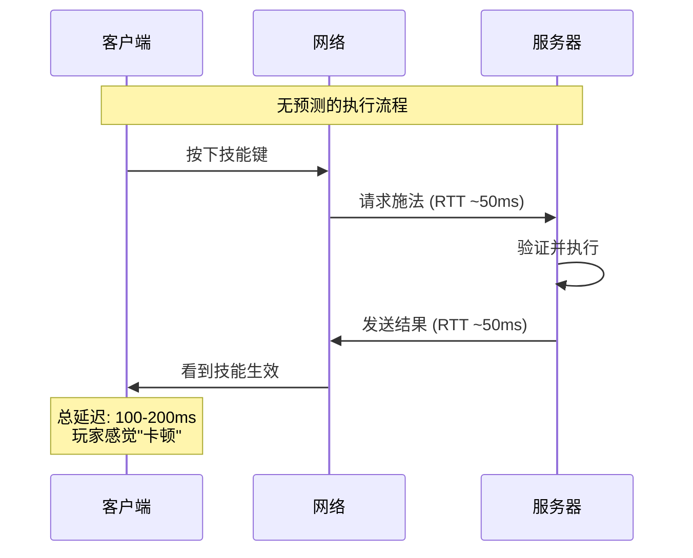
```mermaid
sequenceDiagram
    participant C as 客户端
    participant N as 网络
    participant S as 服务器

    Note over C,S: 无预测的执行流程

    C->>N: 按下技能键
    N->>S: 请求施法 (RTT ~50ms)
    S->>S: 验证并执行
    S->>N: 发送结果 (RTT ~50ms)
    N->>C: 看到技能生效

    Note over C: 总延迟: 100-200ms<br/>玩家感觉"卡顿"
```

### 1.1.2 客户端预测解决方案

客户端预测的核心思想是：**客户端不等待服务器响应，立即本地执行操作**。

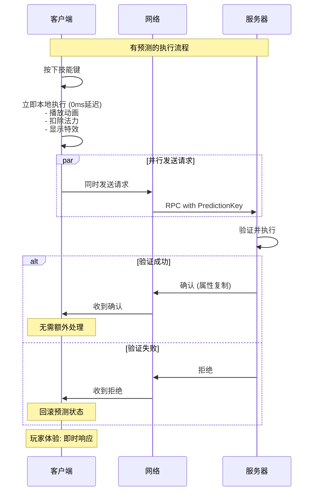
```mermaid
sequenceDiagram
    participant C as 客户端
    participant N as 网络
    participant S as 服务器

    Note over C,S: 有预测的执行流程

    C->>C: 按下技能键
    C->>C: 立即本地执行 (0ms延迟)<br/>- 播放动画<br/>- 扣除法力<br/>- 显示特效

    par 并行发送请求
        C->>N: 同时发送请求
        N->>S: RPC with PredictionKey
    end

    S->>S: 验证并执行

    alt 验证成功
        S->>N: 确认 (属性复制)
        N->>C: 收到确认
        Note over C: 无需额外处理
    else 验证失败
        S->>N: 拒绝
        N->>C: 收到拒绝
        Note over C: 回滚预测状态
    end

    Note over C: 玩家体验: 即时响应
```

### 1.1.3 预测的风险

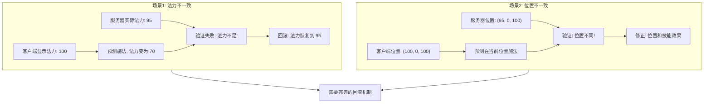
```mermaid
flowchart TD
    subgraph 场景1["场景1: 法力不一致"]
        A1["客户端显示法力: 100"] --> B1["预测施法, 法力变为 70"]
        C1["服务器实际法力: 95"] --> D1["验证失败: 法力不足!"]
        B1 --> D1
        D1 --> E1["回滚: 法力恢复到 95"]
    end

    subgraph 场景2["场景2: 位置不一致"]
        A2["客户端位置: (100, 0, 100)"] --> B2["预测在当前位置施法"]
        C2["服务器位置: (95, 0, 100)"] --> D2["验证: 位置不同!"]
        B2 --> D2
        D2 --> E2["修正: 位置和技能效果"]
    end

    场景1 --> 结果["需要完善的回滚机制"]
    场景2 --> 结果
```

---

## 1.2 GAS 网络架构概览

### 1.2.1 网络角色

在 UE 网络中，Actor 有不同的网络角色：

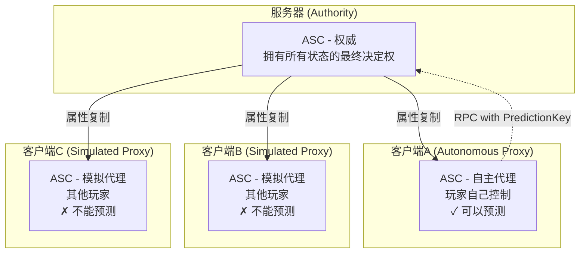
```mermaid
graph TB
    subgraph 服务器["服务器 (Authority)"]
        ASC_S[ASC - 权威<br/>拥有所有状态的最终决定权]
    end

    subgraph 客户端A["客户端A (Autonomous Proxy)"]
        ASC_A[ASC - 自主代理<br/>玩家自己控制<br/>✓ 可以预测]
    end

    subgraph 客户端B["客户端B (Simulated Proxy)"]
        ASC_B[ASC - 模拟代理<br/>其他玩家<br/>✗ 不能预测]
    end

    subgraph 客户端C["客户端C (Simulated Proxy)"]
        ASC_C[ASC - 模拟代理<br/>其他玩家<br/>✗ 不能预测]
    end

    ASC_S -->|属性复制| ASC_A
    ASC_S -->|属性复制| ASC_B
    ASC_S -->|属性复制| ASC_C

    ASC_A -.->|RPC with PredictionKey| ASC_S
```

### 1.2.2 网络角色枚举

```cpp
// Engine/Source/Runtime/Engine/Classes/Engine/EngineTypes.h

enum ENetRole
{
    ROLE_None,              // 无角色
    ROLE_SimulatedProxy,    // 模拟代理：完全由服务器控制，不能预测
    ROLE_AutonomousProxy,   // 自主代理：由玩家控制，可以预测
    ROLE_Authority,         // 权威：拥有状态的所有权
};
```

### 1.2.3 AbilitySystemComponent 网络架构

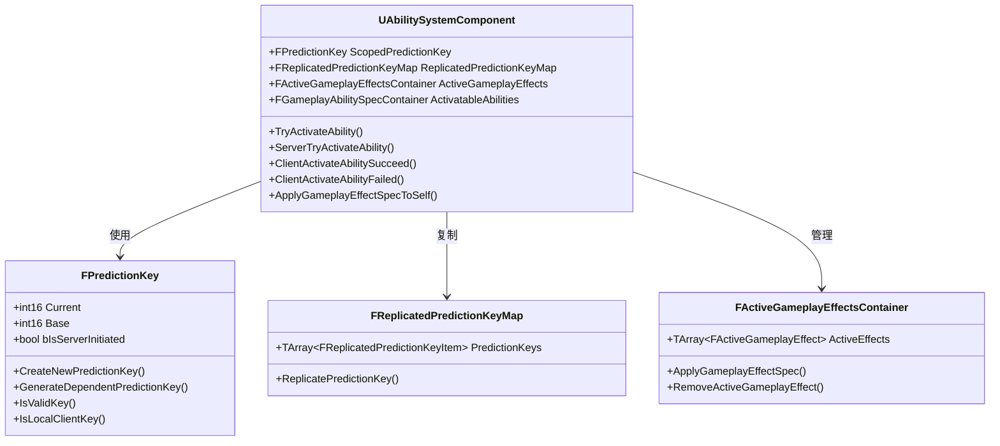
```mermaid
classDiagram
    class UAbilitySystemComponent {
        +FPredictionKey ScopedPredictionKey
        +FReplicatedPredictionKeyMap ReplicatedPredictionKeyMap
        +FActiveGameplayEffectsContainer ActiveGameplayEffects
        +FGameplayAbilitySpecContainer ActivatableAbilities

        +TryActivateAbility()
        +ServerTryActivateAbility()
        +ClientActivateAbilitySucceed()
        +ClientActivateAbilityFailed()
        +ApplyGameplayEffectSpecToSelf()
    }

    class FPredictionKey {
        +int16 Current
        +int16 Base
        +bool bIsServerInitiated

        +CreateNewPredictionKey()
        +GenerateDependentPredictionKey()
        +IsValidKey()
        +IsLocalClientKey()
    }

    class FReplicatedPredictionKeyMap {
        +TArray~FReplicatedPredictionKeyItem~ PredictionKeys
        +ReplicatePredictionKey()
    }

    class FActiveGameplayEffectsContainer {
        +TArray~FActiveGameplayEffect~ ActiveEffects
        +ApplyGameplayEffectSpec()
        +RemoveActiveGameplayEffect()
    }

    UAbilitySystemComponent --> FPredictionKey : 使用
    UAbilitySystemComponent --> FReplicatedPredictionKeyMap : 复制
    UAbilitySystemComponent --> FActiveGameplayEffectsContainer : 管理
```

### 1.2.4 GAS 网络通信方式

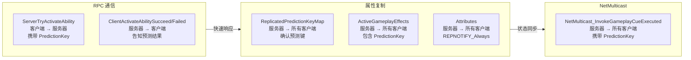
```mermaid
flowchart LR
    subgraph RPC["RPC 通信"]
        direction TB
        RPC1["ServerTryActivateAbility<br/>客户端 → 服务器<br/>携带 PredictionKey"]
        RPC2["ClientActivateAbilitySucceed/Failed<br/>服务器 → 客户端<br/>告知预测结果"]
    end

    subgraph PropertyRep["属性复制"]
        direction TB
        PR1["ReplicatedPredictionKeyMap<br/>服务器 → 所有客户端<br/>确认预测键"]
        PR2["ActiveGameplayEffects<br/>服务器 → 所有客户端<br/>包含 PredictionKey"]
        PR3["Attributes<br/>服务器 → 所有客户端<br/>REPNOTIFY_Always"]
    end

    subgraph Multicast["NetMulticast"]
        direction TB
        MC1["NetMulticast_InvokeGameplayCueExecuted<br/>服务器 → 所有客户端<br/>携带 PredictionKey"]
    end

    RPC --> |"快速响应"| PropertyRep
    PropertyRep --> |"状态同步"| Multicast
```

---

## 1.3 预测系统的6个核心问题

**源码位置**：`GameplayPrediction.h` 第52-59行

```cpp
/**
 * Problems we attempt to solve:
 * 1. "Can I do this?" Basic protocol for prediction.
 * 2. "Undo" How to undo side effects when a prediction fails.
 * 3. "Redo" How to avoid replaying side effects that we predicted locally
 *          but that also get replicated from the server.
 * 4. "Completeness" How to be sure we /really/ predicted all side effects.
 * 5. "Dependencies" How to manage dependent prediction and chains of predicted events.
 * 6. "Override" How to override state predictively that is otherwise replicated/owned by the server.
 */
```

### 1.3.1 问题1："Can I do this?" - 基本预测协议

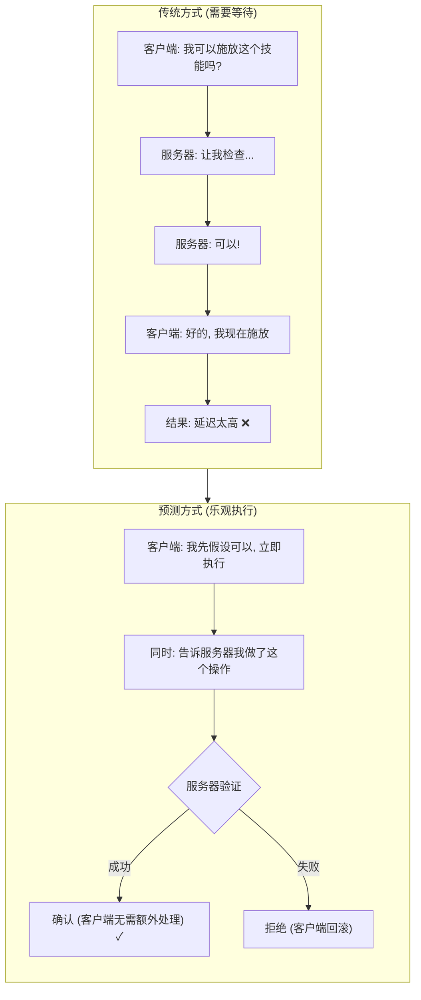
```mermaid
flowchart TB
    subgraph 传统方式["传统方式 (需要等待)"]
        direction TB
        T1["客户端: 我可以施放这个技能吗?"] --> T2["服务器: 让我检查..."]
        T2 --> T3["服务器: 可以!"]
        T3 --> T4["客户端: 好的, 我现在施放"]
        T4 --> T5["结果: 延迟太高 ❌"]
    end

    subgraph 预测方式["预测方式 (乐观执行)"]
        direction TB
        P1["客户端: 我先假设可以, 立即执行"] --> P2["同时: 告诉服务器我做了这个操作"]
        P2 --> P3{"服务器验证"}
        P3 -->|成功| P4["确认 (客户端无需额外处理) ✓"]
        P3 -->|失败| P5["拒绝 (客户端回滚)"]
    end

    传统方式 --> 预测方式
```

**关键机制：PredictionKey（预测键）**

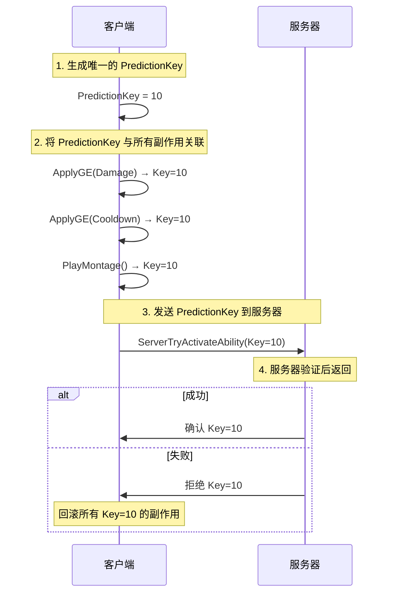
```mermaid
sequenceDiagram
    participant C as 客户端
    participant S as 服务器

    Note over C: 1. 生成唯一的 PredictionKey
    C->>C: PredictionKey = 10

    Note over C: 2. 将 PredictionKey 与所有副作用关联
    C->>C: ApplyGE(Damage) → Key=10
    C->>C: ApplyGE(Cooldown) → Key=10
    C->>C: PlayMontage() → Key=10

    Note over C,S: 3. 发送 PredictionKey 到服务器
    C->>S: ServerTryActivateAbility(Key=10)

    Note over S: 4. 服务器验证后返回
    alt 成功
        S->>C: 确认 Key=10
    else 失败
        S->>C: 拒绝 Key=10
        Note over C: 回滚所有 Key=10 的副作用
    end
```

### 1.3.2 问题2："Undo" - 回滚机制

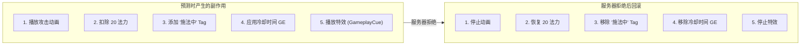
```mermaid
flowchart LR
    subgraph 预测时["预测时产生的副作用"]
        A1["1. 播放攻击动画"]
        A2["2. 扣除 20 法力"]
        A3["3. 添加 '施法中' Tag"]
        A4["4. 应用冷却时间 GE"]
        A5["5. 播放特效 (GameplayCue)"]
    end

    subgraph 回滚["服务器拒绝后回滚"]
        B1["1. 停止动画"]
        B2["2. 恢复 20 法力"]
        B3["3. 移除 '施法中' Tag"]
        B4["4. 移除冷却时间 GE"]
        B5["5. 停止特效"]
    end

    预测时 -->|"服务器拒绝"| 回滚
```

**解决方案：FPredictionKeyDelegates**

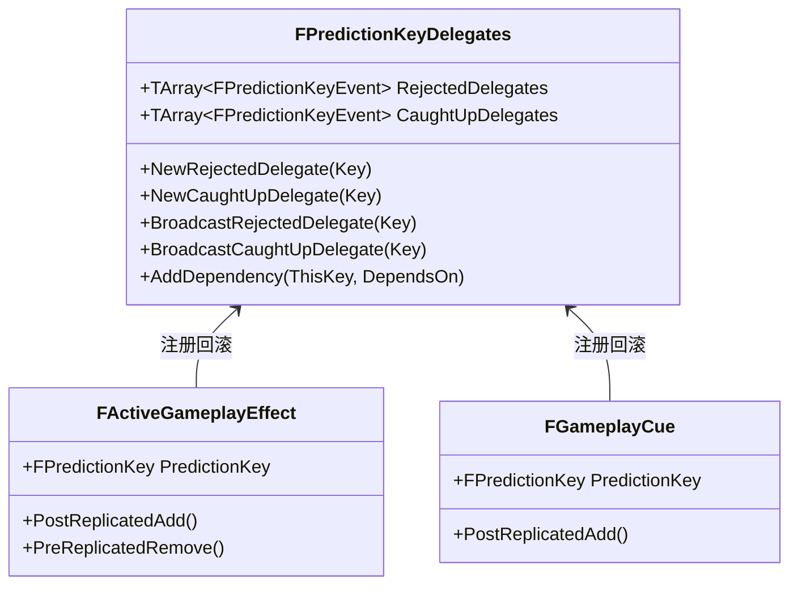
```mermaid
classDiagram
    class FPredictionKeyDelegates {
        +TArray~FPredictionKeyEvent~ RejectedDelegates
        +TArray~FPredictionKeyEvent~ CaughtUpDelegates
        +NewRejectedDelegate(Key)
        +NewCaughtUpDelegate(Key)
        +BroadcastRejectedDelegate(Key)
        +BroadcastCaughtUpDelegate(Key)
        +AddDependency(ThisKey, DependsOn)
    }

    class FActiveGameplayEffect {
        +FPredictionKey PredictionKey
        +PostReplicatedAdd()
        +PreReplicatedRemove()
    }

    class FGameplayCue {
        +FPredictionKey PredictionKey
        +PostReplicatedAdd()
    }

    FPredictionKeyDelegates <-- FActiveGameplayEffect : 注册回滚
    FPredictionKeyDelegates <-- FGameplayCue : 注册回滚
```

### 1.3.3 问题3："Redo" - 避免重复执行

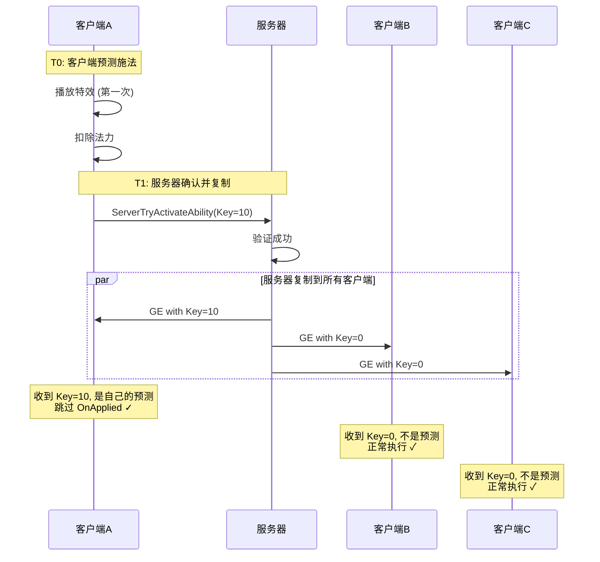
```mermaid
sequenceDiagram
    participant C as 客户端A
    participant S as 服务器
    participant B as 客户端B
    participant O as 客户端C

    Note over C: T0: 客户端预测施法
    C->>C: 播放特效 (第一次)
    C->>C: 扣除法力

    Note over C,S: T1: 服务器确认并复制
    C->>S: ServerTryActivateAbility(Key=10)
    S->>S: 验证成功

    par 服务器复制到所有客户端
        S->>C: GE with Key=10
        S->>B: GE with Key=0
        S->>O: GE with Key=0
    end

    Note over C: 收到 Key=10, 是自己的预测<br/>跳过 OnApplied ✓
    Note over B: 收到 Key=0, 不是预测<br/>正常执行 ✓
    Note over O: 收到 Key=0, 不是预测<br/>正常执行 ✓
```

**关键：PredictionKey 的 NetSerialize 实现**

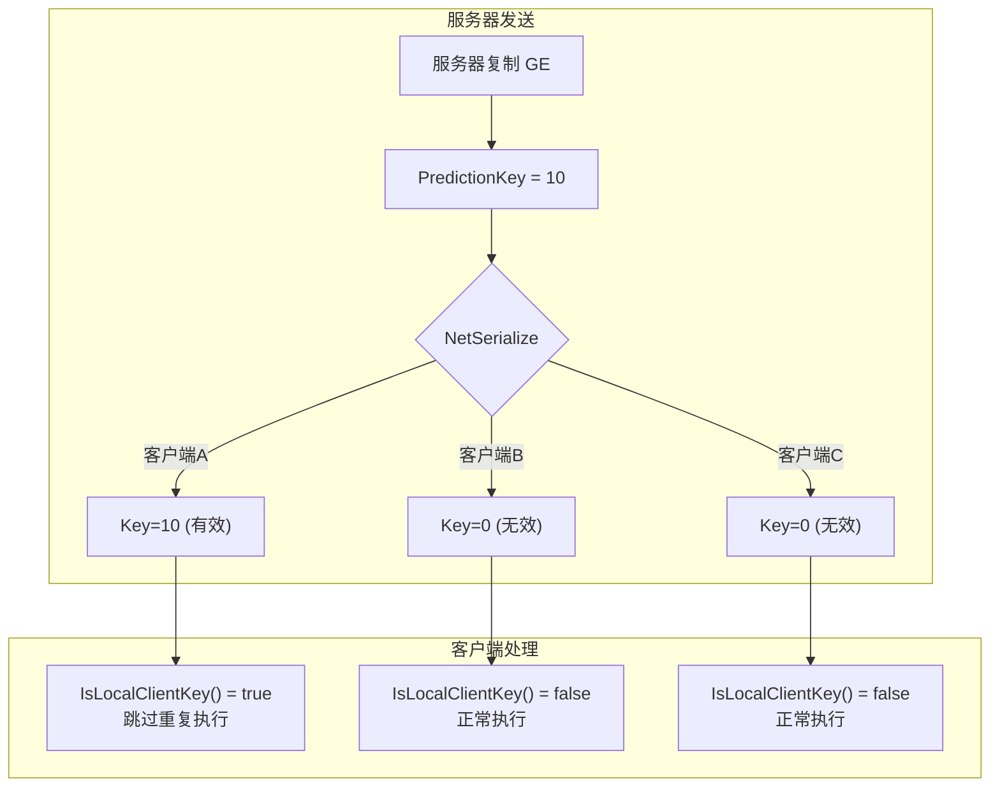
```mermaid
flowchart TD
    subgraph 服务器发送["服务器发送"]
        A["服务器复制 GE"] --> B["PredictionKey = 10"]
        B --> C{"NetSerialize"}
        C -->|客户端A| D["Key=10 (有效)"]
        C -->|客户端B| E["Key=0 (无效)"]
        C -->|客户端C| F["Key=0 (无效)"]
    end

    subgraph 客户端处理["客户端处理"]
        D --> G["IsLocalClientKey() = true<br/>跳过重复执行"]
        E --> H["IsLocalClientKey() = false<br/>正常执行"]
        F --> I["IsLocalClientKey() = false<br/>正常执行"]
    end
```

### 1.3.4 问题4："Completeness" - 完整性

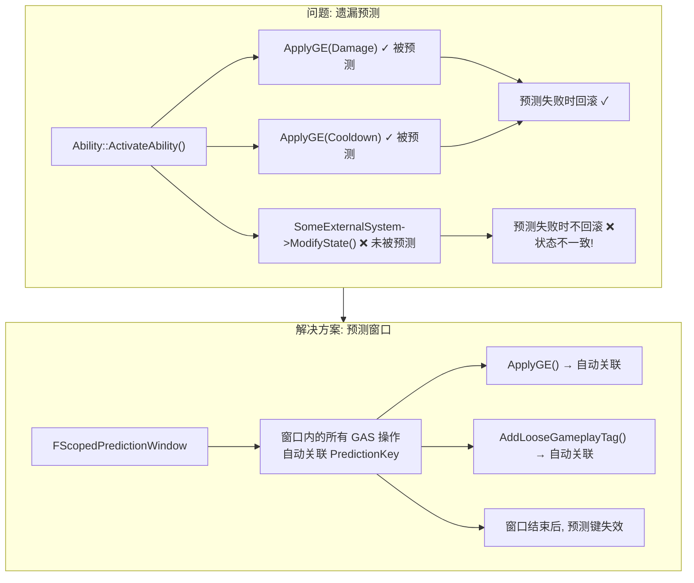
```mermaid
flowchart TB
    subgraph 问题场景["问题: 遗漏预测"]
        A["Ability::ActivateAbility()"] --> B["ApplyGE(Damage) ✓ 被预测"]
        A --> C["ApplyGE(Cooldown) ✓ 被预测"]
        A --> D["SomeExternalSystem->ModifyState() ❌ 未被预测"]

        B --> E["预测失败时回滚 ✓"]
        C --> E
        D --> F["预测失败时不回滚 ❌<br/>状态不一致!"]
    end

    subgraph 解决方案["解决方案: 预测窗口"]
        G["FScopedPredictionWindow"] --> H["窗口内的所有 GAS 操作<br/>自动关联 PredictionKey"]
        H --> I["ApplyGE() → 自动关联"]
        H --> J["AddLooseGameplayTag() → 自动关联"]
        H --> K["窗口结束后, 预测键失效"]
    end

    问题场景 --> 解决方案
```

**预测窗口的生命周期**

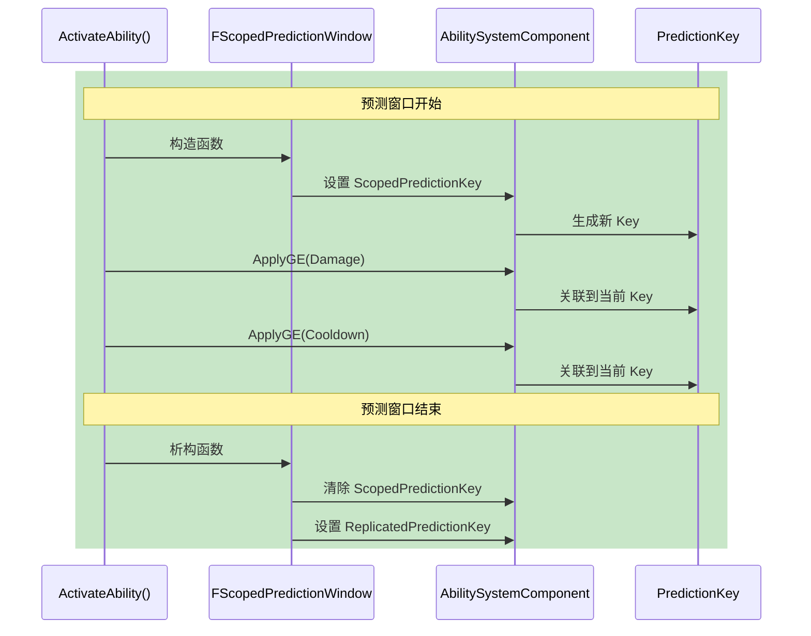
```mermaid
sequenceDiagram
    participant Code as ActivateAbility()
    participant Window as FScopedPredictionWindow
    participant ASC as AbilitySystemComponent
    participant Key as PredictionKey

    rect rgb(200, 230, 200)
        Note over Code,Key: 预测窗口开始
        Code->>Window: 构造函数
        Window->>ASC: 设置 ScopedPredictionKey
        ASC->>Key: 生成新 Key

        Code->>ASC: ApplyGE(Damage)
        ASC->>Key: 关联到当前 Key

        Code->>ASC: ApplyGE(Cooldown)
        ASC->>Key: 关联到当前 Key

        Note over Code,Key: 预测窗口结束
        Code->>Window: 析构函数
        Window->>ASC: 清除 ScopedPredictionKey
        Window->>ASC: 设置 ReplicatedPredictionKey
    end
```

### 1.3.5 问题5："Dependencies" - 依赖管理

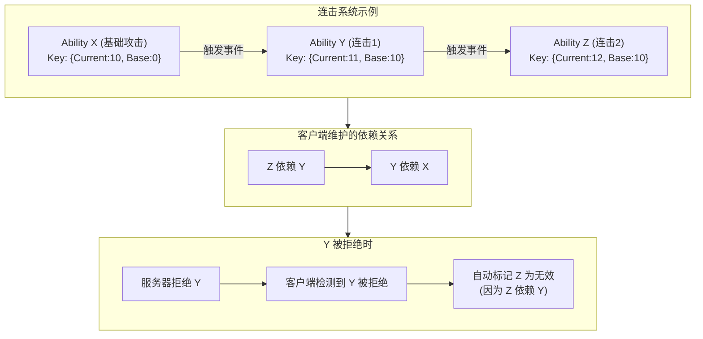
```mermaid
flowchart TB
    subgraph 连击系统["连击系统示例"]
        X["Ability X (基础攻击)<br/>Key: {Current:10, Base:0}"]
        Y["Ability Y (连击1)<br/>Key: {Current:11, Base:10}"]
        Z["Ability Z (连击2)<br/>Key: {Current:12, Base:10}"]

        X -->|"触发事件"| Y
        Y -->|"触发事件"| Z
    end

    subgraph 依赖关系["客户端维护的依赖关系"]
        D1["Z 依赖 Y"]
        D2["Y 依赖 X"]
        D1 --> D2
    end

    subgraph 拒绝场景["Y 被拒绝时"]
        R1["服务器拒绝 Y"] --> R2["客户端检测到 Y 被拒绝"]
        R2 --> R3["自动标记 Z 为无效<br/>(因为 Z 依赖 Y)"]
    end

    连击系统 --> 依赖关系
    依赖关系 --> 拒绝场景
```

**Base PredictionKey 机制**

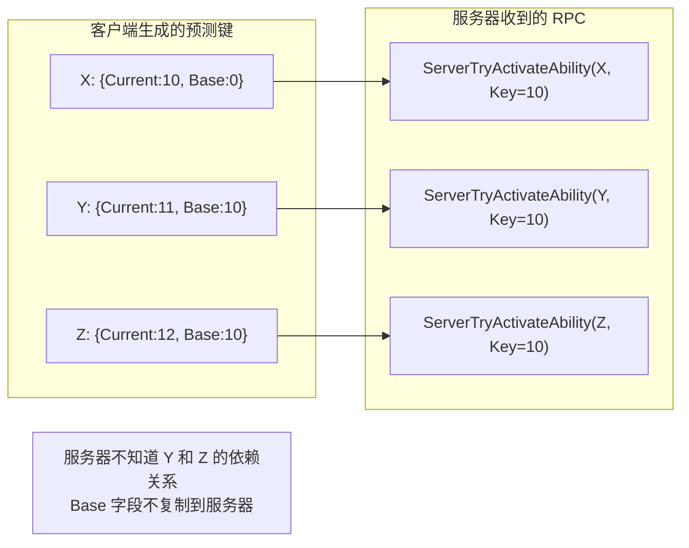
```mermaid
graph LR
    subgraph 客户端生成["客户端生成的预测键"]
        KX["X: {Current:10, Base:0}"]
        KY["Y: {Current:11, Base:10}"]
        KZ["Z: {Current:12, Base:10}"]
    end

    subgraph 服务器收到["服务器收到的 RPC"]
        SX["ServerTryActivateAbility(X, Key=10)"]
        SY["ServerTryActivateAbility(Y, Key=10)"]
        SZ["ServerTryActivateAbility(Z, Key=10)"]
    end

    KX --> SX
    KY --> SY
    KZ --> SZ

    Note1["服务器不知道 Y 和 Z 的依赖关系<br/>Base 字段不复制到服务器"]
```

### 1.3.6 问题6："Override" - 状态覆盖

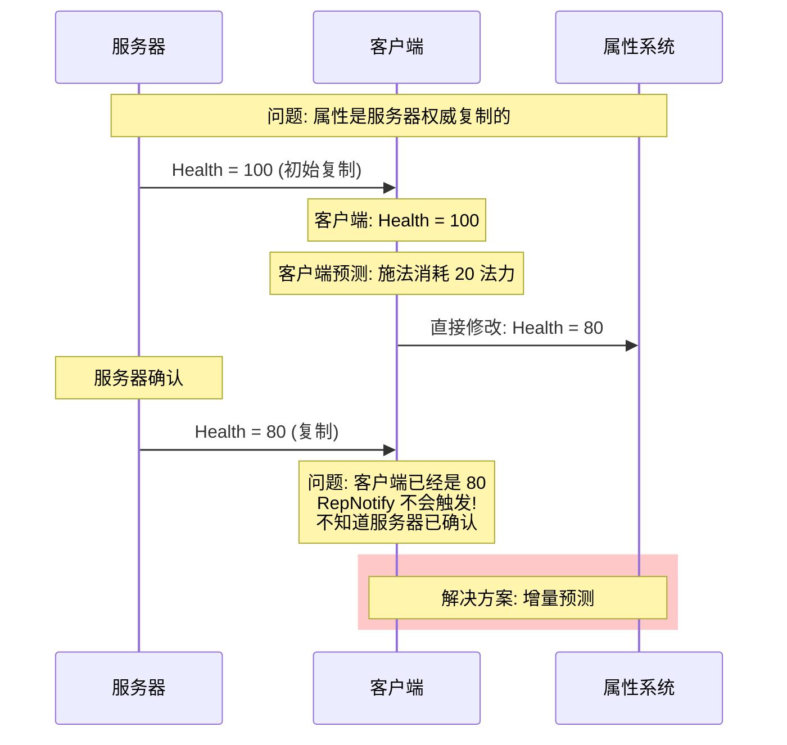
```mermaid
sequenceDiagram
    participant S as 服务器
    participant C as 客户端
    participant Attr as 属性系统

    Note over S,Attr: 问题: 属性是服务器权威复制的

    S->>C: Health = 100 (初始复制)
    Note over C: 客户端: Health = 100

    Note over C: 客户端预测: 施法消耗 20 法力
    C->>Attr: 直接修改: Health = 80

    Note over S: 服务器确认
    S->>C: Health = 80 (复制)

    Note over C: 问题: 客户端已经是 80<br/>RepNotify 不会触发!<br/>不知道服务器已确认

    rect rgb(255, 200, 200)
        Note over C,Attr: 解决方案: 增量预测
    end
```

**增量预测方案**

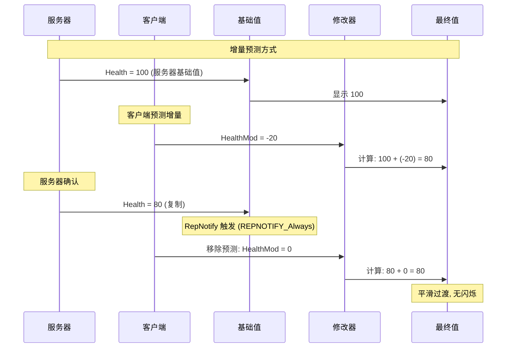
```mermaid
sequenceDiagram
    participant S as 服务器
    participant C as 客户端
    participant Base as 基础值
    participant Mod as 修改器
    participant Final as 最终值

    Note over S,Final: 增量预测方式

    S->>Base: Health = 100 (服务器基础值)
    Base->>Final: 显示 100

    Note over C: 客户端预测增量
    C->>Mod: HealthMod = -20
    Mod->>Final: 计算: 100 + (-20) = 80

    Note over S: 服务器确认
    S->>Base: Health = 80 (复制)
    Note over Base: RepNotify 触发 (REPNOTIFY_Always)
    C->>Mod: 移除预测: HealthMod = 0
    Mod->>Final: 计算: 80 + 0 = 80

    Note over Final: 平滑过渡, 无闪烁
```

---

## 1.4 可预测与不可预测的内容

### 1.4.1 可预测内容总览

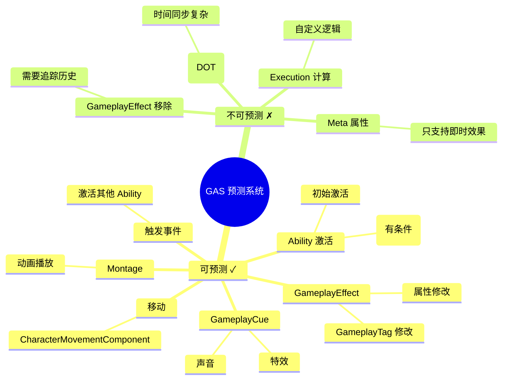
```mermaid
mindmap
  root((GAS 预测系统))
    可预测 ✓
      Ability 激活
        初始激活
        链式激活(有条件)
      触发事件
        激活其他 Ability
      GameplayEffect
        属性修改
        GameplayTag 修改
      GameplayCue
        特效
        声音
      Montage
        动画播放
      移动
        CharacterMovementComponent
    不可预测 ✗
      GameplayEffect 移除
        需要追踪历史
      周期效果(DOT)
        时间同步复杂
      Execution 计算
        自定义逻辑
      Meta 属性
        只支持即时效果
```

### 1.4.2 详细对照表

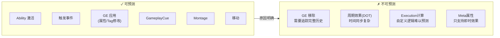
```mermaid
flowchart LR
    subgraph 可预测["✓ 可预测"]
        direction TB
        A1["Ability 激活"]
        A2["触发事件"]
        A3["GE 应用<br/>(属性/Tag修改)"]
        A4["GameplayCue"]
        A5["Montage"]
        A6["移动"]
    end

    subgraph 不可预测["✗ 不可预测"]
        direction TB
        B1["GE 移除<br/>需要追踪完整历史"]
        B2["周期效果(DOT)<br/>时间同步复杂"]
        B3["Execution计算<br/>自定义逻辑难以预测"]
        B4["Meta属性<br/>只支持即时效果"]
    end

    可预测 --> |"原因明确"| 不可预测
```

### 1.4.3 预测窗口的限制

```mermaid
flowchart TD
    subgraph 规则1["规则1: 预测窗口只在同步代码中有效"]
        Code["ActivateAbility() 开始"] --> Window["预测窗口开启"]
        Window --> Op1["ApplyGE(Damage) ✓"]
        Window --> Op2["ApplyGE(Cooldown) ✓"]
        Window --> Async["SetTimer(2.0f, ...)"]
        Async --> LateOp["ApplyGE(Another) ✗ 不被预测"]
        LateOp --> End["窗口结束"]
    end

    subgraph 规则2["规则2: 跨帧操作需要新预测窗口"]
        Start["初始预测窗口"] --> Task["AbilityTask::WaitInputRelease"]
        Task --> NewWindow["新预测窗口 (在Task内)"]
        NewWindow --> FinalOp["ApplyGE(Final) ✓"]
    end
```

---

## 1.5 实践：观察预测系统

### 1.5.1 调试流程

```mermaid
flowchart LR
    subgraph 准备["准备环境"]
        A1["创建/打开 C++ 项目"]
        A2["启用 GameplayAbilities 插件"]
        A3["配置网络调试"]
    end

    subgraph 添加日志["添加日志输出"]
        B1["GameplayPrediction.cpp"]
        B2["FPredictionKey::CreateNewPredictionKey"]
        B3["FPredictionKeyDelegates::BroadcastRejectedDelegate"]
    end

    subgraph 运行调试["运行调试"]
        C1["设置断点"]
        C2["激活 Ability"]
        C3["观察预测键生成"]
    end

    准备 --> 添加日志 --> 运行调试
```

### 1.5.2 关键断点位置

```mermaid
graph TB
    subgraph 断点位置["推荐断点位置"]
        BP1["FPredictionKey::CreateNewPredictionKey<br/>观察预测键生成"]
        BP2["FPredictionKeyDelegates::BroadcastRejectedDelegate<br/>观察预测拒绝"]
        BP3["FReplicatedPredictionKeyItem::OnRep<br/>观察服务器确认"]
        BP4["FScopedPredictionWindow::~FScopedPredictionWindow<br/>观察窗口结束"]
    end
```

### 1.5.3 控制台命令

| 命令 | 用途 |
|-----|------|
| `stat net` | 显示网络统计 |
| `net.PK.Draw 1` | 显示预测键调试信息 |
| `AbilitySystem.Debug 1` | 显示 GAS 调试信息 |
| `net.Replication.Debug 1` | 显示复制信息 |

---

## 课后练习

### 练习1：阅读源码

```mermaid
flowchart LR
    A["打开 GameplayPrediction.h"] --> B["阅读第 22-264 行"]
    B --> C["用自己的话总结<br/>6个核心问题"]
    C --> D["记录不理解的部分"]
```

### 练习2：观察预测键

```mermaid
sequenceDiagram
    participant You as 你
    participant VS as Visual Studio
    participant UE as Unreal Engine

    You->>VS: 在 CreateNewPredictionKey 设置断点
    You->>UE: 运行游戏
    You->>UE: 激活一个 Ability
    UE->>VS: 触发断点
    You->>VS: 观察 PredictionKey 的值
    You->>VS: 查看调用栈
```

### 练习3：思考题

1. **为什么预测键使用 int16 而不是 int32？**
   <details>
   <summary>提示</summary>
   考虑网络带宽和单局游戏的预测键数量需求
   </details>

2. **为什么 Base 字段不复制到服务器？**
   <details>
   <summary>提示</summary>
   依赖关系是客户端本地维护的，服务器不需要知道
   </details>

3. **如果预测窗口跨帧会发生什么？**
   <details>
   <summary>提示</summary>
   预测键在窗口结束时失效，跨帧操作不会被预测
   </details>

---

## 下节课预告

```mermaid
flowchart LR
    L1["第1课: 网络基础与预测概述"] --> L2["第2课: FPredictionKey 核心结构"]

    subgraph 第2课内容["第2课内容"]
        A["预测键的数据结构详解"]
        B["预测键的生成算法"]
        C["预测键的网络序列化机制"]
        D["预测键的生命周期管理"]
    end

    L2 --> 第2课内容
```

---

## 参考资料

- **源码**：`Engine/Plugins/Runtime/GameplayAbilities/Source/GameplayAbilities/Public/GameplayPrediction.h`
- **官方文档**：[Gameplay Ability System](https://dev.epicgames.com/documentation/en-us/unreal-engine/gameplay-ability-system-in-unreal-engine)
- **Lyra 示例项目**：`Samples/Games/Lyra/Source/LyraGame/AbilitySystem/`
