# 第2课：FPredictionKey 核心结构

> 学习时间：45-60分钟
> 难度：进阶
> 前置知识：第1课内容、C++结构体、UE网络序列化基础

---

## 学习目标

完成本课后，你将能够：
1. 掌握 FPredictionKey 的完整数据结构
2. 理解预测键的生成算法和唯一性保证
3. 深入理解预测键的网络序列化机制
4. 掌握预测键的生命周期管理

---

## 2.1 FPredictionKey 数据结构

### 2.1.1 完整结构定义

**源码位置**：`GameplayPrediction.h` 第296-414行

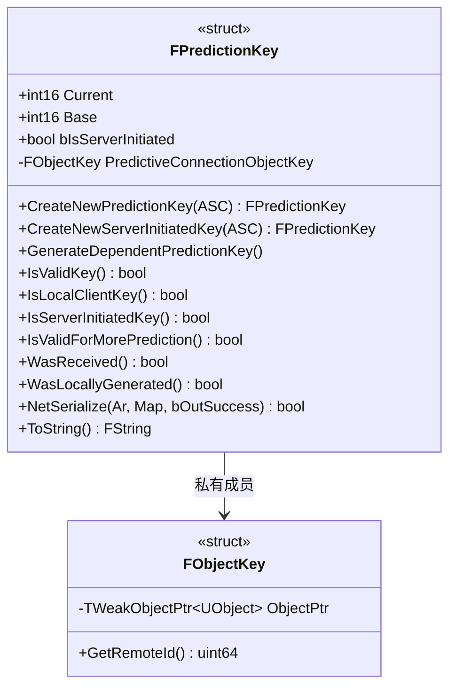
```mermaid
classDiagram
    class FPredictionKey {
        <<struct>>
        +int16 Current
        +int16 Base
        +bool bIsServerInitiated
        -FObjectKey PredictiveConnectionObjectKey

        +CreateNewPredictionKey(ASC) FPredictionKey
        +CreateNewServerInitiatedKey(ASC) FPredictionKey
        +GenerateDependentPredictionKey()
        +IsValidKey() bool
        +IsLocalClientKey() bool
        +IsServerInitiatedKey() bool
        +IsValidForMorePrediction() bool
        +WasReceived() bool
        +WasLocallyGenerated() bool
        +NetSerialize(Ar, Map, bOutSuccess) bool
        +ToString() FString
    }

    class FObjectKey {
        <<struct>>
        -TWeakObjectPtr~UObject~ ObjectPtr
        +GetRemoteId() uint64
    }

    FPredictionKey --> FObjectKey : 私有成员
```

### 2.1.2 成员变量详解

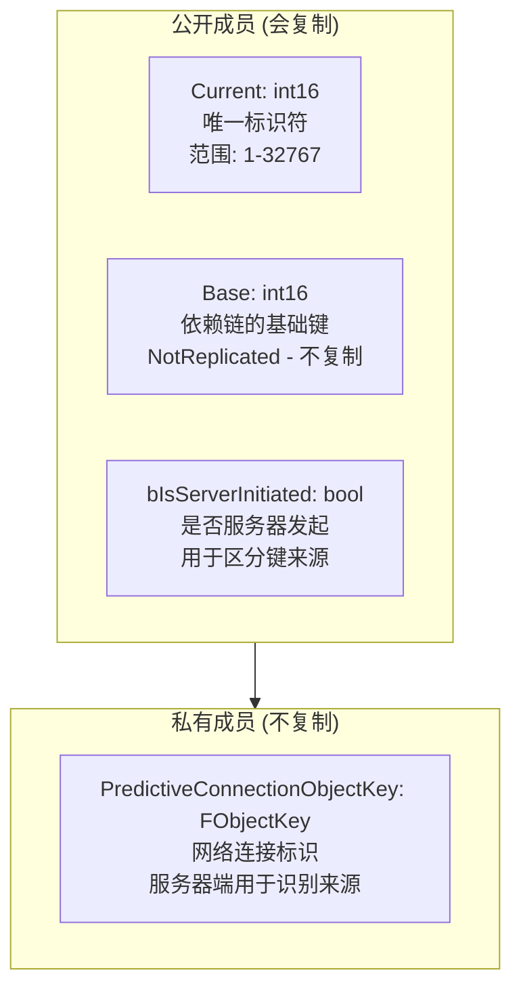
```mermaid
flowchart TB
    subgraph 公开成员["公开成员 (会复制)"]
        Current["Current: int16<br/>唯一标识符<br/>范围: 1-32767"]
        Base["Base: int16<br/>依赖链的基础键<br/>NotReplicated - 不复制"]
        ServerInit["bIsServerInitiated: bool<br/>是否服务器发起<br/>用于区分键来源"]
    end

    subgraph 私有成员["私有成员 (不复制)"]
        ConnKey["PredictiveConnectionObjectKey: FObjectKey<br/>网络连接标识<br/>服务器端用于识别来源"]
    end

    公开成员 --> 私有成员
```

### 2.1.3 设计决策分析

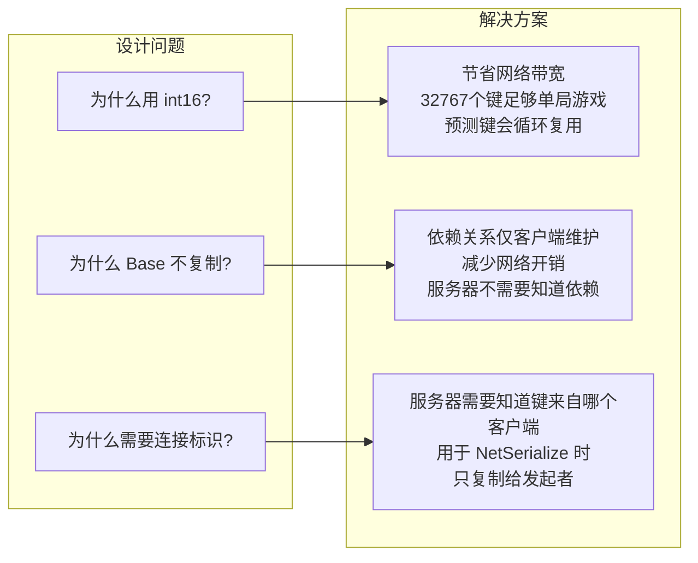
```mermaid
flowchart LR
    subgraph 设计问题["设计问题"]
        Q1["为什么用 int16?"]
        Q2["为什么 Base 不复制?"]
        Q3["为什么需要连接标识?"]
    end

    subgraph 解决方案["解决方案"]
        A1["节省网络带宽<br/>32767个键足够单局游戏<br/>预测键会循环复用"]
        A2["依赖关系仅客户端维护<br/>减少网络开销<br/>服务器不需要知道依赖"]
        A3["服务器需要知道键来自哪个客户端<br/>用于 NetSerialize 时<br/>只复制给发起者"]
    end

    Q1 --> A1
    Q2 --> A2
    Q3 --> A3
```

---

## 2.2 预测键的生成

### 2.2.1 生成流程

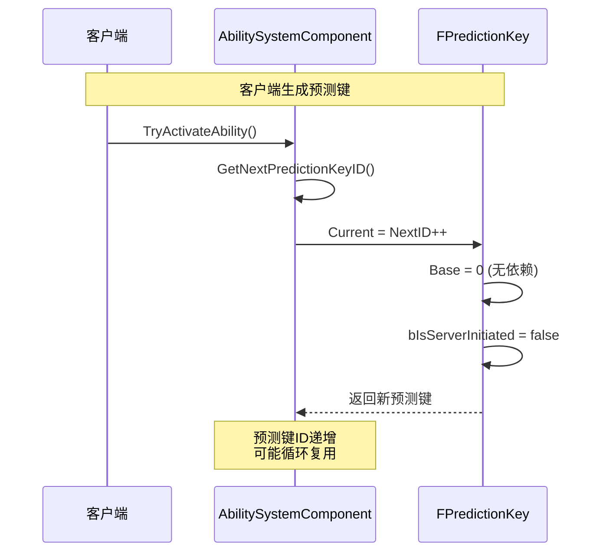
```mermaid
sequenceDiagram
    participant Client as 客户端
    participant ASC as AbilitySystemComponent
    participant Key as FPredictionKey

    Note over Client,Key: 客户端生成预测键

    Client->>ASC: TryActivateAbility()
    ASC->>ASC: GetNextPredictionKeyID()
    ASC->>Key: Current = NextID++
    Key->>Key: Base = 0 (无依赖)
    Key->>Key: bIsServerInitiated = false
    Key-->>ASC: 返回新预测键

    Note over ASC: 预测键ID递增<br/>可能循环复用
```

### 2.2.2 源码实现

```cpp
// GameplayPrediction.cpp

FPredictionKey FPredictionKey::CreateNewPredictionKey(const UAbilitySystemComponent* ASC)
{
    FPredictionKey NewKey;

    if (ASC)
    {
        // 从 ASC 获取下一个可用的键值
        NewKey.Current = ASC->GetNextPredictionKeyID();
    }

    // Base 默认为 0，表示无依赖
    // bIsServerInitiated 默认为 false，表示客户端生成

    return NewKey;
}

void FPredictionKey::GenerateDependentPredictionKey()
{
    // 保存当前键作为 Base
    Base = Current;

    // 生成新的 Current
    // 需要从 ASC 获取新的 ID
    // 这会在 TryActivateAbility 中调用
}
```

### 2.2.3 键ID的管理

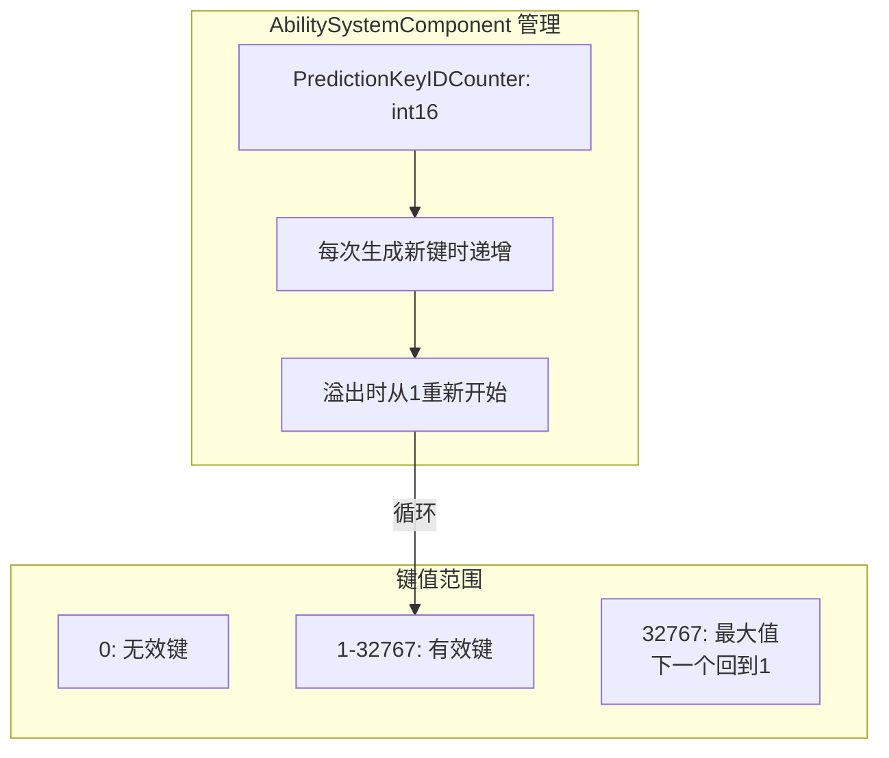
```mermaid
flowchart TB
    subgraph ASC管理["AbilitySystemComponent 管理"]
        Counter["PredictionKeyIDCounter: int16"]
        Increment["每次生成新键时递增"]
        Overflow["溢出时从1重新开始"]
    end

    subgraph 键值范围["键值范围"]
        Zero["0: 无效键"]
        Valid["1-32767: 有效键"]
        Max["32767: 最大值<br/>下一个回到1"]
    end

    Counter --> Increment --> Overflow
    Overflow -->|"循环"| Valid
```

### 2.2.4 服务器发起的键

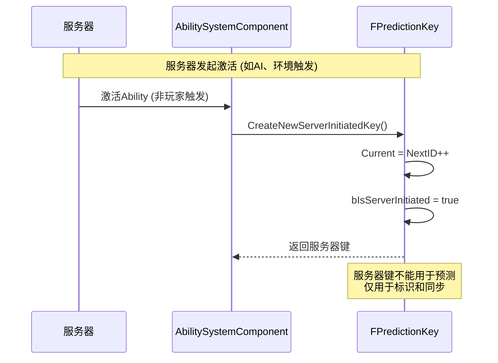
```mermaid
sequenceDiagram
    participant Server as 服务器
    participant ASC as AbilitySystemComponent
    participant Key as FPredictionKey

    Note over Server,Key: 服务器发起激活 (如AI、环境触发)

    Server->>ASC: 激活Ability (非玩家触发)
    ASC->>Key: CreateNewServerInitiatedKey()
    Key->>Key: Current = NextID++
    Key->>Key: bIsServerInitiated = true
    Key-->>ASC: 返回服务器键

    Note over Key: 服务器键不能用于预测<br/>仅用于标识和同步
```

---

## 2.3 预测键的网络序列化

### 2.3.1 核心特性：定向复制

**最重要的特性**：预测键只序列化给发起预测的客户端！

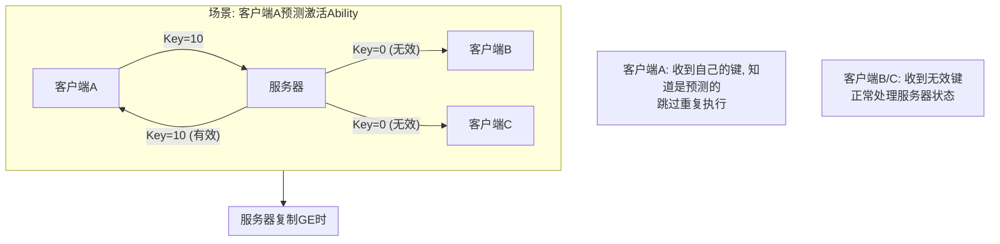
```mermaid
flowchart TB
    subgraph 场景["场景: 客户端A预测激活Ability"]
        CA["客户端A"] -->|"Key=10"| S["服务器"]
        CB["客户端B"]
        CC["客户端C"]
    end

    subgraph 服务器复制["服务器复制GE时"]
        S -->|"Key=10 (有效)"| CA
        S -->|"Key=0 (无效)"| CB
        S -->|"Key=0 (无效)"| CC
    end

    场景 --> 服务器复制

    Note1["客户端A: 收到自己的键, 知道是预测的<br/>跳过重复执行"]
    Note2["客户端B/C: 收到无效键<br/>正常处理服务器状态"]
```

### 2.3.2 NetSerialize 实现

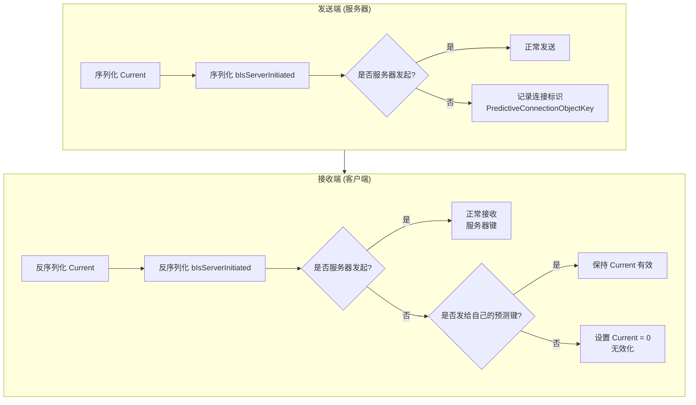
```mermaid
flowchart TD
    subgraph 发送端["发送端 (服务器)"]
        Send1["序列化 Current"] --> Send2["序列化 bIsServerInitiated"]
        Send2 --> Send3{"是否服务器发起?"}
        Send3 -->|是| Send4["正常发送"]
        Send3 -->|否| Send5["记录连接标识<br/>PredictiveConnectionObjectKey"]
    end

    subgraph 接收端["接收端 (客户端)"]
        Recv1["反序列化 Current"] --> Recv2["反序列化 bIsServerInitiated"]
        Recv2 --> Recv3{"是否服务器发起?"}
        Recv3 -->|是| Recv4["正常接收<br/>服务器键"]
        Recv3 -->|否| Recv5{"是否发给自己的预测键?"}
        Recv5 -->|是| Recv6["保持 Current 有效"]
        Recv5 -->|否| Recv7["设置 Current = 0<br/>无效化"]
    end

    发送端 --> 接收端
```

### 2.3.3 源码解析

```cpp
// GameplayPrediction.cpp

bool FPredictionKey::NetSerialize(FArchive& Ar, UPackageMap* Map, bool& bOutSuccess)
{
    // 序列化 Current
    Ar << Current;

    // 序列化 bIsServerInitiated
    Ar << bIsServerInitiated;

    if (Ar.IsSaving())
    {
        // ===== 发送端 (服务器) =====
        if (!bIsServerInitiated)
        {
            // 这是客户端生成的预测键
            // 记录此键来自哪个网络连接
            UNetConnection* Connection = Cast<UNetConnection>(Map);
            if (Connection)
            {
                PredictiveConnectionObjectKey = FObjectKey(Connection);
            }
        }
    }
    else
    {
        // ===== 接收端 (客户端) =====
        if (!bIsServerInitiated && Current > 0)
        {
            // 这是客户端生成的键，检查是否是发给自己的
            UNetConnection* Connection = Cast<UNetConnection>(Map);

            // 如果连接标识不匹配，说明不是发给自己的
            if (PredictiveConnectionObjectKey != FObjectKey(Connection))
            {
                // 无效化！其他客户端会收到 Current = 0
                Current = 0;
            }
        }
    }

    return true;
}
```

### 2.3.4 序列化流程图

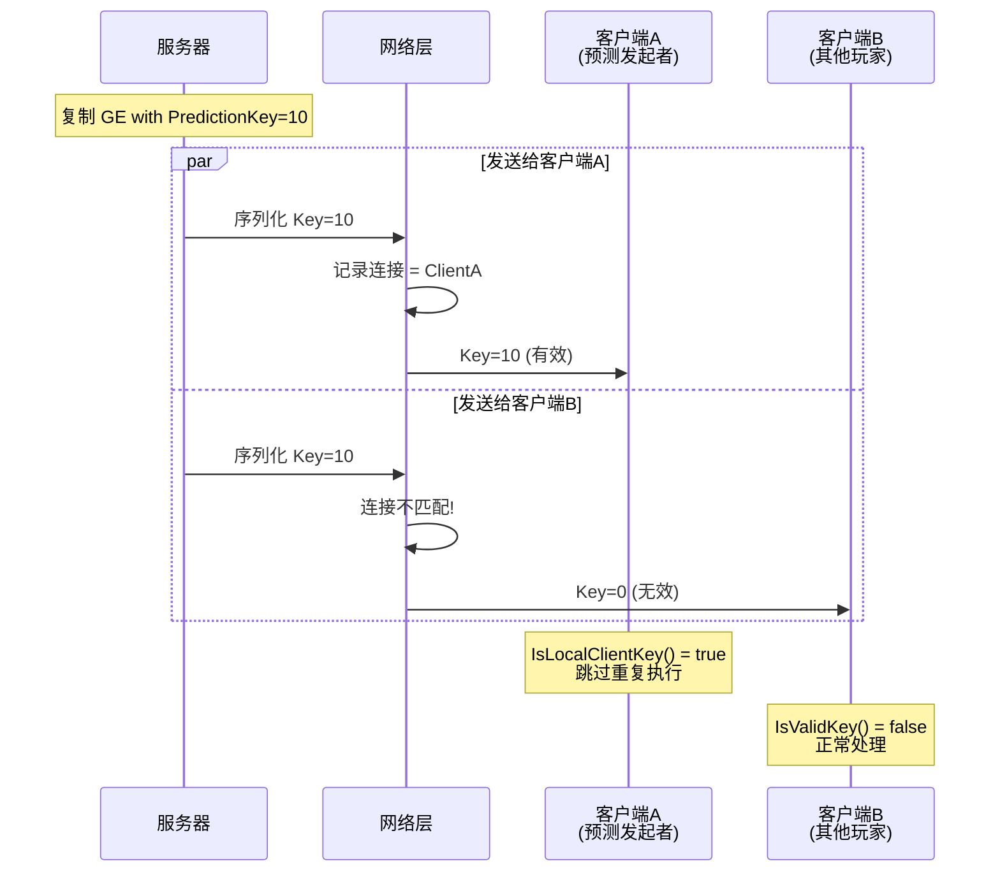
```mermaid
sequenceDiagram
    participant Server as 服务器
    participant Net as 网络层
    participant ClientA as 客户端A<br/>(预测发起者)
    participant ClientB as 客户端B<br/>(其他玩家)

    Note over Server: 复制 GE with PredictionKey=10

    par 发送给客户端A
        Server->>Net: 序列化 Key=10
        Net->>Net: 记录连接 = ClientA
        Net->>ClientA: Key=10 (有效)
    and 发送给客户端B
        Server->>Net: 序列化 Key=10
        Net->>Net: 连接不匹配!
        Net->>ClientB: Key=0 (无效)
    end

    Note over ClientA: IsLocalClientKey() = true<br/>跳过重复执行
    Note over ClientB: IsValidKey() = false<br/>正常处理
```

---

## 2.4 预测键的生命周期

### 2.4.1 完整生命周期

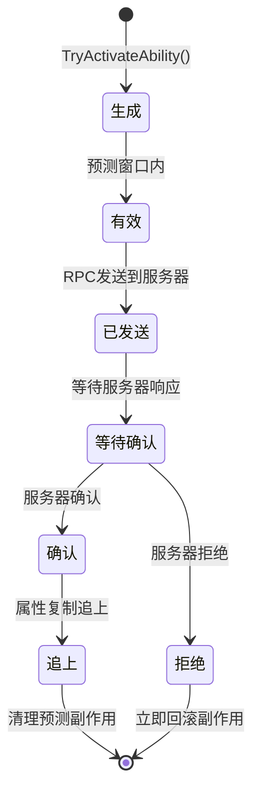
```mermaid
stateDiagram-v2
    [*] --> 生成: TryActivateAbility()
    生成 --> 有效: 预测窗口内
    有效 --> 已发送: RPC发送到服务器
    已发送 --> 等待确认: 等待服务器响应
    等待确认 --> 确认: 服务器确认
    等待确认 --> 拒绝: 服务器拒绝
    确认 --> 追上: 属性复制追上
    追上 --> [*]: 清理预测副作用
    拒绝 --> [*]: 立即回滚副作用
```

### 2.4.2 预测窗口内的状态

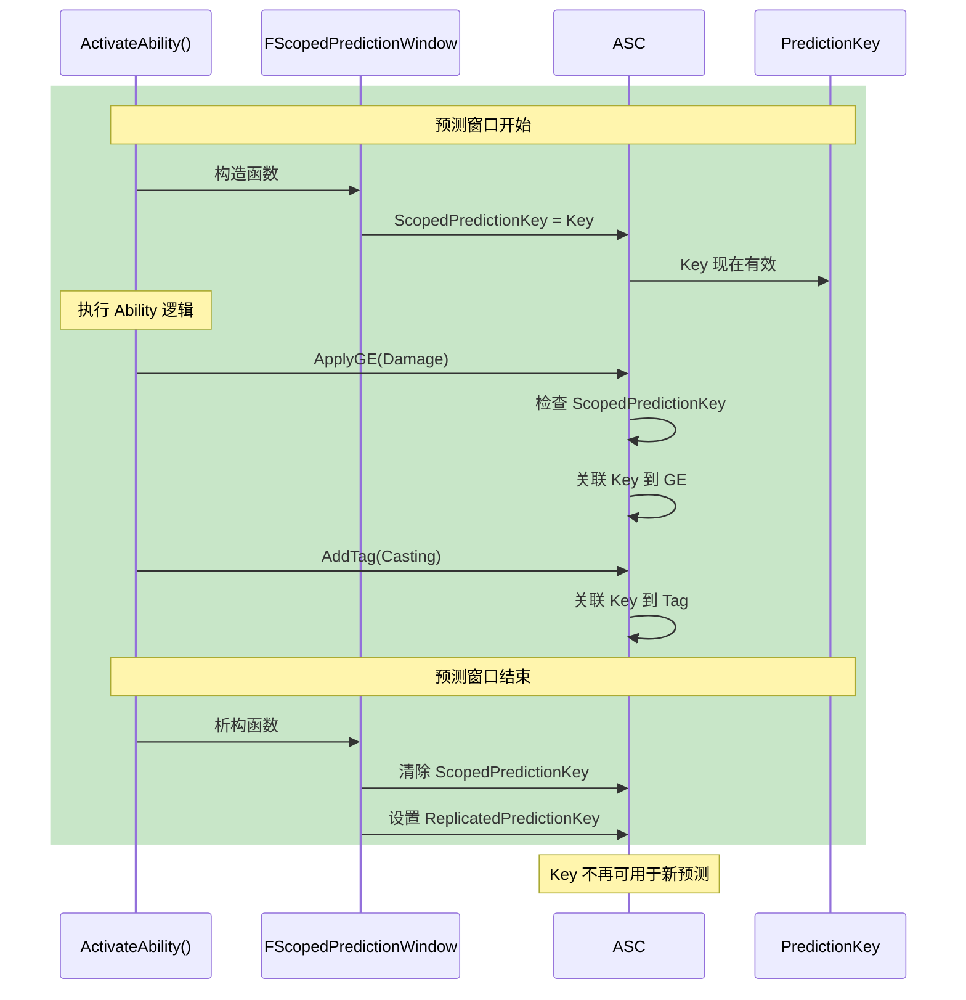
```mermaid
sequenceDiagram
    participant Ability as ActivateAbility()
    participant Window as FScopedPredictionWindow
    participant ASC as ASC
    participant Key as PredictionKey

    rect rgb(200, 230, 200)
        Note over Ability,Key: 预测窗口开始
        Ability->>Window: 构造函数
        Window->>ASC: ScopedPredictionKey = Key
        ASC->>Key: Key 现在有效

        Note over Ability: 执行 Ability 逻辑

        Ability->>ASC: ApplyGE(Damage)
        ASC->>ASC: 检查 ScopedPredictionKey
        ASC->>ASC: 关联 Key 到 GE

        Ability->>ASC: AddTag(Casting)
        ASC->>ASC: 关联 Key 到 Tag

        Note over Ability,Key: 预测窗口结束
        Ability->>Window: 析构函数
        Window->>ASC: 清除 ScopedPredictionKey
        Window->>ASC: 设置 ReplicatedPredictionKey
    end

    Note over ASC: Key 不再可用于新预测
```

### 2.4.3 等待服务器响应

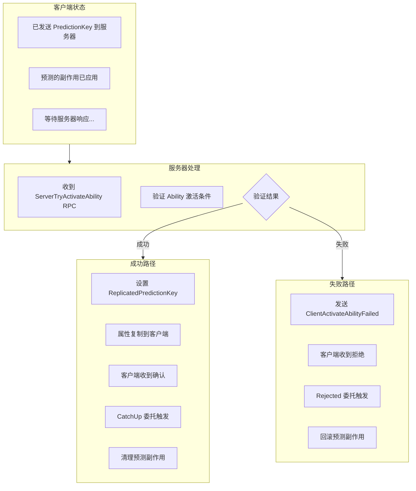
```mermaid
flowchart TB
    subgraph 客户端状态["客户端状态"]
        C1["已发送 PredictionKey 到服务器"]
        C2["预测的副作用已应用"]
        C3["等待服务器响应..."]
    end

    subgraph 服务器处理["服务器处理"]
        S1["收到 ServerTryActivateAbility RPC"]
        S2["验证 Ability 激活条件"]
        S3{"验证结果"}
    end

    subgraph 成功路径["成功路径"]
        OK1["设置 ReplicatedPredictionKey"]
        OK2["属性复制到客户端"]
        OK3["客户端收到确认"]
        OK4["CatchUp 委托触发"]
        OK5["清理预测副作用"]
    end

    subgraph 失败路径["失败路径"]
        Fail1["发送 ClientActivateAbilityFailed"]
        Fail2["客户端收到拒绝"]
        Fail3["Rejected 委托触发"]
        Fail4["回滚预测副作用"]
    end

    客户端状态 --> 服务器处理
    S3 -->|成功| 成功路径
    S3 -->|失败| 失败路径
```

### 2.4.4 FReplicatedPredictionKeyMap

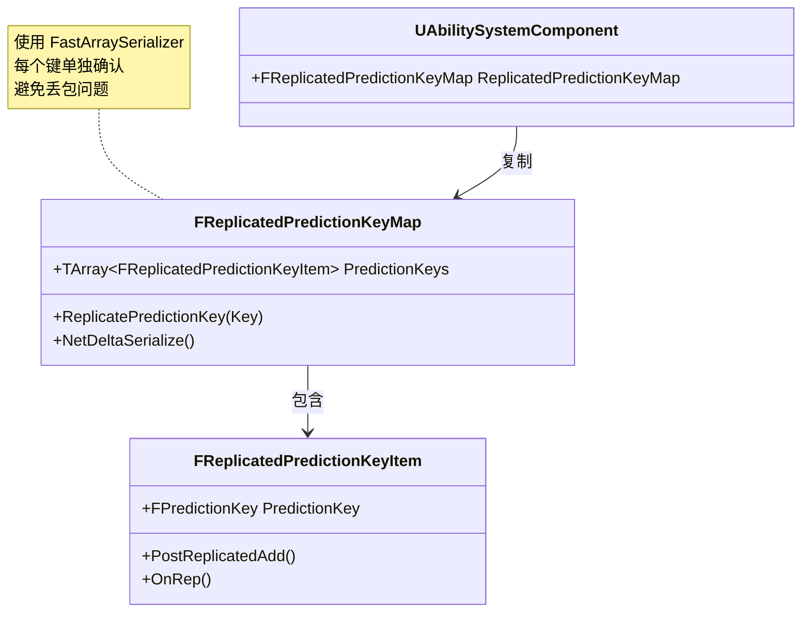
```mermaid
classDiagram
    class FReplicatedPredictionKeyMap {
        +TArray~FReplicatedPredictionKeyItem~ PredictionKeys
        +ReplicatePredictionKey(Key)
        +NetDeltaSerialize()
    }

    class FReplicatedPredictionKeyItem {
        +FPredictionKey PredictionKey
        +PostReplicatedAdd()
        +OnRep()
    }

    class UAbilitySystemComponent {
        +FReplicatedPredictionKeyMap ReplicatedPredictionKeyMap
    }

    FReplicatedPredictionKeyMap --> FReplicatedPredictionKeyItem : 包含
    UAbilitySystemComponent --> FReplicatedPredictionKeyMap : 复制

    note for FReplicatedPredictionKeyMap "使用 FastArraySerializer<br/>每个键单独确认<br/>避免丢包问题"
```

### 2.4.5 为什么用 FastArray 而非单个整数？

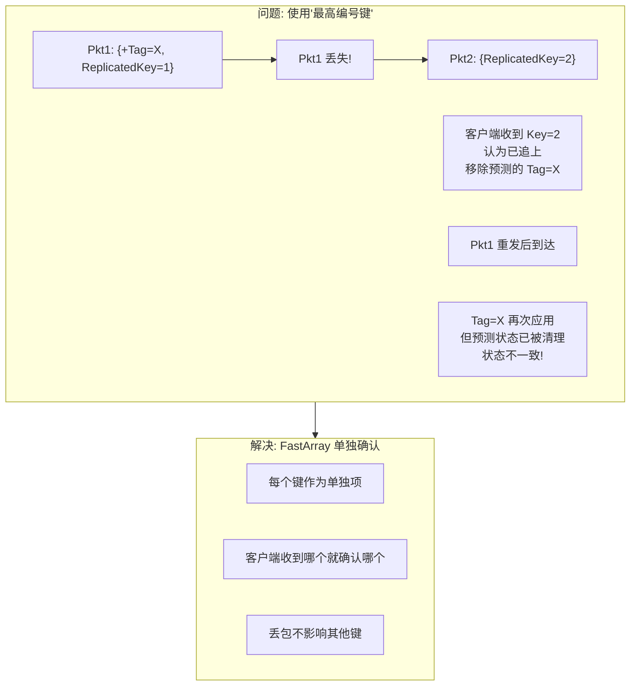
```mermaid
flowchart TB
    subgraph 问题场景["问题: 使用'最高编号键'"]
        P1["Pkt1: {+Tag=X, ReplicatedKey=1}"]
        P2["Pkt2: {ReplicatedKey=2}"]

        P1 --> Drop["Pkt1 丢失!"]
        Drop --> P2

        Note1["客户端收到 Key=2<br/>认为已追上<br/>移除预测的 Tag=X"]

        Recv["Pkt1 重发后到达"]
        Note2["Tag=X 再次应用<br/>但预测状态已被清理<br/>状态不一致!"]
    end

    subgraph 解决方案["解决: FastArray 单独确认"]
        S1["每个键作为单独项"]
        S2["客户端收到哪个就确认哪个"]
        S3["丢包不影响其他键"]
    end

    问题场景 --> 解决方案
```

---

## 2.5 预测键的验证方法

### 2.5.1 验证函数

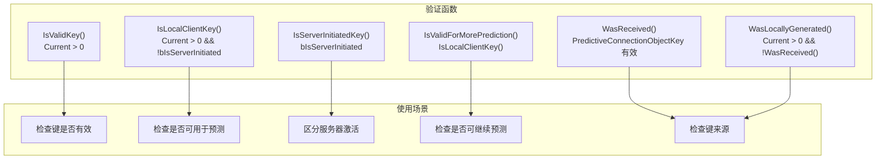
```mermaid
flowchart TB
    subgraph 验证函数["验证函数"]
        IsValid["IsValidKey()<br/>Current > 0"]
        IsLocal["IsLocalClientKey()<br/>Current > 0 && !bIsServerInitiated"]
        IsServer["IsServerInitiatedKey()<br/>bIsServerInitiated"]
        IsValidMore["IsValidForMorePrediction()<br/>IsLocalClientKey()"]
        WasRecv["WasReceived()<br/>PredictiveConnectionObjectKey 有效"]
        WasLocal["WasLocallyGenerated()<br/>Current > 0 && !WasReceived()"]
    end

    subgraph 使用场景["使用场景"]
        Scene1["检查键是否有效"]
        Scene2["检查是否可用于预测"]
        Scene3["区分服务器激活"]
        Scene4["检查是否可继续预测"]
        Scene5["检查键来源"]
    end

    IsValid --> Scene1
    IsLocal --> Scene2
    IsServer --> Scene3
    IsValidMore --> Scene4
    WasRecv --> Scene5
    WasLocal --> Scene5
```

### 2.5.2 源码实现

```cpp
// GameplayPrediction.h

// 检查键是否有效
bool IsValidKey() const
{
    return Current > 0;
}

// 检查是否是本地客户端生成的键
// 用于判断是否可以跳过重复执行
bool IsLocalClientKey() const
{
    return Current > 0 && !bIsServerInitiated;
}

// 检查是否是服务器发起的键
bool IsServerInitiatedKey() const
{
    return bIsServerInitiated;
}

// 检查是否可以继续用于预测
// 只有本地客户端键可以继续预测
bool IsValidForMorePrediction() const
{
    return IsLocalClientKey();
}

// 检查是否是从网络接收的
bool WasReceived() const
{
    return PredictiveConnectionObjectKey != FObjectKey();
}

// 检查是否是本地生成的
bool WasLocallyGenerated() const
{
    return (Current > 0) && (PredictiveConnectionObjectKey == FObjectKey());
}
```

---

## 2.6 实践：调试预测键

### 2.6.1 添加调试日志

```cpp
// 在 GameplayPrediction.cpp 添加

DEFINE_LOG_CATEGORY_STATIC(LogGameplayPrediction, Log, All);

FPredictionKey FPredictionKey::CreateNewPredictionKey(const UAbilitySystemComponent* ASC)
{
    FPredictionKey NewKey;
    if (ASC)
    {
        NewKey.Current = ASC->GetNextPredictionKeyID();
    }

    UE_LOG(LogGameplayPrediction, Log,
           TEXT("Created PredictionKey: Current=%d, Base=%d, ServerInitiated=%d"),
           NewKey.Current, NewKey.Base, NewKey.bIsServerInitiated);

    return NewKey;
}

bool FPredictionKey::NetSerialize(FArchive& Ar, UPackageMap* Map, bool& bOutSuccess)
{
    int16 OldCurrent = Current;

    Ar << Current;
    Ar << bIsServerInitiated;

    if (Ar.IsSaving())
    {
        UE_LOG(LogGameplayPrediction, Verbose,
               TEXT("NetSerialize SENDING: Current=%d, ServerInitiated=%d"),
               Current, bIsServerInitiated);
    }
    else
    {
        UE_LOG(LogGameplayPrediction, Verbose,
               TEXT("NetSerialize RECEIVING: OldCurrent=%d, NewCurrent=%d, ServerInitiated=%d"),
               OldCurrent, Current, bIsServerInitiated);
    }

    // ... 其余实现

    return true;
}
```

### 2.6.2 断点调试

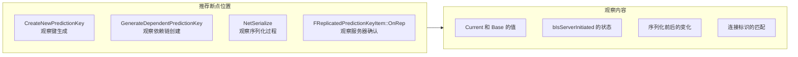
```mermaid
flowchart LR
    subgraph 推荐断点["推荐断点位置"]
        BP1["CreateNewPredictionKey<br/>观察键生成"]
        BP2["GenerateDependentPredictionKey<br/>观察依赖链创建"]
        BP3["NetSerialize<br/>观察序列化过程"]
        BP4["FReplicatedPredictionKeyItem::OnRep<br/>观察服务器确认"]
    end

    subgraph 观察内容["观察内容"]
        O1["Current 和 Base 的值"]
        O2["bIsServerInitiated 的状态"]
        O3["序列化前后的变化"]
        O4["连接标识的匹配"]
    end

    推荐断点 --> 观察内容
```

### 2.6.3 使用控制台命令

```
// 显示预测键调试信息
net.PK.Draw 1

// 显示网络统计
stat net

// 显示详细网络日志
log net verbose
```

---

## 2.7 总结

### 2.7.1 核心概念图

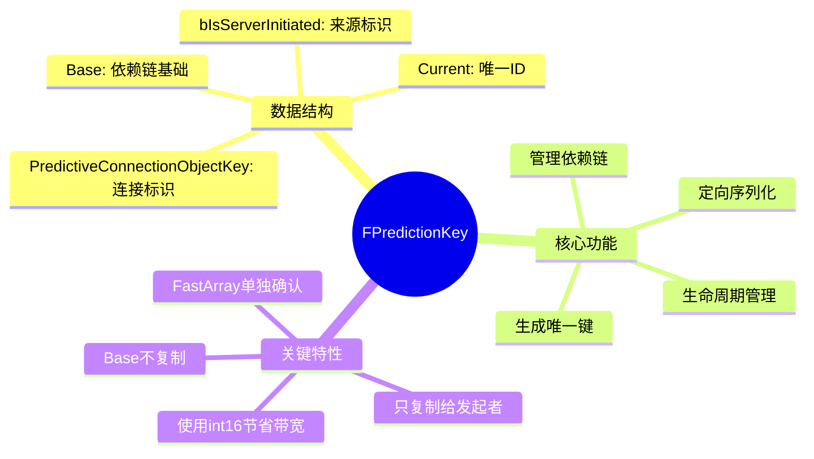
```mermaid
mindmap
  root((FPredictionKey))
    数据结构
      Current: 唯一ID
      Base: 依赖链基础
      bIsServerInitiated: 来源标识
      PredictiveConnectionObjectKey: 连接标识
    核心功能
      生成唯一键
      管理依赖链
      定向序列化
      生命周期管理
    关键特性
      只复制给发起者
      Base不复制
      使用int16节省带宽
      FastArray单独确认
```

### 2.7.2 关键要点

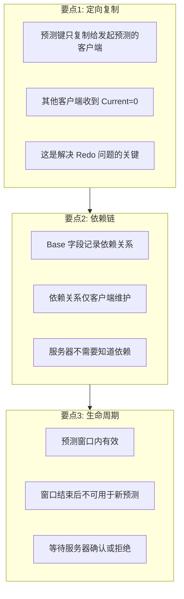
```mermaid
flowchart TB
    subgraph 要点1["要点1: 定向复制"]
        A1["预测键只复制给发起预测的客户端"]
        A2["其他客户端收到 Current=0"]
        A3["这是解决 Redo 问题的关键"]
    end

    subgraph 要点2["要点2: 依赖链"]
        B1["Base 字段记录依赖关系"]
        B2["依赖关系仅客户端维护"]
        B3["服务器不需要知道依赖"]
    end

    subgraph 要点3["要点3: 生命周期"]
        C1["预测窗口内有效"]
        C2["窗口结束后不可用于新预测"]
        C3["等待服务器确认或拒绝"]
    end

    要点1 --> 要点2 --> 要点3
```

---

## 课后练习

### 练习1：阅读源码

1. 打开 `GameplayPrediction.cpp`，找到 `FPredictionKey::NetSerialize`
2. 画出完整的序列化流程图

### 练习2：调试实践

1. 在 `CreateNewPredictionKey` 设置断点
2. 激活多个 Ability，观察键的生成
3. 检查 `Base` 字段在依赖链中的变化

### 练习3：思考题

1. 如果两个客户端同时生成预测键，会发生冲突吗？
2. 为什么 `Base` 字段使用 `NotReplicated`？
3. 预测键用完后会发生什么？

---

## 下节课预告

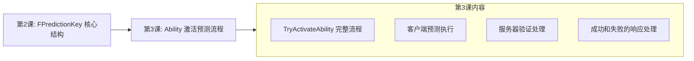
```mermaid
flowchart LR
    L2["第2课: FPredictionKey 核心结构"] --> L3["第3课: Ability 激活预测流程"]

    subgraph 第3课内容["第3课内容"]
        A["TryActivateAbility 完整流程"]
        B["客户端预测执行"]
        C["服务器验证处理"]
        D["成功和失败的响应处理"]
    end

    L3 --> 第3课内容
```

---

## 参考资料

- **源码**：`Engine/Plugins/Runtime/GameplayAbilities/Source/GameplayAbilities/Public/GameplayPrediction.h`
- **源码**：`Engine/Plugins/Runtime/GameplayAbilities/Source/GameplayAbilities/Private/GameplayPrediction.cpp`
- **相关**：`Engine/Plugins/Runtime/GameplayAbilities/Source/GameplayAbilities/Public/AbilitySystemComponent.h`
