# 第3课：Ability 激活预测流程

> 学习时间：45-60分钟
> 难度：进阶
> 前置知识：第1-2课内容、UE RPC机制

---

## 学习目标

完成本课后，你将能够：
1. 掌握 TryActivateAbility 的完整流程
2. 理解客户端预测执行的具体步骤
3. 掌握服务器验证和响应机制
4. 学会处理预测成功和失败的情况

---

## 3.1 激活流程总览

### 3.1.1 完整交互流程

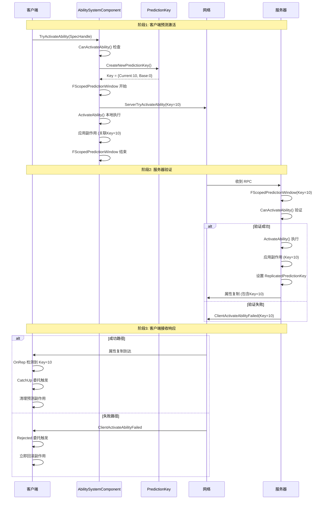
```mermaid
sequenceDiagram
    participant C as 客户端
    participant ASC as AbilitySystemComponent
    participant Key as PredictionKey
    participant Net as 网络
    participant S as 服务器

    Note over C,S: 阶段1: 客户端预测激活

    C->>ASC: TryActivateAbility(SpecHandle)
    ASC->>ASC: CanActivateAbility() 检查
    ASC->>Key: CreateNewPredictionKey()
    Key-->>ASC: Key = {Current:10, Base:0}
    ASC->>ASC: FScopedPredictionWindow 开始
    ASC->>Net: ServerTryActivateAbility(Key=10)
    ASC->>ASC: ActivateAbility() 本地执行
    ASC->>ASC: 应用副作用 (关联Key=10)
    ASC->>ASC: FScopedPredictionWindow 结束

    Note over C,S: 阶段2: 服务器验证

    Net->>S: 收到 RPC
    S->>S: FScopedPredictionWindow(Key=10)
    S->>S: CanActivateAbility() 验证

    alt 验证成功
        S->>S: ActivateAbility() 执行
        S->>S: 应用副作用 (Key=10)
        S->>S: 设置 ReplicatedPredictionKey
        S->>Net: 属性复制 (包含Key=10)
    else 验证失败
        S->>Net: ClientActivateAbilityFailed(Key=10)
    end

    Note over C,S: 阶段3: 客户端接收响应

    alt 成功路径
        Net->>C: 属性复制到达
        C->>C: OnRep 检测到 Key=10
        C->>C: CatchUp 委托触发
        C->>C: 清理预测副作用
    else 失败路径
        Net->>C: ClientActivateAbilityFailed
        C->>C: Rejected 委托触发
        C->>C: 立即回滚副作用
    end
```

### 3.1.2 流程状态图

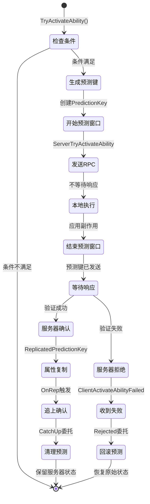
```mermaid
stateDiagram-v2
    [*] --> 检查条件: TryActivateAbility()
    检查条件 --> 生成预测键: 条件满足
    检查条件 --> [*]: 条件不满足

    生成预测键 --> 开始预测窗口: 创建PredictionKey
    开始预测窗口 --> 发送RPC: ServerTryActivateAbility
    发送RPC --> 本地执行: 不等待响应
    本地执行 --> 结束预测窗口: 应用副作用

    结束预测窗口 --> 等待响应: 预测键已发送

    等待响应 --> 服务器确认: 验证成功
    等待响应 --> 服务器拒绝: 验证失败

    服务器确认 --> 属性复制: ReplicatedPredictionKey
    属性复制 --> 追上确认: OnRep触发
    追上确认 --> 清理预测: CatchUp委托
    清理预测 --> [*]: 保留服务器状态

    服务器拒绝 --> 收到失败: ClientActivateAbilityFailed
    收到失败 --> 回滚预测: Rejected委托
    回滚预测 --> [*]: 恢复原始状态
```

---

## 3.2 客户端激活流程

### 3.2.1 TryActivateAbility 入口

**源码位置**：`AbilitySystemComponent_Abilities.cpp`

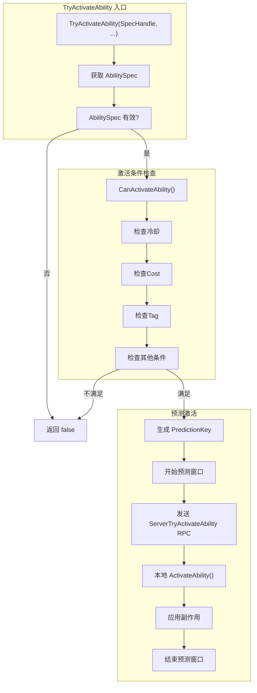
```mermaid
flowchart TB
    subgraph 入口["TryActivateAbility 入口"]
        A["TryActivateAbility(SpecHandle, ...)"]
        B["获取 AbilitySpec"]
        C["AbilitySpec 有效?"]
    end

    subgraph 检查["激活条件检查"]
        D["CanActivateAbility()"]
        E["检查冷却"]
        F["检查Cost"]
        G["检查Tag"]
        H["检查其他条件"]
    end

    subgraph 预测["预测激活"]
        I["生成 PredictionKey"]
        J["开始预测窗口"]
        K["发送 ServerTryActivateAbility RPC"]
        L["本地 ActivateAbility()"]
        M["应用副作用"]
        N["结束预测窗口"]
    end

    A --> B --> C
    C -->|否| Fail["返回 false"]
    C -->|是| D
    D --> E --> F --> G --> H
    H -->|不满足| Fail
    H -->|满足| I --> J --> K --> L --> M --> N
```

### 3.2.2 源码解析

```cpp
// AbilitySystemComponent_Abilities.cpp (简化版)

bool UAbilitySystemComponent::TryActivateAbility(
    FGameplayAbilitySpecHandle AbilityToActivate,
    bool InputPressed,
    const FPredictionKey* InPredictionKey)
{
    // Step 1: 获取 AbilitySpec
    FGameplayAbilitySpec* Spec = FindAbilitySpecFromHandle(AbilityToActivate);
    if (!Spec)
    {
        return false;
    }

    // Step 2: 检查是否可以激活
    if (!CanActivateAbility(AbilityToActivate))
    {
        return false;
    }

    // Step 3: 生成或使用预测键
    FPredictionKey PredictionKey;
    if (InPredictionKey)
    {
        // 使用传入的预测键（依赖链场景）
        PredictionKey = *InPredictionKey;
        PredictionKey.GenerateDependentPredictionKey();
    }
    else
    {
        // 生成新的预测键
        PredictionKey = FPredictionKey::CreateNewPredictionKey(this);
    }

    // Step 4: 开始预测窗口
    FScopedPredictionWindow ScopedPred(this, true);

    // Step 5: 发送 RPC 到服务器
    ServerTryActivateAbility(AbilityToActivate, PredictionKey, InputPressed);

    // Step 6: 本地预测执行
    ActivateAbility(AbilityToActivate, PredictionKey, ...);

    // Step 7: 预测窗口结束（ScopedPred 析构）
    return true;
}
```

### 3.2.3 FScopedPredictionWindow 作用

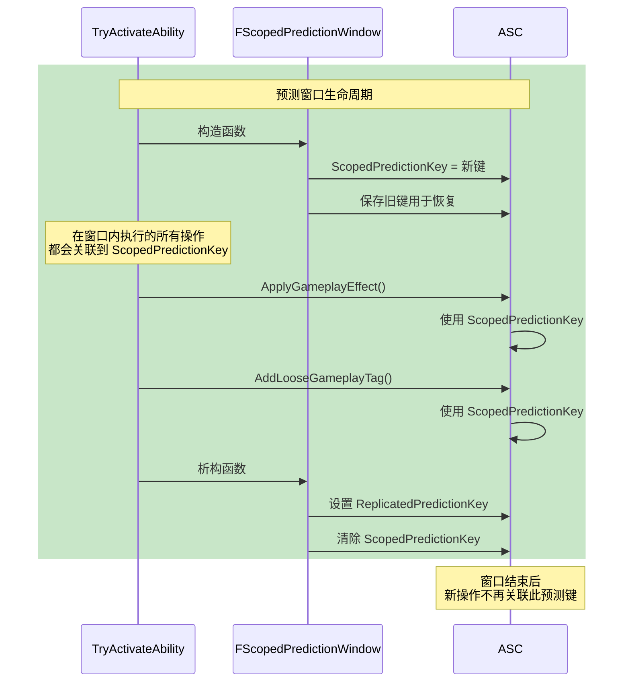
```mermaid
sequenceDiagram
    participant Code as TryActivateAbility
    participant Window as FScopedPredictionWindow
    participant ASC as ASC

    rect rgb(200, 230, 200)
        Note over Code,ASC: 预测窗口生命周期

        Code->>Window: 构造函数
        Window->>ASC: ScopedPredictionKey = 新键
        Window->>ASC: 保存旧键用于恢复

        Note over Code: 在窗口内执行的所有操作<br/>都会关联到 ScopedPredictionKey

        Code->>ASC: ApplyGameplayEffect()
        ASC->>ASC: 使用 ScopedPredictionKey

        Code->>ASC: AddLooseGameplayTag()
        ASC->>ASC: 使用 ScopedPredictionKey

        Code->>Window: 析构函数
        Window->>ASC: 设置 ReplicatedPredictionKey
        Window->>ASC: 清除 ScopedPredictionKey
    end

    Note over ASC: 窗口结束后<br/>新操作不再关联此预测键
```

### 3.2.4 本地预测执行

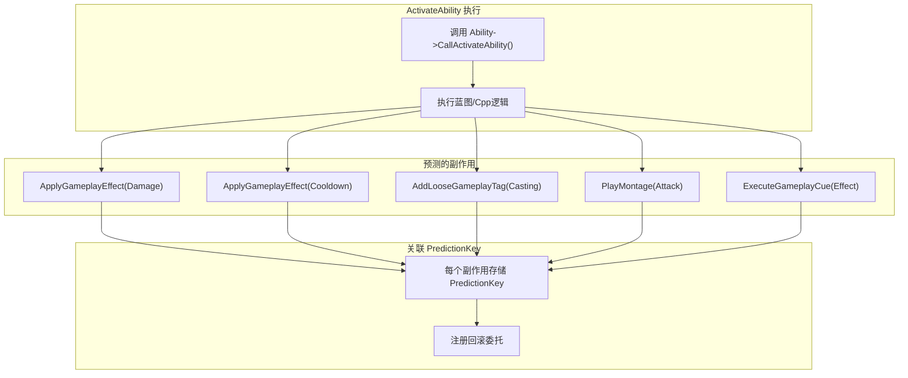
```mermaid
flowchart TB
    subgraph ActivateAbility["ActivateAbility 执行"]
        A["调用 Ability->CallActivateAbility()"]
        B["执行蓝图/Cpp逻辑"]
    end

    subgraph 副作用["预测的副作用"]
        C["ApplyGameplayEffect(Damage)"]
        D["ApplyGameplayEffect(Cooldown)"]
        E["AddLooseGameplayTag(Casting)"]
        F["PlayMontage(Attack)"]
        G["ExecuteGameplayCue(Effect)"]
    end

    subgraph 关联["关联 PredictionKey"]
        H["每个副作用存储 PredictionKey"]
        I["注册回滚委托"]
    end

    A --> B
    B --> C & D & E & F & G
    C & D & E & F & G --> H
    H --> I
```

---

## 3.3 服务器验证流程

### 3.3.1 服务器 RPC 处理

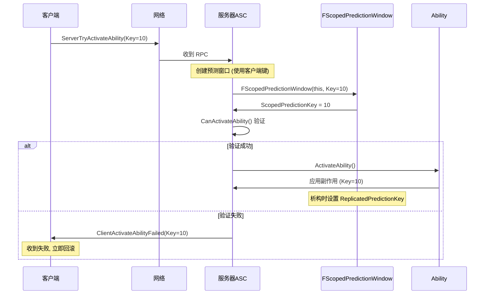
```mermaid
sequenceDiagram
    participant Client as 客户端
    participant Net as 网络
    participant Server as 服务器ASC
    participant Window as FScopedPredictionWindow
    participant Ability as Ability

    Client->>Net: ServerTryActivateAbility(Key=10)
    Net->>Server: 收到 RPC

    Note over Server: 创建预测窗口 (使用客户端键)
    Server->>Window: FScopedPredictionWindow(this, Key=10)
    Window->>Server: ScopedPredictionKey = 10

    Server->>Server: CanActivateAbility() 验证

    alt 验证成功
        Server->>Ability: ActivateAbility()
        Ability->>Server: 应用副作用 (Key=10)
        Note over Window: 析构时设置 ReplicatedPredictionKey
    else 验证失败
        Server->>Client: ClientActivateAbilityFailed(Key=10)
        Note over Client: 收到失败, 立即回滚
    end
```

### 3.3.2 源码解析

```cpp
// AbilitySystemComponent_Abilities.cpp (简化版)

void UAbilitySystemComponent::ServerTryActivateAbility_Implementation(
    FGameplayAbilitySpecHandle AbilityToActivate,
    FPredictionKey PredictionKey,
    bool InputPressed)
{
    // Step 1: 使用客户端传来的预测键创建窗口
    // 这确保服务器和客户端使用相同的键
    FScopedPredictionWindow ScopedPred(this, PredictionKey);

    // Step 2: 获取 AbilitySpec
    FGameplayAbilitySpec* Spec = FindAbilitySpecFromHandle(AbilityToActivate);
    if (!Spec)
    {
        ClientActivateAbilityFailed(AbilityToActivate, PredictionKey);
        return;
    }

    // Step 3: 验证是否可以激活
    if (!CanActivateAbility(AbilityToActivate))
    {
        ClientActivateAbilityFailed(AbilityToActivate, PredictionKey);
        return;
    }

    // Step 4: 执行 Ability
    ActivateAbility(AbilityToActivate, PredictionKey, ...);

    // Step 5: 预测窗口结束
    // ScopedPred 析构时会自动设置 ReplicatedPredictionKey
    // 这会触发属性复制，客户端收到后会清理预测状态
}
```

### 3.3.3 验证条件

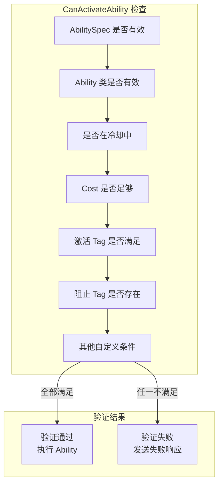
```mermaid
flowchart TB
    subgraph 验证条件["CanActivateAbility 检查"]
        A["AbilitySpec 是否有效"]
        B["Ability 类是否有效"]
        C["是否在冷却中"]
        D["Cost 是否足够"]
        E["激活 Tag 是否满足"]
        F["阻止 Tag 是否存在"]
        G["其他自定义条件"]
    end

    subgraph 结果["验证结果"]
        Pass["验证通过<br/>执行 Ability"]
        Fail["验证失败<br/>发送失败响应"]
    end

    A --> B --> C --> D --> E --> F --> G
    G -->|全部满足| Pass
    G -->|任一不满足| Fail
```

---

## 3.4 成功路径处理

### 3.4.1 服务器确认流程

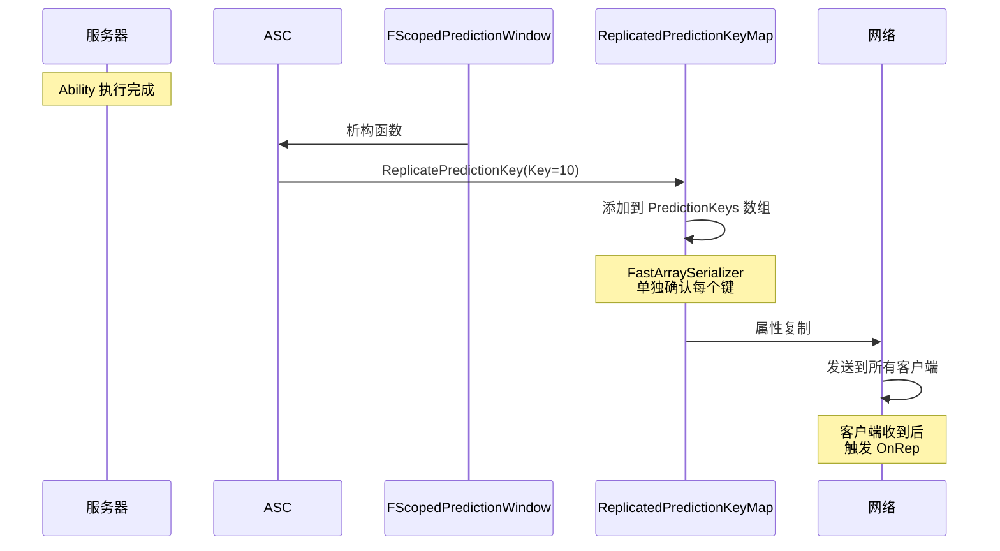
```mermaid
sequenceDiagram
    participant Server as 服务器
    participant ASC as ASC
    participant Window as FScopedPredictionWindow
    participant ReplMap as ReplicatedPredictionKeyMap
    participant Net as 网络

    Note over Server: Ability 执行完成

    Window->>ASC: 析构函数
    ASC->>ReplMap: ReplicatePredictionKey(Key=10)
    ReplMap->>ReplMap: 添加到 PredictionKeys 数组

    Note over ReplMap: FastArraySerializer<br/>单独确认每个键

    ReplMap->>Net: 属性复制
    Net->>Net: 发送到所有客户端

    Note over Net: 客户端收到后<br/>触发 OnRep
```

### 3.4.2 客户端接收确认

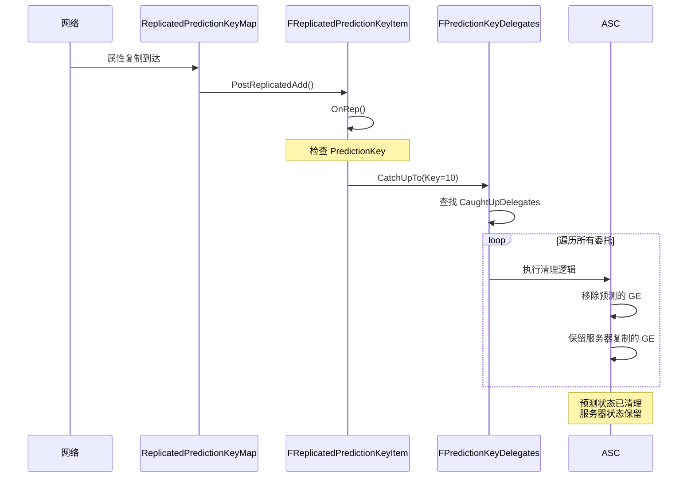
```mermaid
sequenceDiagram
    participant Net as 网络
    participant ReplMap as ReplicatedPredictionKeyMap
    participant Item as FReplicatedPredictionKeyItem
    participant Delegate as FPredictionKeyDelegates
    participant ASC as ASC

    Net->>ReplMap: 属性复制到达
    ReplMap->>Item: PostReplicatedAdd()
    Item->>Item: OnRep()

    Note over Item: 检查 PredictionKey

    Item->>Delegate: CatchUpTo(Key=10)
    Delegate->>Delegate: 查找 CaughtUpDelegates

    loop 遍历所有委托
        Delegate->>ASC: 执行清理逻辑
        ASC->>ASC: 移除预测的 GE
        ASC->>ASC: 保留服务器复制的 GE
    end

    Note over ASC: 预测状态已清理<br/>服务器状态保留
```

### 3.4.3 源码解析

```cpp
// GameplayPrediction.cpp

void FReplicatedPredictionKeyItem::OnRep(const FReplicatedPredictionKeyMap& InArray)
{
    // 触发 CatchUp 委托
    // 这会清理与此预测键关联的所有预测副作用
    FPredictionKeyDelegates::CatchUpTo(PredictionKey.Current);
}

// FPredictionKeyDelegates 实现
void FPredictionKeyDelegates::CatchUpTo(FPredictionKey::KeyType Key)
{
    FPredictionKeyDelegates& Delegates = Get();

    // 查找此键的委托
    FDelegates* KeyDelegates = Delegates.DelegateMap.Find(Key);
    if (KeyDelegates)
    {
        // 执行所有 CaughtUp 委托
        for (const FPredictionKeyEvent& Event : KeyDelegates->CaughtUpDelegates)
        {
            Event.ExecuteIfBound();
        }

        // 清理委托
        Delegates.DelegateMap.Remove(Key);
    }
}
```

### 3.4.4 清理预测副作用

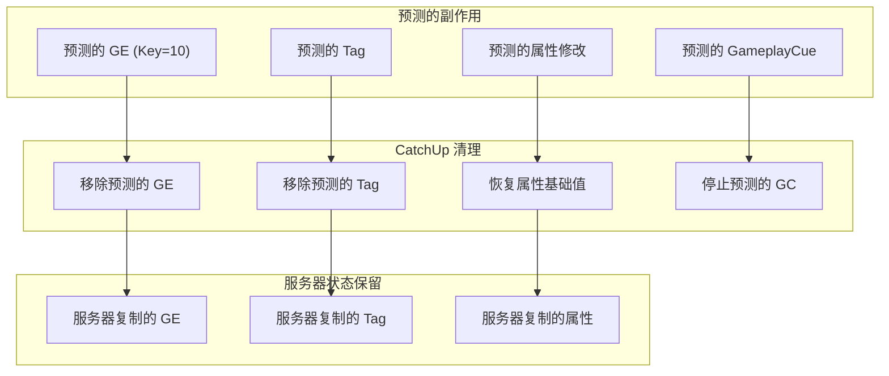
```mermaid
flowchart TB
    subgraph 预测状态["预测的副作用"]
        A["预测的 GE (Key=10)"]
        B["预测的 Tag"]
        C["预测的属性修改"]
        D["预测的 GameplayCue"]
    end

    subgraph 清理过程["CatchUp 清理"]
        E["移除预测的 GE"]
        F["移除预测的 Tag"]
        G["恢复属性基础值"]
        H["停止预测的 GC"]
    end

    subgraph 保留状态["服务器状态保留"]
        I["服务器复制的 GE"]
        J["服务器复制的 Tag"]
        K["服务器复制的属性"]
    end

    A --> E --> I
    B --> F --> J
    C --> G --> K
    D --> H
```

---

## 3.5 失败路径处理

### 3.5.1 服务器拒绝流程

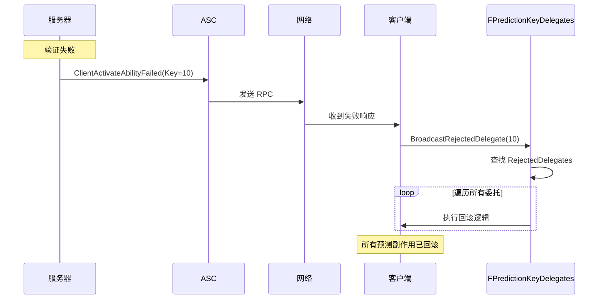
```mermaid
sequenceDiagram
    participant Server as 服务器
    participant ASC as ASC
    participant Net as 网络
    participant Client as 客户端
    participant Delegate as FPredictionKeyDelegates

    Note over Server: 验证失败

    Server->>ASC: ClientActivateAbilityFailed(Key=10)
    ASC->>Net: 发送 RPC
    Net->>Client: 收到失败响应

    Client->>Delegate: BroadcastRejectedDelegate(10)
    Delegate->>Delegate: 查找 RejectedDelegates

    loop 遍历所有委托
        Delegate->>Client: 执行回滚逻辑
    end

    Note over Client: 所有预测副作用已回滚
```

### 3.5.2 源码解析

```cpp
// AbilitySystemComponent_Abilities.cpp

void UAbilitySystemComponent::ClientActivateAbilityFailed_Implementation(
    FGameplayAbilitySpecHandle AbilityToActivate,
    FPredictionKey PredictionKey)
{
    // 立即广播拒绝委托
    // 这会触发所有与此预测键关联的回滚逻辑
    FPredictionKeyDelegates::BroadcastRejectedDelegate(PredictionKey.Current);

    // 取消 Ability
    FGameplayAbilitySpec* Spec = FindAbilitySpecFromHandle(AbilityToActivate);
    if (Spec && Spec->Ability)
    {
        Spec->Ability->K2_CancelAbility();
    }
}

// FPredictionKeyDelegates 实现
void FPredictionKeyDelegates::BroadcastRejectedDelegate(FPredictionKey::KeyType Key)
{
    FPredictionKeyDelegates& Delegates = Get();

    FDelegates* KeyDelegates = Delegates.DelegateMap.Find(Key);
    if (KeyDelegates)
    {
        // 执行所有 Rejected 委托
        for (const FPredictionKeyEvent& Event : KeyDelegates->RejectedDelegates)
        {
            Event.ExecuteIfBound();
        }

        // 同时执行 CaughtUp 委托（清理）
        for (const FPredictionKeyEvent& Event : KeyDelegates->CaughtUpDelegates)
        {
            Event.ExecuteIfBound();
        }

        // 清理委托
        Delegates.DelegateMap.Remove(Key);
    }
}
```

### 3.5.3 回滚过程详解

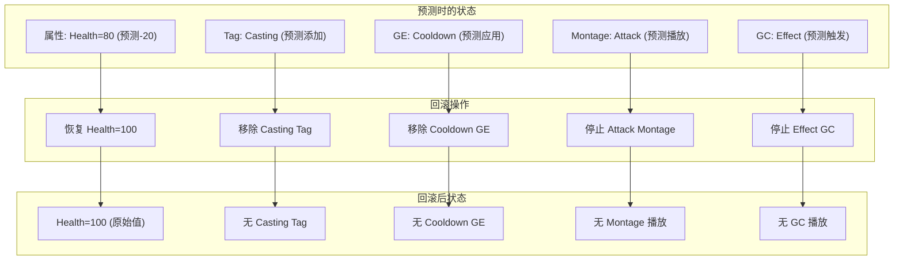
```mermaid
flowchart TB
    subgraph 预测状态["预测时的状态"]
        A1["属性: Health=80 (预测-20)"]
        A2["Tag: Casting (预测添加)"]
        A3["GE: Cooldown (预测应用)"]
        A4["Montage: Attack (预测播放)"]
        A5["GC: Effect (预测触发)"]
    end

    subgraph 回滚操作["回滚操作"]
        B1["恢复 Health=100"]
        B2["移除 Casting Tag"]
        B3["移除 Cooldown GE"]
        B4["停止 Attack Montage"]
        B5["停止 Effect GC"]
    end

    subgraph 最终状态["回滚后状态"]
        C1["Health=100 (原始值)"]
        C2["无 Casting Tag"]
        C3["无 Cooldown GE"]
        C4["无 Montage 播放"]
        C5["无 GC 播放"]
    end

    A1 --> B1 --> C1
    A2 --> B2 --> C2
    A3 --> B3 --> C3
    A4 --> B4 --> C4
    A5 --> B5 --> C5
```

---

## 3.6 委托注册机制

### 3.6.1 委托注册流程

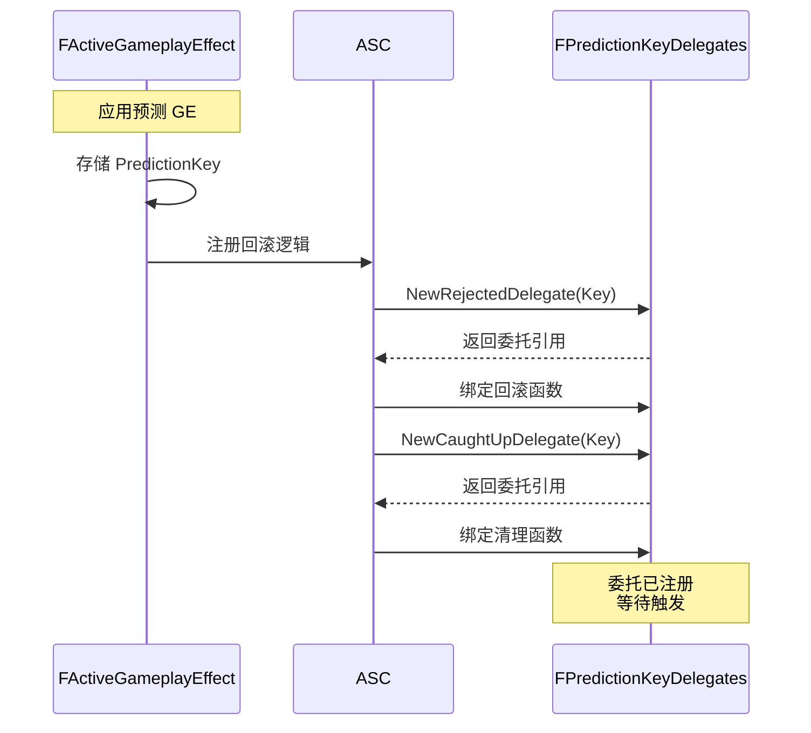
```mermaid
sequenceDiagram
    participant GE as FActiveGameplayEffect
    participant ASC as ASC
    participant Delegate as FPredictionKeyDelegates

    Note over GE: 应用预测 GE

    GE->>GE: 存储 PredictionKey
    GE->>ASC: 注册回滚逻辑

    ASC->>Delegate: NewRejectedDelegate(Key)
    Delegate-->>ASC: 返回委托引用
    ASC->>Delegate: 绑定回滚函数

    ASC->>Delegate: NewCaughtUpDelegate(Key)
    Delegate-->>ASC: 返回委托引用
    ASC->>Delegate: 绑定清理函数

    Note over Delegate: 委托已注册<br/>等待触发
```

### 3.6.2 源码示例

```cpp
// GameplayEffect.cpp (简化版)

void FActiveGameplayEffectsContainer::ApplyGameplayEffectSpec(
    const FGameplayEffectSpec& Spec,
    FPredictionKey PredictionKey)
{
    // 创建 ActiveGE
    FActiveGameplayEffect& NewGE = ActiveEffects.AddDefaulted_GetRef();
    NewGE.PredictionKey = PredictionKey;

    if (PredictionKey.IsValidKey())
    {
        // 注册回滚委托
        FPredictionKeyDelegates::NewRejectedDelegate(PredictionKey.Current)
            .AddLambda([this, &NewGE]()
            {
                // 回滚: 移除此 GE
                RemoveActiveGameplayEffect_NoReturn(NewGE);
            });

        // 注册清理委托
        FPredictionKeyDelegates::NewCaughtUpDelegate(PredictionKey.Current)
            .AddLambda([this, &NewGE]()
            {
                // 清理: 移除预测的 GE，保留服务器的
                RemoveActiveGameplayEffect_NoReturn(NewGE);
            });
    }
}
```

### 3.6.3 委托数据结构

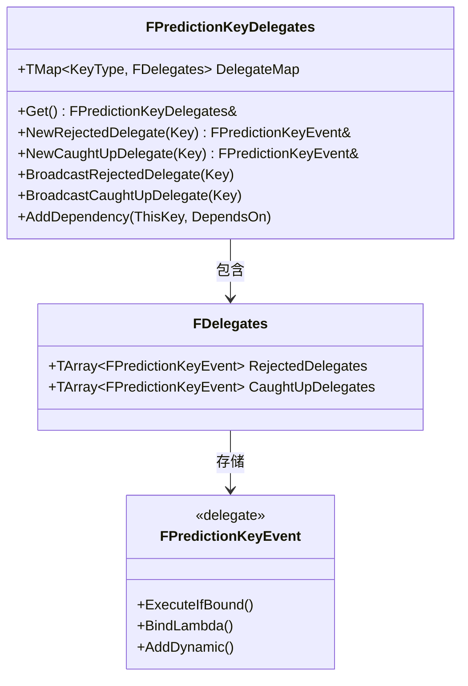
```mermaid
classDiagram
    class FPredictionKeyDelegates {
        +TMap~KeyType, FDelegates~ DelegateMap
        +Get() FPredictionKeyDelegates&
        +NewRejectedDelegate(Key) FPredictionKeyEvent&
        +NewCaughtUpDelegate(Key) FPredictionKeyEvent&
        +BroadcastRejectedDelegate(Key)
        +BroadcastCaughtUpDelegate(Key)
        +AddDependency(ThisKey, DependsOn)
    }

    class FDelegates {
        +TArray~FPredictionKeyEvent~ RejectedDelegates
        +TArray~FPredictionKeyEvent~ CaughtUpDelegates
    }

    class FPredictionKeyEvent {
        <<delegate>>
        +ExecuteIfBound()
        +BindLambda()
        +AddDynamic()
    }

    FPredictionKeyDelegates --> FDelegates : 包含
    FDelegates --> FPredictionKeyEvent : 存储
```

---

## 3.7 完整示例

### 3.7.1 火球术 Ability 示例

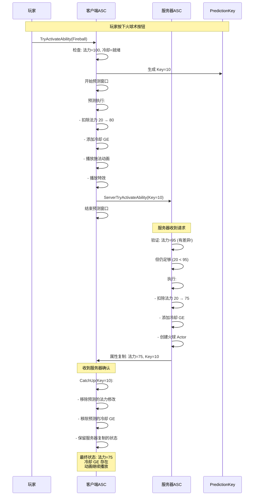
```mermaid
sequenceDiagram
    participant Player as 玩家
    participant Client as 客户端ASC
    participant Server as 服务器ASC
    participant Key as PredictionKey

    Note over Player,Key: 玩家按下火球术按钮

    Player->>Client: TryActivateAbility(Fireball)

    Client->>Client: 检查: 法力=100, 冷却=就绪
    Client->>Key: 生成 Key=10
    Client->>Client: 开始预测窗口

    Client->>Client: 预测执行:
    Client->>Client: - 扣除法力 20 → 80
    Client->>Client: - 添加冷却 GE
    Client->>Client: - 播放施法动画
    Client->>Client: - 播放特效

    Client->>Server: ServerTryActivateAbility(Key=10)
    Client->>Client: 结束预测窗口

    Note over Server: 服务器收到请求

    Server->>Server: 验证: 法力=95 (有差异!)
    Server->>Server: 但仍足够 (20 < 95)

    Server->>Server: 执行:
    Server->>Server: - 扣除法力 20 → 75
    Server->>Server: - 添加冷却 GE
    Server->>Server: - 创建火球 Actor

    Server->>Client: 属性复制: 法力=75, Key=10

    Note over Client: 收到服务器确认

    Client->>Client: CatchUp(Key=10):
    Client->>Client: - 移除预测的法力修改
    Client->>Client: - 移除预测的冷却 GE
    Client->>Client: - 保留服务器复制的状态

    Note over Client: 最终状态: 法力=75<br/>冷却 GE 存在<br/>动画继续播放
```

### 3.7.2 预测失败示例

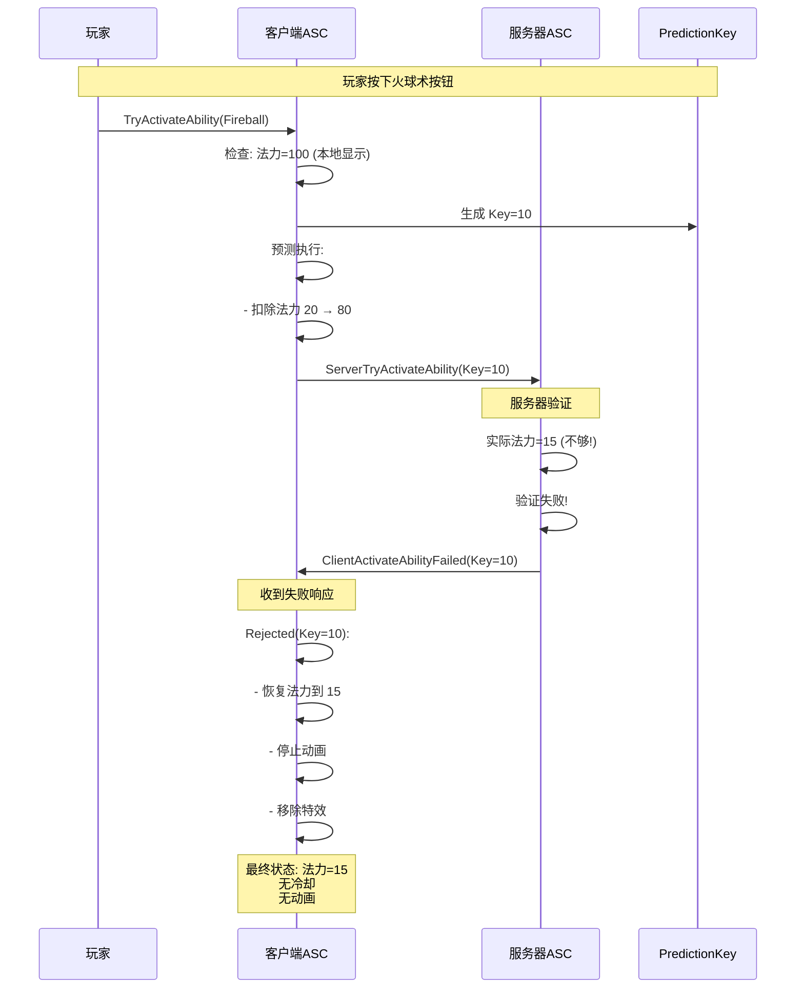
```mermaid
sequenceDiagram
    participant Player as 玩家
    participant Client as 客户端ASC
    participant Server as 服务器ASC
    participant Key as PredictionKey

    Note over Player,Key: 玩家按下火球术按钮

    Player->>Client: TryActivateAbility(Fireball)

    Client->>Client: 检查: 法力=100 (本地显示)
    Client->>Key: 生成 Key=10
    Client->>Client: 预测执行:
    Client->>Client: - 扣除法力 20 → 80

    Client->>Server: ServerTryActivateAbility(Key=10)

    Note over Server: 服务器验证

    Server->>Server: 实际法力=15 (不够!)
    Server->>Server: 验证失败!

    Server->>Client: ClientActivateAbilityFailed(Key=10)

    Note over Client: 收到失败响应

    Client->>Client: Rejected(Key=10):
    Client->>Client: - 恢复法力到 15
    Client->>Client: - 停止动画
    Client->>Client: - 移除特效

    Note over Client: 最终状态: 法力=15<br/>无冷却<br/>无动画
```

---

## 3.8 实践：调试激活流程

### 3.8.1 添加调试日志

```cpp
// AbilitySystemComponent_Abilities.cpp

bool UAbilitySystemComponent::TryActivateAbility(...)
{
    UE_LOG(LogGameplayAbilities, Log, TEXT("TryActivateAbility: SpecHandle=%s"), *AbilityToActivate.ToString());

    // ... 检查逻辑 ...

    FPredictionKey PredictionKey = FPredictionKey::CreateNewPredictionKey(this);
    UE_LOG(LogGameplayAbilities, Log, TEXT("Created PredictionKey: %s"), *PredictionKey.ToString());

    // ... 执行逻辑 ...

    return true;
}

void UAbilitySystemComponent::ServerTryActivateAbility_Implementation(...)
{
    UE_LOG(LogGameplayAbilities, Log, TEXT("Server received: Key=%s"), *PredictionKey.ToString());

    // ... 验证逻辑 ...

    if (bSuccess)
    {
        UE_LOG(LogGameplayAbilities, Log, TEXT("Server accepted: Key=%s"), *PredictionKey.ToString());
    }
    else
    {
        UE_LOG(LogGameplayAbilities, Warning, TEXT("Server rejected: Key=%s"), *PredictionKey.ToString());
    }
}

void UAbilitySystemComponent::ClientActivateAbilityFailed_Implementation(...)
{
    UE_LOG(LogGameplayAbilities, Warning, TEXT("Client received failure: Key=%s"), *PredictionKey.ToString());
}
```

### 3.8.2 断点位置

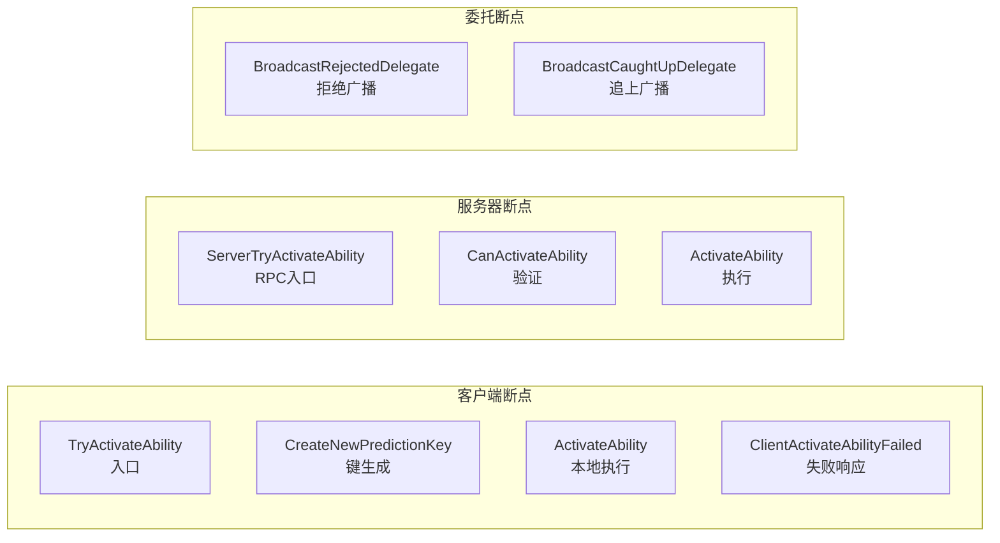
```mermaid
flowchart LR
    subgraph 客户端断点["客户端断点"]
        C1["TryActivateAbility<br/>入口"]
        C2["CreateNewPredictionKey<br/>键生成"]
        C3["ActivateAbility<br/>本地执行"]
        C4["ClientActivateAbilityFailed<br/>失败响应"]
    end

    subgraph 服务器断点["服务器断点"]
        S1["ServerTryActivateAbility<br/>RPC入口"]
        S2["CanActivateAbility<br/>验证"]
        S3["ActivateAbility<br/>执行"]
    end

    subgraph 委托断点["委托断点"]
        D1["BroadcastRejectedDelegate<br/>拒绝广播"]
        D2["BroadcastCaughtUpDelegate<br/>追上广播"]
    end
```

---

## 3.9 总结

### 3.9.1 核心流程图

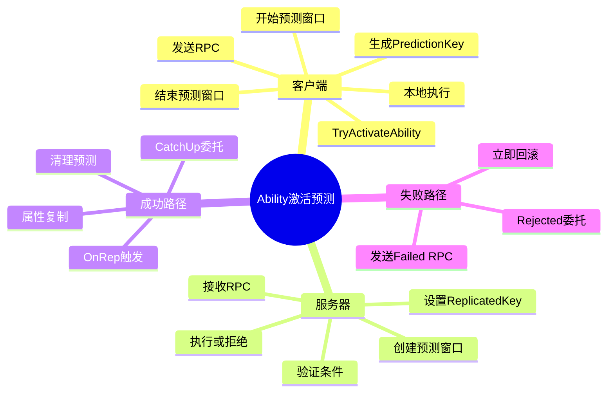
```mermaid
mindmap
  root((Ability激活预测))
    客户端
      TryActivateAbility
      生成PredictionKey
      开始预测窗口
      发送RPC
      本地执行
      结束预测窗口
    服务器
      接收RPC
      创建预测窗口
      验证条件
      执行或拒绝
      设置ReplicatedKey
    成功路径
      属性复制
      OnRep触发
      CatchUp委托
      清理预测
    失败路径
      发送Failed RPC
      Rejected委托
      立即回滚
```

### 3.9.2 关键要点

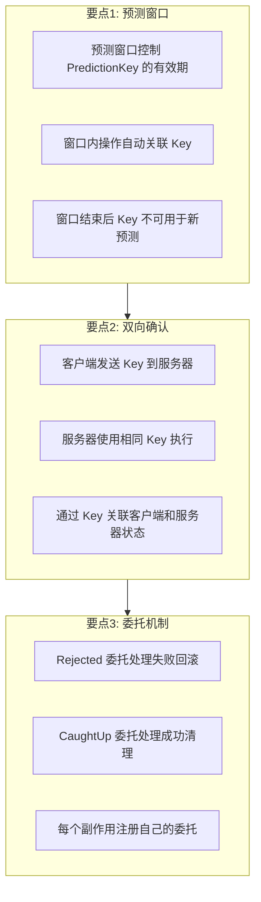
```mermaid
flowchart TB
    subgraph 要点1["要点1: 预测窗口"]
        A1["预测窗口控制 PredictionKey 的有效期"]
        A2["窗口内操作自动关联 Key"]
        A3["窗口结束后 Key 不可用于新预测"]
    end

    subgraph 要点2["要点2: 双向确认"]
        B1["客户端发送 Key 到服务器"]
        B2["服务器使用相同 Key 执行"]
        B3["通过 Key 关联客户端和服务器状态"]
    end

    subgraph 要点3["要点3: 委托机制"]
        C1["Rejected 委托处理失败回滚"]
        C2["CaughtUp 委托处理成功清理"]
        C3["每个副作用注册自己的委托"]
    end

    要点1 --> 要点2 --> 要点3
```

---

## 课后练习

### 练习1：流程追踪

1. 在 `TryActivateAbility` 设置断点
2. 单步执行，追踪完整的激活流程
3. 记录 PredictionKey 在每一步的状态

### 练习2：模拟失败

1. 创建一个需要 Cost 的 Ability
2. 在服务器端修改属性使其不足
3. 观察客户端的回滚过程

### 练习3：思考题

1. 为什么客户端不等待服务器响应就执行？
2. 如果 RPC 丢失会发生什么？
3. 如何处理网络抖动导致的延迟确认？

---

## 下节课预告

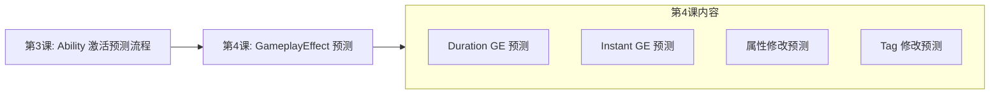
```mermaid
flowchart LR
    L3["第3课: Ability 激活预测流程"] --> L4["第4课: GameplayEffect 预测"]

    subgraph 第4课内容["第4课内容"]
        A["Duration GE 预测"]
        B["Instant GE 预测"]
        C["属性修改预测"]
        D["Tag 修改预测"]
    end

    L4 --> 第4课内容
```

---

## 参考资料

- **源码**：`Engine/Plugins/Runtime/GameplayAbilities/Source/GameplayAbilities/Private/AbilitySystemComponent_Abilities.cpp`
- **源码**：`Engine/Plugins/Runtime/GameplayAbilities/Source/GameplayAbilities/Private/GameplayPrediction.cpp`
- **官方文档**：[Gameplay Ability System](https://dev.epicgames.com/documentation/en-us/unreal-engine/gameplay-ability-system-in-unreal-engine)
