# 第4课：GameplayEffect 预测

> 学习时间：45-60分钟
> 难度：进阶
> 前置知识：第1-3课内容、GameplayEffect基础

---

## 学习目标

完成本课后，你将能够：
1. 掌握 GameplayEffect 应用的预测机制
2. 理解 Duration GE 和 Instant GE 的预测差异
3. 学会处理 GE 的 "Undo" 和 "Redo" 问题
4. 掌握 GameplayTag 的预测修改

---

## 4.1 GameplayEffect 预测概述

### 4.1.1 GE 预测的基本原则

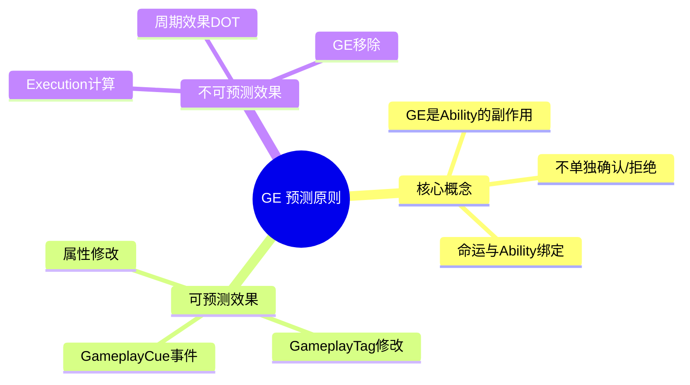
```mermaid
mindmap
  root((GE 预测原则))
    核心概念
      GE是Ability的副作用
      不单独确认/拒绝
      命运与Ability绑定
    可预测效果
      属性修改
      GameplayTag修改
      GameplayCue事件
    不可预测效果
      Execution计算
      周期效果DOT
      GE移除
```

### 4.1.2 GE 预测流程总览

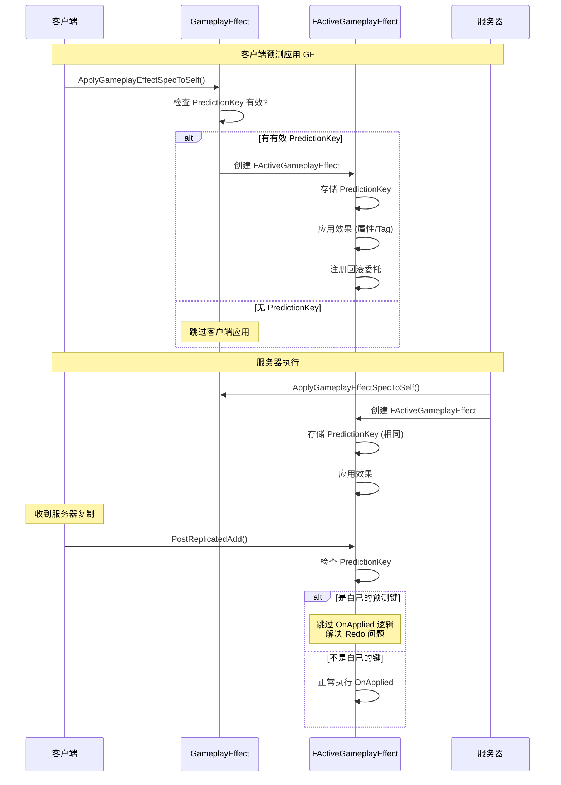
```mermaid
sequenceDiagram
    participant Client as 客户端
    participant GE as GameplayEffect
    participant ActiveGE as FActiveGameplayEffect
    participant Server as 服务器

    Note over Client,Server: 客户端预测应用 GE

    Client->>GE: ApplyGameplayEffectSpecToSelf()
    GE->>GE: 检查 PredictionKey 有效?

    alt 有有效 PredictionKey
        GE->>ActiveGE: 创建 FActiveGameplayEffect
        ActiveGE->>ActiveGE: 存储 PredictionKey
        ActiveGE->>ActiveGE: 应用效果 (属性/Tag)
        ActiveGE->>ActiveGE: 注册回滚委托
    else 无 PredictionKey
        Note over GE: 跳过客户端应用
    end

    Note over Client,Server: 服务器执行

    Server->>GE: ApplyGameplayEffectSpecToSelf()
    Server->>ActiveGE: 创建 FActiveGameplayEffect
    ActiveGE->>ActiveGE: 存储 PredictionKey (相同)
    ActiveGE->>ActiveGE: 应用效果

    Note over Client: 收到服务器复制

    Client->>ActiveGE: PostReplicatedAdd()
    ActiveGE->>ActiveGE: 检查 PredictionKey

    alt 是自己的预测键
        Note over ActiveGE: 跳过 OnApplied 逻辑<br/>解决 Redo 问题
    else 不是自己的键
        ActiveGE->>ActiveGE: 正常执行 OnApplied
    end
```

---

## 4.2 Duration GameplayEffect 预测

### 4.2.1 Duration GE 的特点

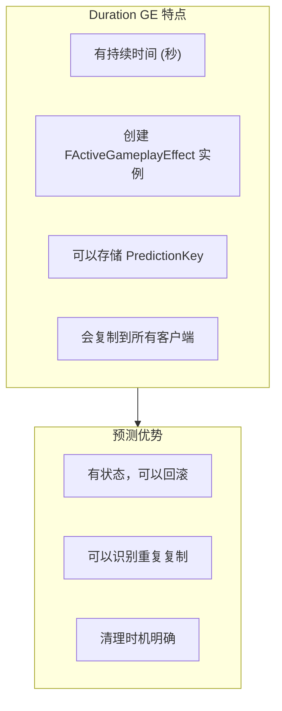
```mermaid
flowchart TB
    subgraph DurationGE["Duration GE 特点"]
        A["有持续时间 (秒)"]
        B["创建 FActiveGameplayEffect 实例"]
        C["可以存储 PredictionKey"]
        D["会复制到所有客户端"]
    end

    subgraph 预测优势["预测优势"]
        E["有状态，可以回滚"]
        F["可以识别重复复制"]
        G["清理时机明确"]
    end

    DurationGE --> 预测优势
```

### 4.2.2 Duration GE 预测流程

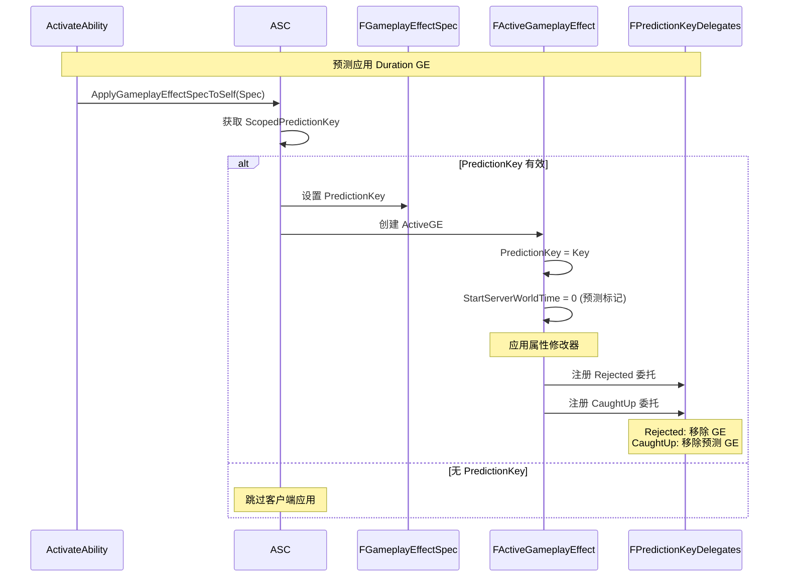
```mermaid
sequenceDiagram
    participant Ability as ActivateAbility
    participant ASC as ASC
    participant Spec as FGameplayEffectSpec
    participant Active as FActiveGameplayEffect
    participant Delegate as FPredictionKeyDelegates

    Note over Ability,Delegate: 预测应用 Duration GE

    Ability->>ASC: ApplyGameplayEffectSpecToSelf(Spec)
    ASC->>ASC: 获取 ScopedPredictionKey

    alt PredictionKey 有效
        ASC->>Spec: 设置 PredictionKey

        ASC->>Active: 创建 ActiveGE
        Active->>Active: PredictionKey = Key
        Active->>Active: StartServerWorldTime = 0 (预测标记)

        Note over Active: 应用属性修改器

        Active->>Delegate: 注册 Rejected 委托
        Active->>Delegate: 注册 CaughtUp 委托

        Note over Delegate: Rejected: 移除 GE<br/>CaughtUp: 移除预测 GE
    else 无 PredictionKey
        Note over ASC: 跳过客户端应用
    end
```

### 4.2.3 源码解析

```cpp
// AbilitySystemComponent.cpp (简化版)

FActiveGameplayEffectHandle UAbilitySystemComponent::ApplyGameplayEffectSpecToSelf(
    const FGameplayEffectSpec& Spec,
    FPredictionKey PredictionKey)
{
    // 检查是否有有效的预测键
    if (PredictionKey.IsValidKey())
    {
        // 客户端预测：只在有预测键时应用
        // 无预测键时跳过（避免非预测场景下客户端自行应用）

        FActiveGameplayEffect& NewGE = ActiveGameplayEffects.ApplyGameplayEffectSpec(Spec, PredictionKey);

        // 注册回滚逻辑
        if (NewGE.PredictionKey.IsValidKey())
        {
            // 注册拒绝时的回滚
            FPredictionKeyDelegates::NewRejectedDelegate(NewGE.PredictionKey.Current)
                .AddLambda([this, Handle = NewGE.Handle]()
                {
                    RemoveActiveGameplayEffectByAppliedEffect(Handle);
                });

            // 注册追上时的清理
            FPredictionKeyDelegates::NewCaughtUpDelegate(NewGE.PredictionKey.Current)
                .AddLambda([this, Handle = NewGE.Handle]()
                {
                    RemoveActiveGameplayEffectByAppliedEffect(Handle);
                });
        }

        return NewGE.Handle;
    }

    // 无预测键，跳过客户端应用
    return FActiveGameplayEffectHandle();
}
```

### 4.2.4 解决 Redo 问题

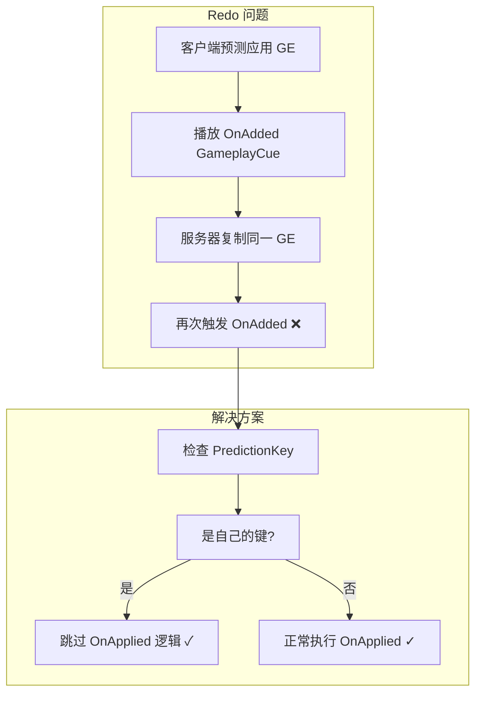
```mermaid
flowchart TB
    subgraph 问题["Redo 问题"]
        P1["客户端预测应用 GE"]
        P2["播放 OnAdded GameplayCue"]
        P3["服务器复制同一 GE"]
        P4["再次触发 OnAdded ❌"]
    end

    subgraph 解决方案["解决方案"]
        S1["检查 PredictionKey"]
        S2["是自己的键?"]
        S3["跳过 OnApplied 逻辑 ✓"]
        S4["正常执行 OnApplied ✓"]
    end

    P1 --> P2 --> P3 --> P4
    P4 --> S1 --> S2
    S2 -->|是| S3
    S2 -->|否| S4
```

### 4.2.5 PostReplicatedAdd 实现

```cpp
// GameplayEffect.cpp (简化版)

void FActiveGameplayEffect::PostReplicatedAdd(const FActiveGameplayEffectsContainer& InArray)
{
    // 检查是否是自己预测的 GE
    if (PredictionKey.IsLocalClientKey())
    {
        // 是自己预测的，跳过 OnApplied 逻辑
        // 这解决了 Redo 问题
        return;
    }

    // 不是自己预测的，正常处理
    // 执行 OnApplied 逻辑（如 GameplayCue）

    // 应用属性修改器
    InArray.Owner->UpdateAggregatorsForEffect(this);

    // 触发 GameplayCue
    if (InGameplayEffect->GameplayCues.Num() > 0)
    {
        for (const FGameplayEffectCue& Cue : InGameplayEffect->GameplayCues)
        {
            InArray.Owner->ExecuteGameplayCue(Cue.GameplayCueTag, ...);
        }
    }
}
```

---

## 4.3 Instant GameplayEffect 预测

### 4.3.1 Instant GE 的挑战

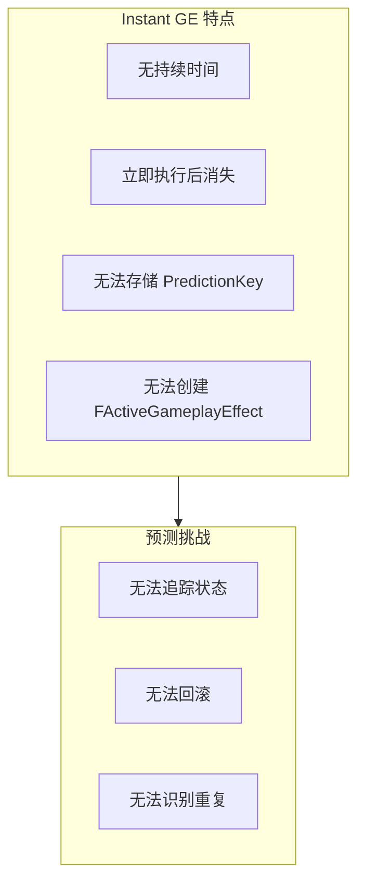
```mermaid
flowchart TB
    subgraph InstantGE["Instant GE 特点"]
        A["无持续时间"]
        B["立即执行后消失"]
        C["无法存储 PredictionKey"]
        D["无法创建 FActiveGameplayEffect"]
    end

    subgraph 挑战["预测挑战"]
        E["无法追踪状态"]
        F["无法回滚"]
        G["无法识别重复"]
    end

    InstantGE --> 挑战
```

### 4.3.2 解决方案：转换为无限持续

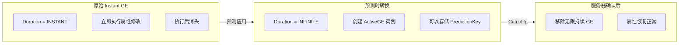
```mermaid
flowchart LR
    subgraph 原始["原始 Instant GE"]
        A["Duration = INSTANT"]
        B["立即执行属性修改"]
        C["执行后消失"]
    end

    subgraph 转换["预测时转换"]
        D["Duration = INFINITE"]
        E["创建 ActiveGE 实例"]
        F["可以存储 PredictionKey"]
    end

    subgraph 清理["服务器确认后"]
        G["移除无限持续 GE"]
        H["属性恢复正常"]
    end

    原始 -->|"预测应用"| 转换 -->|"CatchUp"| 清理
```

### 4.3.3 转换流程

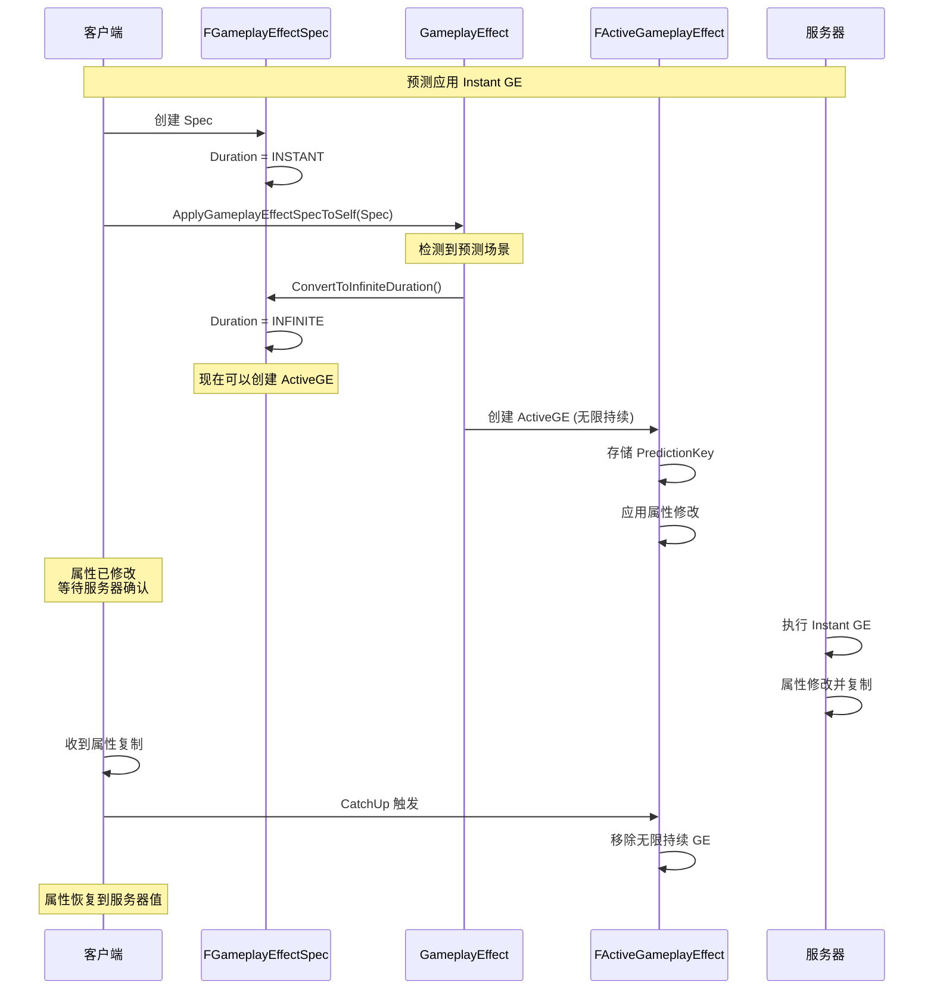
```mermaid
sequenceDiagram
    participant Client as 客户端
    participant Spec as FGameplayEffectSpec
    participant GE as GameplayEffect
    participant Active as FActiveGameplayEffect
    participant Server as 服务器

    Note over Client,Server: 预测应用 Instant GE

    Client->>Spec: 创建 Spec
    Spec->>Spec: Duration = INSTANT

    Client->>GE: ApplyGameplayEffectSpecToSelf(Spec)

    Note over GE: 检测到预测场景

    GE->>Spec: ConvertToInfiniteDuration()
    Spec->>Spec: Duration = INFINITE

    Note over Spec: 现在可以创建 ActiveGE

    GE->>Active: 创建 ActiveGE (无限持续)
    Active->>Active: 存储 PredictionKey
    Active->>Active: 应用属性修改

    Note over Client: 属性已修改<br/>等待服务器确认

    Server->>Server: 执行 Instant GE
    Server->>Server: 属性修改并复制

    Client->>Client: 收到属性复制
    Client->>Active: CatchUp 触发
    Active->>Active: 移除无限持续 GE

    Note over Client: 属性恢复到服务器值
```

### 4.3.4 源码解析

```cpp
// AbilitySystemComponent.cpp (简化版)

FActiveGameplayEffectHandle UAbilitySystemComponent::ApplyGameplayEffectSpecToSelf(
    FGameplayEffectSpec& Spec,
    FPredictionKey PredictionKey)
{
    // 检查是否是预测场景
    if (PredictionKey.IsValidKey())
    {
        // 检查是否是即时效果
        if (Spec.GetDuration() == UGameplayEffect::INSTANT_APPLICATION)
        {
            // 关键：将即时效果转换为无限持续
            // 这样才能在预测失败时回滚
            Spec.ConvertToInfiniteDuration();

            UE_LOG(LogGameplayAbilities, Log,
                   TEXT("Converted instant GE to infinite for prediction"));
        }
    }

    // 继续正常应用流程...
    return ActiveGameplayEffects.ApplyGameplayEffectSpec(Spec, PredictionKey);
}
```

### 4.3.5 Instant GE 预测示例

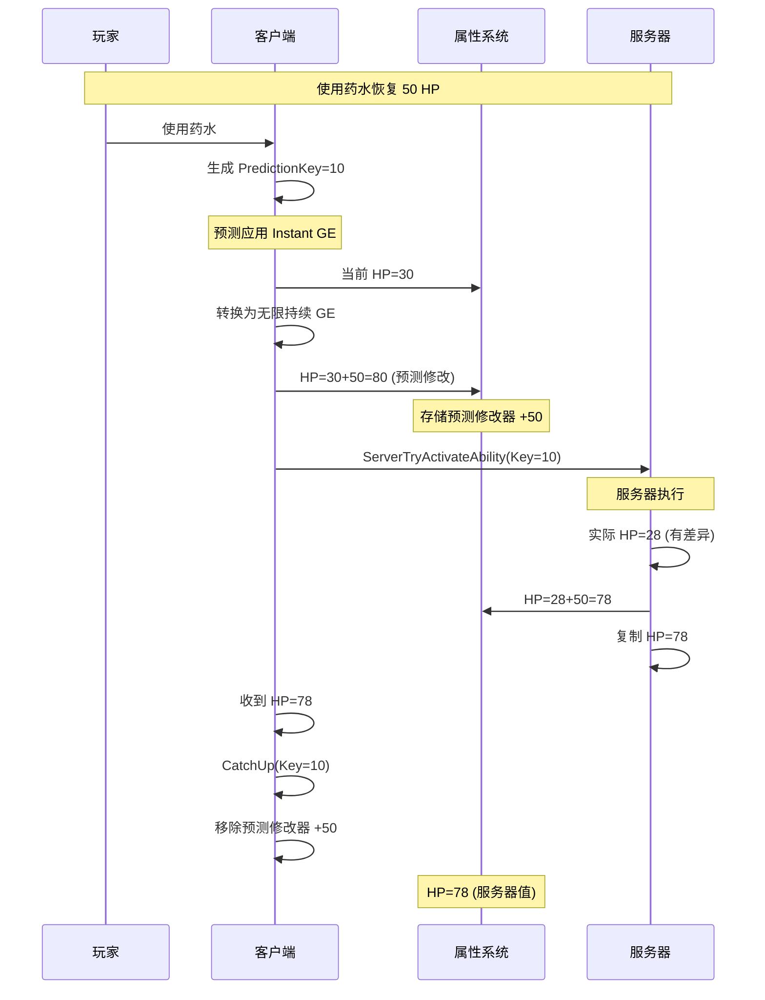
```mermaid
sequenceDiagram
    participant Player as 玩家
    participant Client as 客户端
    participant Attr as 属性系统
    participant Server as 服务器

    Note over Player,Server: 使用药水恢复 50 HP

    Player->>Client: 使用药水
    Client->>Client: 生成 PredictionKey=10

    Note over Client: 预测应用 Instant GE

    Client->>Attr: 当前 HP=30
    Client->>Client: 转换为无限持续 GE
    Client->>Attr: HP=30+50=80 (预测修改)

    Note over Attr: 存储预测修改器 +50

    Client->>Server: ServerTryActivateAbility(Key=10)

    Note over Server: 服务器执行

    Server->>Server: 实际 HP=28 (有差异)
    Server->>Attr: HP=28+50=78
    Server->>Server: 复制 HP=78

    Client->>Client: 收到 HP=78
    Client->>Client: CatchUp(Key=10)
    Client->>Client: 移除预测修改器 +50

    Note over Attr: HP=78 (服务器值)
```

---

## 4.4 属性修改预测

### 4.4.1 属性修改器类型

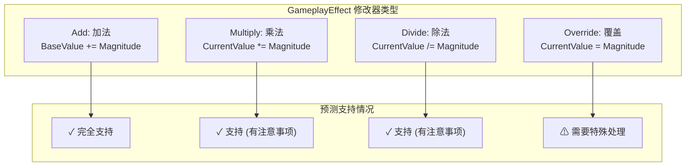
```mermaid
flowchart TB
    subgraph 修改器类型["GameplayEffect 修改器类型"]
        Add["Add: 加法<br/>BaseValue += Magnitude"]
        Multiply["Multiply: 乘法<br/>CurrentValue *= Magnitude"]
        Divide["Divide: 除法<br/>CurrentValue /= Magnitude"]
        Override["Override: 覆盖<br/>CurrentValue = Magnitude"]
    end

    subgraph 预测支持["预测支持情况"]
        Add_S["✓ 完全支持"]
        Multiply_S["✓ 支持 (有注意事项)"]
        Divide_S["✓ 支持 (有注意事项)"]
        Override_S["⚠ 需要特殊处理"]
    end

    Add --> Add_S
    Multiply --> Multiply_S
    Divide --> Divide_S
    Override --> Override_S
```

### 4.4.2 属性计算流程

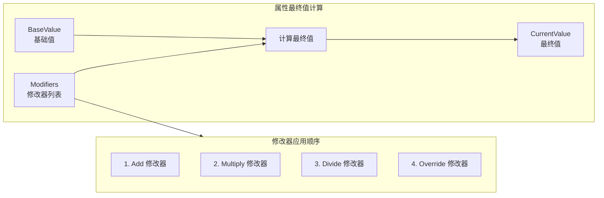
```mermaid
flowchart LR
    subgraph 计算流程["属性最终值计算"]
        Base["BaseValue<br/>基础值"]
        Mods["Modifiers<br/>修改器列表"]
        Calc["计算最终值"]
        Final["CurrentValue<br/>最终值"]
    end

    Base --> Calc
    Mods --> Calc
    Calc --> Final

    subgraph 修改器应用["修改器应用顺序"]
        M1["1. Add 修改器"]
        M2["2. Multiply 修改器"]
        M3["3. Divide 修改器"]
        M4["4. Override 修改器"]
    end

    Mods --> 修改器应用
```

### 4.4.3 预测属性修改的存储

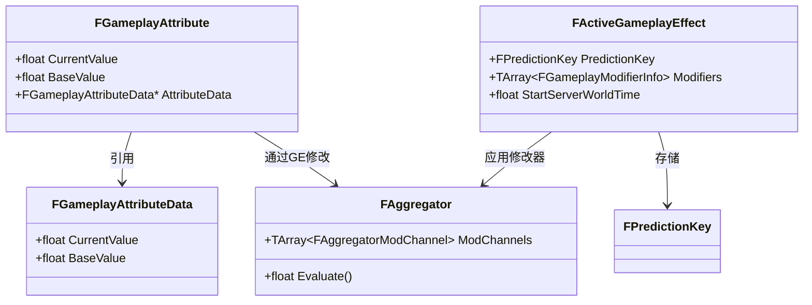
```mermaid
classDiagram
    class FGameplayAttribute {
        +float CurrentValue
        +float BaseValue
        +FGameplayAttributeData* AttributeData
    }

    class FGameplayAttributeData {
        +float CurrentValue
        +float BaseValue
    }

    class FAggregator {
        +TArray~FAggregatorModChannel~ ModChannels
        +float Evaluate()
    }

    class FActiveGameplayEffect {
        +FPredictionKey PredictionKey
        +TArray~FGameplayModifierInfo~ Modifiers
        +float StartServerWorldTime
    }

    FGameplayAttribute --> FGameplayAttributeData : 引用
    FGameplayAttribute --> FAggregator : 通过GE修改
    FActiveGameplayEffect --> FAggregator : 应用修改器
    FActiveGameplayEffect --> FPredictionKey : 存储
```

### 4.4.4 属性预测的增量存储

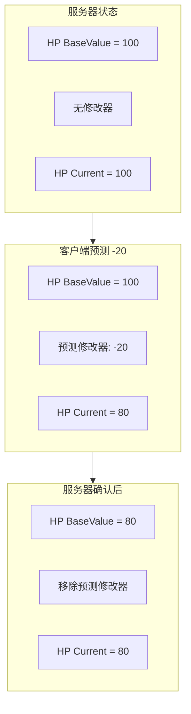
```mermaid
flowchart TB
    subgraph 服务器状态["服务器状态"]
        S1["HP BaseValue = 100"]
        S2["无修改器"]
        S3["HP Current = 100"]
    end

    subgraph 客户端预测["客户端预测 -20"]
        C1["HP BaseValue = 100"]
        C2["预测修改器: -20"]
        C3["HP Current = 80"]
    end

    subgraph 服务器确认后["服务器确认后"]
        A1["HP BaseValue = 80"]
        A2["移除预测修改器"]
        A3["HP Current = 80"]
    end

    服务器状态 --> 客户端预测 --> 服务器确认后
```

---

## 4.5 GameplayTag 预测

### 4.5.1 Tag 预测机制

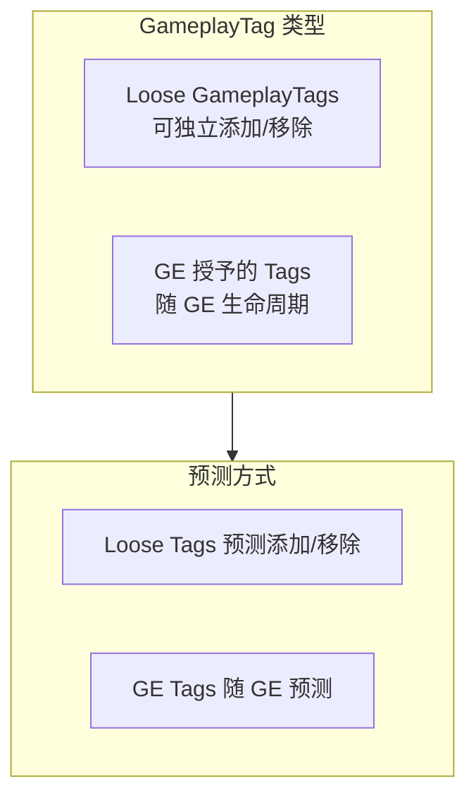
```mermaid
flowchart TB
    subgraph Tag类型["GameplayTag 类型"]
        Loose["Loose GameplayTags<br/>可独立添加/移除"]
        GE["GE 授予的 Tags<br/>随 GE 生命周期"]
    end

    subgraph 预测方式["预测方式"]
        Loose_P["Loose Tags 预测添加/移除"]
        GE_P["GE Tags 随 GE 预测"]
    end

    Tag类型 --> 预测方式
```

### 4.5.2 Loose Tag 预测

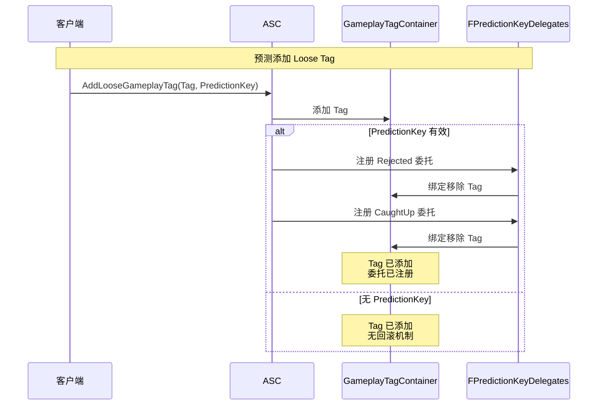
```mermaid
sequenceDiagram
    participant Client as 客户端
    participant ASC as ASC
    participant Tags as GameplayTagContainer
    participant Delegate as FPredictionKeyDelegates

    Note over Client,Delegate: 预测添加 Loose Tag

    Client->>ASC: AddLooseGameplayTag(Tag, PredictionKey)

    ASC->>Tags: 添加 Tag

    alt PredictionKey 有效
        ASC->>Delegate: 注册 Rejected 委托
        Delegate->>Tags: 绑定移除 Tag

        ASC->>Delegate: 注册 CaughtUp 委托
        Delegate->>Tags: 绑定移除 Tag

        Note over Tags: Tag 已添加<br/>委托已注册
    else 无 PredictionKey
        Note over Tags: Tag 已添加<br/>无回滚机制
    end
```

### 4.5.3 GE 授予的 Tag 预测

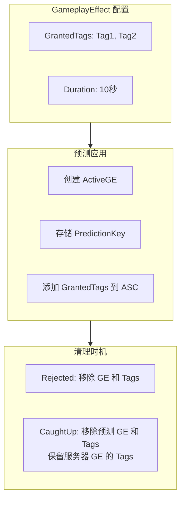
```mermaid
flowchart TB
    subgraph GE配置["GameplayEffect 配置"]
        A["GrantedTags: Tag1, Tag2"]
        B["Duration: 10秒"]
    end

    subgraph 预测应用["预测应用"]
        C["创建 ActiveGE"]
        D["存储 PredictionKey"]
        E["添加 GrantedTags 到 ASC"]
    end

    subgraph 清理["清理时机"]
        F["Rejected: 移除 GE 和 Tags"]
        G["CaughtUp: 移除预测 GE 和 Tags<br/>保留服务器 GE 的 Tags"]
    end

    GE配置 --> 预测应用 --> 清理
```

### 4.5.4 源码解析

```cpp
// AbilitySystemComponent.cpp (简化版)

void UAbilitySystemComponent::AddLooseGameplayTag(
    const FGameplayTag& Tag,
    FPredictionKey PredictionKey)
{
    // 添加 Tag
    GameplayTagContainer.AddTag(Tag);

    // 如果有预测键，注册回滚
    if (PredictionKey.IsValidKey())
    {
        // 注册拒绝时的回滚
        FPredictionKeyDelegates::NewRejectedDelegate(PredictionKey.Current)
            .AddLambda([this, Tag]()
            {
                RemoveLooseGameplayTag(Tag);
            });

        // 注册追上时的清理
        FPredictionKeyDelegates::NewCaughtUpDelegate(PredictionKey.Current)
            .AddLambda([this, Tag]()
            {
                RemoveLooseGameplayTag(Tag);
            });
    }
}
```

---

## 4.6 完整示例

### 4.6.1 护盾 Buff 示例

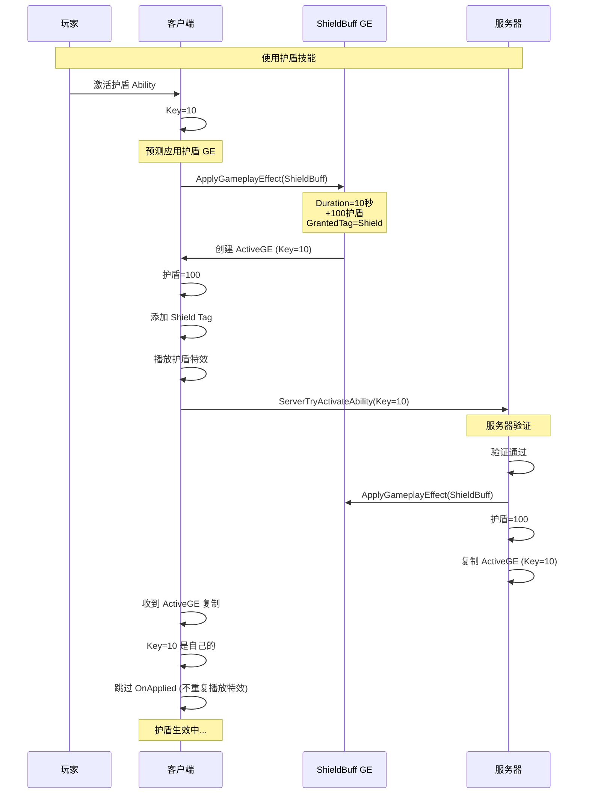
```mermaid
sequenceDiagram
    participant Player as 玩家
    participant Client as 客户端
    participant GE as ShieldBuff GE
    participant Server as 服务器

    Note over Player,Server: 使用护盾技能

    Player->>Client: 激活护盾 Ability
    Client->>Client: Key=10

    Note over Client: 预测应用护盾 GE

    Client->>GE: ApplyGameplayEffect(ShieldBuff)
    Note over GE: Duration=10秒<br/>+100护盾<br/>GrantedTag=Shield

    GE->>Client: 创建 ActiveGE (Key=10)
    Client->>Client: 护盾=100
    Client->>Client: 添加 Shield Tag
    Client->>Client: 播放护盾特效

    Client->>Server: ServerTryActivateAbility(Key=10)

    Note over Server: 服务器验证

    Server->>Server: 验证通过
    Server->>GE: ApplyGameplayEffect(ShieldBuff)
    Server->>Server: 护盾=100
    Server->>Server: 复制 ActiveGE (Key=10)

    Client->>Client: 收到 ActiveGE 复制
    Client->>Client: Key=10 是自己的
    Client->>Client: 跳过 OnApplied (不重复播放特效)

    Note over Client: 护盾生效中...
```

### 4.6.2 伤害 GE 示例

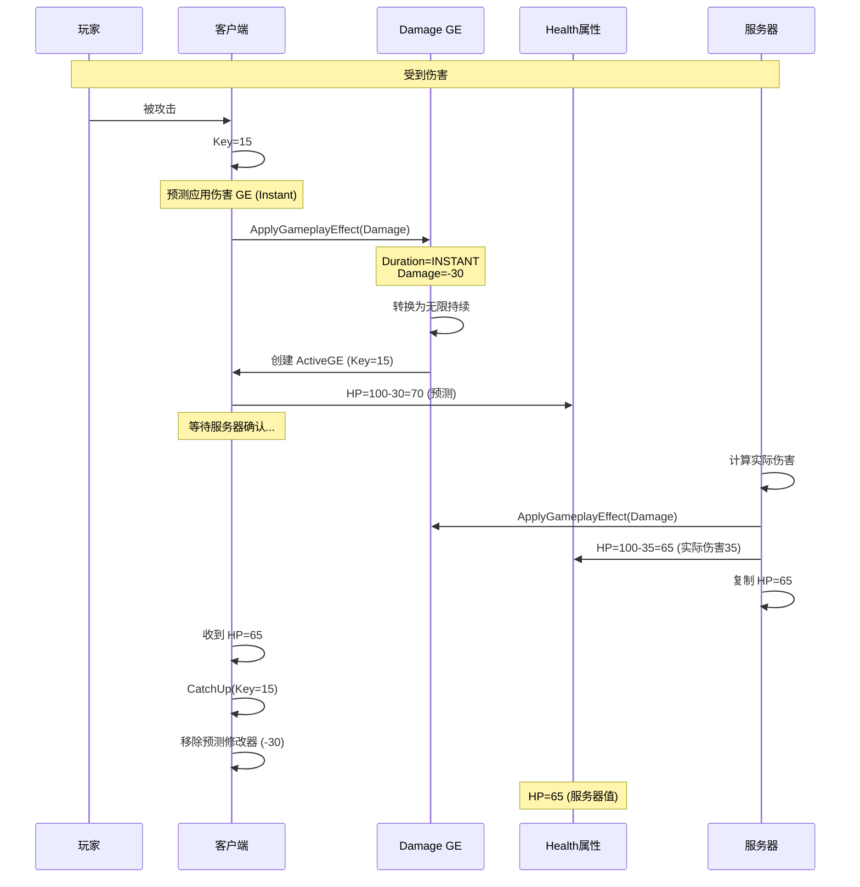
```mermaid
sequenceDiagram
    participant Player as 玩家
    participant Client as 客户端
    participant GE as Damage GE
    participant HP as Health属性
    participant Server as 服务器

    Note over Player,Server: 受到伤害

    Player->>Client: 被攻击
    Client->>Client: Key=15

    Note over Client: 预测应用伤害 GE (Instant)

    Client->>GE: ApplyGameplayEffect(Damage)
    Note over GE: Duration=INSTANT<br/>Damage=-30

    GE->>GE: 转换为无限持续
    GE->>Client: 创建 ActiveGE (Key=15)
    Client->>HP: HP=100-30=70 (预测)

    Note over Client: 等待服务器确认...

    Server->>Server: 计算实际伤害
    Server->>GE: ApplyGameplayEffect(Damage)
    Server->>HP: HP=100-35=65 (实际伤害35)
    Server->>Server: 复制 HP=65

    Client->>Client: 收到 HP=65
    Client->>Client: CatchUp(Key=15)
    Client->>Client: 移除预测修改器 (-30)

    Note over HP: HP=65 (服务器值)
```

---

## 4.7 实践：调试 GE 预测

### 4.7.1 断点位置

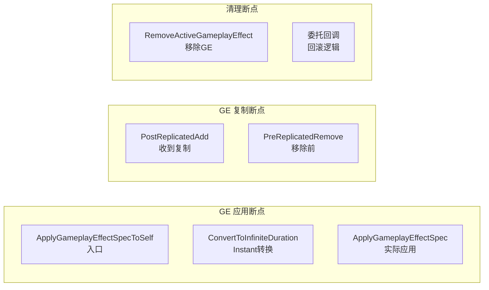
```mermaid
flowchart LR
    subgraph 应用断点["GE 应用断点"]
        A1["ApplyGameplayEffectSpecToSelf<br/>入口"]
        A2["ConvertToInfiniteDuration<br/>Instant转换"]
        A3["ApplyGameplayEffectSpec<br/>实际应用"]
    end

    subgraph 复制断点["GE 复制断点"]
        B1["PostReplicatedAdd<br/>收到复制"]
        B2["PreReplicatedRemove<br/>移除前"]
    end

    subgraph 清理断点["清理断点"]
        C1["RemoveActiveGameplayEffect<br/>移除GE"]
        C2["委托回调<br/>回滚逻辑"]
    end
```

### 4.7.2 添加调试日志

```cpp
// AbilitySystemComponent.cpp

FActiveGameplayEffectHandle ApplyGameplayEffectSpecToSelf(...)
{
    UE_LOG(LogGameplayAbilities, Log,
           TEXT("ApplyGE: %s, PredictionKey=%s, Duration=%f"),
           *Spec.GetEffectClass()->GetName(),
           *PredictionKey.ToString(),
           Spec.GetDuration());

    if (PredictionKey.IsValidKey() && Spec.GetDuration() == UGameplayEffect::INSTANT_APPLICATION)
    {
        UE_LOG(LogGameplayAbilities, Log,
               TEXT("Converting instant GE to infinite for prediction"));
    }

    // ...
}

// GameplayEffect.cpp

void FActiveGameplayEffect::PostReplicatedAdd(...)
{
    UE_LOG(LogGameplayAbilities, Log,
           TEXT("ActiveGE PostReplicatedAdd: %s, PredictionKey=%s, IsLocalClientKey=%d"),
           *InGameplayEffect->GetName(),
           *PredictionKey.ToString(),
           PredictionKey.IsLocalClientKey());
}
```

---

## 4.8 总结

### 4.8.1 核心概念图

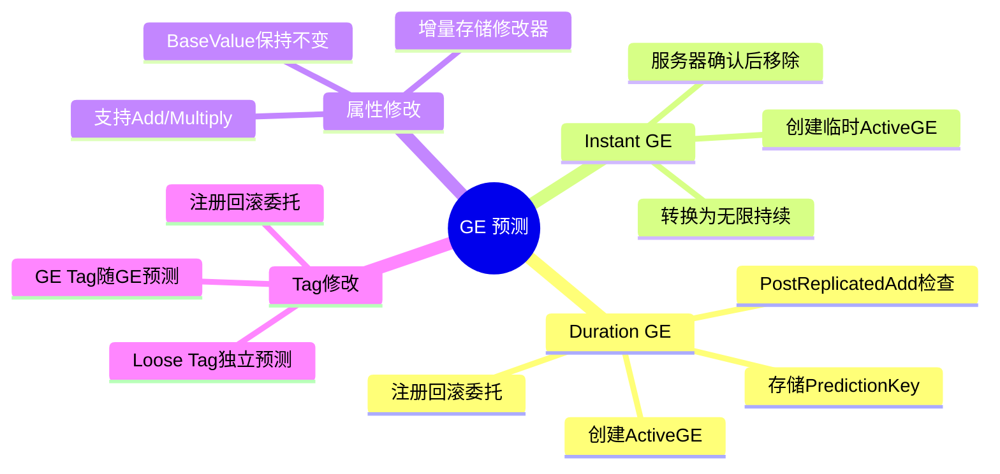
```mermaid
mindmap
  root((GE 预测))
    Duration GE
      创建ActiveGE
      存储PredictionKey
      注册回滚委托
      PostReplicatedAdd检查
    Instant GE
      转换为无限持续
      创建临时ActiveGE
      服务器确认后移除
    属性修改
      增量存储修改器
      支持Add/Multiply
      BaseValue保持不变
    Tag修改
      Loose Tag独立预测
      GE Tag随GE预测
      注册回滚委托
```

### 4.8.2 关键要点

```mermaid
flowchart TB
    subgraph 要点1["要点1: Duration GE"]
        A1["可以存储 PredictionKey"]
        A2["PostReplicatedAdd 检查避免重复"]
        A3["CaughtUp 时清理预测 GE"]
    end

    subgraph 要点2["要点2: Instant GE"]
        B1["转换为无限持续才能预测"]
        B2["服务器确认后移除临时 GE"]
        B3["属性恢复到服务器值"]
    end

    subgraph 要点3["要点3: 委托注册"]
        C1["Rejected 委托处理失败回滚"]
        C2["CaughtUp 委托处理成功清理"]
        C3["每个 GE 注册自己的委托"]
    end

    要点1 --> 要点2 --> 要点3
```

---

## 课后练习

### 练习1：观察 Duration GE

1. 创建一个 Duration GE（如 Buff）
2. 在 `PostReplicatedAdd` 设置断点
3. 观察 `PredictionKey.IsLocalClientKey()` 的返回值

### 练习2：观察 Instant GE 转换

1. 创建一个 Instant GE（如伤害）
2. 在 `ConvertToInfiniteDuration` 设置断点
3. 观察转换前后的 Duration 值

### 练习3：思考题

1. 为什么 Instant GE 需要转换为无限持续？
2. 如果 GE 同时修改属性和 Tag，回滚顺序是什么？
3. 如何处理 GE 的周期效果（DOT）？

---

## 下节课预告

```mermaid
flowchart LR
    L4["第4课: GameplayEffect 预测"] --> L5["第5课: 属性预测与回滚机制"]

    subgraph 第5课内容["第5课内容"]
        A["增量预测原理"]
        B["RepNotify 实现"]
        C["属性回滚机制"]
        D["自定义属性集"]
    end

    L5 --> 第5课内容
```

---

## 参考资料

- **源码**：`Engine/Plugins/Runtime/GameplayAbilities/Source/GameplayAbilities/Private/AbilitySystemComponent.cpp`
- **源码**：`Engine/Plugins/Runtime/GameplayAbilities/Source/GameplayAbilities/Private/GameplayEffect.cpp`
- **源码**：`Engine/Plugins/Runtime/GameplayAbilities/Source/GameplayAbilities/Public/GameplayEffect.h`
