# 第5课：属性预测与回滚机制

> 学习时间：45-60分钟
> 难度：进阶
> 前置知识：第1-4课内容、AttributeSet基础

---

## 学习目标

完成本课后，你将能够：
1. 深入理解属性增量预测的原理
2. 掌握 RepNotify 在属性预测中的作用
3. 学会实现自定义属性的预测支持
4. 掌握属性回滚的完整机制

---

## 5.1 属性预测的挑战

### 5.1.1 核心问题

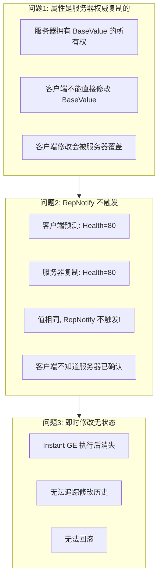

### 5.1.2 传统方式的失败

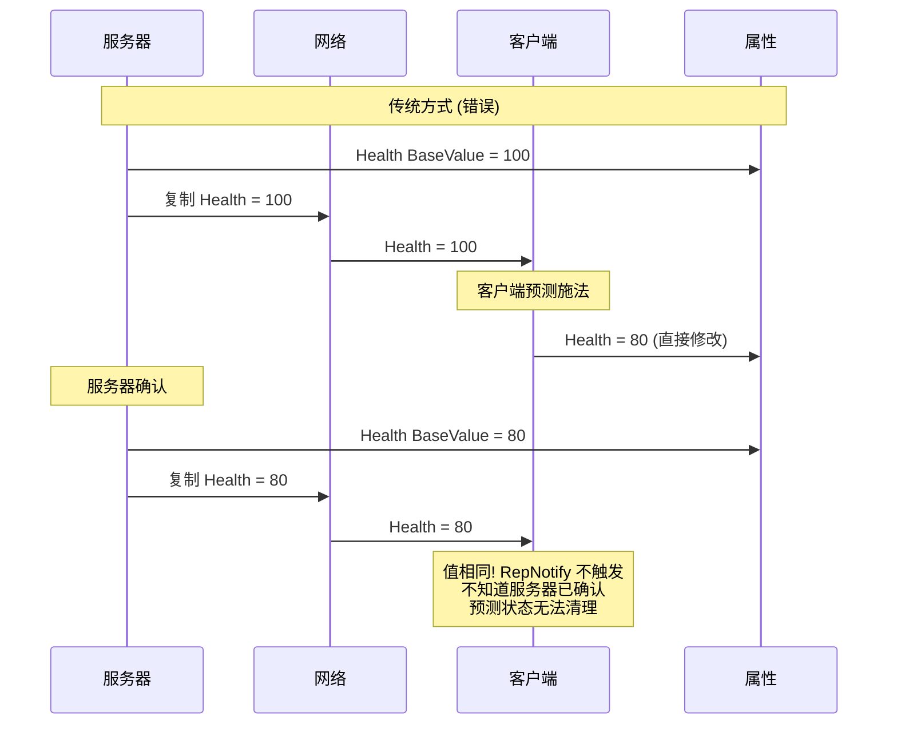

---

## 5.2 增量预测方案

### 5.2.1 核心思想

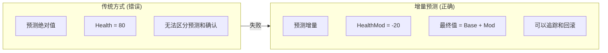

### 5.2.2 增量预测流程

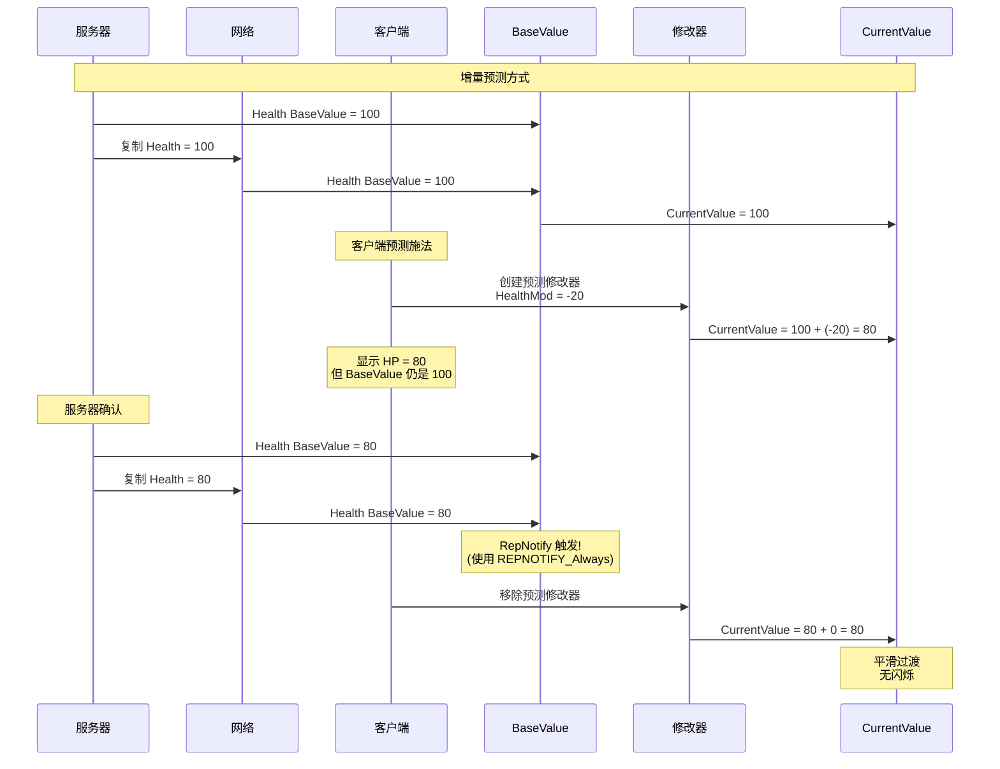

### 5.2.3 值的计算关系

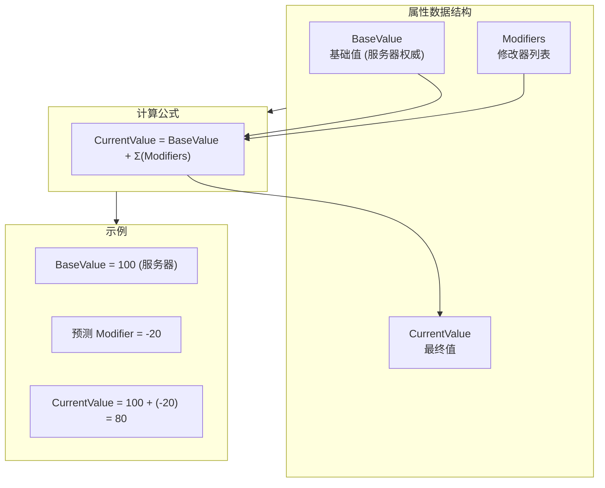

---

## 5.3 RepNotify 实现

### 5.3.1 REPNOTIFY_Always 的必要性

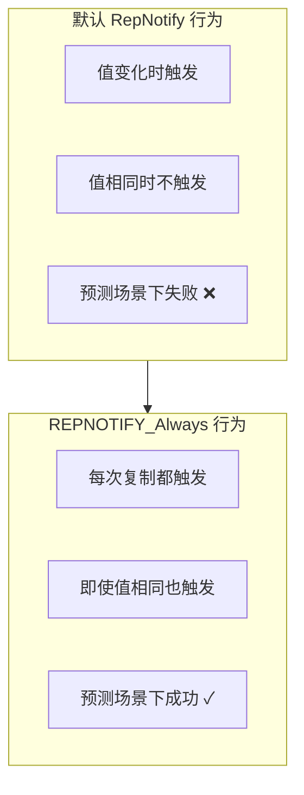

### 5.3.2 属性复制配置

```cpp
// AttributeSet.h

void UMyAttributeSet::GetLifetimeReplicatedProps(TArray<FLifetimeProperty>& OutLifetimeProps) const
{
    Super::GetLifetimeReplicatedProps(OutLifetimeProps);

    // 关键: 使用 REPNOTIFY_Always
    // 确保每次复制都触发回调，即使本地值与复制值相同
    DOREPLIFETIME_CONDITION_NOTIFY(UMyAttributeSet, Health, COND_None, REPNOTIFY_Always);
    DOREPLIFETIME_CONDITION_NOTIFY(UMyAttributeSet, MaxHealth, COND_None, REPNOTIFY_Always);
    DOREPLIFETIME_CONDITION_NOTIFY(UMyAttributeSet, Mana, COND_None, REPNOTIFY_Always);
    DOREPLIFETIME_CONDITION_NOTIFY(UMyAttributeSet, Stamina, COND_None, REPNOTIFY_Always);
}
```

### 5.3.3 RepNotify 实现

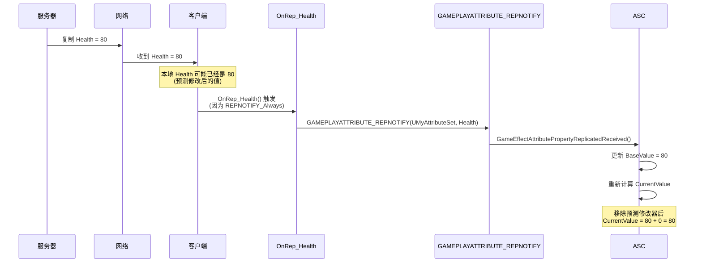

### 5.3.4 GAMEPLAYATTRIBUTE_REPNOTIFY 宏

```cpp
// AttributeSet.h

#define GAMEPLAYATTRIBUTE_REPNOTIFY(ClassName, PropertyName) \
{ \
    GameEffectAttributePropertyReplicatedReceived( \
        Get##PropertyName##Attribute(), \
        PropertyName); \
}

// 展开后的实际调用
void UMyAttributeSet::OnRep_Health()
{
    GameEffectAttributePropertyReplicatedReceived(
        GetHealthAttribute(),  // FGameplayAttribute
        Health);               // float&
}

// AttributeSet.cpp
void UAttributeSet::GameEffectAttributePropertyReplicatedReceived(
    FGameplayAttribute Attribute,
    float& NewValue)
{
    // 1. 更新 BaseValue 为服务器值
    SetBaseAttributeValueFromReplication(Attribute, NewValue);

    // 2. 重新计算最终值 (BaseValue + 所有修改器)
    // 这会自动处理预测修改器的清理
}
```

---

## 5.4 属性回滚机制

### 5.4.1 回滚流程

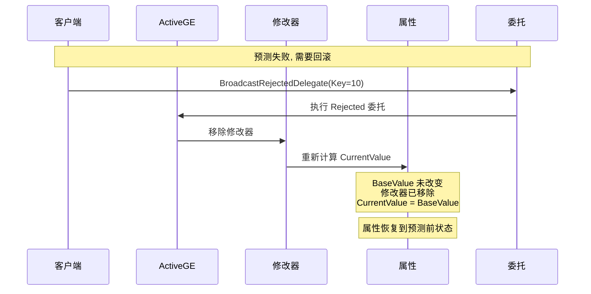

### 5.4.2 修改器的追踪

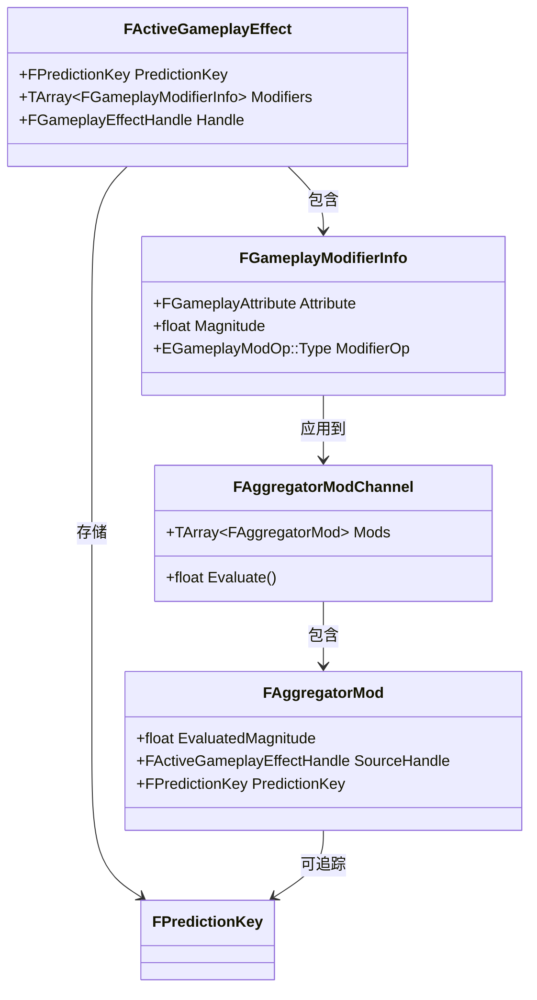

### 5.4.3 回滚时的属性恢复

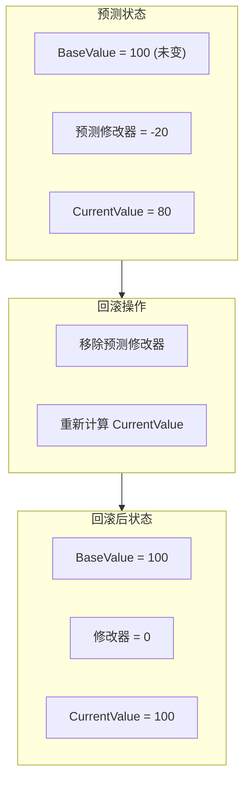

### 5.4.4 源码解析

```cpp
// GameplayEffect.cpp (简化版)

void FActiveGameplayEffectsContainer::RemoveActiveGameplayEffect_NoReturn(
    FActiveGameplayEffectHandle Handle,
    bool bInvokeRemoveCallbacks)
{
    FActiveGameplayEffect* ActiveGE = GetActiveGameplayEffect(Handle);
    if (!ActiveGE)
    {
        return;
    }

    // 检查是否需要跳过回调 (预测清理时)
    if (ActiveGE->PredictionKey.IsLocalClientKey() && !bInvokeRemoveCallbacks)
    {
        // 这是自己预测的 GE，跳过 OnRemove 逻辑
        // 避免 GameplayCue 重复移除
        ActiveEffects.Remove(ActiveGE);
        return;
    }

    // 正常移除流程
    // 1. 移除修改器
    for (const FGameplayModifierInfo& Mod : ActiveGE->Modifiers)
    {
        RemoveModifierFromAggregator(Mod, ActiveGE->Handle);
    }

    // 2. 触发 OnRemove 回调
    if (bInvokeRemoveCallbacks)
    {
        OnRemovedDelegate.Broadcast(ActiveGE);
    }

    // 3. 移除 GE
    ActiveEffects.Remove(ActiveGE);
}
```

---

## 5.5 自定义属性集实现

### 5.5.1 完整示例

```cpp
// MyAttributeSet.h

#pragma once

#include "CoreMinimal.h"
#include "AttributeSet.h"
#include "AbilitySystemComponent.h"
#include "MyAttributeSet.generated.h"

UCLASS()
class MYGAME_API UMyAttributeSet : public UAttributeSet
{
    GENERATED_BODY()

public:
    // 属性定义
    UPROPERTY(VisibleAnywhere, BlueprintReadOnly, Category = "Attributes")
    FGameplayAttributeData Health;
    ATTRIBUTE_ACCESSORS(UMyAttributeSet, Health)

    UPROPERTY(VisibleAnywhere, BlueprintReadOnly, Category = "Attributes")
    FGameplayAttributeData MaxHealth;
    ATTRIBUTE_ACCESSORS(UMyAttributeSet, MaxHealth)

    UPROPERTY(VisibleAnywhere, BlueprintReadOnly, Category = "Attributes")
    FGameplayAttributeData Mana;
    ATTRIBUTE_ACCESSORS(UMyAttributeSet, Mana)

    UPROPERTY(VisibleAnywhere, BlueprintReadOnly, Category = "Attributes")
    FGameplayAttributeData MaxMana;
    ATTRIBUTE_ACCESSORS(UMyAttributeSet, MaxMana)

    // Meta 属性 (不复制，用于即时效果)
    UPROPERTY(VisibleAnywhere, BlueprintReadOnly, Category = "Attributes")
    FGameplayAttributeData Damage;
    ATTRIBUTE_ACCESSORS(UMyAttributeSet, Damage)

    // 复制配置
    virtual void GetLifetimeReplicatedProps(TArray<FLifetimeProperty>& OutLifetimeProps) const override;

    // RepNotify 函数
    UFUNCTION()
    virtual void OnRep_Health(const FGameplayAttributeData& OldValue);

    UFUNCTION()
    virtual void OnRep_MaxHealth(const FGameplayAttributeData& OldValue);

    UFUNCTION()
    virtual void OnRep_Mana(const FGameplayAttributeData& OldValue);

    UFUNCTION()
    virtual void OnRep_MaxMana(const FGameplayAttributeData& OldValue);

    // 属性修改前后回调
    virtual void PreAttributeChange(const FGameplayAttribute& Attribute, float& NewValue) override;
    virtual void PostGameplayEffectExecute(const FGameplayEffectModCallbackData& Data) override;
};
```

### 5.5.2 实现文件

```cpp
// MyAttributeSet.cpp

#include "MyAttributeSet.h"
#include "Net/UnrealNetwork.h"

void UMyAttributeSet::GetLifetimeReplicatedProps(TArray<FLifetimeProperty>& OutLifetimeProps) const
{
    Super::GetLifetimeReplicatedProps(OutLifetimeProps);

    // 关键: 使用 REPNOTIFY_Always 支持预测
    DOREPLIFETIME_CONDITION_NOTIFY(UMyAttributeSet, Health, COND_None, REPNOTIFY_Always);
    DOREPLIFETIME_CONDITION_NOTIFY(UMyAttributeSet, MaxHealth, COND_None, REPNOTIFY_Always);
    DOREPLIFETIME_CONDITION_NOTIFY(UMyAttributeSet, Mana, COND_None, REPNOTIFY_Always);
    DOREPLIFETIME_CONDITION_NOTIFY(UMyAttributeSet, MaxMana, COND_None, REPNOTIFY_Always);

    // Meta 属性不复制
    // Damage 不需要复制
}

void UMyAttributeSet::OnRep_Health(const FGameplayAttributeData& OldValue)
{
    GAMEPLAYATTRIBUTE_REPNOTIFY(UMyAttributeSet, Health, OldValue);
}

void UMyAttributeSet::OnRep_MaxHealth(const FGameplayAttributeData& OldValue)
{
    GAMEPLAYATTRIBUTE_REPNOTIFY(UMyAttributeSet, MaxHealth, OldValue);
}

void UMyAttributeSet::OnRep_Mana(const FGameplayAttributeData& OldValue)
{
    GAMEPLAYATTRIBUTE_REPNOTIFY(UMyAttributeSet, Mana, OldValue);
}

void UMyAttributeSet::OnRep_MaxMana(const FGameplayAttributeData& OldValue)
{
    GAMEPLAYATTRIBUTE_REPNOTIFY(UMyAttributeSet, MaxMana, OldValue);
}

void UMyAttributeSet::PreAttributeChange(const FGameplayAttribute& Attribute, float& NewValue)
{
    Super::PreAttributeChange(Attribute, NewValue);

    // 限制属性范围
    if (Attribute == GetHealthAttribute())
    {
        NewValue = FMath::Clamp(NewValue, 0.0f, GetMaxHealth());
    }
    else if (Attribute == GetManaAttribute())
    {
        NewValue = FMath::Clamp(NewValue, 0.0f, GetMaxMana());
    }
}

void UMyAttributeSet::PostGameplayEffectExecute(const FGameplayEffectModCallbackData& Data)
{
    Super::PostGameplayEffectExecute(Data);

    // 处理 Meta 属性
    if (Data.EvaluatedData.Attribute == GetDamageAttribute())
    {
        // Damage -> Health
        const float DamageDone = GetDamage();
        SetDamage(0.0f); // 重置

        if (DamageDone > 0.0f)
        {
            SetHealth(FMath::Clamp(GetHealth() - DamageDone, 0.0f, GetMaxHealth()));
        }
    }
}
```

### 5.5.3 属性集配置流程

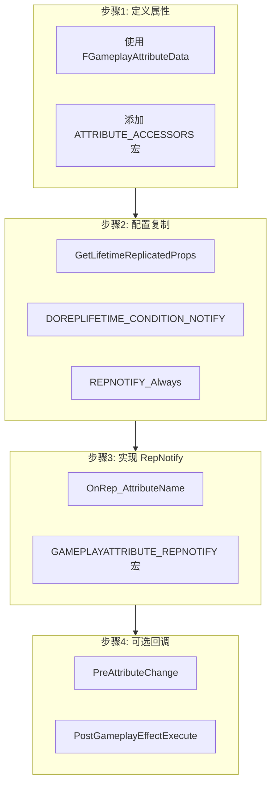

---

## 5.6 Meta 属性的限制

### 5.6.1 Meta 属性特点

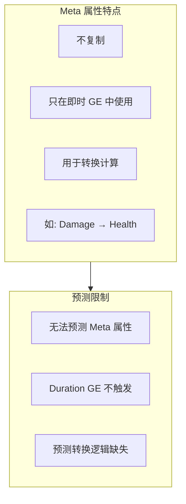

### 5.6.2 Meta 属性工作流程

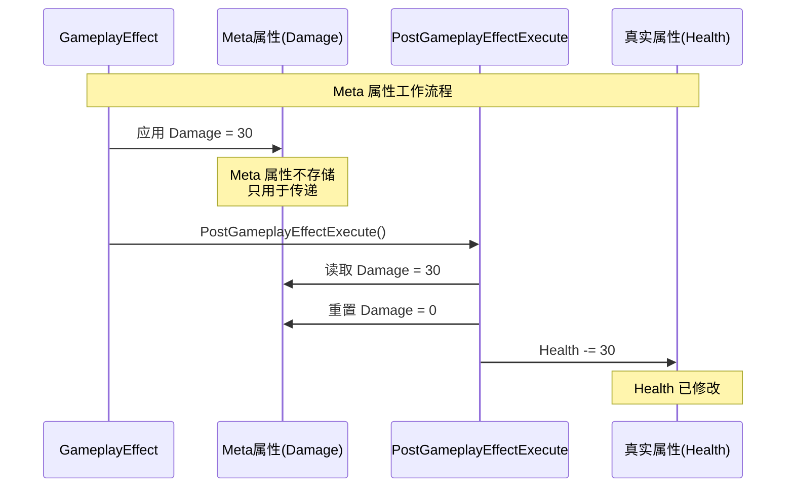

### 5.6.3 为什么 Meta 属性难以预测

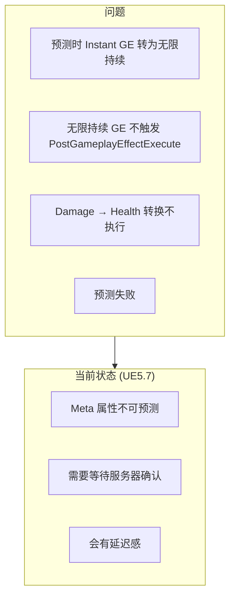

---

## 5.7 完整示例

### 5.7.1 法力消耗预测

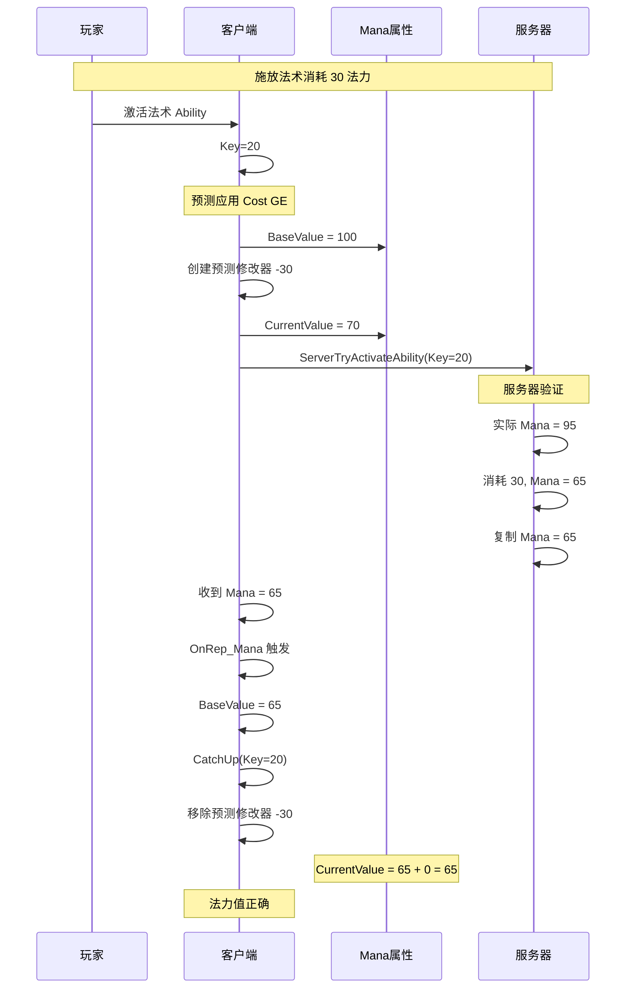

### 5.7.2 预测失败回滚

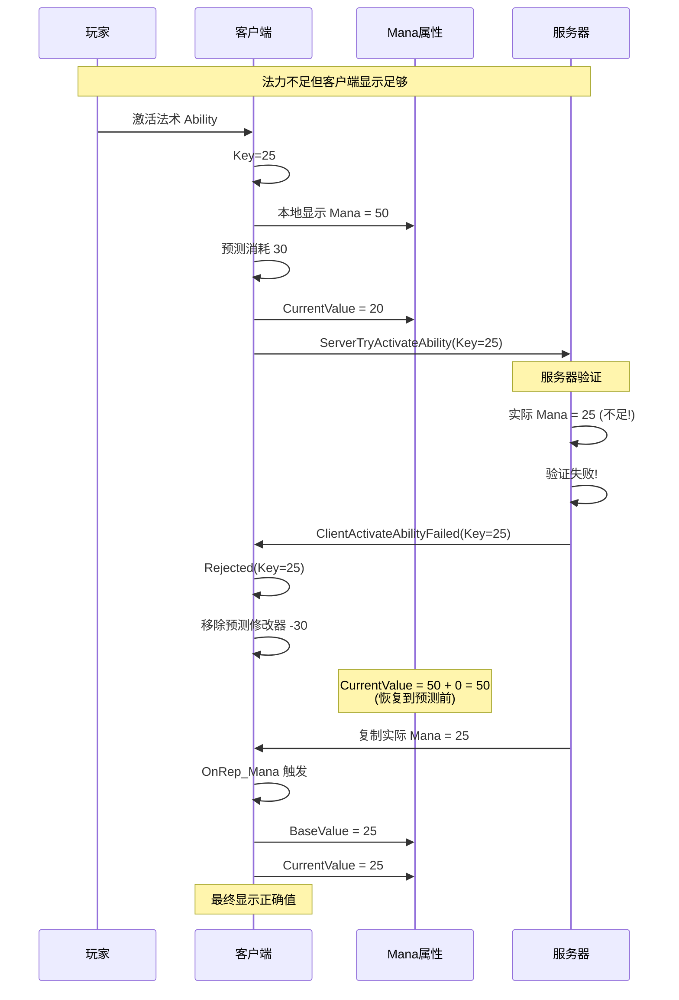

---

## 5.8 实践：调试属性预测

### 5.8.1 断点位置

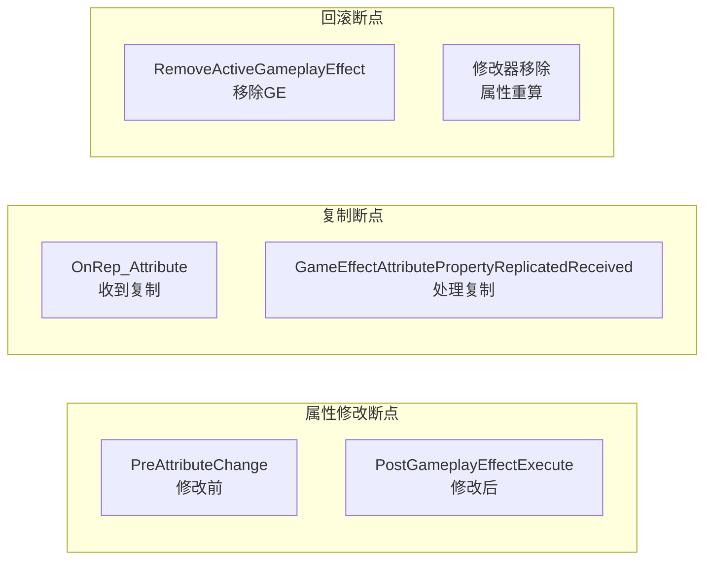

### 5.8.2 添加调试日志

```cpp
// MyAttributeSet.cpp

void UMyAttributeSet::OnRep_Health(const FGameplayAttributeData& OldValue)
{
    UE_LOG(LogGameplayAbilities, Log,
           TEXT("OnRep_Health: Old=%.2f, New=%.2f, Base=%.2f"),
           OldValue.GetCurrentValue(),
           GetHealth(),
           GetHealthAttribute().GetNumericValue(this));

    GAMEPLAYATTRIBUTE_REPNOTIFY(UMyAttributeSet, Health, OldValue);
}

void UMyAttributeSet::PreAttributeChange(const FGameplayAttribute& Attribute, float& NewValue)
{
    UE_LOG(LogGameplayAbilities, Log,
           TEXT("PreAttributeChange: %s, NewValue=%.2f"),
           *Attribute.GetName(),
           NewValue);

    Super::PreAttributeChange(Attribute, NewValue);
}
```

### 5.8.3 观察属性值变化

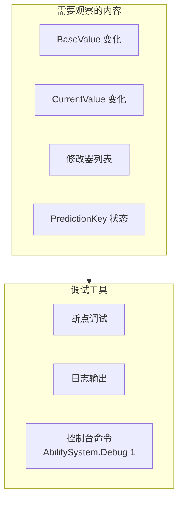

---

## 5.9 总结

### 5.9.1 核心概念图

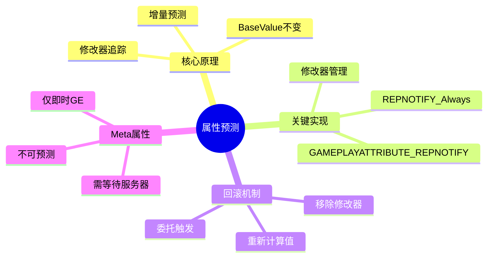

### 5.9.2 关键要点

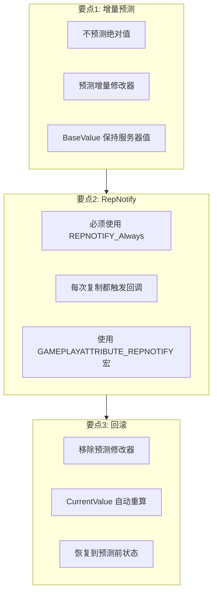

---

## 课后练习

### 练习1：实现自定义属性集

1. 创建自定义 AttributeSet 类
2. 添加 Health, Mana 属性
3. 配置 RepNotify 和复制

### 练习2：观察预测流程

1. 在 `OnRep_Health` 添加日志
2. 激活消耗法力的 Ability
3. 观察属性值的变化过程

### 练习3：思考题

1. 为什么不能直接修改 BaseValue？
2. 如果属性有多个修改器，回滚时如何处理？
3. 如何处理属性的上限限制（如 Health 不能超过 MaxHealth）？

---

## 下节课预告

```mermaid
flowchart LR
    L5["第5课: 属性预测与回滚机制"] --> L6["第6课: GameplayCue 预测"]

    subgraph 第6课内容["第6课内容"]
        A["GameplayCue 类型"]
        B["GC 预测流程"]
        C["避免重复执行"]
        D["GC 与 GE 的关系"]
    end

    L6 --> 第6课内容
```

---

## 参考资料

- **源码**：`Engine/Plugins/Runtime/GameplayAbilities/Source/GameplayAbilities/Public/AttributeSet.h`
- **源码**：`Engine/Plugins/Runtime/GameplayAbilities/Source/GameplayAbilities/Private/AttributeSet.cpp`
- **官方文档**：[Gameplay Attributes](https://dev.epicgames.com/documentation/en-us/unreal-engine/gameplay-attributes-in-unreal-engine)
