# 第6课：GameplayCue 预测

> 学习时间：45-60分钟
> 难度：进阶
> 前置知识：第1-5课内容、GameplayCue基础

---

## 学习目标

完成本课后，你将能够：
1. 掌握 GameplayCue 的类型和触发时机
2. 理解 GC 预测的完整流程
3. 学会解决 GC 的 "Redo" 问题
4. 掌握独立 GC 和 GE 内 GC 的预测差异

---

## 6.1 GameplayCue 概述

### 6.1.1 GC 的作用

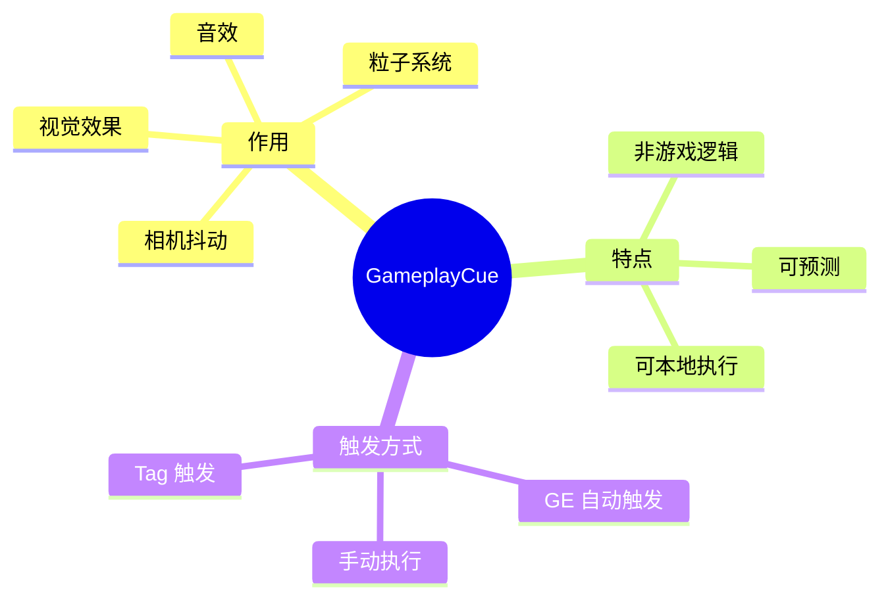

### 6.1.2 GC 类型与触发时机

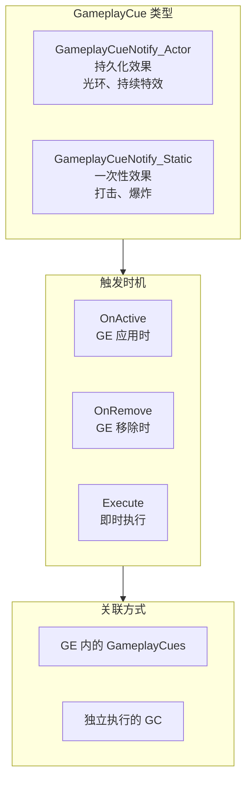

### 6.1.3 GC 与游戏逻辑分离

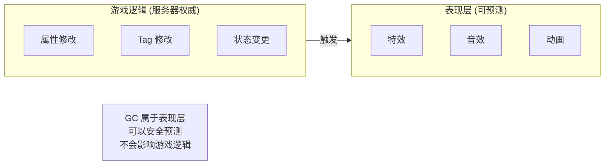

---

## 6.2 GE 内的 GameplayCue 预测

### 6.2.1 GE 触发 GC 流程

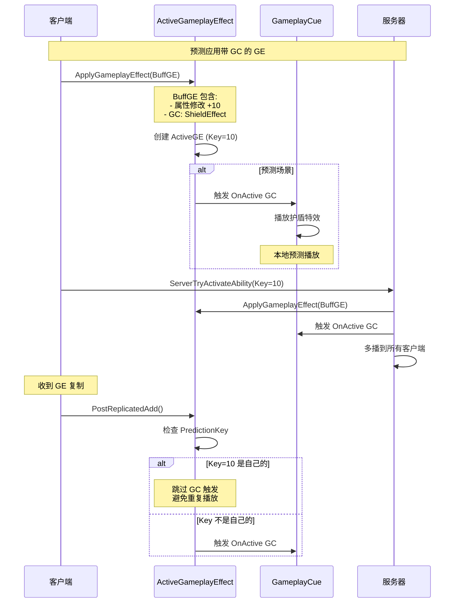

### 6.2.2 GC 在 ActiveGE 中的存储

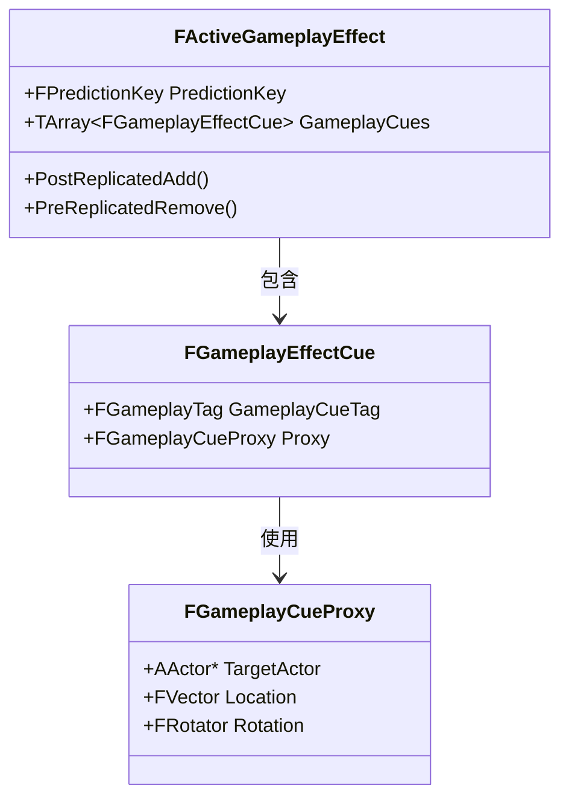

### 6.2.3 PostReplicatedAdd 中的 GC 处理

```cpp
// GameplayEffect.cpp (简化版)

void FActiveGameplayEffect::PostReplicatedAdd(const FActiveGameplayEffectsContainer& InArray)
{
    // 检查是否是自己预测的 GE
    if (PredictionKey.IsLocalClientKey())
    {
        // 是自己预测的，跳过所有 OnApplied 逻辑
        // 包括 GameplayCue 的触发
        // 这解决了 GC 的 Redo 问题
        return;
    }

    // 不是自己预测的，正常处理

    // 1. 应用属性修改器
    InArray.Owner->UpdateAggregatorsForEffect(this);

    // 2. 触发 GameplayCue
    for (const FGameplayEffectCue& Cue : GameplayCues)
    {
        InArray.Owner->InvokeGameplayCueAdded(
            Cue.GameplayCueTag,
            PredictionKey,
            Cue.Proxy);
    }
}
```

### 6.2.4 PreReplicatedRemove 中的 GC 处理

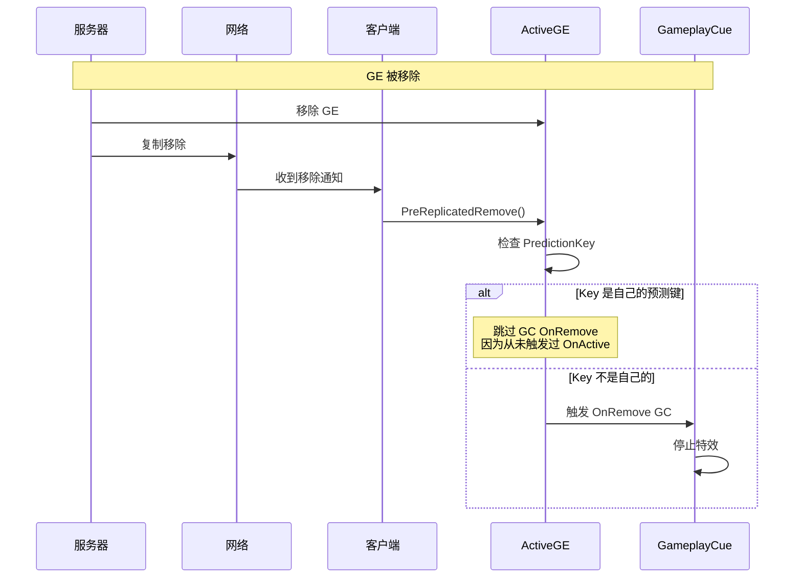

---

## 6.3 独立 GameplayCue 预测

### 6.3.1 独立 GC 执行流程

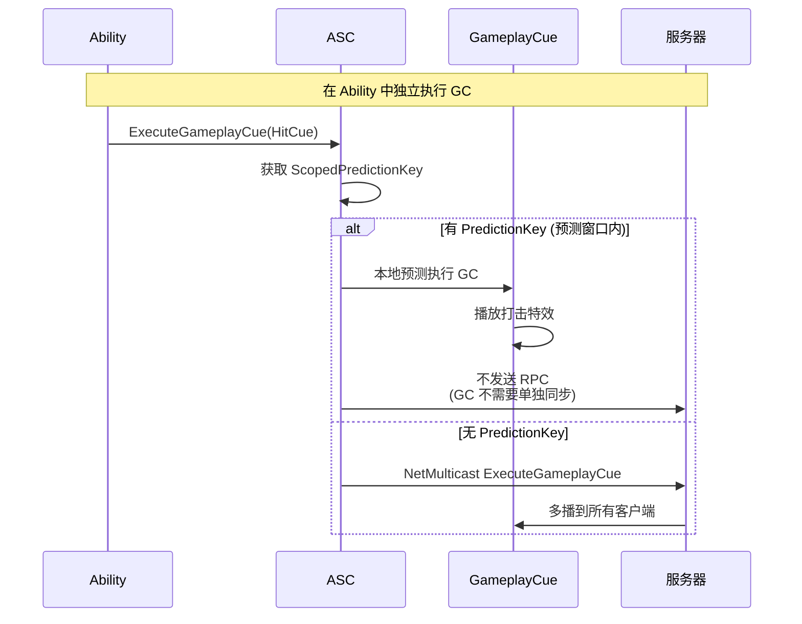

### 6.3.2 ExecuteGameplayCue 实现

```cpp
// AbilitySystemComponent.cpp (简化版)

void UAbilitySystemComponent::ExecuteGameplayCue(
    const FGameplayTag& GameplayCueTag,
    FPredictionKey PredictionKey,
    const FGameplayCueParameters& Parameters)
{
    if (IsNetAuthority())
    {
        // 服务器：多播到所有客户端
        NetMulticast_InvokeGameplayCueExecuted(
            GameplayCueTag,
            PredictionKey,
            Parameters);
    }
    else if (PredictionKey.IsValidKey())
    {
        // 客户端预测：本地执行
        // 不发送 RPC，等待服务器通过其他方式同步
        InvokeGameplayCueExecuted(GameplayCueTag, Parameters);
    }
    // 无 PredictionKey 时，客户端不执行
}
```

### 6.3.3 服务器多播处理

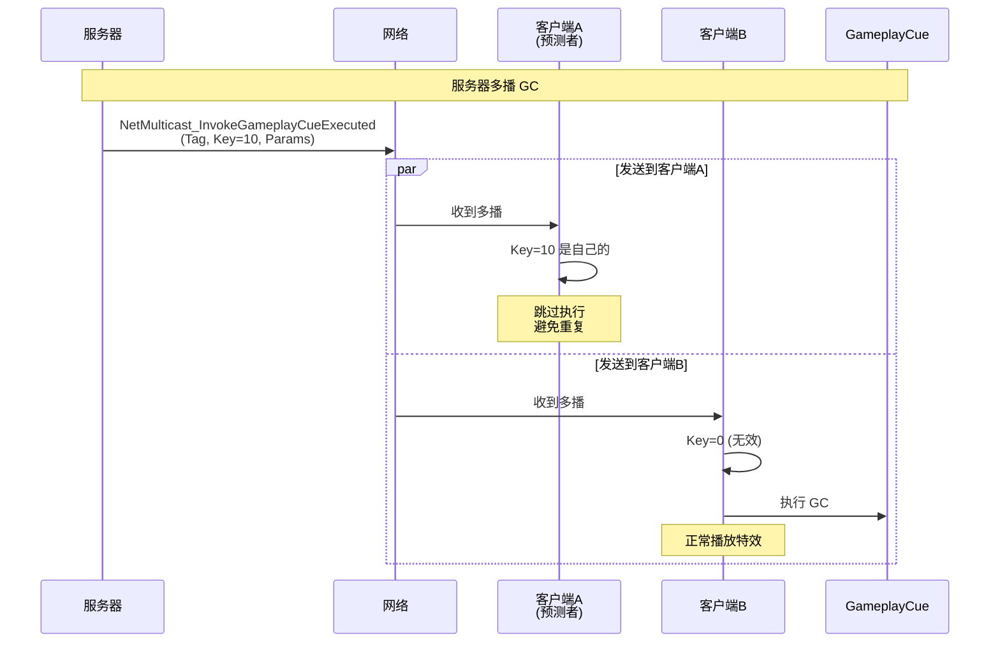

### 6.3.4 NetMulticast 实现

```cpp
// AbilitySystemComponent.cpp (简化版)

void UAbilitySystemComponent::NetMulticast_InvokeGameplayCueExecuted_Implementation(
    const FGameplayTag& GameplayCueTag,
    FPredictionKey PredictionKey,
    const FGameplayCueParameters& Parameters)
{
    // 关键检查：是否是自己预测的 GC
    if (PredictionKey.IsLocalClientKey())
    {
        // 这是自己预测的 GC，跳过执行
        // 解决 Redo 问题
        return;
    }

    // 不是自己预测的，正常执行
    InvokeGameplayCueExecuted(GameplayCueTag, Parameters);
}
```

---

## 6.4 GameplayCue 预测总结

### 6.4.1 预测场景对比

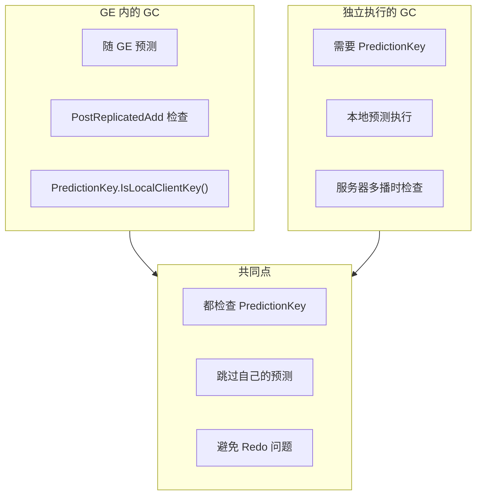

### 6.4.2 Redo 问题解决流程

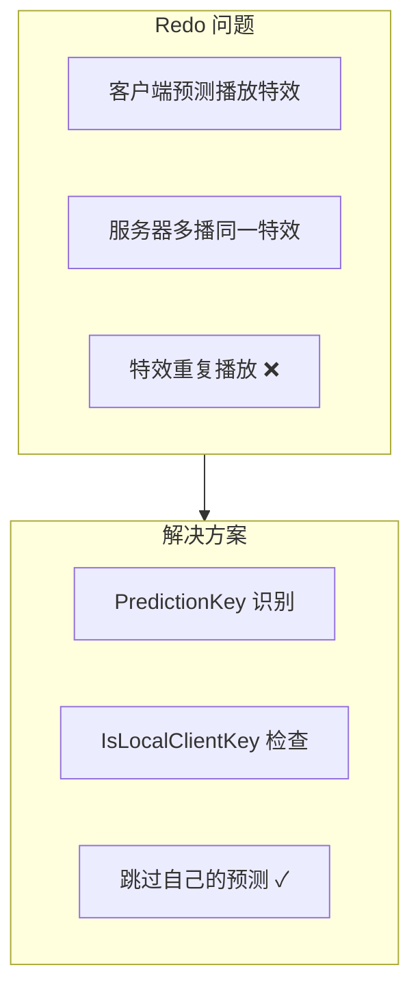

### 6.4.3 完整流程图

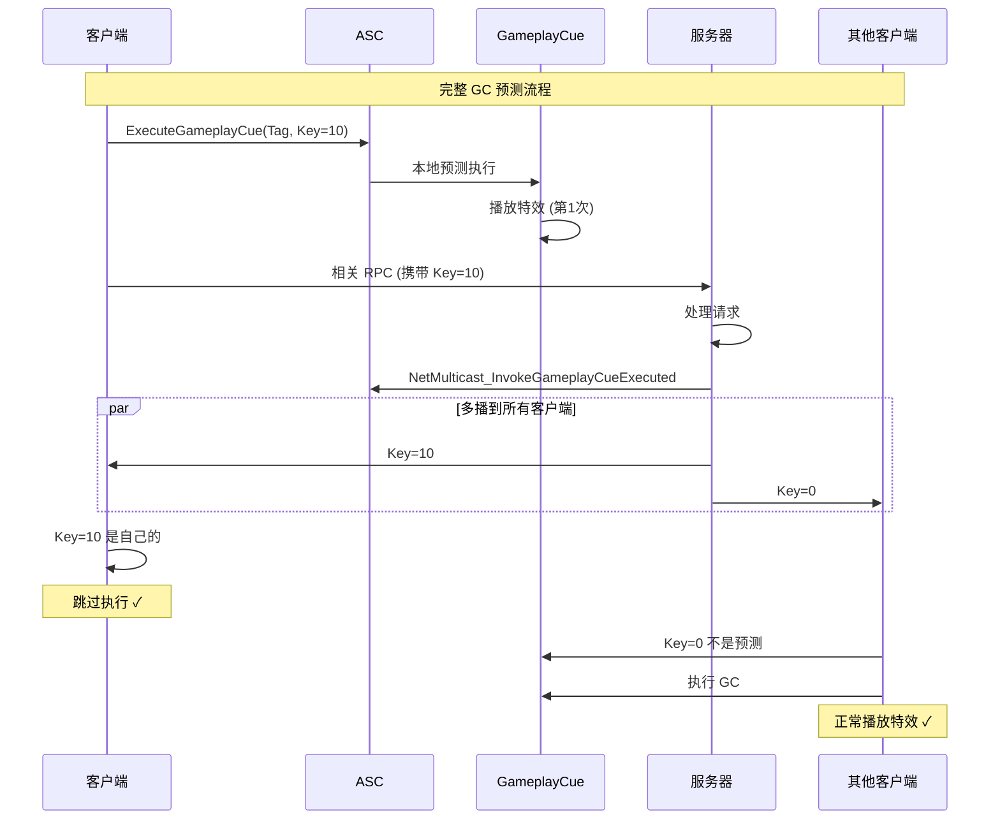

---

## 6.5 GameplayCue 参数传递

### 6.5.1 参数结构

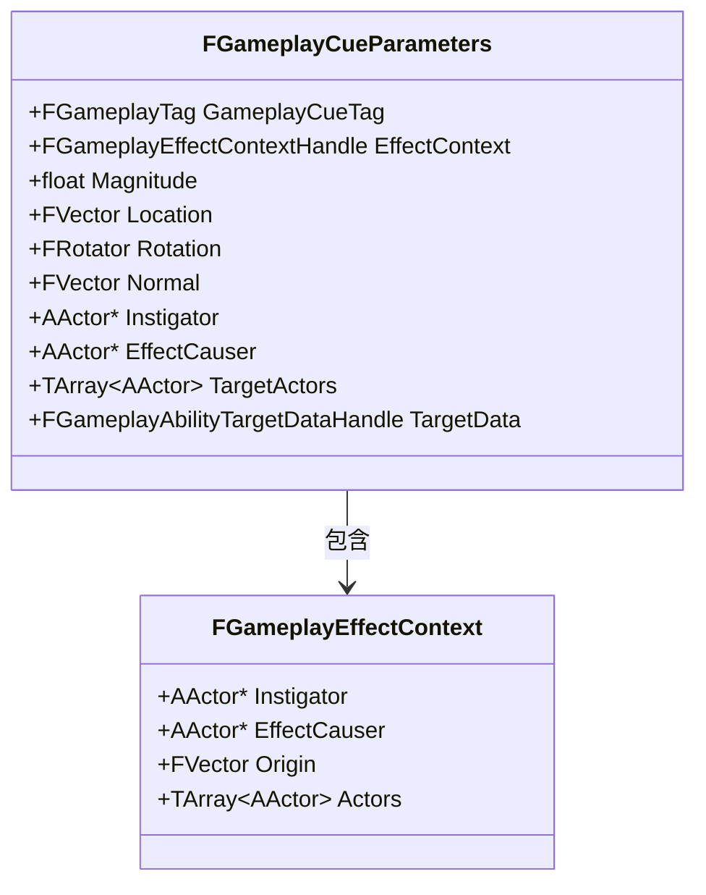

### 6.5.2 参数传递流程

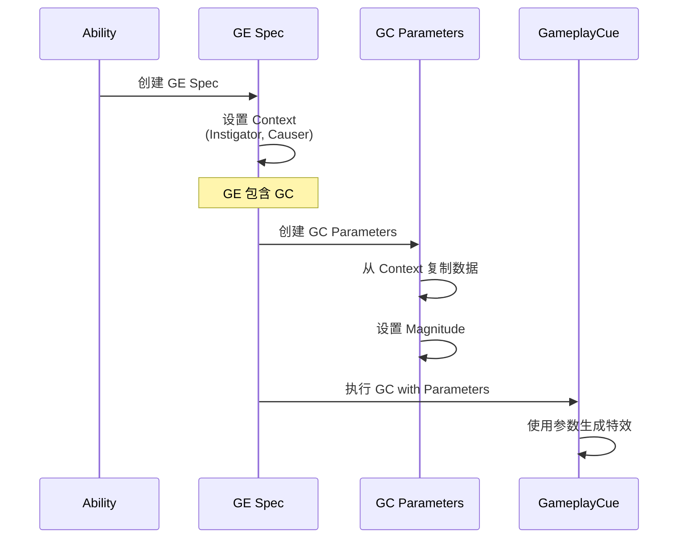

---

## 6.6 实践：自定义 GameplayCue

### 6.6.1 创建 GameplayCueNotify

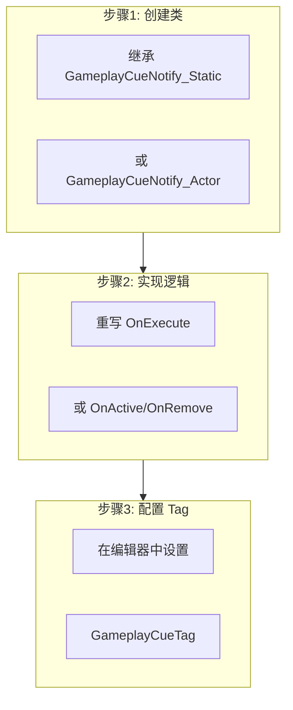

### 6.6.2 示例：打击特效

```cpp
// MyHitGameplayCue.h

#pragma once

#include "CoreMinimal.h"
#include "GameplayCueNotify_Static.h"
#include "MyHitGameplayCue.generated.h"

UCLASS()
class MYGAME_API UMyHitGameplayCue : public UGameplayCueNotify_Static
{
    GENERATED_BODY()

public:
    // 打击特效
    UPROPERTY(EditDefaultsOnly, Category = "Effects")
    UNiagaraSystem* HitEffect;

    // 打击音效
    UPROPERTY(EditDefaultsOnly, Category = "Effects")
    USoundBase* HitSound;

    virtual bool OnExecute_Implementation(
        AActor* Target,
        const FGameplayCueParameters& Parameters) override;
};
```

```cpp
// MyHitGameplayCue.cpp

#include "MyHitGameplayCue.h"
#include "NiagaraFunctionLibrary.h"
#include "Kismet/GameplayStatics.h"

bool UMyHitGameplayCue::OnExecute_Implementation(
    AActor* Target,
    const FGameplayCueParameters& Parameters)
{
    // 获取位置
    FVector Location = Parameters.Location;
    if (Location.IsNearlyZero())
    {
        Location = Target->GetActorLocation();
    }

    // 播放特效
    if (HitEffect)
    {
        UNiagaraFunctionLibrary::SpawnSystemAtLocation(
            GetWorld(),
            HitEffect,
            Location);
    }

    // 播放音效
    if (HitSound)
    {
        UGameplayStatics::PlaySoundAtLocation(
            GetWorld(),
            HitSound,
            Location);
    }

    return true;
}
```

### 6.6.3 在 Ability 中使用

```cpp
// MyAttackAbility.cpp

void UMyAttackAbility::OnHitConfirmed(FGameplayAbilityTargetDataHandle TargetData)
{
    // 创建新的预测窗口
    FScopedPredictionWindow ScopedPred(GetAbilitySystemComponent());

    // 执行打击 GC (预测)
    FGameplayCueParameters Params;
    Params.Location = TargetData.Get(0)->GetHitResult()->Location;

    GetAbilitySystemComponent()->ExecuteGameplayCue(
        FGameplayTag::RequestGameplayTag(FName("GameplayCue.Hit")),
        ScopedPred.ScopedPredictionKey,
        Params);
}
```

---

## 6.7 调试 GameplayCue

### 6.7.1 断点位置

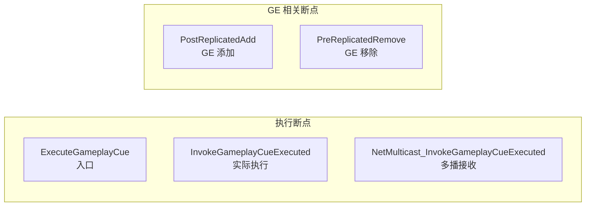

### 6.7.2 添加日志

```cpp
// AbilitySystemComponent.cpp

void UAbilitySystemComponent::ExecuteGameplayCue(
    const FGameplayTag& GameplayCueTag,
    FPredictionKey PredictionKey,
    const FGameplayCueParameters& Parameters)
{
    UE_LOG(LogGameplayAbilities, Log,
           TEXT("ExecuteGameplayCue: Tag=%s, Key=%s, IsAuthority=%d"),
           *GameplayCueTag.ToString(),
           *PredictionKey.ToString(),
           IsNetAuthority());

    // ...
}

void UAbilitySystemComponent::NetMulticast_InvokeGameplayCueExecuted_Implementation(...)
{
    UE_LOG(LogGameplayAbilities, Log,
           TEXT("NetMulticast GC: Tag=%s, Key=%s, IsLocalClientKey=%d"),
           *GameplayCueTag.ToString(),
           *PredictionKey.ToString(),
           PredictionKey.IsLocalClientKey());

    // ...
}
```

---

## 6.8 总结

### 6.8.1 核心概念图

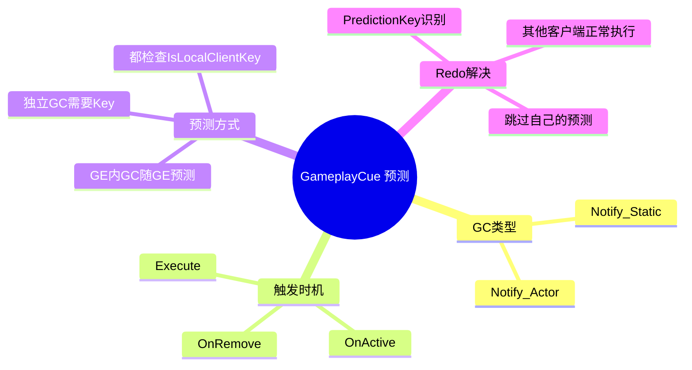

### 6.8.2 关键要点

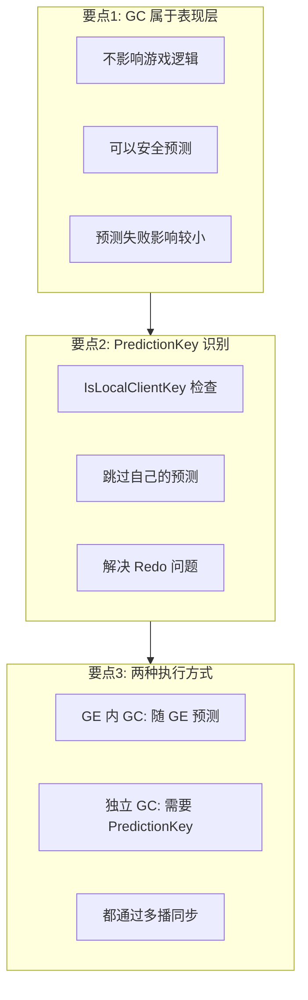

---

## 课后练习

### 练习1：创建自定义 GC

1. 创建继承 GameplayCueNotify_Static 的类
2. 实现打击特效和音效
3. 在 Ability 中调用 ExecuteGameplayCue

### 练习2：观察 GC 预测

1. 在 NetMulticast_InvokeGameplayCueExecuted 设置断点
2. 观察 PredictionKey 的状态
3. 验证 Redo 问题的解决

### 练习3：思考题

1. 为什么 GC 可以安全预测而属性修改需要增量预测？
2. 如果 GC 执行失败（预测成功但服务器失败），会有什么影响？
3. 如何处理 GC 的网络带宽优化？

---

## 下节课预告

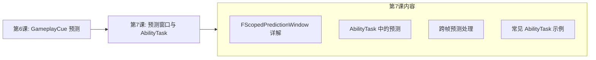

---

## 参考资料

- **源码**：`Engine/Plugins/Runtime/GameplayAbilities/Source/GameplayAbilities/Public/GameplayCueInterface.h`
- **源码**：`Engine/Plugins/Runtime/GameplayAbilities/Source/GameplayAbilities/Public/GameplayCue_Types.h`
- **官方文档**：[Gameplay Cues](https://dev.epicgames.com/documentation/en-us/unreal-engine/gameplay-cues-in-unreal-engine)
