# 第7课：预测窗口与 AbilityTask

> 学习时间：45-60分钟
> 难度：进阶
> 前置知识：第1-6课内容、AbilityTask基础

---

## 学习目标

完成本课后，你将能够：
1. 深入理解 FScopedPredictionWindow 的实现原理
2. 掌握 AbilityTask 中的预测机制
3. 学会处理跨帧预测场景
4. 掌握常见 AbilityTask 的预测实现

---

## 7.1 预测窗口的概念

### 7.1.1 为什么需要预测窗口？

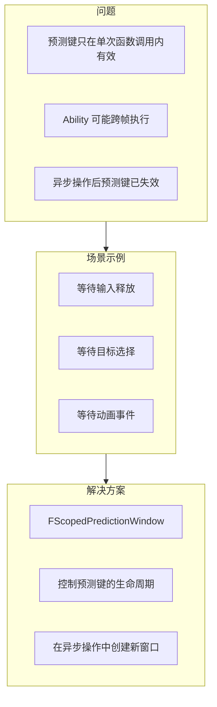
```mermaid
flowchart TB
    subgraph 问题["问题"]
        P1["预测键只在单次函数调用内有效"]
        P2["Ability 可能跨帧执行"]
        P3["异步操作后预测键已失效"]
    end

    subgraph 场景["场景示例"]
        S1["等待输入释放"]
        S2["等待目标选择"]
        S3["等待动画事件"]
    end

    subgraph 解决方案["解决方案"]
        R1["FScopedPredictionWindow"]
        R2["控制预测键的生命周期"]
        R3["在异步操作中创建新窗口"]
    end

    问题 --> 场景 --> 解决方案
```

### 7.1.2 预测窗口的生命周期

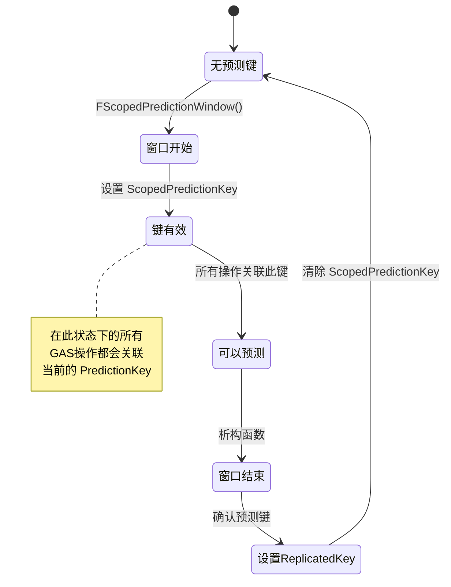
```mermaid
stateDiagram-v2
    [*] --> 无预测键
    无预测键 --> 窗口开始: FScopedPredictionWindow()
    窗口开始 --> 键有效: 设置 ScopedPredictionKey
    键有效 --> 可以预测: 所有操作关联此键

    可以预测 --> 窗口结束: 析构函数
    窗口结束 --> 设置ReplicatedKey: 确认预测键
    设置ReplicatedKey --> 无预测键: 清除 ScopedPredictionKey

    note right of 键有效
        在此状态下的所有
        GAS操作都会关联
        当前的 PredictionKey
    end note
```

### 7.1.3 预测窗口的限制

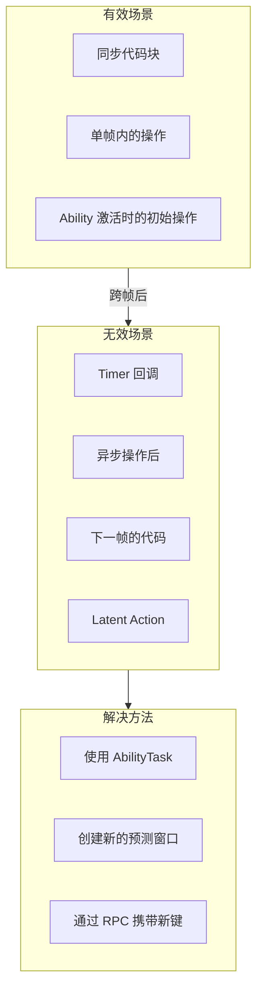
```mermaid
flowchart TB
    subgraph 有效场景["有效场景"]
        E1["同步代码块"]
        E2["单帧内的操作"]
        E3["Ability 激活时的初始操作"]
    end

    subgraph 无效场景["无效场景"]
        I1["Timer 回调"]
        I2["异步操作后"]
        I3["下一帧的代码"]
        I4["Latent Action"]
    end

    subgraph 解决方法["解决方法"]
        S1["使用 AbilityTask"]
        S2["创建新的预测窗口"]
        S3["通过 RPC 携带新键"]
    end

    有效场景 -->|"跨帧后"| 无效场景 --> 解决方法
```

---

## 7.2 FScopedPredictionWindow 深入

### 7.2.1 类结构

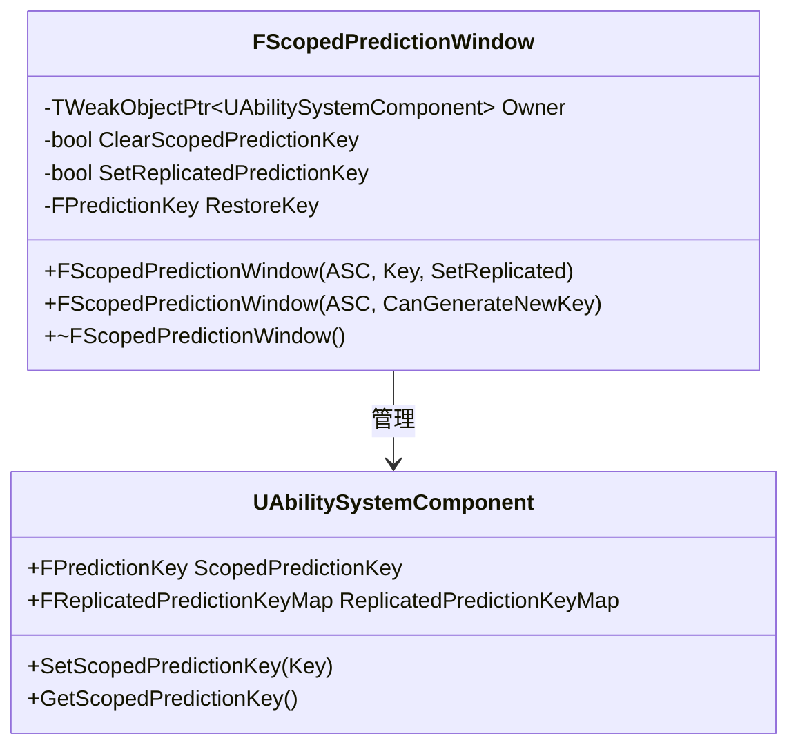
```mermaid
classDiagram
    class FScopedPredictionWindow {
        -TWeakObjectPtr~UAbilitySystemComponent~ Owner
        -bool ClearScopedPredictionKey
        -bool SetReplicatedPredictionKey
        -FPredictionKey RestoreKey

        +FScopedPredictionWindow(ASC, Key, SetReplicated)
        +FScopedPredictionWindow(ASC, CanGenerateNewKey)
        +~FScopedPredictionWindow()
    }

    class UAbilitySystemComponent {
        +FPredictionKey ScopedPredictionKey
        +FReplicatedPredictionKeyMap ReplicatedPredictionKeyMap

        +SetScopedPredictionKey(Key)
        +GetScopedPredictionKey()
    }

    FScopedPredictionWindow --> UAbilitySystemComponent : 管理
```

### 7.2.2 构造函数实现

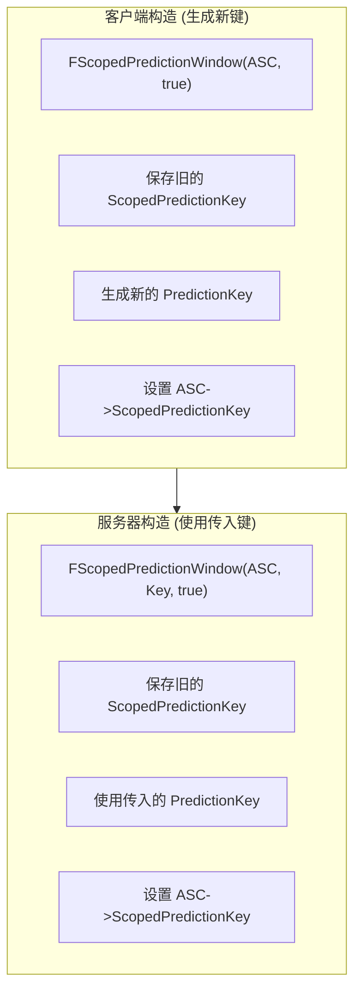
```mermaid
flowchart TB
    subgraph 客户端构造["客户端构造 (生成新键)"]
        C1["FScopedPredictionWindow(ASC, true)"]
        C2["保存旧的 ScopedPredictionKey"]
        C3["生成新的 PredictionKey"]
        C4["设置 ASC->ScopedPredictionKey"]
    end

    subgraph 服务器构造["服务器构造 (使用传入键)"]
        S1["FScopedPredictionWindow(ASC, Key, true)"]
        S2["保存旧的 ScopedPredictionKey"]
        S3["使用传入的 PredictionKey"]
        S4["设置 ASC->ScopedPredictionKey"]
    end

    客户端构造 --> 服务器构造
```

### 7.2.3 源码解析

```cpp
// GameplayPrediction.cpp (简化版)

// 客户端：生成新的预测键
FScopedPredictionWindow::FScopedPredictionWindow(
    UAbilitySystemComponent* InOwner,
    bool CanGenerateNewKey)
    : Owner(InOwner)
    , ClearScopedPredictionKey(false)
    , SetReplicatedPredictionKey(false)
{
    if (InOwner && CanGenerateNewKey)
    {
        // 保存旧键用于恢复
        RestoreKey = InOwner->ScopedPredictionKey;

        // 生成新的预测键
        InOwner->ScopedPredictionKey = FPredictionKey::CreateNewPredictionKey(InOwner);

        ClearScopedPredictionKey = true;
        SetReplicatedPredictionKey = true;
    }
}

// 服务器：使用客户端传来的键
FScopedPredictionWindow::FScopedPredictionWindow(
    UAbilitySystemComponent* InOwner,
    FPredictionKey InPredictionKey,
    bool InSetReplicatedPredictionKey)
    : Owner(InOwner)
    , ClearScopedPredictionKey(false)
    , SetReplicatedPredictionKey(InSetReplicatedPredictionKey)
{
    if (InOwner && InPredictionKey.IsValidKey())
    {
        // 保存旧键
        RestoreKey = InOwner->ScopedPredictionKey;

        // 使用传入的键
        InOwner->ScopedPredictionKey = InPredictionKey;

        ClearScopedPredictionKey = true;
    }
}
```

### 7.2.4 析构函数实现

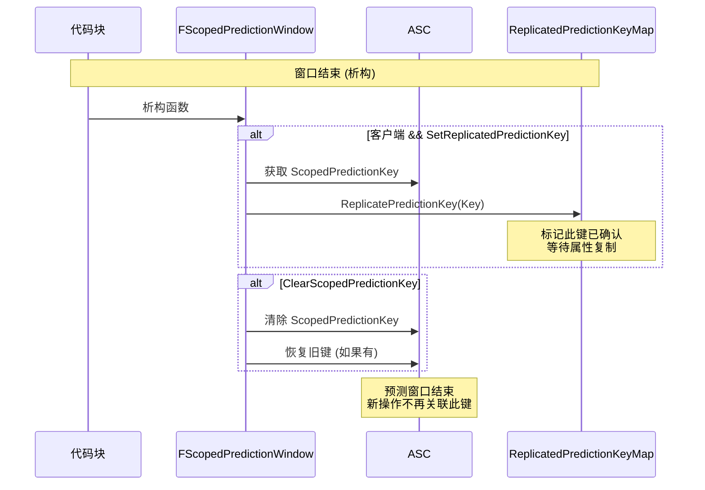
```mermaid
sequenceDiagram
    participant Code as 代码块
    participant Window as FScopedPredictionWindow
    participant ASC as ASC
    participant ReplMap as ReplicatedPredictionKeyMap

    Note over Code,ReplMap: 窗口结束 (析构)

    Code->>Window: 析构函数

    alt 客户端 && SetReplicatedPredictionKey
        Window->>ASC: 获取 ScopedPredictionKey
        Window->>ReplMap: ReplicatePredictionKey(Key)
        Note over ReplMap: 标记此键已确认<br/>等待属性复制
    end

    alt ClearScopedPredictionKey
        Window->>ASC: 清除 ScopedPredictionKey
        Window->>ASC: 恢复旧键 (如果有)
    end

    Note over ASC: 预测窗口结束<br/>新操作不再关联此键
```

```cpp
// GameplayPrediction.cpp (简化版)

FScopedPredictionWindow::~FScopedPredictionWindow()
{
    if (Owner.IsValid())
    {
        UAbilitySystemComponent* ASC = Owner.Get();

        // 客户端：设置 ReplicatedPredictionKey
        if (SetReplicatedPredictionKey && ASC->ScopedPredictionKey.IsValidKey())
        {
            ASC->ReplicatedPredictionKeyMap.ReplicatePredictionKey(ASC->ScopedPredictionKey);
        }

        // 清除 ScopedPredictionKey
        if (ClearScopedPredictionKey)
        {
            ASC->ScopedPredictionKey = RestoreKey;
        }
    }
}
```

---

## 7.3 AbilityTask 中的预测

### 7.3.1 AbilityTask 概述

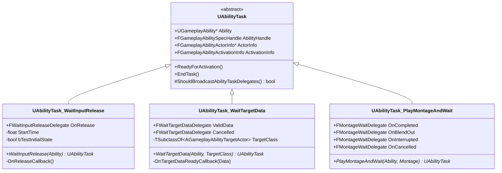
```mermaid
classDiagram
    class UAbilityTask {
        <<abstract>>
        +UGameplayAbility* Ability
        +FGameplayAbilitySpecHandle AbilityHandle
        +FGameplayAbilityActorInfo* ActorInfo
        +FGameplayAbilityActivationInfo ActivationInfo

        +ReadyForActivation()
        +EndTask()
        #ShouldBroadcastAbilityTaskDelegates() bool
    }

    class UAbilityTask_WaitInputRelease {
        +FWaitInputReleaseDelegate OnRelease
        -float StartTime
        -bool bTestInitialState

        +WaitInputRelease(Ability) UAbilityTask*
        -OnReleaseCallback()
    }

    class UAbilityTask_WaitTargetData {
        +FWaitTargetDataDelegate ValidData
        +FWaitTargetDataDelegate Cancelled
        -TSubclassOf~AGameplayAbilityTargetActor~ TargetClass

        +WaitTargetData(Ability, TargetClass) UAbilityTask*
        -OnTargetDataReadyCallback(Data)
    }

    class UAbilityTask_PlayMontageAndWait {
        +FMontageWaitDelegate OnCompleted
        +FMontageWaitDelegate OnBlendOut
        +FMontageWaitDelegate OnInterrupted
        +FMontageWaitDelegate OnCancelled

        +PlayMontageAndWait(Ability, Montage) UAbilityTask*
    }

    UAbilityTask <|-- UAbilityTask_WaitInputRelease
    UAbilityTask <|-- UAbilityTask_WaitTargetData
    UAbilityTask <|-- UAbilityTask_PlayMontageAndWait
```

### 7.3.2 WaitInputRelease 预测实现

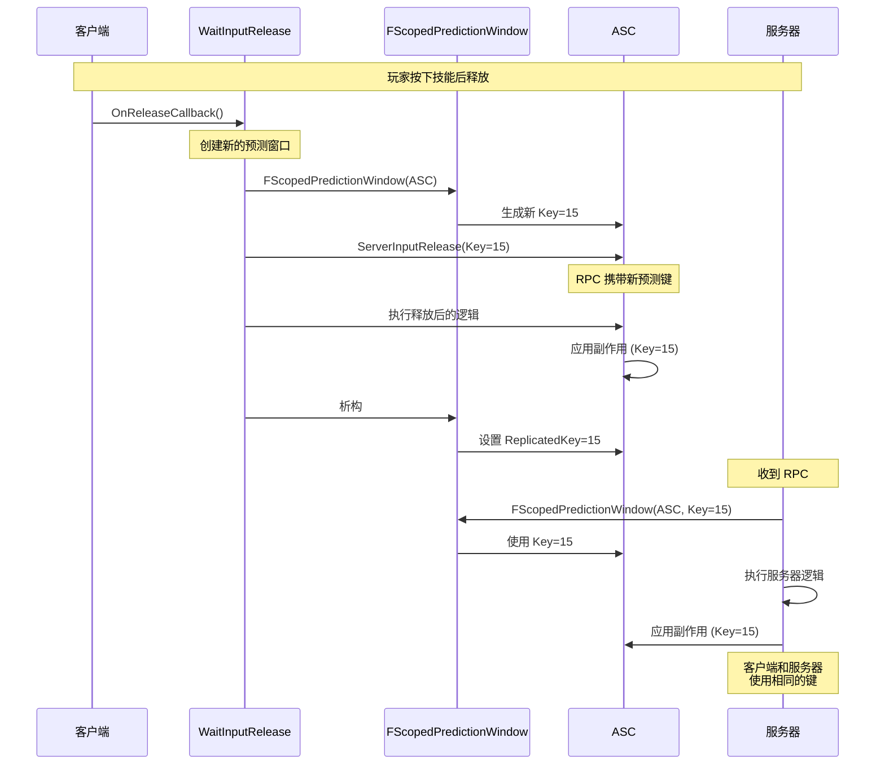
```mermaid
sequenceDiagram
    participant Client as 客户端
    participant Task as WaitInputRelease
    participant Window as FScopedPredictionWindow
    participant ASC as ASC
    participant Server as 服务器

    Note over Client,Server: 玩家按下技能后释放

    Client->>Task: OnReleaseCallback()

    Note over Task: 创建新的预测窗口

    Task->>Window: FScopedPredictionWindow(ASC)
    Window->>ASC: 生成新 Key=15

    Task->>ASC: ServerInputRelease(Key=15)
    Note over ASC: RPC 携带新预测键

    Task->>ASC: 执行释放后的逻辑
    ASC->>ASC: 应用副作用 (Key=15)

    Task->>Window: 析构
    Window->>ASC: 设置 ReplicatedKey=15

    Note over Server: 收到 RPC

    Server->>Window: FScopedPredictionWindow(ASC, Key=15)
    Window->>ASC: 使用 Key=15

    Server->>Server: 执行服务器逻辑
    Server->>ASC: 应用副作用 (Key=15)

    Note over Server: 客户端和服务器<br/>使用相同的键
```

### 7.3.3 源码解析

```cpp
// AbilityTask_WaitInputRelease.cpp (简化版)

void UAbilityTask_WaitInputRelease::OnReleaseCallback()
{
    // 检查是否应该广播
    if (!ShouldBroadcastAbilityTaskDelegates())
    {
        return;
    }

    // 关键：创建新的预测窗口
    // 这会生成新的 PredictionKey
    FScopedPredictionWindow ScopedPredictionWindow(AbilitySystemComponent);

    // 发送 RPC 到服务器，携带新的预测键
    AbilitySystemComponent->ServerInputRelease(
        ScopedPredictionWindow.ScopedPredictionKey);

    // 广播委托，执行后续逻辑
    // 后续逻辑中的副作用会关联到新的预测键
    OnRelease.Broadcast();

    // 预测窗口结束，设置 ReplicatedPredictionKey

    EndTask();
}

// 服务器端
void UAbilitySystemComponent::ServerInputRelease_Implementation(
    FPredictionKey PredictionKey)
{
    // 使用客户端传来的预测键创建窗口
    FScopedPredictionWindow ScopedPredictionWindow(this, PredictionKey);

    // 触发输入释放事件
    // 服务器端执行的副作用会使用相同的 PredictionKey
    OnInputReleased.Broadcast();

    // 窗口结束，确认预测键
}
```

### 7.3.4 WaitTargetData 预测实现

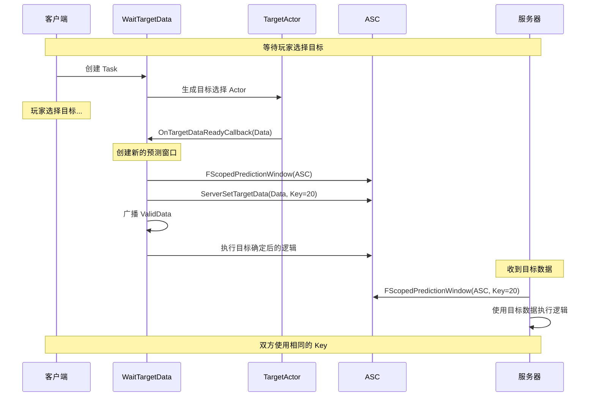
```mermaid
sequenceDiagram
    participant Client as 客户端
    participant Task as WaitTargetData
    participant TargetActor as TargetActor
    participant ASC as ASC
    participant Server as 服务器

    Note over Client,Server: 等待玩家选择目标

    Client->>Task: 创建 Task
    Task->>TargetActor: 生成目标选择 Actor

    Note over Client: 玩家选择目标...

    TargetActor->>Task: OnTargetDataReadyCallback(Data)

    Note over Task: 创建新的预测窗口

    Task->>ASC: FScopedPredictionWindow(ASC)
    Task->>ASC: ServerSetTargetData(Data, Key=20)

    Task->>Task: 广播 ValidData
    Task->>ASC: 执行目标确定后的逻辑

    Note over Server: 收到目标数据

    Server->>ASC: FScopedPredictionWindow(ASC, Key=20)
    Server->>Server: 使用目标数据执行逻辑

    Note over Client,Server: 双方使用相同的 Key
```

---

## 7.4 常见 AbilityTask 预测场景

### 7.4.1 PlayMontageAndWait

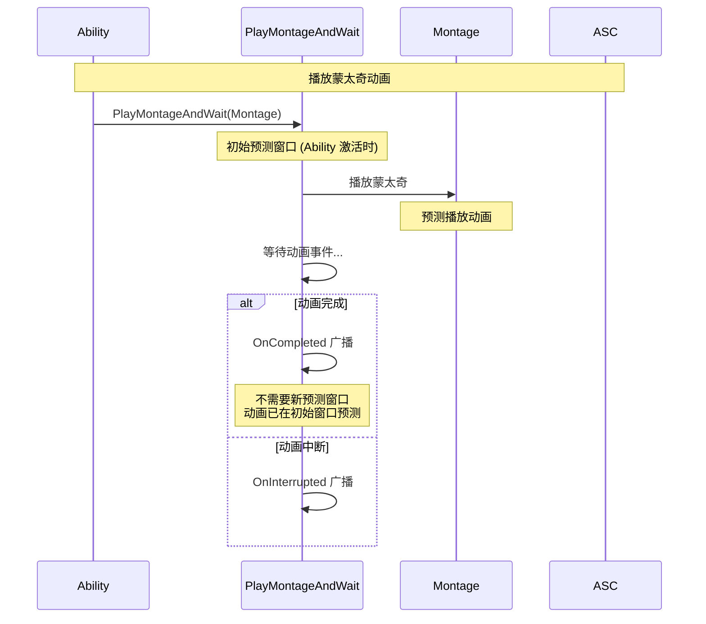
```mermaid
sequenceDiagram
    participant Ability as Ability
    participant Task as PlayMontageAndWait
    participant Montage as Montage
    participant ASC as ASC

    Note over Ability,ASC: 播放蒙太奇动画

    Ability->>Task: PlayMontageAndWait(Montage)

    Note over Task: 初始预测窗口 (Ability 激活时)

    Task->>Montage: 播放蒙太奇
    Note over Montage: 预测播放动画

    Task->>Task: 等待动画事件...

    alt 动画完成
        Task->>Task: OnCompleted 广播
        Note over Task: 不需要新预测窗口<br/>动画已在初始窗口预测
    else 动画中断
        Task->>Task: OnInterrupted 广播
    end
```

### 7.4.2 WaitNetSync

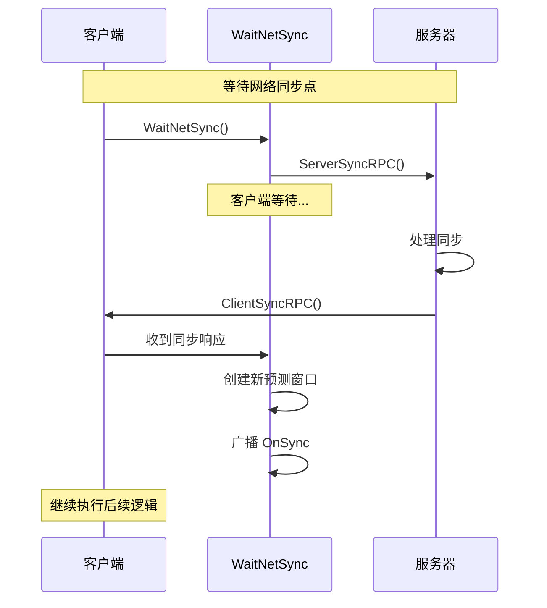
```mermaid
sequenceDiagram
    participant Client as 客户端
    participant Task as WaitNetSync
    participant Server as 服务器

    Note over Client,Server: 等待网络同步点

    Client->>Task: WaitNetSync()

    Task->>Server: ServerSyncRPC()
    Note over Task: 客户端等待...

    Server->>Server: 处理同步
    Server->>Client: ClientSyncRPC()

    Client->>Task: 收到同步响应
    Task->>Task: 创建新预测窗口
    Task->>Task: 广播 OnSync

    Note over Client: 继续执行后续逻辑
```

### 7.4.3 WaitGameplayEvent

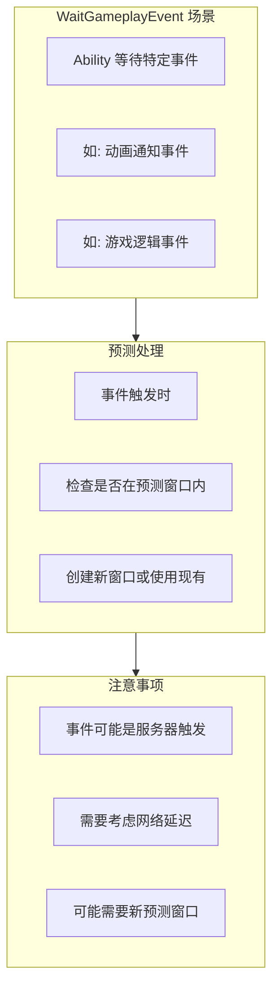
```mermaid
flowchart TB
    subgraph 场景["WaitGameplayEvent 场景"]
        A["Ability 等待特定事件"]
        B["如: 动画通知事件"]
        C["如: 游戏逻辑事件"]
    end

    subgraph 预测处理["预测处理"]
        D["事件触发时"]
        E["检查是否在预测窗口内"]
        F["创建新窗口或使用现有"]
    end

    subgraph 注意事项["注意事项"]
        G["事件可能是服务器触发"]
        H["需要考虑网络延迟"]
        I["可能需要新预测窗口"]
    end

    场景 --> 预测处理 --> 注意事项
```

---

## 7.5 跨帧预测处理

### 7.5.1 问题场景

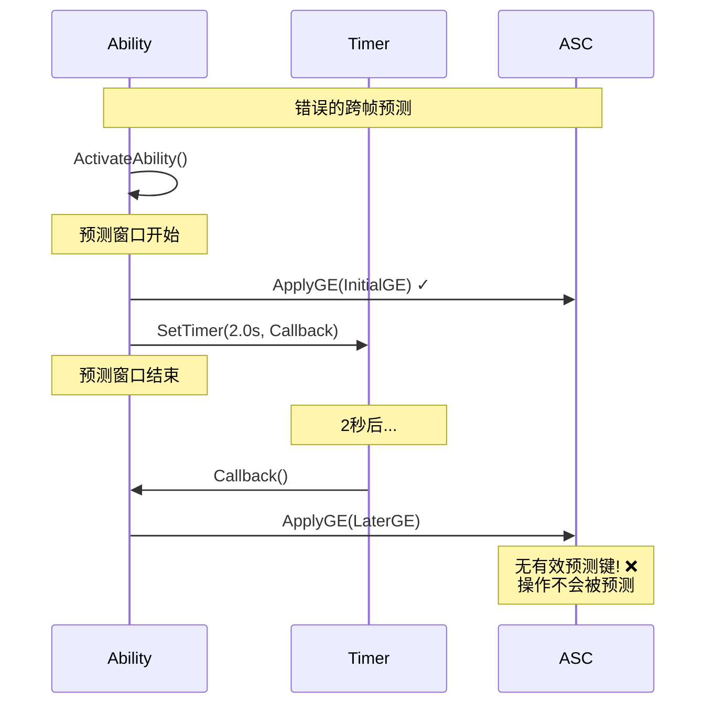
```mermaid
sequenceDiagram
    participant Ability as Ability
    participant Timer as Timer
    participant ASC as ASC

    Note over Ability,ASC: 错误的跨帧预测

    Ability->>Ability: ActivateAbility()
    Note over Ability: 预测窗口开始

    Ability->>ASC: ApplyGE(InitialGE) ✓

    Ability->>Timer: SetTimer(2.0s, Callback)
    Note over Ability: 预测窗口结束

    Note over Timer: 2秒后...

    Timer->>Ability: Callback()
    Ability->>ASC: ApplyGE(LaterGE)
    Note over ASC: 无有效预测键! ❌<br/>操作不会被预测
```

### 7.5.2 正确的跨帧处理

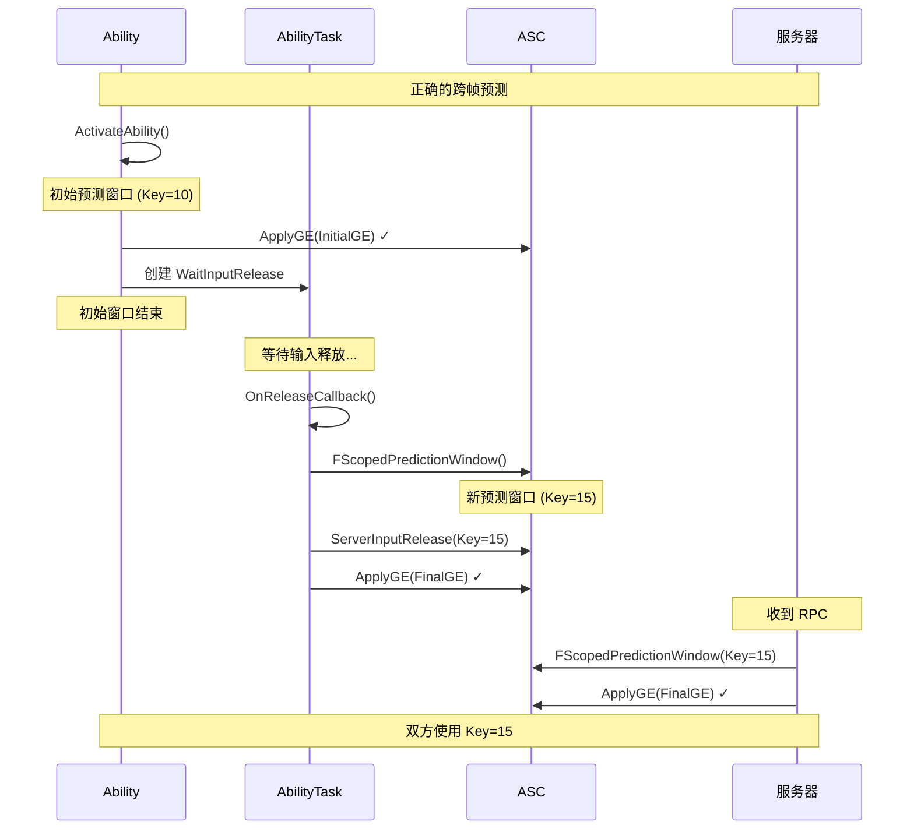
```mermaid
sequenceDiagram
    participant Ability as Ability
    participant Task as AbilityTask
    participant ASC as ASC
    participant Server as 服务器

    Note over Ability,Server: 正确的跨帧预测

    Ability->>Ability: ActivateAbility()
    Note over Ability: 初始预测窗口 (Key=10)

    Ability->>ASC: ApplyGE(InitialGE) ✓
    Ability->>Task: 创建 WaitInputRelease

    Note over Ability: 初始窗口结束

    Note over Task: 等待输入释放...

    Task->>Task: OnReleaseCallback()
    Task->>ASC: FScopedPredictionWindow()
    Note over ASC: 新预测窗口 (Key=15)

    Task->>ASC: ServerInputRelease(Key=15)
    Task->>ASC: ApplyGE(FinalGE) ✓

    Note over Server: 收到 RPC

    Server->>ASC: FScopedPredictionWindow(Key=15)
    Server->>ASC: ApplyGE(FinalGE) ✓

    Note over Ability,Server: 双方使用 Key=15
```

### 7.5.3 设计原则

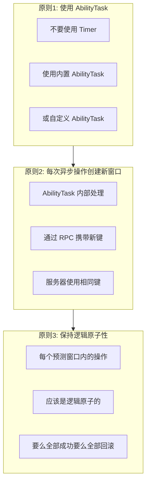
```mermaid
flowchart TB
    subgraph 原则1["原则1: 使用 AbilityTask"]
        A1["不要使用 Timer"]
        A2["使用内置 AbilityTask"]
        A3["或自定义 AbilityTask"]
    end

    subgraph 原则2["原则2: 每次异步操作创建新窗口"]
        B1["AbilityTask 内部处理"]
        B2["通过 RPC 携带新键"]
        B3["服务器使用相同键"]
    end

    subgraph 原则3["原则3: 保持逻辑原子性"]
        C1["每个预测窗口内的操作"]
        C2["应该是逻辑原子的"]
        C3["要么全部成功要么全部回滚"]
    end

    原则1 --> 原则2 --> 原则3
```

---

## 7.6 自定义 AbilityTask 示例

### 7.6.1 创建自定义 Task

```cpp
// MyAbilityTask_WaitForSomething.h

#pragma once

#include "CoreMinimal.h"
#include "Abilities/Tasks/AbilityTask.h"
#include "MyAbilityTask_WaitForSomething.generated.h"

DECLARE_DYNAMIC_MULTICAST_DELEGATE(FWaitForSomethingDelegate);

UCLASS()
class MYGAME_API UMyAbilityTask_WaitForSomething : public UAbilityTask
{
    GENERATED_BODY()

public:
    // 输出委托
    UPROPERTY(BlueprintAssignable)
    FWaitForSomethingDelegate OnCompleted;

    UPROPERTY(BlueprintAssignable)
    FWaitForSomethingDelegate OnCancelled;

    // 工厂函数
    UFUNCTION(BlueprintCallable,
              Category = "Ability|Tasks",
              meta = (HidePin = "OwningAbility", DefaultToSelf = "OwningAbility"))
    static UMyAbilityTask_WaitForSomething* WaitForSomething(
        UGameplayAbility* OwningAbility,
        float WaitTime);

protected:
    virtual void Activate() override;
    virtual void OnDestroy(bool bInOwnerFinished) override;

private:
    float WaitTime;
    FTimerHandle TimerHandle;

    void OnTimeReached();
    void ServerNotify_Implementation(FPredictionKey PredictionKey);
};
```

### 7.6.2 实现自定义 Task

```cpp
// MyAbilityTask_WaitForSomething.cpp

#include "MyAbilityTask_WaitForSomething.h"

UMyAbilityTask_WaitForSomething* UMyAbilityTask_WaitForSomething::WaitForSomething(
    UGameplayAbility* OwningAbility,
    float InWaitTime)
{
    auto Task = NewAbilityTask<UMyAbilityTask_WaitForSomething>(OwningAbility);
    Task->WaitTime = InWaitTime;
    return Task;
}

void UMyAbilityTask_WaitForSomething::Activate()
{
    Super::Activate();

    // 设置定时器
    GetWorld()->GetTimerManager().SetTimer(
        TimerHandle,
        this,
        &UMyAbilityTask_WaitForSomething::OnTimeReached,
        WaitTime);
}

void UMyAbilityTask_WaitForSomething::OnTimeReached()
{
    // 关键：创建新的预测窗口
    FScopedPredictionWindow ScopedPred(AbilitySystemComponent);

    // 发送 RPC 到服务器
    ServerNotify(ScopedPred.ScopedPredictionKey);

    // 广播完成委托
    // 后续逻辑会使用新的预测键
    if (ShouldBroadcastAbilityTaskDelegates())
    {
        OnCompleted.Broadcast();
    }

    EndTask();
}

void UMyAbilityTask_WaitForSomething::ServerNotify_Implementation(
    FPredictionKey PredictionKey)
{
    // 服务器端：使用客户端传来的预测键
    FScopedPredictionWindow ScopedPred(AbilitySystemComponent, PredictionKey);

    // 执行服务器端逻辑
    // 副作用会使用相同的 PredictionKey
}
```

### 7.6.3 使用自定义 Task

```cpp
// MyAbility.cpp

void UMyAbility::ActivateAbility(...)
{
    // 初始预测窗口
    ApplyGameplayEffect(InitialGE);

    // 使用自定义 Task
    auto Task = UMyAbilityTask_WaitForSomething::WaitForSomething(this, 2.0f);
    Task->OnCompleted.AddDynamic(this, &UMyAbility::OnWaitCompleted);
    Task->ReadyForActivation();
}

void UMyAbility::OnWaitCompleted()
{
    // Task 内部已创建新预测窗口
    // 这里的操作会被正确预测
    ApplyGameplayEffect(FinalGE);
}
```

---

## 7.7 调试预测窗口

### 7.7.1 断点位置

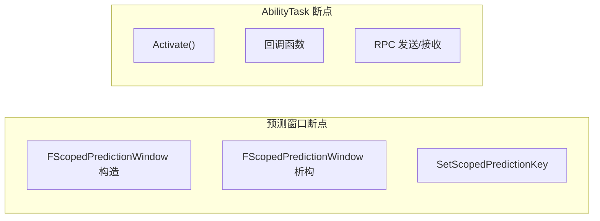
```mermaid
flowchart LR
    subgraph 窗口断点["预测窗口断点"]
        A1["FScopedPredictionWindow 构造"]
        A2["FScopedPredictionWindow 析构"]
        A3["SetScopedPredictionKey"]
    end

    subgraph Task断点["AbilityTask 断点"]
        B1["Activate()"]
        B2["回调函数"]
        B3["RPC 发送/接收"]
    end
```

### 7.7.2 添加日志

```cpp
// GameplayPrediction.cpp

FScopedPredictionWindow::FScopedPredictionWindow(
    UAbilitySystemComponent* InOwner,
    bool CanGenerateNewKey)
{
    // ...

    if (InOwner && CanGenerateNewKey)
    {
        InOwner->ScopedPredictionKey = FPredictionKey::CreateNewPredictionKey(InOwner);

        UE_LOG(LogGameplayAbilities, Log,
               TEXT("PredictionWindow START: Key=%s"),
               *InOwner->ScopedPredictionKey.ToString());
    }
}

FScopedPredictionWindow::~FScopedPredictionWindow()
{
    if (Owner.IsValid())
    {
        UAbilitySystemComponent* ASC = Owner.Get();

        UE_LOG(LogGameplayAbilities, Log,
               TEXT("PredictionWindow END: Key=%s, SetReplicated=%d"),
               *ASC->ScopedPredictionKey.ToString(),
               SetReplicatedPredictionKey);

        // ...
    }
}
```

---

## 7.8 总结

### 7.8.1 核心概念图

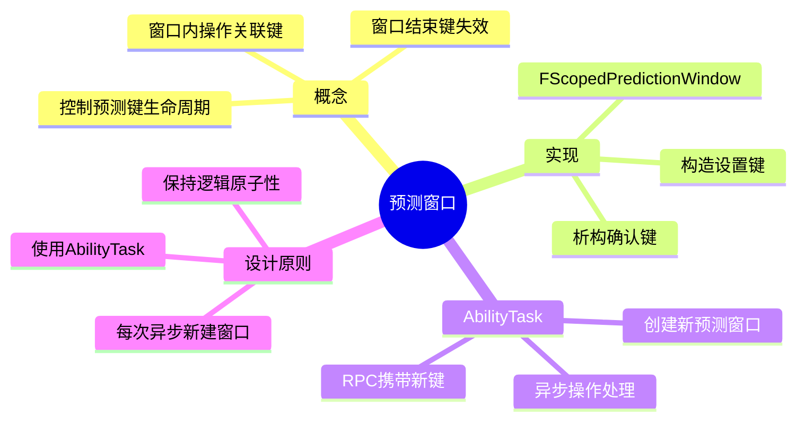
```mermaid
mindmap
  root((预测窗口))
    概念
      控制预测键生命周期
      窗口内操作关联键
      窗口结束键失效
    实现
      FScopedPredictionWindow
      构造设置键
      析构确认键
    AbilityTask
      异步操作处理
      创建新预测窗口
      RPC携带新键
    设计原则
      使用AbilityTask
      保持逻辑原子性
      每次异步新建窗口
```

### 7.8.2 关键要点

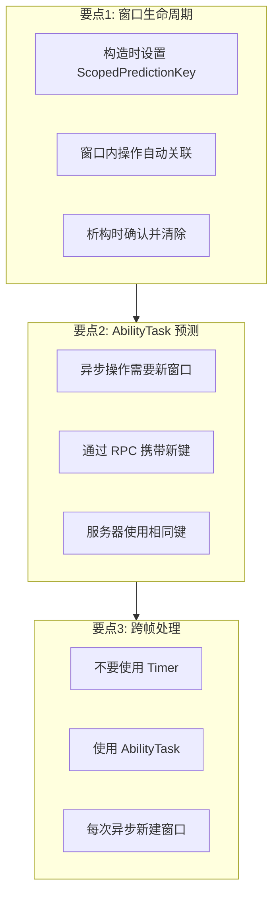
```mermaid
flowchart TB
    subgraph 要点1["要点1: 窗口生命周期"]
        A1["构造时设置 ScopedPredictionKey"]
        A2["窗口内操作自动关联"]
        A3["析构时确认并清除"]
    end

    subgraph 要点2["要点2: AbilityTask 预测"]
        B1["异步操作需要新窗口"]
        B2["通过 RPC 携带新键"]
        B3["服务器使用相同键"]
    end

    subgraph 要点3["要点3: 跨帧处理"]
        C1["不要使用 Timer"]
        C2["使用 AbilityTask"]
        C3["每次异步新建窗口"]
    end

    要点1 --> 要点2 --> 要点3
```

---

## 课后练习

### 练习1：观察预测窗口

1. 在 FScopedPredictionWindow 构造/析构设置断点
2. 激活一个 Ability
3. 观察预测键的创建和确认

### 练习2：创建自定义 AbilityTask

1. 创建继承 UAbilityTask 的类
2. 实现带预测窗口的异步操作
3. 在 Ability 中使用

### 练习3：思考题

1. 为什么 Timer 回调中的操作不会被预测？
2. AbilityTask 如何确保客户端和服务器使用相同的预测键？
3. 如果 Ability 有多个异步操作，如何处理预测键？

---

## 下节课预告

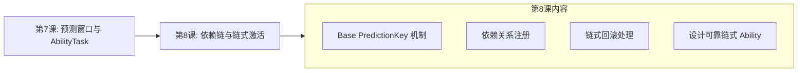
```mermaid
flowchart LR
    L7["第7课: 预测窗口与 AbilityTask"] --> L8["第8课: 依赖链与链式激活"]

    subgraph 第8课内容["第8课内容"]
        A["Base PredictionKey 机制"]
        B["依赖关系注册"]
        C["链式回滚处理"]
        D["设计可靠链式 Ability"]
    end

    L8 --> 第8课内容
```

---

## 参考资料

- **源码**：`Engine/Plugins/Runtime/GameplayAbilities/Source/GameplayAbilities/Public/GameplayPrediction.h`
- **源码**：`Engine/Plugins/Runtime/GameplayAbilities/Source/GameplayAbilities/Private/Tasks/AbilityTask_WaitInputRelease.cpp`
- **官方文档**：[Ability Tasks](https://dev.epicgames.com/documentation/en-us/unreal-engine/gameplay-ability-system-tasks-in-unreal-engine)
