# 第8课：依赖链与链式激活

> 学习时间：45-60分钟
> 难度：高级
> 前置知识：第1-7课内容、GameplayTag系统

---

## 学习目标

完成本课后，你将能够：
1. 深入理解 Base PredictionKey 机制
2. 掌握依赖关系的注册和管理
3. 学会处理链式激活的回滚
4. 设计可靠的链式 Ability 系统

---

## 8.1 依赖链问题

### 8.1.1 链式激活场景

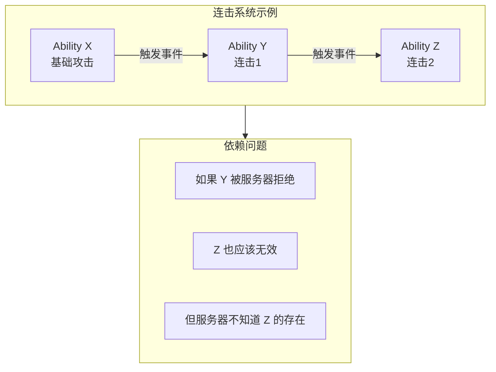
```mermaid
flowchart TB
    subgraph 连击系统["连击系统示例"]
        A["Ability X<br/>基础攻击"]
        B["Ability Y<br/>连击1"]
        C["Ability Z<br/>连击2"]

        A -->|"触发事件"| B
        B -->|"触发事件"| C
    end

    subgraph 问题["依赖问题"]
        P1["如果 Y 被服务器拒绝"]
        P2["Z 也应该无效"]
        P3["但服务器不知道 Z 的存在"]
    end

    连击系统 --> 问题
```

### 8.1.2 问题分析

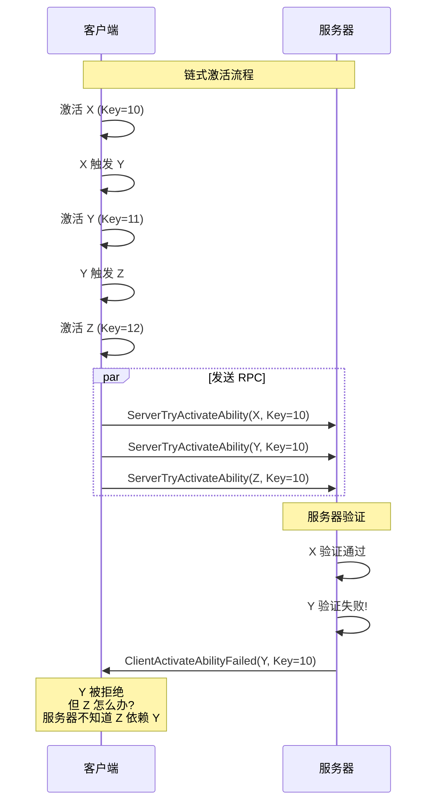
```mermaid
sequenceDiagram
    participant Client as 客户端
    participant Server as 服务器

    Note over Client,Server: 链式激活流程

    Client->>Client: 激活 X (Key=10)
    Client->>Client: X 触发 Y
    Client->>Client: 激活 Y (Key=11)
    Client->>Client: Y 触发 Z
    Client->>Client: 激活 Z (Key=12)

    par 发送 RPC
        Client->>Server: ServerTryActivateAbility(X, Key=10)
        Client->>Server: ServerTryActivateAbility(Y, Key=10)
        Client->>Server: ServerTryActivateAbility(Z, Key=10)
    end

    Note over Server: 服务器验证

    Server->>Server: X 验证通过
    Server->>Server: Y 验证失败!

    Server->>Client: ClientActivateAbilityFailed(Y, Key=10)

    Note over Client: Y 被拒绝<br/>但 Z 怎么办?<br/>服务器不知道 Z 依赖 Y
```

### 8.1.3 核心矛盾

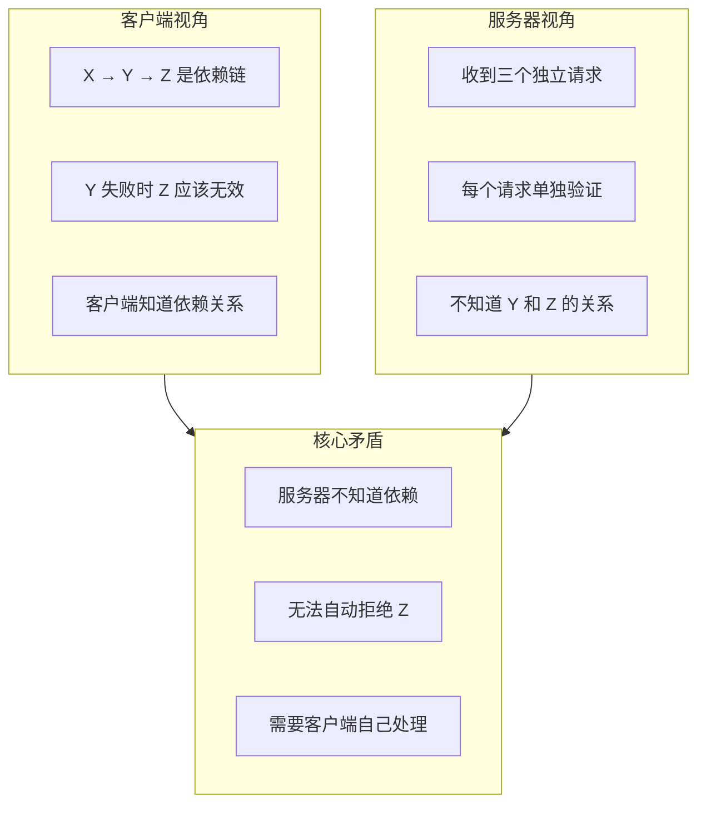
```mermaid
flowchart TB
    subgraph 客户端视角["客户端视角"]
        C1["X → Y → Z 是依赖链"]
        C2["Y 失败时 Z 应该无效"]
        C3["客户端知道依赖关系"]
    end

    subgraph 服务器视角["服务器视角"]
        S1["收到三个独立请求"]
        S2["每个请求单独验证"]
        S3["不知道 Y 和 Z 的关系"]
    end

    subgraph 矛盾["核心矛盾"]
        M1["服务器不知道依赖"]
        M2["无法自动拒绝 Z"]
        M3["需要客户端自己处理"]
    end

    客户端视角 --> 矛盾
    服务器视角 --> 矛盾
```

---

## 8.2 Base PredictionKey 机制

### 8.2.1 概念解释

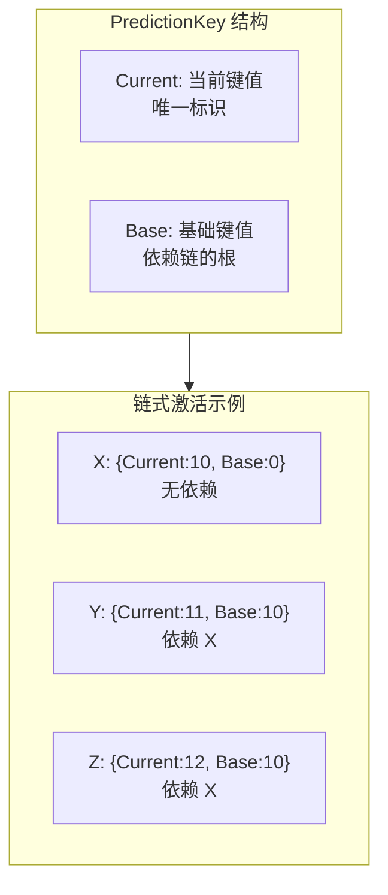
```mermaid
flowchart TB
    subgraph PredictionKey结构["PredictionKey 结构"]
        Current["Current: 当前键值<br/>唯一标识"]
        Base["Base: 基础键值<br/>依赖链的根"]
    end

    subgraph 示例["链式激活示例"]
        KX["X: {Current:10, Base:0}<br/>无依赖"]
        KY["Y: {Current:11, Base:10}<br/>依赖 X"]
        KZ["Z: {Current:12, Base:10}<br/>依赖 X"]
    end

    PredictionKey结构 --> 示例
```

### 8.2.2 依赖键生成

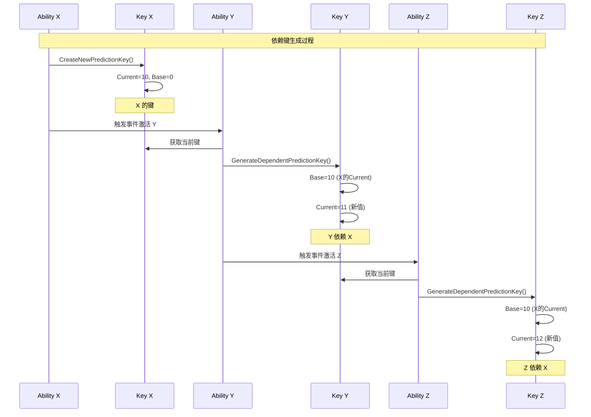
```mermaid
sequenceDiagram
    participant AbilityX as Ability X
    participant KeyX as Key X
    participant AbilityY as Ability Y
    participant KeyY as Key Y
    participant AbilityZ as Ability Z
    participant KeyZ as Key Z

    Note over AbilityX,KeyZ: 依赖键生成过程

    AbilityX->>KeyX: CreateNewPredictionKey()
    KeyX->>KeyX: Current=10, Base=0
    Note over KeyX: X 的键

    AbilityX->>AbilityY: 触发事件激活 Y

    AbilityY->>KeyX: 获取当前键
    AbilityY->>KeyY: GenerateDependentPredictionKey()
    KeyY->>KeyY: Base=10 (X的Current)
    KeyY->>KeyY: Current=11 (新值)
    Note over KeyY: Y 依赖 X

    AbilityY->>AbilityZ: 触发事件激活 Z

    AbilityZ->>KeyY: 获取当前键
    AbilityZ->>KeyZ: GenerateDependentPredictionKey()
    KeyZ->>KeyZ: Base=10 (X的Current)
    KeyZ->>KeyZ: Current=12 (新值)
    Note over KeyZ: Z 依赖 X
```

### 8.2.3 源码解析

```cpp
// GameplayPrediction.cpp (简化版)

void FPredictionKey::GenerateDependentPredictionKey()
{
    // 保存当前键作为 Base
    // 这建立了依赖关系
    Base = Current;

    // 生成新的 Current
    // 需要从 ASC 获取新的 ID
    // 这会在 TryActivateAbility 中完成
}

// AbilitySystemComponent_Abilities.cpp
bool UAbilitySystemComponent::TryActivateAbility(
    FGameplayAbilitySpecHandle AbilityToActivate,
    bool InputPressed,
    const FPredictionKey* InPredictionKey)
{
    FPredictionKey PredictionKey;

    if (InPredictionKey)
    {
        // 有传入的预测键（依赖链场景）
        PredictionKey = *InPredictionKey;

        // 生成依赖键
        PredictionKey.GenerateDependentPredictionKey();

        // 现在 PredictionKey.Base = InPredictionKey->Current
        // PredictionKey.Current = 新值
    }
    else
    {
        // 无传入键，生成新键
        PredictionKey = FPredictionKey::CreateNewPredictionKey(this);
    }

    // ...
}
```

### 8.2.4 Base 字段不复制的原因

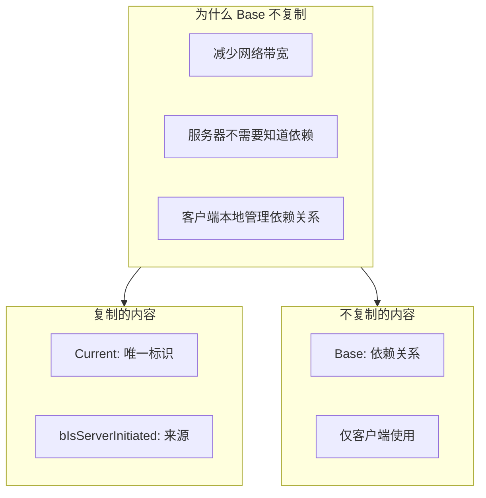
```mermaid
flowchart TB
    subgraph 设计原因["为什么 Base 不复制"]
        R1["减少网络带宽"]
        R2["服务器不需要知道依赖"]
        R3["客户端本地管理依赖关系"]
    end

    subgraph 复制内容["复制的内容"]
        C1["Current: 唯一标识"]
        C2["bIsServerInitiated: 来源"]
    end

    subgraph 不复制内容["不复制的内容"]
        N1["Base: 依赖关系"]
        N2["仅客户端使用"]
    end

    设计原因 --> 复制内容
    设计原因 --> 不复制内容
```

---

## 8.3 依赖关系注册

### 8.3.1 FPredictionKeyDelegates 机制

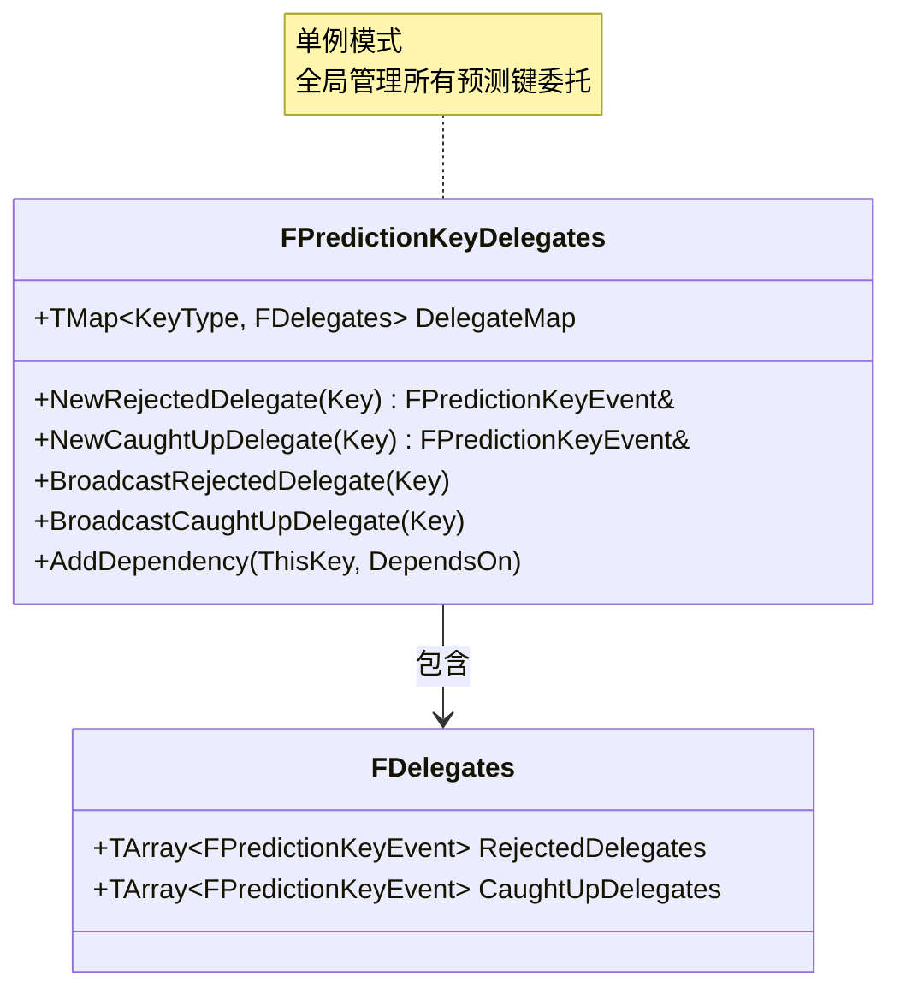
```mermaid
classDiagram
    class FPredictionKeyDelegates {
        +TMap~KeyType, FDelegates~ DelegateMap
        +NewRejectedDelegate(Key) FPredictionKeyEvent&
        +NewCaughtUpDelegate(Key) FPredictionKeyEvent&
        +BroadcastRejectedDelegate(Key)
        +BroadcastCaughtUpDelegate(Key)
        +AddDependency(ThisKey, DependsOn)
    }

    class FDelegates {
        +TArray~FPredictionKeyEvent~ RejectedDelegates
        +TArray~FPredictionKeyEvent~ CaughtUpDelegates
    }

    FPredictionKeyDelegates --> FDelegates : 包含

    note for FPredictionKeyDelegates "单例模式<br/>全局管理所有预测键委托"
```

### 8.3.2 AddDependency 实现

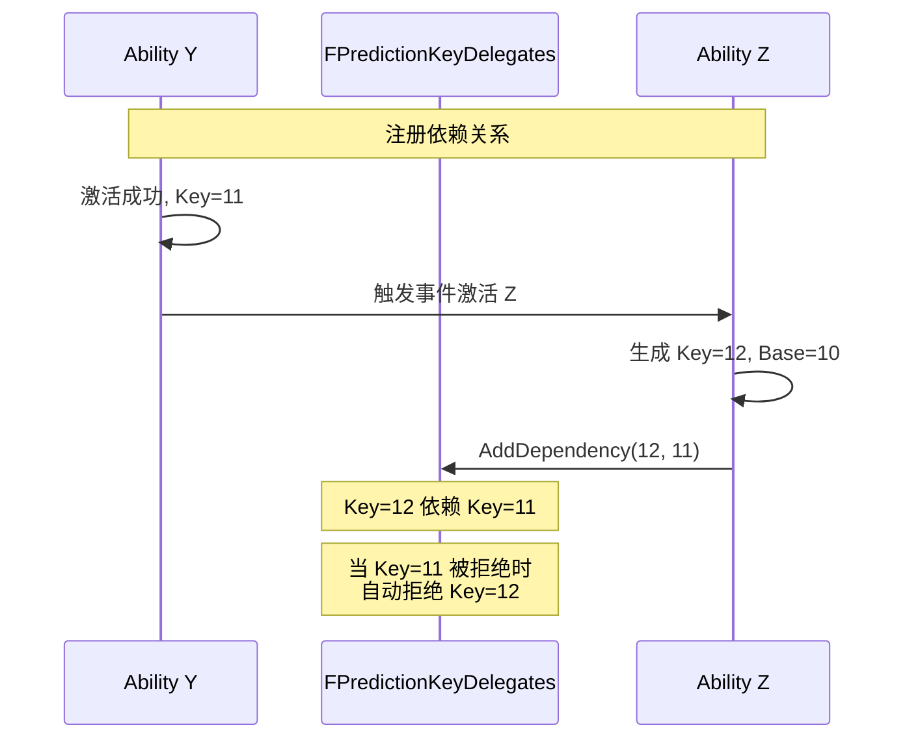
```mermaid
sequenceDiagram
    participant Y as Ability Y
    participant Delegate as FPredictionKeyDelegates
    participant Z as Ability Z

    Note over Y,Z: 注册依赖关系

    Y->>Y: 激活成功, Key=11
    Y->>Z: 触发事件激活 Z

    Z->>Z: 生成 Key=12, Base=10

    Z->>Delegate: AddDependency(12, 11)
    Note over Delegate: Key=12 依赖 Key=11

    Note over Delegate: 当 Key=11 被拒绝时<br/>自动拒绝 Key=12
```

### 8.3.3 源码解析

```cpp
// GameplayPrediction.cpp (简化版)

void FPredictionKeyDelegates::AddDependency(
    FPredictionKey::KeyType ThisKey,
    FPredictionKey::KeyType DependsOn)
{
    FPredictionKeyDelegates& Delegates = Get();

    // 获取父键的委托
    FDelegates& ParentDelegates = Delegates.DelegateMap.FindOrAdd(DependsOn);

    // 添加依赖委托：当父键被拒绝时，也拒绝子键
    ParentDelegates.RejectedDelegates.Add([ThisKey]()
    {
        BroadcastRejectedDelegate(ThisKey);
    });

    // 添加依赖委托：当父键追上时，也追上子键
    ParentDelegates.CaughtUpDelegates.Add([ThisKey]()
    {
        BroadcastCaughtUpDelegate(ThisKey);
    });
}
```

### 8.3.4 依赖链触发


```mermaid
flowchart TB
    subgraph 正常流程["正常流程"]
        N1["X 成功"]
        N2["Y 成功"]
        N3["Z 成功"]
        N4["所有键依次追上"]

        N1 --> N2 --> N3 --> N4
    end

    subgraph Y失败["Y 失败场景"]
        F1["X 成功"]
        F2["Y 被拒绝"]
        F3["触发 Y 的 Rejected 委托"]
        F4["委托中包含 Z 的拒绝"]
        F5["Z 也被拒绝"]

        F1 --> F2 --> F3 --> F4 --> F5
    end

    subgraph X失败["X 失败场景"]
        X1["X 被拒绝"]
        X2["触发 X 的 Rejected 委托"]
        X3["Y 和 Z 都依赖 X"]
        X4["Y 和 Z 都被拒绝"]

        X1 --> X2 --> X3 --> X4
    end
```

---

## 8.4 链式回滚处理

### 8.4.1 完整回滚流程

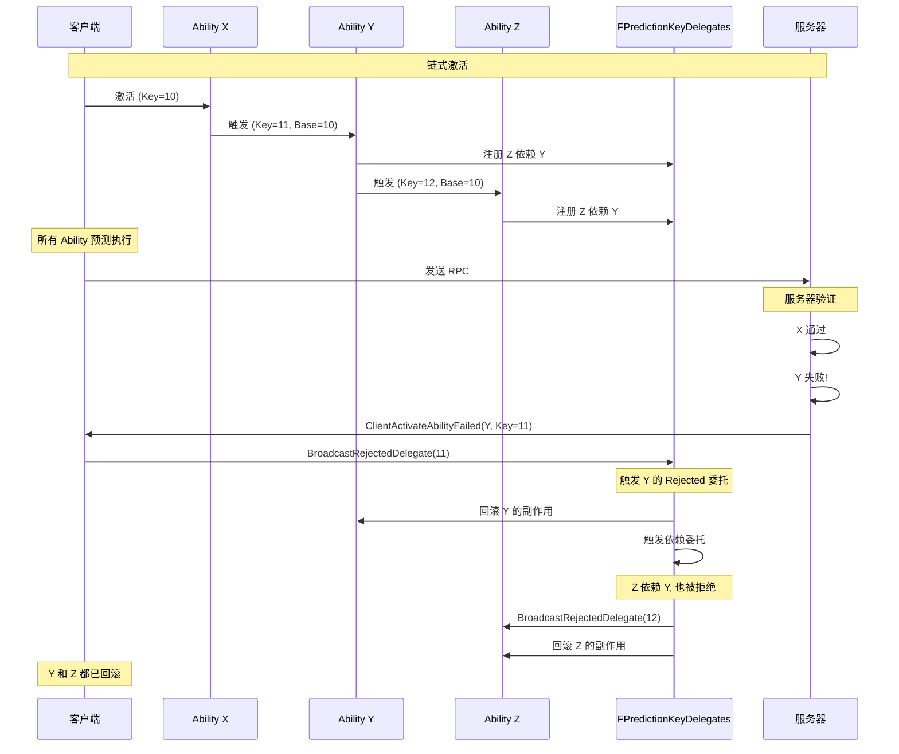
```mermaid
sequenceDiagram
    participant Client as 客户端
    participant X as Ability X
    participant Y as Ability Y
    participant Z as Ability Z
    participant Delegate as FPredictionKeyDelegates
    participant Server as 服务器

    Note over Client,Server: 链式激活

    Client->>X: 激活 (Key=10)
    X->>Y: 触发 (Key=11, Base=10)
    Y->>Delegate: 注册 Z 依赖 Y
    Y->>Z: 触发 (Key=12, Base=10)
    Z->>Delegate: 注册 Z 依赖 Y

    Note over Client: 所有 Ability 预测执行

    Client->>Server: 发送 RPC

    Note over Server: 服务器验证

    Server->>Server: X 通过
    Server->>Server: Y 失败!

    Server->>Client: ClientActivateAbilityFailed(Y, Key=11)

    Client->>Delegate: BroadcastRejectedDelegate(11)

    Note over Delegate: 触发 Y 的 Rejected 委托

    Delegate->>Y: 回滚 Y 的副作用
    Delegate->>Delegate: 触发依赖委托

    Note over Delegate: Z 依赖 Y, 也被拒绝

    Delegate->>Z: BroadcastRejectedDelegate(12)
    Delegate->>Z: 回滚 Z 的副作用

    Note over Client: Y 和 Z 都已回滚
```

### 8.4.2 副作用回滚顺序

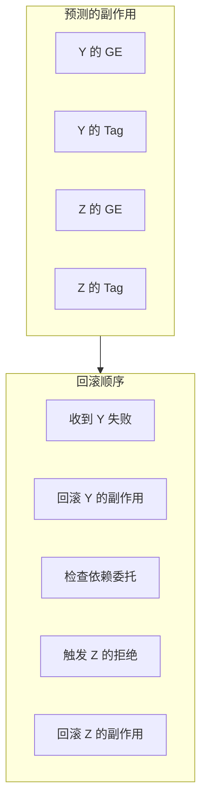
```mermaid
flowchart TB
    subgraph 预测副作用["预测的副作用"]
        S1["Y 的 GE"]
        S2["Y 的 Tag"]
        S3["Z 的 GE"]
        S4["Z 的 Tag"]
    end

    subgraph 回滚顺序["回滚顺序"]
        R1["收到 Y 失败"]
        R2["回滚 Y 的副作用"]
        R3["检查依赖委托"]
        R4["触发 Z 的拒绝"]
        R5["回滚 Z 的副作用"]
    end

    预测副作用 --> 回滚顺序
```

### 8.4.3 源码流程

```cpp
// GameplayPrediction.cpp (简化版)

void FPredictionKeyDelegates::BroadcastRejectedDelegate(FPredictionKey::KeyType Key)
{
    FPredictionKeyDelegates& Delegates = Get();

    FDelegates* KeyDelegates = Delegates.DelegateMap.Find(Key);
    if (KeyDelegates)
    {
        // 1. 执行所有 Rejected 委托
        // 这些委托包括:
        // - 此键关联的副作用回滚
        // - 依赖此键的子键的拒绝
        for (const FPredictionKeyEvent& Event : KeyDelegates->RejectedDelegates)
        {
            Event.ExecuteIfBound();
        }

        // 2. 执行所有 CaughtUp 委托
        // 清理预测状态
        for (const FPredictionKeyEvent& Event : KeyDelegates->CaughtUpDelegates)
        {
            Event.ExecuteIfBound();
        }

        // 3. 清理委托映射
        Delegates.DelegateMap.Remove(Key);
    }
}
```

---

## 8.5 设计可靠的链式 Ability

### 8.5.1 使用 GameplayTag 确保依赖

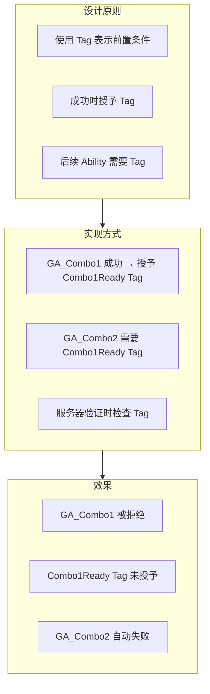
```mermaid
flowchart TB
    subgraph 设计原则["设计原则"]
        P1["使用 Tag 表示前置条件"]
        P2["成功时授予 Tag"]
        P3["后续 Ability 需要 Tag"]
    end

    subgraph 实现["实现方式"]
        I1["GA_Combo1 成功 → 授予 Combo1Ready Tag"]
        I2["GA_Combo2 需要 Combo1Ready Tag"]
        I3["服务器验证时检查 Tag"]
    end

    subgraph 效果["效果"]
        E1["GA_Combo1 被拒绝"]
        E2["Combo1Ready Tag 未授予"]
        E3["GA_Combo2 自动失败"]
    end

    设计原则 --> 实现 --> 效果
```

### 8.5.2 示例实现

```cpp
// GA_ComboAttack1.h

UCLASS()
class UGA_ComboAttack1 : public UGameplayAbility
{
    GENERATED_BODY()

public:
    // 成功时授予的 Tag
    UPROPERTY(EditDefaultsOnly, Category = "Combo")
    FGameplayTag ComboSuccessTag;

    virtual void ActivateAbility(...) override
    {
        // ... 执行攻击逻辑 ...

        // 成功时授予 Tag
        FGameplayEffectSpecHandle SpecHandle = MakeOutgoingGameplayEffectSpec(ComboEffectClass);
        ApplyGameplayEffectSpecToOwner(Handle, ActorInfo, ActivationInfo, SpecHandle);
    }
};

// GA_ComboAttack2.h

UCLASS()
class UGA_ComboAttack2 : public UGameplayAbility
{
    GENERATED_BODY()

public:
    // 需要的前置 Tag
    UPROPERTY(EditDefaultsOnly, Category = "Combo")
    FGameplayTagContainer RequiredComboTags;

    virtual bool CanActivateAbility(...) const override
    {
        if (!Super::CanActivateAbility(...))
        {
            return false;
        }

        // 检查是否有前置 Tag
        if (!AbilitySystemComponent->HasAllMatchingGameplayTags(RequiredComboTags))
        {
            return false;
        }

        return true;
    }
};
```

### 8.5.3 流程图

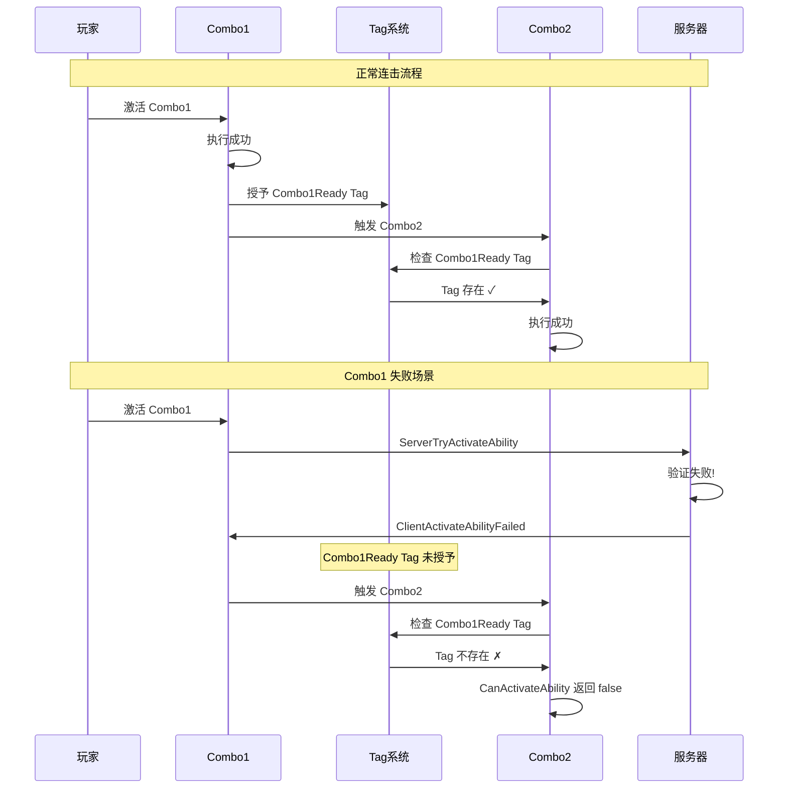
```mermaid
sequenceDiagram
    participant Player as 玩家
    participant C1 as Combo1
    participant Tag as Tag系统
    participant C2 as Combo2
    participant Server as 服务器

    Note over Player,Server: 正常连击流程

    Player->>C1: 激活 Combo1
    C1->>C1: 执行成功
    C1->>Tag: 授予 Combo1Ready Tag

    C1->>C2: 触发 Combo2
    C2->>Tag: 检查 Combo1Ready Tag
    Tag->>C2: Tag 存在 ✓
    C2->>C2: 执行成功

    Note over Player,Server: Combo1 失败场景

    Player->>C1: 激活 Combo1
    C1->>Server: ServerTryActivateAbility
    Server->>Server: 验证失败!
    Server->>C1: ClientActivateAbilityFailed

    Note over Tag: Combo1Ready Tag 未授予

    C1->>C2: 触发 Combo2
    C2->>Tag: 检查 Combo1Ready Tag
    Tag->>C2: Tag 不存在 ✗
    C2->>C2: CanActivateAbility 返回 false
```

### 8.5.4 服务器端处理

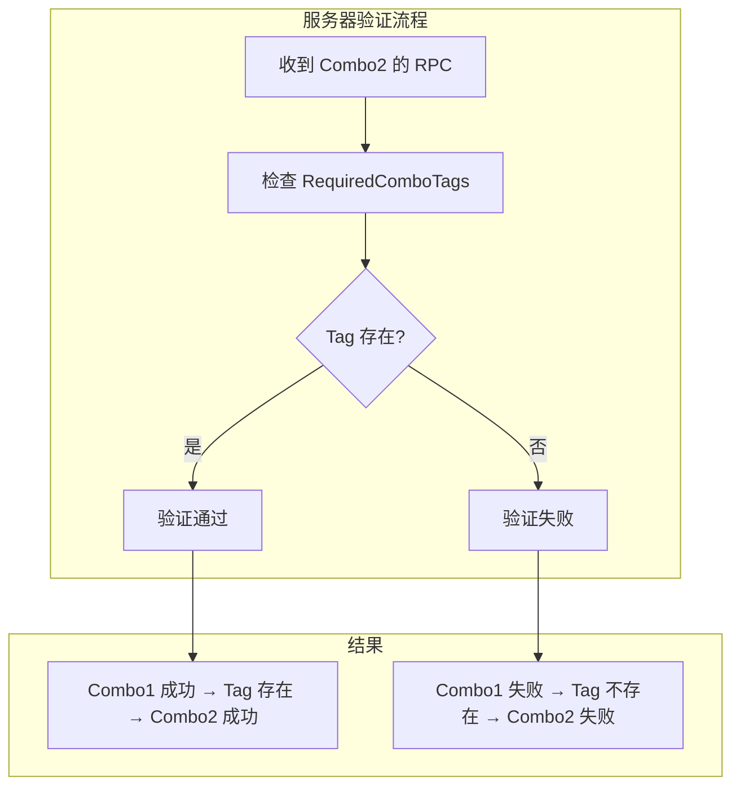
```mermaid
flowchart TB
    subgraph 服务器验证["服务器验证流程"]
        V1["收到 Combo2 的 RPC"]
        V2["检查 RequiredComboTags"]
        V3{"Tag 存在?"}
        V4["验证通过"]
        V5["验证失败"]
    end

    subgraph 结果["结果"]
        R1["Combo1 成功 → Tag 存在 → Combo2 成功"]
        R2["Combo1 失败 → Tag 不存在 → Combo2 失败"]
    end

    V1 --> V2 --> V3
    V3 -->|是| V4 --> R1
    V3 -->|否| V5 --> R2
```

---

## 8.6 完整示例：连击系统

### 8.6.1 系统架构

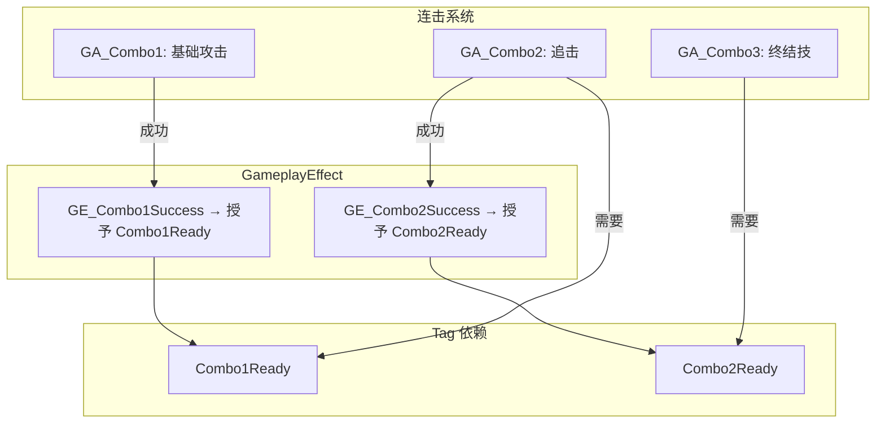
```mermaid
flowchart TB
    subgraph 连击系统["连击系统"]
        C1["GA_Combo1: 基础攻击"]
        C2["GA_Combo2: 追击"]
        C3["GA_Combo3: 终结技"]
    end

    subgraph Tag依赖["Tag 依赖"]
        T1["Combo1Ready"]
        T2["Combo2Ready"]
    end

    subgraph GE["GameplayEffect"]
        GE1["GE_Combo1Success → 授予 Combo1Ready"]
        GE2["GE_Combo2Success → 授予 Combo2Ready"]
    end

    C1 -->|"成功"| GE1 --> T1
    C2 -->|"需要"| T1
    C2 -->|"成功"| GE2 --> T2
    C3 -->|"需要"| T2
```

### 8.6.2 预测流程

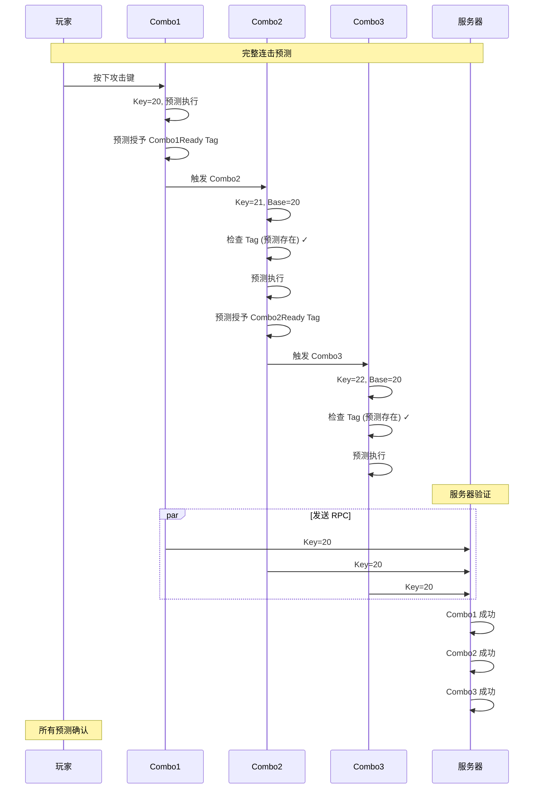
```mermaid
sequenceDiagram
    participant Player as 玩家
    participant C1 as Combo1
    participant C2 as Combo2
    participant C3 as Combo3
    participant Server as 服务器

    Note over Player,Server: 完整连击预测

    Player->>C1: 按下攻击键
    C1->>C1: Key=20, 预测执行
    C1->>C1: 预测授予 Combo1Ready Tag

    C1->>C2: 触发 Combo2
    C2->>C2: Key=21, Base=20
    C2->>C2: 检查 Tag (预测存在) ✓
    C2->>C2: 预测执行
    C2->>C2: 预测授予 Combo2Ready Tag

    C2->>C3: 触发 Combo3
    C3->>C3: Key=22, Base=20
    C3->>C3: 检查 Tag (预测存在) ✓
    C3->>C3: 预测执行

    Note over Server: 服务器验证

    par 发送 RPC
        C1->>Server: Key=20
        C2->>Server: Key=20
        C3->>Server: Key=20
    end

    Server->>Server: Combo1 成功
    Server->>Server: Combo2 成功
    Server->>Server: Combo3 成功

    Note over Player: 所有预测确认
```

### 8.6.3 失败回滚

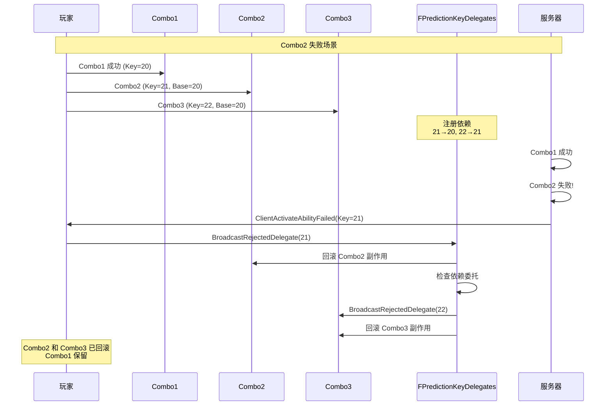
```mermaid
sequenceDiagram
    participant Player as 玩家
    participant C1 as Combo1
    participant C2 as Combo2
    participant C3 as Combo3
    participant Delegate as FPredictionKeyDelegates
    participant Server as 服务器

    Note over Player,Server: Combo2 失败场景

    Player->>C1: Combo1 成功 (Key=20)
    Player->>C2: Combo2 (Key=21, Base=20)
    Player->>C3: Combo3 (Key=22, Base=20)

    Note over Delegate: 注册依赖<br/>21→20, 22→21

    Server->>Server: Combo1 成功
    Server->>Server: Combo2 失败!

    Server->>Player: ClientActivateAbilityFailed(Key=21)

    Player->>Delegate: BroadcastRejectedDelegate(21)

    Delegate->>C2: 回滚 Combo2 副作用
    Delegate->>Delegate: 检查依赖委托
    Delegate->>C3: BroadcastRejectedDelegate(22)
    Delegate->>C3: 回滚 Combo3 副作用

    Note over Player: Combo2 和 Combo3 已回滚<br/>Combo1 保留
```

---

## 8.7 调试依赖链

### 8.7.1 断点位置

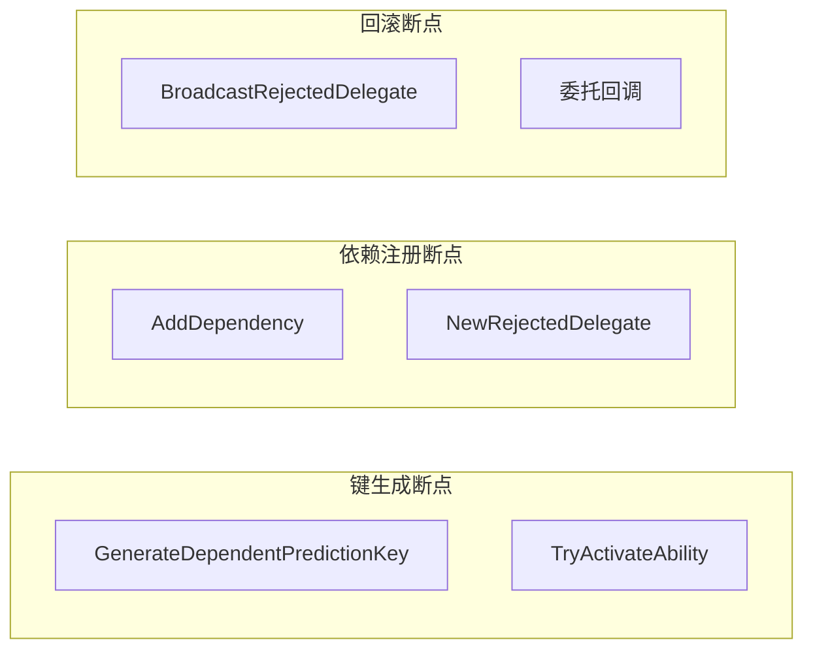
```mermaid
flowchart LR
    subgraph 键生成["键生成断点"]
        A1["GenerateDependentPredictionKey"]
        A2["TryActivateAbility"]
    end

    subgraph 依赖注册["依赖注册断点"]
        B1["AddDependency"]
        B2["NewRejectedDelegate"]
    end

    subgraph 回滚["回滚断点"]
        C1["BroadcastRejectedDelegate"]
        C2["委托回调"]
    end
```

### 8.7.2 添加日志

```cpp
// GameplayPrediction.cpp

void FPredictionKeyDelegates::AddDependency(
    FPredictionKey::KeyType ThisKey,
    FPredictionKey::KeyType DependsOn)
{
    UE_LOG(LogGameplayAbilities, Log,
           TEXT("AddDependency: Key=%d depends on Key=%d"),
           ThisKey, DependsOn);

    // ...
}

void FPredictionKeyDelegates::BroadcastRejectedDelegate(FPredictionKey::KeyType Key)
{
    UE_LOG(LogGameplayAbilities, Warning,
           TEXT("BroadcastRejectedDelegate: Key=%d"),
           Key);

    // ...
}
```

---

## 8.8 总结

### 8.8.1 核心概念图

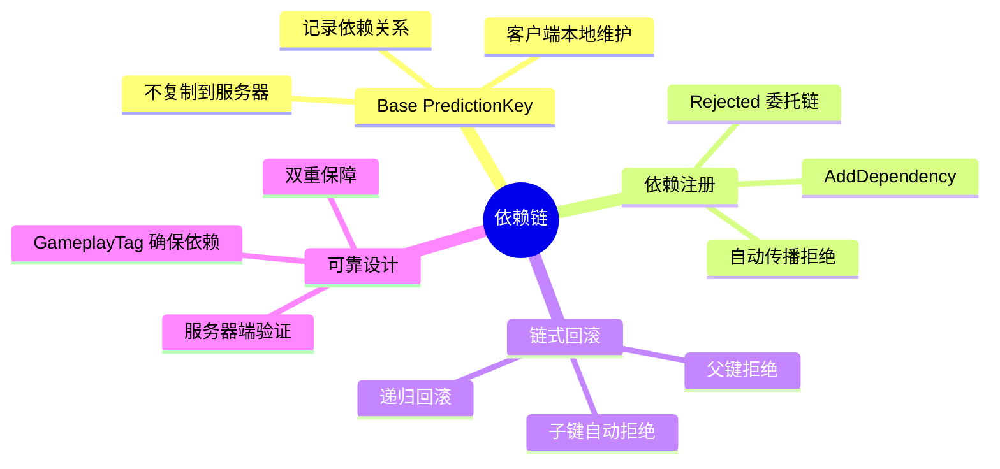
```mermaid
mindmap
  root((依赖链))
    Base PredictionKey
      记录依赖关系
      客户端本地维护
      不复制到服务器
    依赖注册
      AddDependency
      Rejected 委托链
      自动传播拒绝
    链式回滚
      父键拒绝
      子键自动拒绝
      递归回滚
    可靠设计
      GameplayTag 确保依赖
      服务器端验证
      双重保障
```

### 8.8.2 关键要点

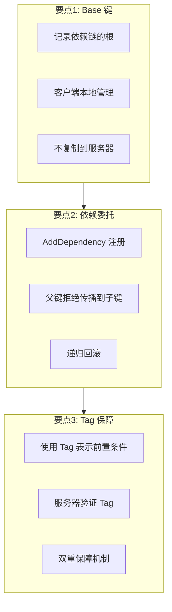
```mermaid
flowchart TB
    subgraph 要点1["要点1: Base 键"]
        A1["记录依赖链的根"]
        A2["客户端本地管理"]
        A3["不复制到服务器"]
    end

    subgraph 要点2["要点2: 依赖委托"]
        B1["AddDependency 注册"]
        B2["父键拒绝传播到子键"]
        B3["递归回滚"]
    end

    subgraph 要点3["要点3: Tag 保障"]
        C1["使用 Tag 表示前置条件"]
        C2["服务器验证 Tag"]
        C3["双重保障机制"]
    end

    要点1 --> 要点2 --> 要点3
```

---

## 课后练习

### 练习1：实现连击系统

1. 创建 Combo1、Combo2、Combo3 Ability
2. 使用 GameplayTag 确保依赖关系
3. 测试失败回滚场景

### 练习2：观察依赖链

1. 在 AddDependency 设置断点
2. 执行链式激活
3. 观察依赖关系的注册

### 练习3：思考题

1. 为什么 Base 字段不复制到服务器？
2. 如果不使用 GameplayTag，如何确保链式 Ability 的可靠性？
3. 多层依赖链（A→B→C→D）的回滚顺序是什么？

---

## 下节课预告

```mermaid
flowchart LR
    L8["第8课: 依赖链与链式激活"] --> L9["第9课: 高级话题与限制"]

    subgraph 第9课内容["第9课内容"]
        A["弱预测概念"]
        B["Meta 属性限制"]
        C["百分比效果问题"]
        D["未来改进方向"]
    end

    L9 --> 第9课内容
```

---

## 参考资料

- **源码**：`Engine/Plugins/Runtime/GameplayAbilities/Source/GameplayAbilities/Public/GameplayPrediction.h` (第170-189行)
- **源码**：`Engine/Plugins/Runtime/GameplayAbilities/Source/GameplayAbilities/Private/GameplayPrediction.cpp`
- **官方文档**：[Gameplay Tags](https://dev.epicgames.com/documentation/en-us/unreal-engine/using-gameplay-tags-in-unreal-engine)
