# 第9课：高级话题与限制

> 学习时间：45-60分钟
> 难度：高级
> 前置知识：第1-8课内容

---

## 学习目标

完成本课后，你将能够：
1. 理解当前预测系统的限制
2. 了解弱预测的概念和应用场景
3. 掌握 Meta 属性和百分比效果的预测问题
4. 了解未来可能的改进方向

---

## 9.1 当前预测系统限制总览

### 9.1.1 不可预测内容

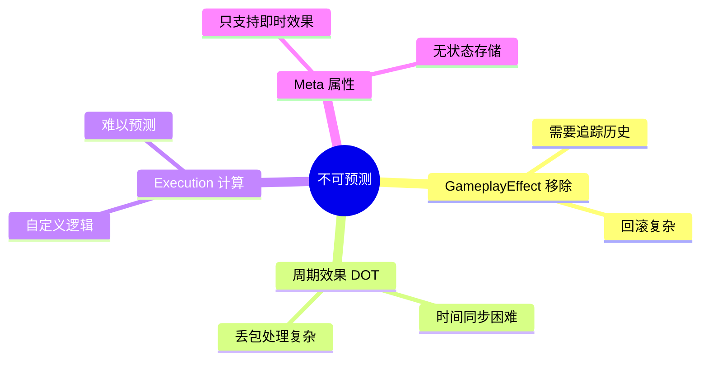

### 9.1.2 已知问题

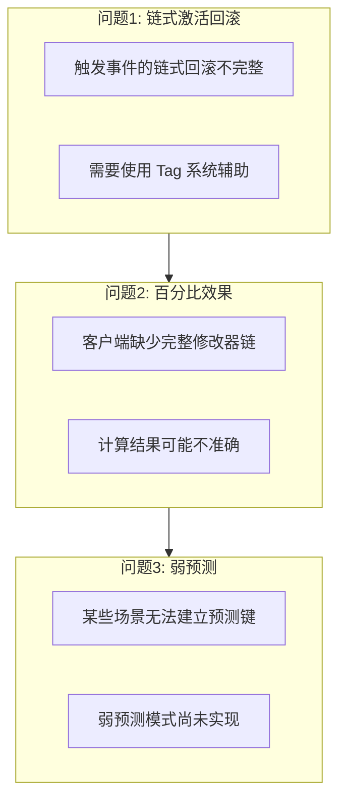

---

## 9.2 GameplayEffect 移除

### 9.2.1 为什么不可预测

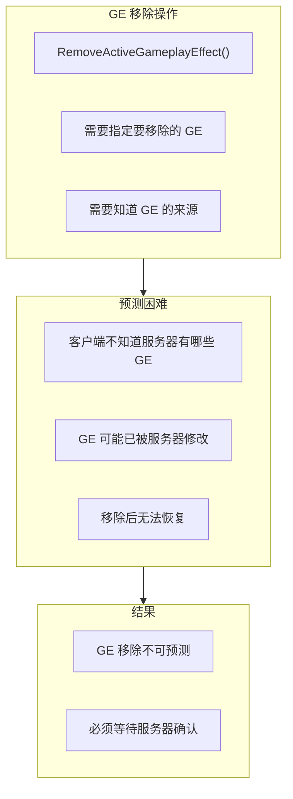

### 9.2.2 可能的解决方案

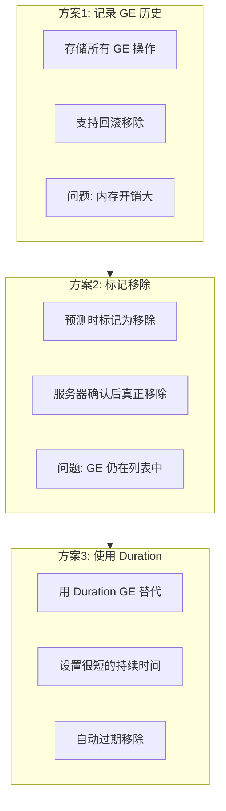

### 9.2.3 源码注释

```cpp
// GameplayPrediction.h 第47-49行

/**
 * Some things we don't predict (most of these we potentially could, but currently dont):
 * - GameplayEffect removal
 * - GameplayEffect periodic effects (dots ticking)
 */
```

---

## 9.3 周期效果（DOT）

### 9.3.1 周期效果的工作方式

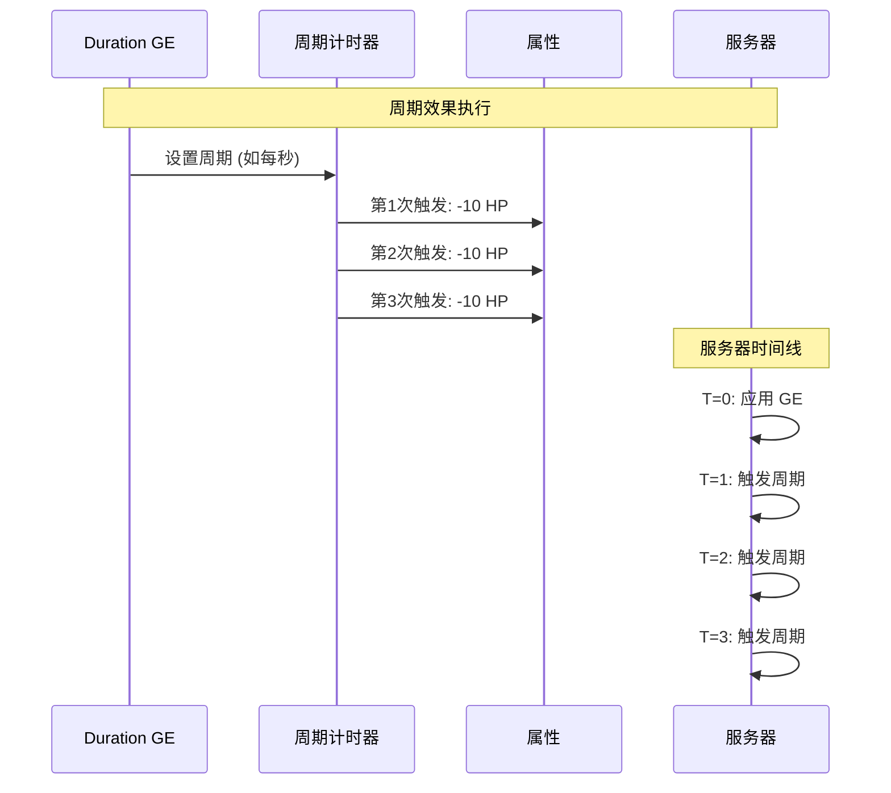

### 9.3.2 预测困难

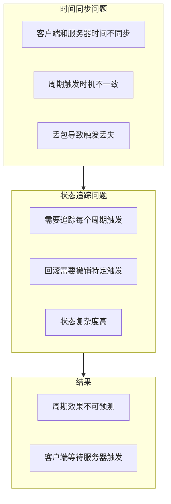

### 9.3.3 替代方案

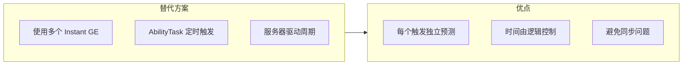

---

## 9.4 Meta 属性限制

### 9.4.1 Meta 属性特点

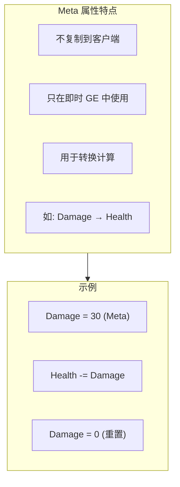

### 9.4.2 预测问题

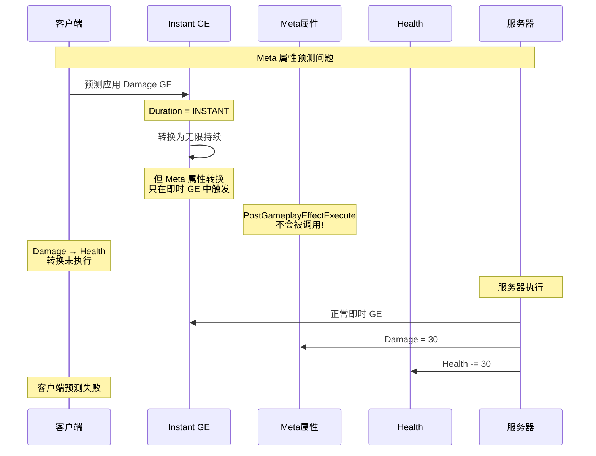

### 9.4.3 源码注释

```cpp
// GameplayPrediction.h 第229-234行

/**
 * We are unable to apply meta attributes predictively. Meta attributes only work on instant effects,
 * in the back end of GameplayEffect (Pre/Post Modify Attribute on the UAttributeSet).
 * These events are not called when applying duration-based gameplay effects.
 *
 * In order to support this, we would probably add some limited support for duration based meta attributes,
 * and move the transform of the instant gameplay effect from the front end
 * (UAbilitySystemComponent::ApplyGameplayEffectSpecToSelf)
 * to the backend (UAttributeSet::PostModifyAttribute).
 */
```

### 9.4.4 解决方案

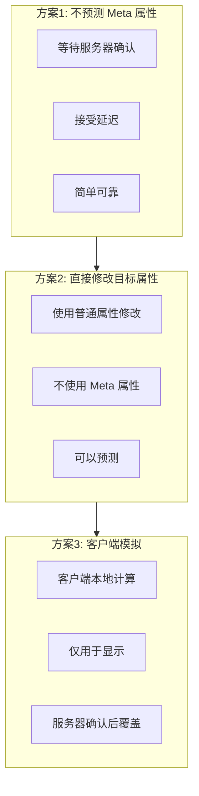

---

## 9.5 百分比效果问题

### 9.5.1 问题描述

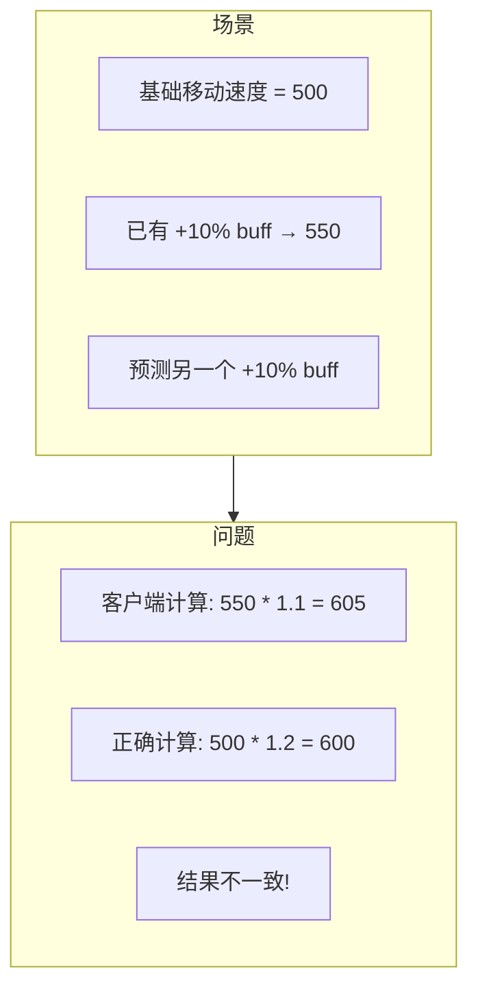

### 9.5.2 根本原因

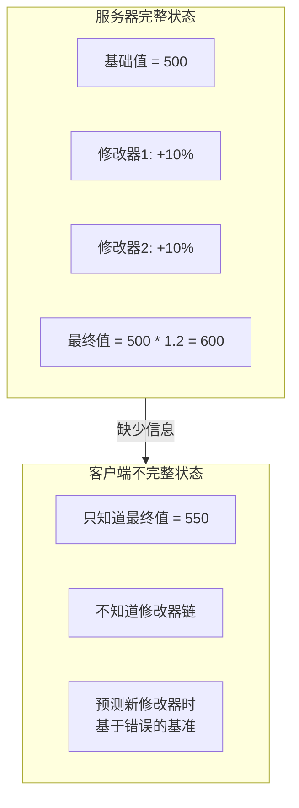

### 9.5.3 源码注释

```cpp
// GameplayPrediction.h 第237-247行

/**
 * There are also limitations when predicting % based gameplay effects.
 * Since the server replicates down the 'final value' of an attribute,
 * but not the entire aggregator chain of what is modifying it,
 * we may run into cases where the client cannot accurately predict new gameplay effects.
 *
 * For example:
 * - Client has a perm +10% movement speed buff with base movement speed of 500 -> 550
 * - Client has an ability which grants an additional 10% movement speed buff.
 *   It is expected to *sum* the % based multipliers for a final 20% bonus to 500 -> 600.
 * - However on the client, we just apply a 10% buff to 550 -> 605.
 *
 * This will need to be fixed by replicating down the aggregator chain for attributes.
 */
```

### 9.5.4 可能的解决方案

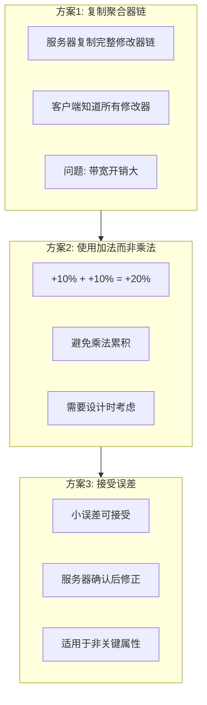

---

## 9.6 弱预测概念

### 9.6.1 弱预测场景

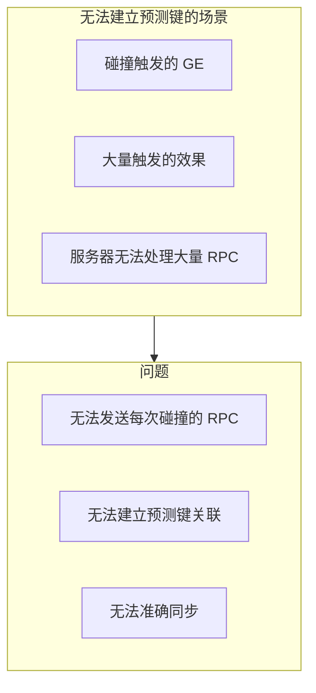

### 9.6.2 弱预测定义

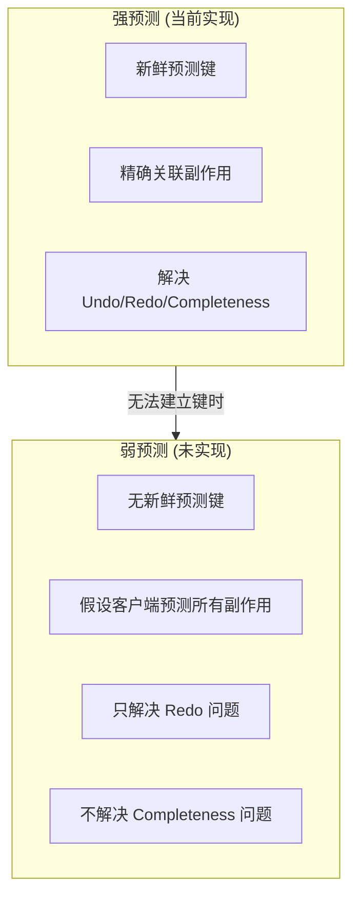

### 9.6.3 源码注释

```cpp
// GameplayPrediction.h 第250-263行

/**
 * We will probably still have cases that do not fit well into this system.
 * Some situations will exist where a prediction key exchange is not feasible.
 * For example, an ability where any one that player collides with/touches
 * receives a GameplayEffect that slows them and their material blue.
 * Since we can't send Server RPCs every time this happens
 * (and the server couldn't necessarily handle the message at its point in the simulation),
 * there is no way to correlate the gameplay effect side effects between client and server.
 *
 * One approach here may be to think about a weaker form of prediction.
 * One where there is not a fresh prediction key used and instead the server assumes
 * the client will predict all side effects from an entire ability.
 * This would at least solve the "redo" problem but would not solve the "completeness" problem.
 */
```

### 9.6.4 弱预测实现思路

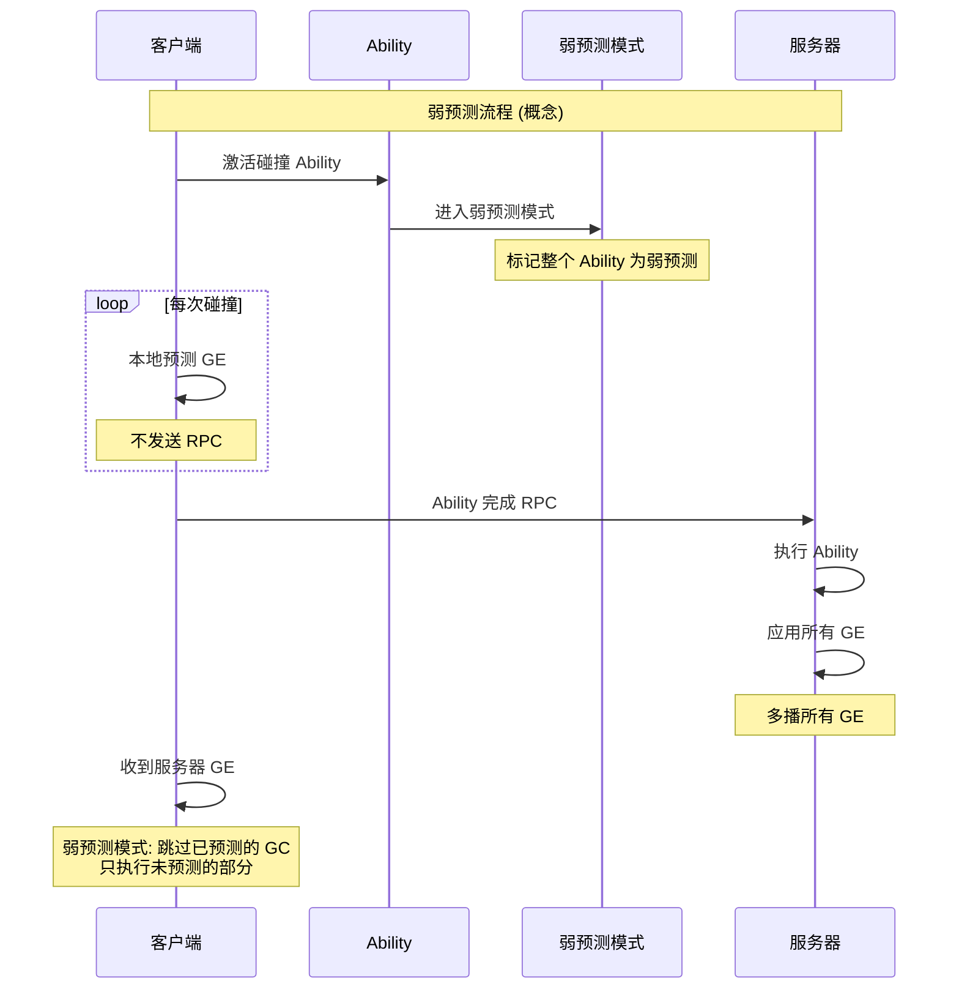

---

## 9.7 其他限制与注意事项

### 9.7.1 网络条件影响

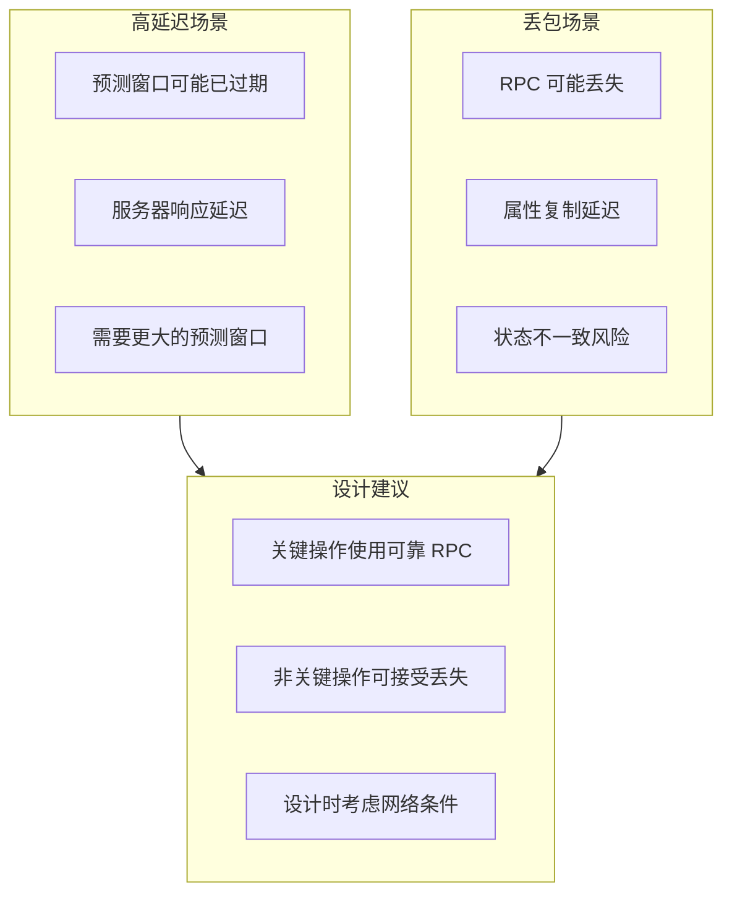

### 9.7.2 性能考虑

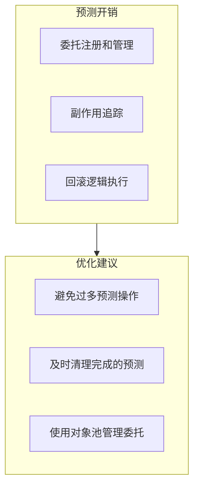

### 9.7.3 调试难度

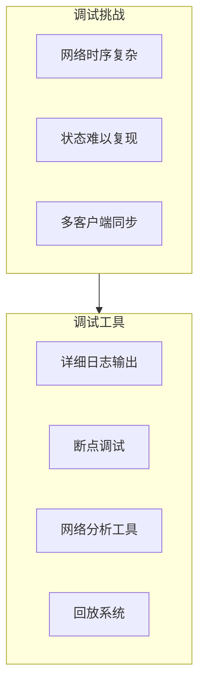

---

## 9.8 未来改进方向

### 9.8.1 源码中的 TODO

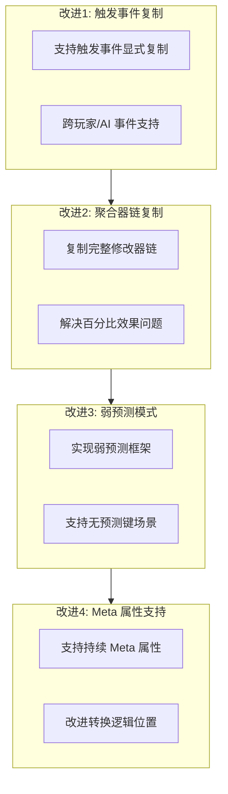

### 9.8.2 社区贡献方向

```mermaid
mindmap
  root((未来改进))
    性能优化
      减少委托开销
      优化内存使用
    功能扩展
      弱预测模式
      GE 移除预测
    工具支持
      可视化调试
      状态检查工具
    文档完善
      最佳实践
      常见问题解决
```

---

## 9.9 总结

### 9.9.1 核心概念图

```mermaid
mindmap
  root((限制与高级话题))
    不可预测内容
      GE 移除
      周期效果
      Execution
      Meta 属性
    已知问题
      链式回滚不完整
      百分比效果误差
      弱预测未实现
    解决方案
      Tag 系统辅助
      设计规避
      接受限制
    未来方向
      聚合器链复制
      弱预测模式
      触发事件复制
```

### 9.9.2 设计建议

```mermaid
flowchart TB
    subgraph 建议1["建议1: 了解限制"]
        A1["知道什么不能预测"]
        A2["设计时规避限制"]
    end

    subgraph 建议2["建议2: 使用替代方案"]
        B1["用 Tag 确保依赖"]
        B2["用 AbilityTask 处理异步"]
        B3["用 Duration GE 替代移除"]
    end

    subgraph 建议3["建议3: 接受权衡"]
        C1["某些延迟可接受"]
        C2["某些误差可接受"]
        C3["优先保证正确性"]
    end

    建议1 --> 建议2 --> 建议3
```

---

## 课后练习

### 练习1：识别限制场景

1. 列出你项目中需要预测的功能
2. 检查是否有不可预测的内容
3. 设计替代方案

### 练习2：处理百分比效果

1. 创建一个百分比 buff 系统
2. 观察客户端和服务器计算差异
3. 思考如何减少误差

### 练习3：思考题

1. 为什么 GE 移除比 GE 应用更难预测？
2. 弱预测模式适用于什么场景？
3. 如何在项目中规避这些限制？

---

## 下节课预告

```mermaid
flowchart LR
    L9["第9课: 高级话题与限制"] --> L10["第10课: 实战案例与调试技巧"]

    subgraph 第10课内容["第10课内容"]
        A["Lyra 项目分析"]
        B["调试技巧总结"]
        C["最佳实践"]
        D["课程总结"]
    end

    L10 --> 第10课内容
```

---

## 参考资料

- **源码**：`Engine/Plugins/Runtime/GameplayAbilities/Source/GameplayAbilities/Public/GameplayPrediction.h` (第218-263行)
- **官方文档**：[Gameplay Ability System](https://dev.epicgames.com/documentation/en-us/unreal-engine/gameplay-ability-system-in-unreal-engine)
- **社区讨论**：[Unreal Engine Forums](https://forums.unrealengine.com/)
