# 第10课：实战案例与调试技巧

> 学习时间：45-60分钟
> 难度：高级
> 前置知识：第1-9课内容

---

## 学习目标

完成本课后，你将能够：
1. 分析 Lyra 项目中的 GAS 预测实现
2. 掌握完整的调试技巧和工具
3. 了解预测系统的最佳实践
4. 对整个课程进行总结回顾

---

## 10.1 Lyra 项目分析

### 10.1.1 Lyra GAS 架构

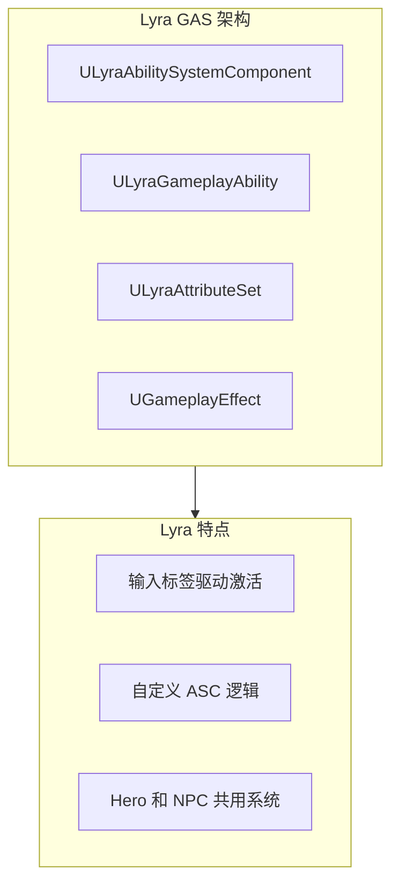

### 10.1.2 LyraAbilitySystemComponent

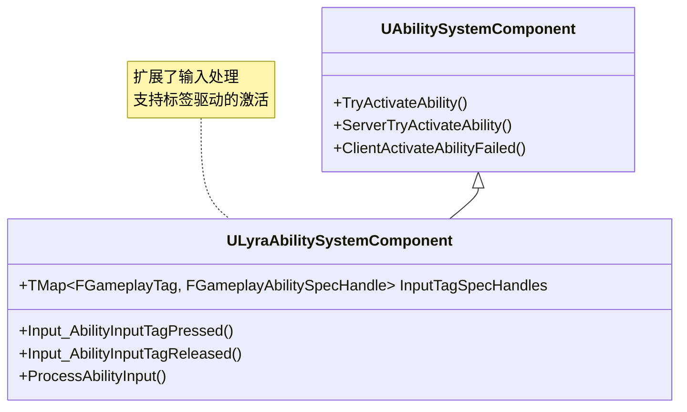

### 10.1.3 Lyra 输入处理流程

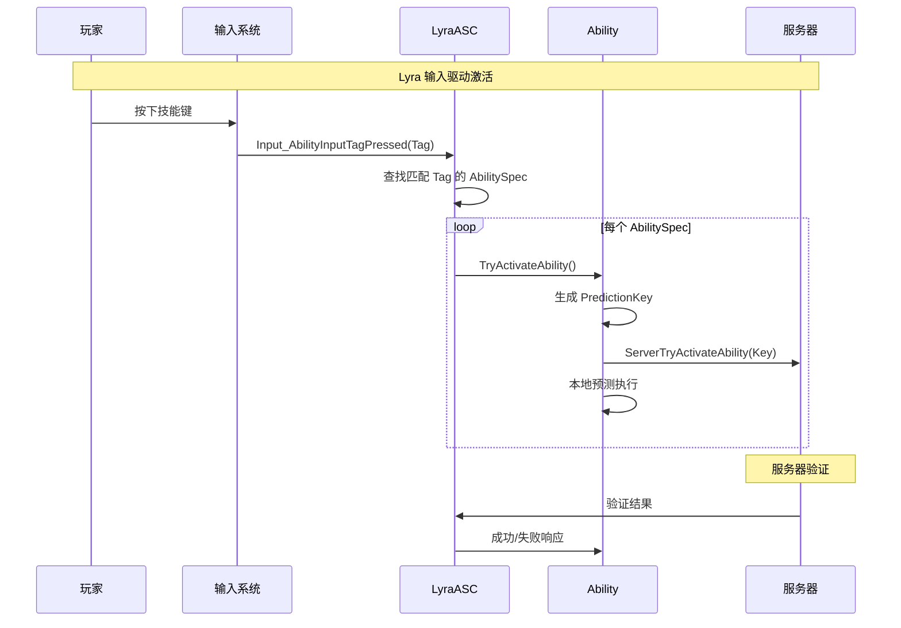

### 10.1.4 LyraGameplayAbility

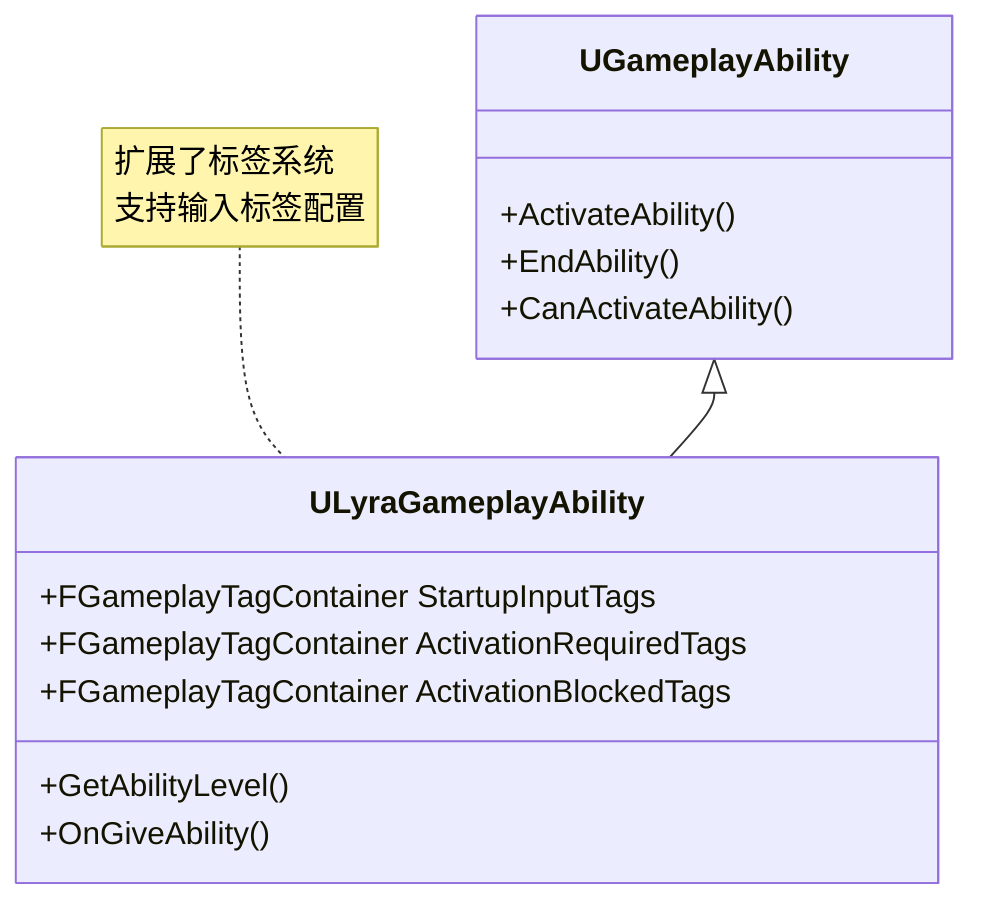

### 10.1.5 Lyra 示例 Ability 分析

```cpp
// LyraGame/AbilitySystem/Abilities/LyraGameplayAbility.h (简化版)

UCLASS()
class ULyraGameplayAbility : public UGameplayAbility
{
    GENERATED_BODY()

public:
    // 输入标签 - 决定哪个输入激活此 Ability
    UPROPERTY(EditDefaultsOnly, Category = "Lyra|Input")
    FGameplayTagContainer StartupInputTags;

    // 激活所需的标签
    UPROPERTY(EditDefaultsOnly, Category = "Lyra|Activation")
    FGameplayTagContainer ActivationRequiredTags;

    // 阻止激活的标签
    UPROPERTY(EditDefaultsOnly, Category = "Lyra|Activation")
    FGameplayTagContainer ActivationBlockedTags;

    // Cost GE
    UPROPERTY(EditDefaultsOnly, Category = "Lyra|Cost")
    TSubclassOf<UGameplayEffect> CostGameplayEffectClass;

    // Cooldown GE
    UPROPERTY(EditDefaultsOnly, Category = "Lyra|Cooldown")
    TSubclassOf<UGameplayEffect> CooldownGameplayEffectClass;

protected:
    virtual bool CheckCost(...) const override;
    virtual void ApplyCost(...) override;
    virtual bool CheckCooldown(...) const override;
    virtual void ApplyCooldown(...) override;
};
```

---

## 10.2 调试技巧总结

### 10.2.1 关键断点位置

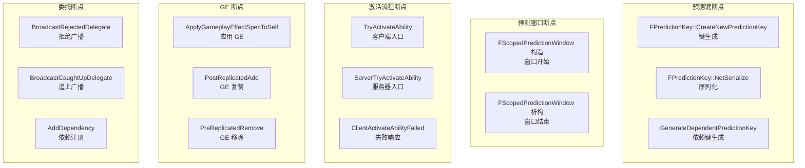

### 10.2.2 日志配置

```cpp
// 推荐的日志配置

// 在 GameplayPrediction.cpp 开头添加
DEFINE_LOG_CATEGORY_STATIC(LogGameplayPrediction, Log, All);

// 预测键生成日志
UE_LOG(LogGameplayPrediction, Log,
       TEXT("CreateNewPredictionKey: Key=%d, ASC=%s"),
       NewKey.Current, *ASC->GetName());

// 预测窗口日志
UE_LOG(LogGameplayPrediction, Log,
       TEXT("PredictionWindow: %s, Key=%s"),
       bIsStart ? TEXT("START") : TEXT("END"),
       *PredictionKey.ToString());

// 委托触发日志
UE_LOG(LogGameplayPrediction, Warning,
       TEXT("BroadcastRejectedDelegate: Key=%d, Delegates=%d"),
       Key, KeyDelegates->RejectedDelegates.Num());

// GE 应用日志
UE_LOG(LogGameplayPrediction, Log,
       TEXT("ApplyGE: %s, Key=%s, Duration=%f"),
       *GEClass->GetName(), *PredictionKey.ToString(), Duration);
```

### 10.2.3 控制台命令

| 命令 | 用途 |
|-----|------|
| `stat net` | 显示网络统计 |
| `net.PK.Draw 1` | 显示预测键调试信息 |
| `AbilitySystem.Debug 1` | 显示 GAS 调试信息 |
| `net.Replication.Debug 1` | 显示复制信息 |
| `log LogGameplayAbilities verbose` | 详细 GAS 日志 |

### 10.2.4 调试流程

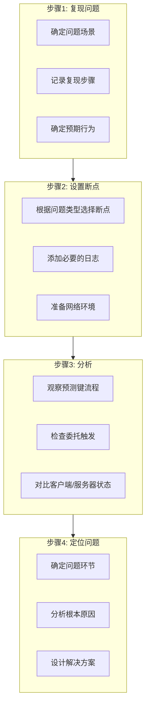

---

## 10.3 最佳实践

### 10.3.1 Ability 设计原则

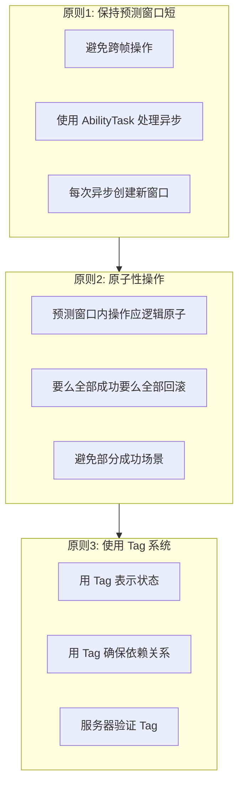

### 10.3.2 AttributeSet 设计

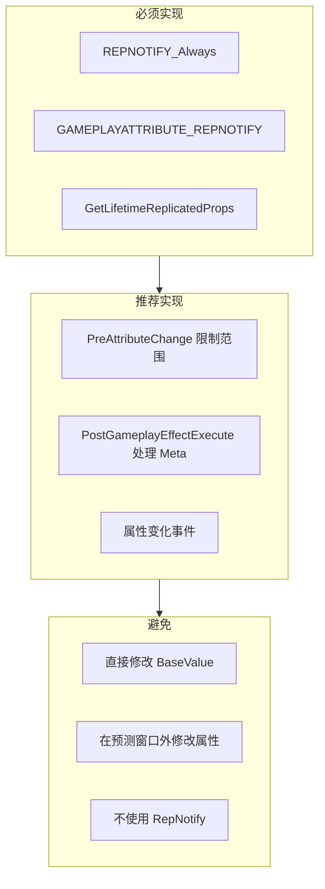

### 10.3.3 GameplayEffect 设计

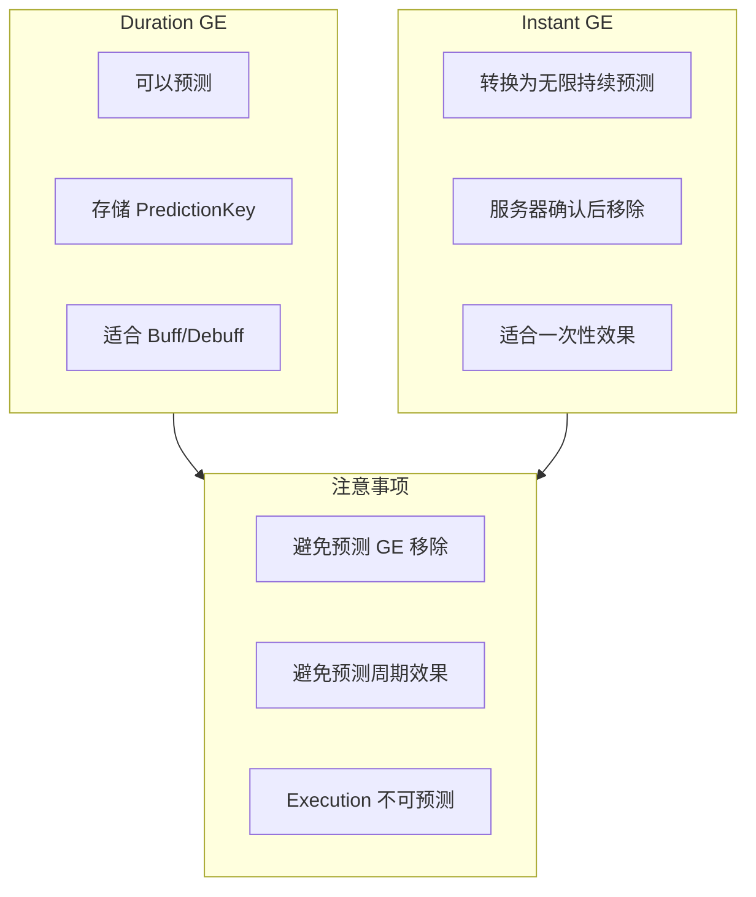

### 10.3.4 GameplayCue 设计

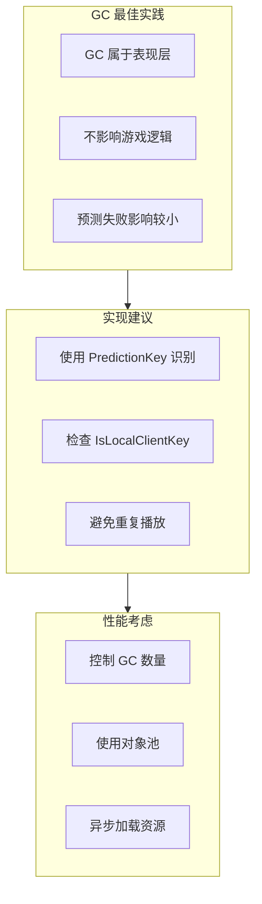

---

## 10.4 常见问题解决

### 10.4.1 预测不生效

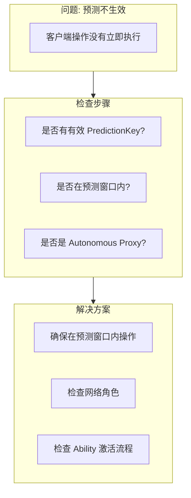

### 10.4.2 重复执行

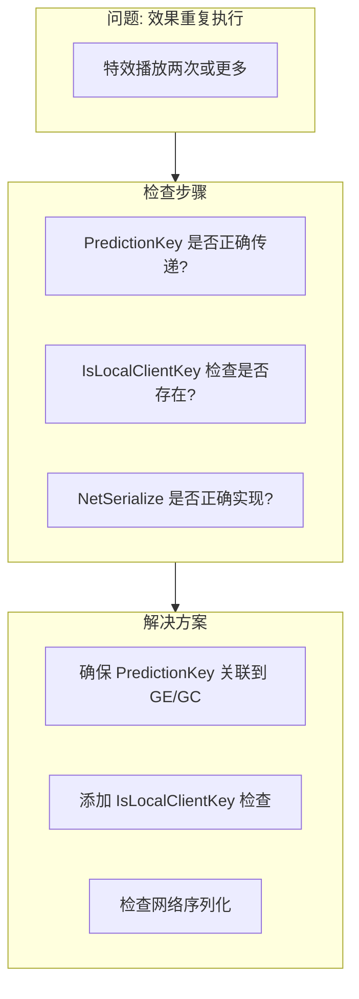

### 10.4.3 回滚不完整

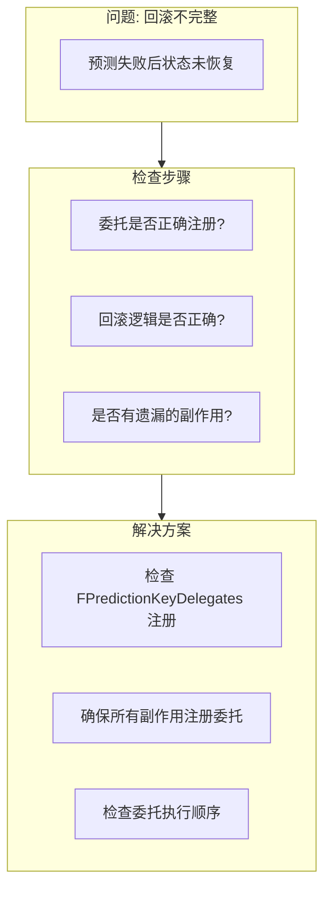

### 10.4.4 状态不同步

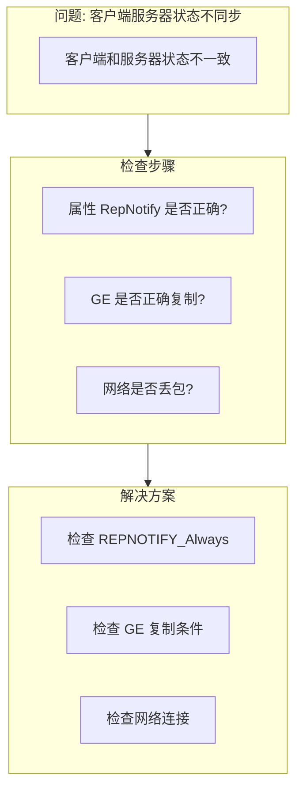

---

## 10.5 课程总结

### 10.5.1 知识体系回顾

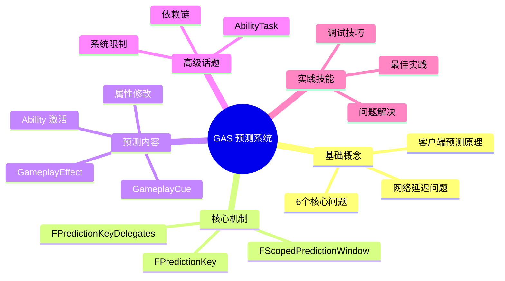

### 10.5.2 核心概念总结

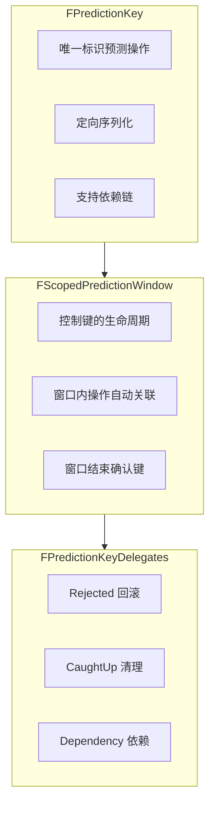

### 10.5.3 关键流程总结

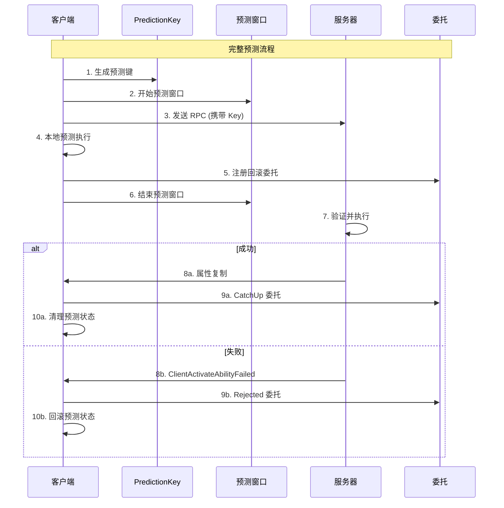

### 10.5.4 学习路径回顾

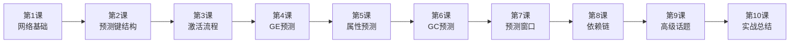

---

## 10.6 进一步学习资源

### 10.6.1 官方资源

| 资源 | 链接 |
|-----|------|
| 官方文档 | https://dev.epicgames.com/documentation/en-us/unreal-engine/gameplay-ability-system-in-unreal-engine |
| Lyra 示例项目 | Engine/Samples/Games/Lyra |
| 源码 | Engine/Plugins/Runtime/GameplayAbilities |

### 10.6.2 社区资源

| 资源 | 说明 |
|-----|------|
| Unreal Forums | 官方论坛 GAS 板块 |
| Reddit r/unrealengine | 社区讨论 |
| GitHub Issues | 源码问题追踪 |

### 10.6.3 推荐实践项目

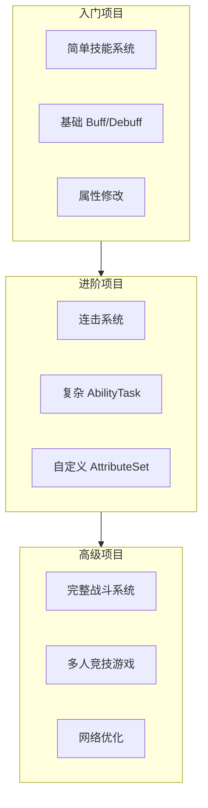

---

## 10.7 结语

### 10.7.1 学习建议

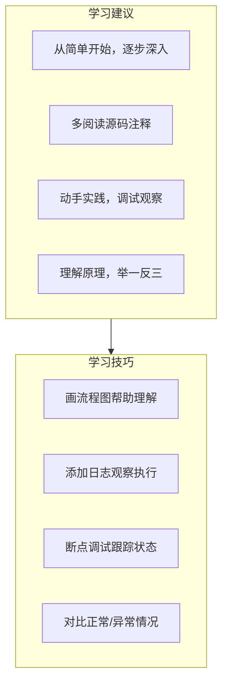

### 10.7.2 课程完成

恭喜你完成了 GAS 预测系统的完整学习！

```mermaid
flowchart LR
    Start["开始学习"] --> Complete["课程完成!"]

    subgraph 收获["你的收获"]
        G1["理解预测原理"]
        G2["掌握核心机制"]
        G3["学会调试技巧"]
        G4["了解最佳实践"]
    end

    Complete --> 收获
```

---

## 附录

### A. 源码文件索引

| 文件 | 主要内容 |
|-----|---------|
| `GameplayPrediction.h` | 预测系统核心定义和注释 |
| `GameplayPrediction.cpp` | 预测系统实现 |
| `AbilitySystemComponent.h` | ASC 定义 |
| `AbilitySystemComponent_Abilities.cpp` | Ability 激活实现 |
| `GameplayEffect.h` | GE 定义 |
| `GameplayEffect.cpp` | GE 实现 |
| `AttributeSet.h` | AttributeSet 定义 |
| `AttributeSet.cpp` | AttributeSet 实现 |

### B. 调试命令汇总

```
// 网络调试
stat net
net.PK.Draw 1
net.Replication.Debug 1

// GAS 调试
AbilitySystem.Debug 1

// 日志级别
log LogGameplayAbilities verbose
log LogGameplayPrediction verbose
```

### C. 常用断点位置

| 断点位置 | 用途 |
|---------|------|
| `FPredictionKey::CreateNewPredictionKey` | 观察键生成 |
| `FScopedPredictionWindow::构造/析构` | 观察窗口生命周期 |
| `TryActivateAbility` | 观察激活入口 |
| `ServerTryActivateAbility_Implementation` | 观察服务器处理 |
| `ClientActivateAbilityFailed_Implementation` | 观察失败响应 |
| `BroadcastRejectedDelegate` | 观察拒绝广播 |
| `BroadcastCaughtUpDelegate` | 观察追上广播 |
| `PostReplicatedAdd` | 观察 GE 复制 |
| `OnRep_Attribute` | 观察属性复制 |

---

## 课程完成！

你已经完成了 GAS 预测系统的 10 节课程学习。

### 教程文件列表

```
Tutorial/
├── GAS_Prediction_System_Guide.md           # 总体学习指南
├── GAS_Prediction_Course_Outline.md         # 课程大纲
├── Lesson01_GAS_Network_Basics_and_Prediction_Overview.md
├── Lesson02_FPredictionKey_Core_Structure.md
├── Lesson03_Ability_Activation_Prediction_Flow.md
├── Lesson04_GameplayEffect_Prediction.md
├── Lesson05_Attribute_Prediction_and_Rollback.md
├── Lesson06_GameplayCue_Prediction.md
├── Lesson07_Prediction_Window_and_AbilityTask.md
├── Lesson08_Dependency_Chain_and_Chained_Activation.md
├── Lesson09_Advanced_Topics_and_Limitations.md
└── Lesson10_Practical_Cases_and_Debugging.md
```

祝你在 UE5 开发中取得成功！
