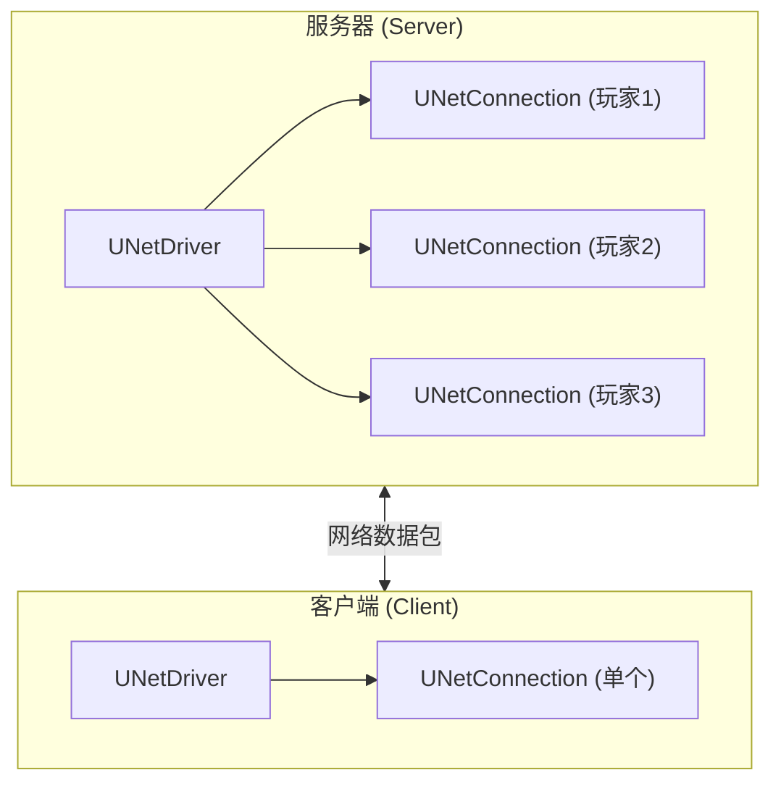
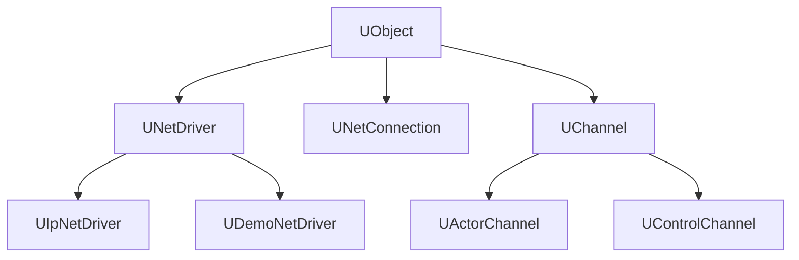
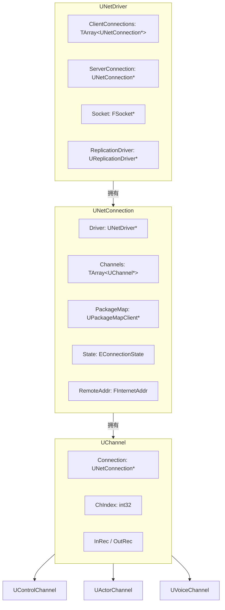
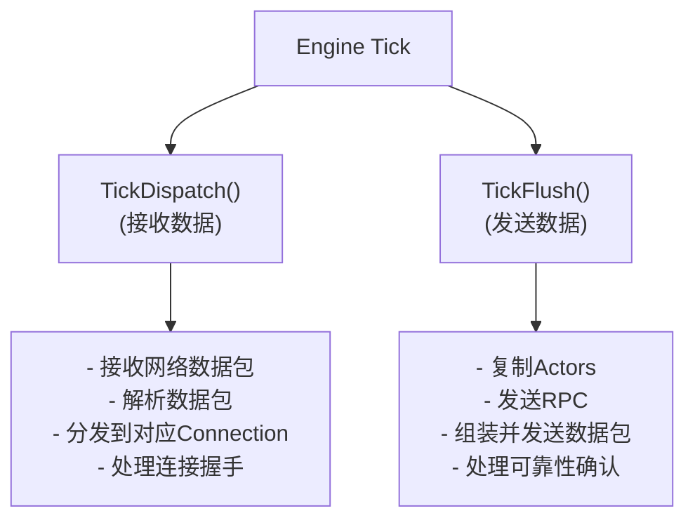
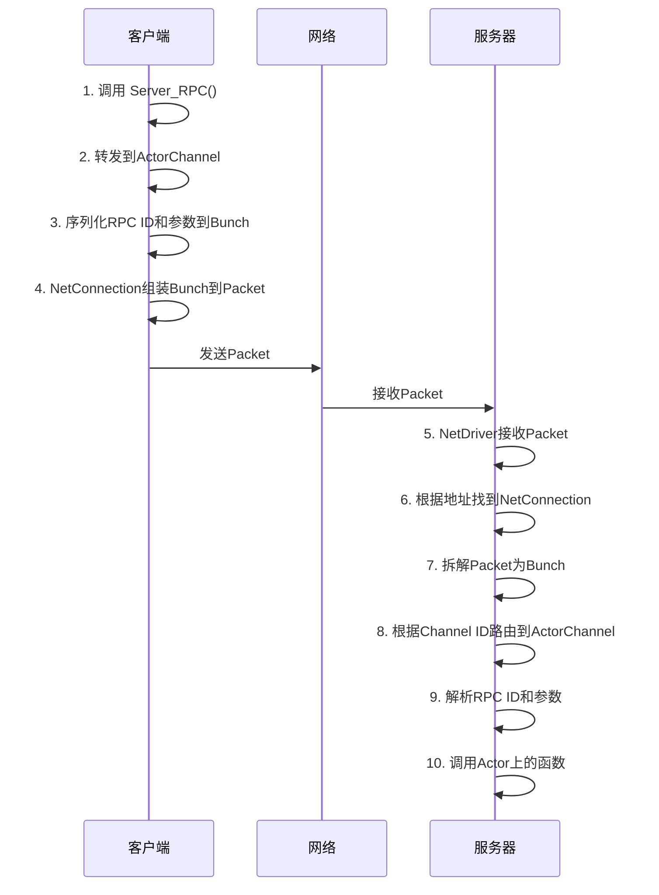
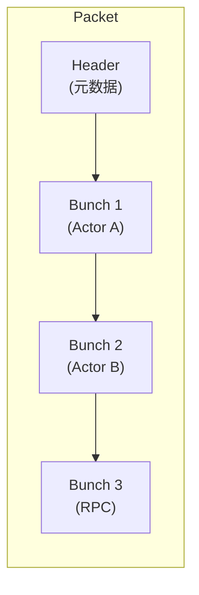
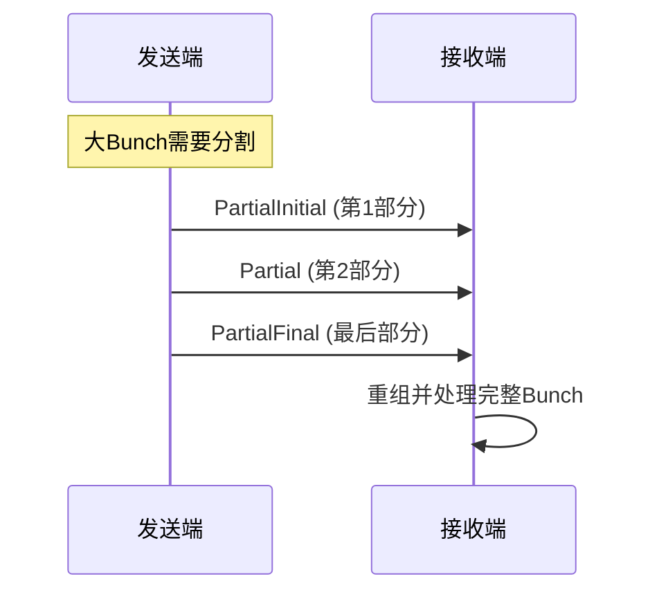
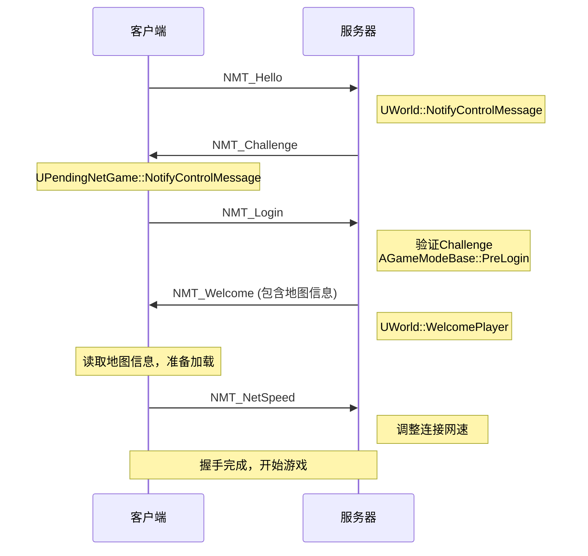

# 第一课：网络架构概览

> **学习目标**: 理解UE网络架构的整体设计，掌握核心类之间的关系
> **时长**: 约60分钟
> **前置知识**: C++基础、UnrealEngine基础概念

---

## 一、客户端-服务器模型

### 1.1 基本架构

UnrealEngine采用经典的**客户端-服务器模型**：



### 1.2 关键特点

| 特点           | 说明                            |
| -------------- | ------------------------------- |
| **服务器权威** | 服务器拥有游戏状态的最终决定权  |
| **状态复制**   | 服务器将状态变化同步给客户端    |
| **RPC调用**    | 客户端通过RPC请求服务器执行操作 |
| **预测机制**   | 客户端可预测执行，减少延迟感    |

---

## 二、网络模块目录结构

### 2.1 核心目录

UnrealEngine的网络相关代码分布在以下目录：

```
Engine/Source/Runtime/
│
├── Net/                          # 网络核心模块 (UE5+)
│   ├── Core/                     # 网络核心功能
│   │   └── Public/Net/Core/
│   │       ├── Connection/       # 连接相关
│   │       ├── Misc/             # 杂项工具
│   │       ├── PushModel/        # Push Model系统
│   │       ├── PropertyConditions/ # 属性条件
│   │       └── Serialization/    # 序列化
│   │
│   ├── Iris/                     # Iris新一代网络系统
│   │   └── Public/Iris/
│   │       ├── Core/
│   │       ├── DataStream/
│   │       ├── ReplicationState/
│   │       └── ReplicationSystem/
│   │
│   └── Common/                   # 网络公共组件
│       └── Public/Net/Common/
│           ├── Packets/
│           └── Sockets/
│
├── Sockets/                      # Socket子系统
│   └── Public/
│       ├── SocketSubsystem.h     # Socket子系统接口
│       ├── Sockets.h             # Socket类
│       └── IPAddress.h           # IP地址
│
├── Networking/                   # 网络模块入口
│   └── Public/Networking.h
│
└── Engine/                       # 引擎核心网络实现
    ├── Classes/Engine/
    │   ├── NetDriver.h           # 网络驱动器 ⭐
    │   ├── NetConnection.h       # 网络连接 ⭐
    │   ├── Channel.h             # 通道基类 ⭐
    │   ├── ActorChannel.h        # Actor通道 ⭐
    │   ├── PackageMapClient.h    # 包映射客户端
    │   ├── ReplicationDriver.h   # 复制驱动器
    │   └── DemoNetDriver.h       # 回放网络驱动
    │
    └── Public/Net/
        ├── DataBunch.h           # 数据束
        ├── DataReplication.h     # 数据复制
        ├── RepLayout.h           # 复制布局
        ├── UnrealNetwork.h       # 网络宏定义 ⭐
        └── NetPacketNotify.h     # 包通知
```

### 2.2 必读源文件

以下文件是理解UE网络系统的核心：

| 文件                                    | 说明                                 | 重要性 |
| --------------------------------------- | ------------------------------------ | ------ |
| `Engine/Classes/Engine/NetDriver.h`     | 包含详细的架构注释，是网络系统的入口 | ★★★★★  |
| `Engine/Classes/Engine/NetConnection.h` | 连接管理，数据包处理                 | ★★★★★  |
| `Engine/Classes/Engine/Channel.h`       | 通道基类，数据传输                   | ★★★★   |
| `Engine/Classes/Engine/ActorChannel.h`  | Actor复制核心                        | ★★★★★  |
| `Engine/Public/Net/UnrealNetwork.h`     | 复制宏定义                           | ★★★★★  |

> **提示**: `NetDriver.h` 文件头部有约300行的详细注释，解释了整个网络架构，建议仔细阅读。

---

## 三、核心类关系

### 3.1 类层次结构



### 3.2 核心类职责

#### UNetDriver (网络驱动器)

**位置**: `Engine/Classes/Engine/NetDriver.h:798`

```cpp
class UNetDriver : public UObject, public FExec
```

**职责**:

- 管理所有网络连接的顶层类
- 服务器端：管理所有客户端连接
- 客户端：管理到服务器的单个连接
- 负责数据包的发送和接收
- 创建和管理Channel

**关键成员**:

```cpp
class UNetDriver : public UObject, public FExec
{
    // 服务器端的客户端连接列表
    TArray<class UNetConnection*> ClientConnections;

    // 客户端到服务器的连接
    class UNetConnection* ServerConnection;

    // 连接映射 (地址 -> 连接)
    FConnectionMap MappedClientConnections;

    // 复制驱动器
    UReplicationDriver* ReplicationDriver;

    // Socket子系统
    class ISocketSubsystem* SocketSubsystem;

    // 本地Socket
    FSocket* Socket;
};
```

**主要NetDriver类型**:

| 类型             | 用途                         |
| ---------------- | ---------------------------- |
| `UIpNetDriver`   | 基于IP的标准网络驱动（默认） |
| `UDemoNetDriver` | 回放录制/播放驱动            |
| 自定义NetDriver  | 游戏可自定义实现             |

---

#### UNetConnection (网络连接)

**位置**: `Engine/Classes/Engine/NetConnection.h`

**职责**:

- 表示单个网络连接
- 管理该连接的所有Channel
- 处理数据包的组装和拆解
- 管理可靠性和重传

**连接状态**:

```cpp
enum EConnectionState
{
    USOCK_Invalid   = 0,  // 连接无效，可能未初始化
    USOCK_Closed    = 1,  // 连接已永久关闭
    USOCK_Pending   = 2,  // 连接等待中
    USOCK_Open      = 3,  // 连接已打开
    USOCK_Closing   = 4,  // 连接正在关闭，等待可靠数据确认
};
```

**关键成员**:

```cpp
class UNetConnection
{
    // 所属的NetDriver
    class UNetDriver* Driver;

    // 所有通道
    TArray<class UChannel*> Channels;

    // Actor到Channel的映射
    FActorChannelMap ActorChannels;

    // 包映射客户端
    class UPackageMapClient* PackageMap;

    // 连接状态
    EConnectionState State;

    // 远程地址
    TSharedRef<FInternetAddr> RemoteAddr;
};
```

---

#### UChannel (通道基类)

**位置**: `Engine/Classes/Engine/Channel.h:62`

**职责**:

- 数据传输通道的基类
- 处理可靠/不可靠数据传输
- 管理数据束(DataBunch)的序列化

**通道类型**:

```cpp
enum EChannelType
{
    CHTYPE_None     = 0,  // 无效类型
    CHTYPE_Control  = 1,  // 控制通道 - 连接状态管理
    CHTYPE_Actor    = 2,  // Actor通道 - Actor复制
    CHTYPE_File     = 3,  // 文件通道 - 文件传输
    CHTYPE_Voice    = 4,  // 语音通道 - VoIP
    CHTYPE_MAX      = 8,  // 最大值
};
```

**关键成员**:

```cpp
class UChannel : public UObject
{
    // 所属连接
    TObjectPtr<class UNetConnection> Connection;

    // 通道索引
    int32 ChIndex;

    // 通道名称
    FName ChName;

    // 状态标志
    uint32 OpenAcked:1;      // Open包已确认
    uint32 Closing:1;        // 正在关闭
    uint32 Dormant:1;        // 休眠状态
    uint32 Broken:1;         // 已出错，忽略后续数据包

    // 可靠数据重传
    class FInBunch* InRec;   // 等待依赖的传入数据
    class FOutBunch* OutRec; // 未确认的传出可靠数据
};
```

---

### 3.3 类关系图



---

## 四、网络Tick流程

### 4.1 Tick生命周期

UNetDriver的主要Tick流程分为两个阶段：



### 4.2 TickDispatch (接收阶段)

**函数签名**:

```cpp
// NetDriver.h:1686
virtual void TickDispatch(float DeltaTime);
```

**核心逻辑** (源码注释 NetDriver.h:113):

```
1. 从Socket接收数据包
   └── ISocketSubsystem::RecvFrom()

2. 检查数据包来源地址
   └── 已知连接? → UNetConnection::ReceivedRawPacket()
   └── 新连接? → 开始握手流程

3. 处理连接映射
   └── 通过 FInternetAddr → UNetConnection 映射查找

4. 处理无连接数据包
   └── 开始StatelessHandshake
```

### 4.3 TickFlush (发送阶段)

**函数签名**:

```cpp
// NetDriver.h:1692
virtual void TickFlush(float DeltaSeconds);
```

**核心逻辑**:

```
1. 服务器端：遍历所有客户端连接
   └── 调用 ReplicationDriver 复制Actors

2. 客户端：处理服务器连接
   └── 发送客户端RPC

3. 组装数据包
   └── 将多个Bunch打包成Packet

4. 发送数据包
   └── ISocketSubsystem::SendTo()
```

### 4.4 数据流向

#### RPC调用流程 (示例：客户端调用服务器RPC)

根据源码注释 (NetDriver.h:211-222)：



---

## 五、Packet与Bunch

### 5.1 概念区分

根据源码注释 (NetDriver.h:194-209)：

| 概念       | 说明                          | 传输层级 |
| ---------- | ----------------------------- | -------- |
| **Packet** | NetConnection之间传输的数据块 | 连接级别 |
| **Bunch**  | Channel之间传输的数据块       | 通道级别 |



### 5.2 大数据处理 - Partial Bunch

当Bunch过大时，UE会将其分割：

```cpp
// 分割标志
enum EBunchFlags
{
    PartialInitial = ...,  // 分割的第一个部分
    Partial = ...,         // 中间部分
    PartialFinal = ...,    // 最后一个部分
};
```

**流程**:



---

## 六、可靠性保证

### 6.1 序列号机制

根据源码注释 (NetDriver.h:230-244)：

```
Packet Number: 每个连接一个，每发送一个Packet递增
               - 不会重复使用
               - 用于检测丢包

Bunch Number: 每个Channel一个，仅对可靠Bunch递增
              - 可靠Bunch可以被重传（相同序号）
              - 用于保证可靠传输
```

### 6.2 ACK/NAK机制

```
接收端检测丢包:

  收到Packet 100, 101, 102, 105
                       ↓
  缺失 103, 104 → 认为丢包
                       ↓
  发送 ACK 100, 101, 102, 105
  (隐含 NAK 103, 104)

发送端处理:

  收到 ACK 102, 105
       ↓
  检测到 103, 104 被NAK
       ↓
  重传包含 103, 104 的可靠Bunch
```

### 6.3 可靠Bunch重传

```
发送可靠Bunch时:
  └── 添加到 OutRec 队列

收到对应Packet的ACK时:
  └── 从 OutRec 移除

收到对应Packet的NAK时:
  └── 重传 OutRec 中的可靠Bunch
  └── 放入新的Packet（新Packet序号）
```

---

## 七、连接握手流程

### 7.1 完整握手流程

根据源码注释 (NetDriver.h:137-155)：



### 7.2 控制消息类型

定义在 `DataChannel.h` 中：

```cpp
// 部分控制消息类型
NMT_Hello          // 客户端发起连接
NMT_Challenge      // 服务器挑战
NMT_Login          // 客户端登录
NMT_Welcome        // 服务器欢迎
NMT_NetSpeed       // 网速设置
NMT_Join           // 加入游戏
NMT_GameSpeed      // 游戏速度
// ... 更多类型
```

---

## 八、总结

### 8.1 核心要点回顾

1. **架构层次**: UNetDriver → UNetConnection → UChannel
2. **数据传输**: Packet (连接级) 包含 Bunch (通道级)
3. **Tick流程**: TickDispatch (收) → TickFlush (发)
4. **可靠性**: 序列号 + ACK/NAK + 重传机制

### 8.2 下一课预告

**第二课：网络驱动与连接管理**

将深入讲解：

- UNetDriver的初始化和配置
- UNetConnection的详细实现
- UIpNetDriver的工作原理
- 连接状态管理

---

## 九、课后练习

### 练习1：阅读源码

阅读 `Engine/Classes/Engine/NetDriver.h` 头部注释（第31-321行），回答以下问题：

1. 为什么UE不在Packet级别实现可靠传输？
2. Partial Bunch机制解决了什么问题？

### 练习2：追踪代码

使用IDE或代码编辑器，追踪以下函数调用链：

```
UNetDriver::TickDispatch → UNetConnection::ReceivedRawPacket → UChannel::ReceivedRawBunch
```

### 练习3：绘制图表

根据本文内容，绘制一份完整的网络数据流图，包含：

- 客户端到服务器的RPC调用
- 服务器到客户端的属性复制
- ACK/NAK的往返过程

---

## 参考资料

1. **源码文件**:
   - `Engine/Classes/Engine/NetDriver.h` (第31-321行注释)
   - `Engine/Classes/Engine/NetConnection.h`
   - `Engine/Classes/Engine/Channel.h`

2. **官方文档**:
   - [Unreal Engine Networking](https://docs.unrealengine.com/5.0/en-US/gameplay/networking/)

---

_下一课: [第二课：网络驱动与连接管理](./Lesson02_NetDriverAndConnection.md)_
