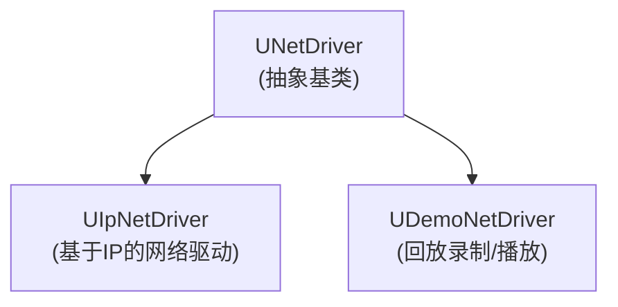
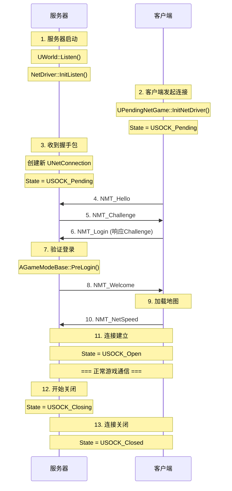

# 第二课：网络驱动与连接管理

> **学习目标**: 深入理解UNetDriver和UNetConnection的工作机制
> **时长**: 约60分钟
> **前置知识**: 第一课内容

---

## 一、UNetDriver 详解

### 1.1 类定义与继承

**位置**: `Engine/Classes/Engine/NetDriver.h:798`

```cpp
UCLASS(Abstract, customConstructor, transient, MinimalAPI, config=Engine)
class UNetDriver : public UObject, public FExec
{
    GENERATED_UCLASS_BODY()
    // ...
};
```

**关键特点**:

- `Abstract`: 抽象类，不能直接实例化
- `config=Engine`: 配置从Engine.ini读取
- 继承自 `FExec`: 支持控制台命令处理

### 1.2 核心配置属性

#### 连接与驱动类配置

```cpp
// 连接类名称 (可配置)
UPROPERTY(Config)
FString NetConnectionClassName;

// 复制驱动器类名称
UPROPERTY(Config)
FString ReplicationDriverClassName;

// 复制桥接类名称 (Iris)
UPROPERTY(Config)
FString ReplicationBridgeClassName;
```

#### 服务器配置

```cpp
// 服务器最大Tick率
UPROPERTY(Config)
int32 NetServerMaxTickRate;

// 复制最大Tick率 (限制高频帧下的复制频率)
UPROPERTY(Config)
int32 MaxNetTickRate;

// 最大客户端速率
UPROPERTY(Config)
int32 MaxClientRate;

// 最大互联网客户端速率
UPROPERTY(Config)
int32 MaxInternetClientRate;
```

#### 超时配置

```cpp
// 初始连接超时时间 (秒)
UPROPERTY(Config)
float InitialConnectTimeout;

// 已建立连接的超时时间 (秒)
UPROPERTY(Config)
float ConnectionTimeout;

// 优雅关闭超时时间 (秒)
UPROPERTY(Config)
float GracefulCloseConnectionTimeout = 2.0f;

// 相关性超时 - Actor失去相关性后通道保持时间
UPROPERTY(Config)
float RelevantTimeout;

// 保活时间
UPROPERTY(Config)
float KeepAliveTime;

// 服务器旅行暂停时间
UPROPERTY(Config)
float ServerTravelPause;
```

### 1.3 核心成员变量

#### 连接管理

```cpp
class UNetDriver : public UObject, public FExec
{
public:
    // ========== 连接管理 ==========

    // 客户端：到服务器的单个连接
    UPROPERTY()
    TObjectPtr<class UNetConnection> ServerConnection;

    // 服务器：所有客户端连接列表
    UPROPERTY()
    TArray<TObjectPtr<UNetConnection>> ClientConnections;

    // IP地址到连接的快速映射 (用于DDoS场景)
    FConnectionMap MappedClientConnections;

    // 最近断开的客户端跟踪
    TArray<FDisconnectedClient> RecentlyDisconnectedClients;

    // ========== 复制系统 ==========

    // 复制驱动器
    UPROPERTY()
    TObjectPtr<UClass> ReplicationDriverClass;

    // NetGUID缓存
    TSharedPtr<class FNetGUIDCache> GuidCache;

    // ========== 网络基础设施 ==========

    // 关联的World
    UPROPERTY()
    TObjectPtr<class UWorld> World;

    // NetDriver名称
    UPROPERTY(Config)
    FName NetDriverName;

    // 通道定义
    UPROPERTY(Config)
    TArray<FChannelDefinition> ChannelDefinitions;

    // 通道定义快速查找
    UPROPERTY()
    TMap<FName, FChannelDefinition> ChannelDefinitionMap;
};
```

### 1.4 NetDriver类型



| NetDriver类型         | 用途           | 场景              |
| --------------------- | -------------- | ----------------- |
| `UIpNetDriver`        | 标准IP网络通信 | 游戏主要网络流量  |
| `UDemoNetDriver`      | 回放系统       | 录制/播放游戏回放 |
| `UWebSocketNetDriver` | WebSocket通信  | Web平台或特殊需求 |
| 自定义NetDriver       | 游戏特定需求   | 可扩展实现        |

---

## 二、UNetDriver 初始化流程

### 2.1 服务器端初始化

```
┌─────────────────────────────────────────────────────────────────────┐
│                    服务器启动流程                                    │
└─────────────────────────────────────────────────────────────────────┘

UEngine::LoadMap()
        │
        ▼
UWorld::Listen()
        │
        ├── 创建 UNetDriver
        │
        ├── 解析配置设置
        │
        ▼
UNetDriver::InitListen()
        │
        ├── InitBase()           // 基础初始化
        │   ├── 初始化连接类
        │   ├── 创建Socket
        │   └── 设置本地地址
        │
        ├── InitConnectionlessHandler()  // 初始化无连接处理器
        │
        └── 绑定端口，开始监听
```

### 2.2 客户端初始化

```
┌─────────────────────────────────────────────────────────────────────┐
│                    客户端连接流程                                    │
└─────────────────────────────────────────────────────────────────────┘

UEngine::Browse()
        │
        ▼
UPendingNetGame::Initialize()
        │
        ▼
UPendingNetGame::InitNetDriver()
        │
        ├── 创建 UNetDriver
        │
        ▼
UNetDriver::InitConnect()
        │
        ├── InitBase()           // 基础初始化
        │
        ├── 创建 ServerConnection
        │
        └── 开始握手流程
```

### 2.3 关键初始化函数

#### InitBase (通用初始化)

**位置**: `NetDriver.h:1526`

```cpp
/**
 * 服务器和客户端连接设置的通用初始化
 *
 * @param bInitAsClient    是否为客户端
 * @param InNotify         网络通知对象
 * @param URL              目标URL
 * @param bReuseAddressAndPort 是否重用地址和端口
 * @param Error            错误输出
 *
 * @return 成功返回true
 */
virtual bool InitBase(
    bool bInitAsClient,
    FNetworkNotify* InNotify,
    const FURL& URL,
    bool bReuseAddressAndPort,
    FString& Error
);
```

#### InitConnect (客户端连接)

**位置**: `NetDriver.h:1537`

```cpp
/**
 * 以客户端模式初始化NetDriver
 *
 * @param InNotify   网络通知对象
 * @param ConnectURL 远程主机地址 (ip:port)
 * @param Error      连接错误信息
 *
 * @return 成功返回true
 */
virtual bool InitConnect(
    class FNetworkNotify* InNotify,
    const FURL& ConnectURL,
    FString& Error
);
```

#### InitListen (服务器监听)

**位置**: `NetDriver.h:1539`

```cpp
/**
 * 以服务器模式初始化NetDriver
 *
 * @param InNotify 网络通知对象
 * @param URL      监听URL
 * @param Error    错误输出
 *
 * @return 成功返回true
 */
virtual bool InitListen(
    class FNetworkNotify* InNotify,
    FURL& URL,
    FString& Error
);
```

---

## 三、UNetConnection 详解

### 3.1 类定义

**位置**: `Engine/Classes/Engine/NetConnection.h:283`

```cpp
UCLASS(customConstructor, Abstract, MinimalAPI, transient, config=Engine)
class UNetConnection : public UPlayer
{
    GENERATED_BODY()
    // ...
};
```

**关键特点**:

- 继承自 `UPlayer`: 代表一个玩家连接
- `Abstract`: 抽象基类
- 管理该连接的所有通道和数据传输

### 3.2 连接状态

```cpp
enum EConnectionState
{
    USOCK_Invalid   = 0,  // 连接无效，可能未初始化
    USOCK_Closed    = 1,  // 连接已永久关闭
    USOCK_Pending   = 2,  // 连接等待中 (握手阶段)
    USOCK_Open      = 3,  // 连接已打开 (正常通信)
    USOCK_Closing   = 4,  // 正在关闭，等待可靠数据确认
};
```

```
┌─────────────────────────────────────────────────────────────────────┐
│                      连接状态转换图                                  │
└─────────────────────────────────────────────────────────────────────┘

                    ┌──────────────┐
                    │ USOCK_Invalid │
                    └──────────────┘
                           │
                           │ InitConnect/InitListen
                           ▼
                    ┌──────────────┐
           ┌───────│ USOCK_Pending │◄──────────┐
           │       └──────────────┘            │
           │              │                    │
           │              │ 握手成功            │ 连接恢复
           │              ▼                    │
           │       ┌──────────────┐            │
           │       │  USOCK_Open  │────────────┘
           │       └──────────────┘
           │              │
           │              │ 开始关闭
           │              ▼
           │       ┌──────────────┐
           │       │ USOCK_Closing│
           │       └──────────────┘
           │              │
           │              │ 确认完成/超时
           │              ▼
           │       ┌──────────────┐
           └──────►│ USOCK_Closed │
                   └──────────────┘
```

### 3.3 核心成员变量

#### 基础信息

```cpp
class UNetConnection : public UPlayer
{
public:
    // 所属NetDriver
    UPROPERTY()
    TObjectPtr<class UNetDriver> Driver;

    // 远程地址
    TSharedPtr<FInternetAddr> RemoteAddr;

    // URL信息
    struct FURL URL;

    // 连接状态
    EConnectionState State;

    // 最大包大小
    UPROPERTY()
    int32 MaxPacket;
};
```

#### 通道管理

```cpp
    // 所有打开的通道
    UPROPERTY()
    TArray<TObjectPtr<class UChannel>> OpenChannels;

    // 通道表 (按索引)
    TArray<TObjectPtr<UChannel>> Channels;

    // Actor到通道的映射
    // FActorChannelMap 定义见 NetConnection.h:64
    // typedef TMap<TWeakObjectPtr<AActor>, UActorChannel*, ...> FActorChannelMap;
```

#### 包映射

```cpp
    // PackageMap类
    UPROPERTY()
    TSubclassOf<UPackageMap> PackageMapClass;

    // PackageMap实例
    UPROPERTY()
    TObjectPtr<class UPackageMap> PackageMap;
```

#### 统计信息

```cpp
    // 字节统计
    int32 InBytes, OutBytes;           // 当前周期
    int32 InTotalBytes, OutTotalBytes; // 累计

    // 包统计
    int32 InPackets, OutPackets;           // 当前周期
    int32 InTotalPackets, OutTotalPackets; // 累计

    // 每秒统计
    int32 InBytesPerSecond, OutBytesPerSecond;
    int32 InPacketsPerSecond, OutPacketsPerSecond;

    // 丢包统计
    int32 InPacketsLost, OutPacketsLost;
    int32 InTotalPacketsLost, OutTotalPacketsLost;

    // 平均延迟
    float AvgLag;

    // 抖动 (毫秒)
    float AverageJitterInMS;
```

### 3.4 数据发送缓冲

```cpp
    // 发送缓冲区
    FBitWriter SendBuffer;

    // 最近发送的数据束标记
    FBitWriterMark LastStart;   // 最近发送的bunch开始位置
    FBitWriterMark LastEnd;     // 最近发送的bunch结束位置

    // 是否允许合并
    bool AllowMerge;

    // 内容是否时间敏感
    bool TimeSensitive;

    // 最近发送的bunch
    FOutBunch* LastOutBunch;
    FOutBunch LastOut;
```

---

## 四、Tick流程详解

### 4.1 TickDispatch (接收阶段)

**位置**: `NetDriver.h:1686`

```cpp
virtual void TickDispatch(float DeltaTime);
```

**核心职责**:

1. 从Socket接收数据包
2. 分发数据包到对应连接
3. 处理新连接握手

```
┌─────────────────────────────────────────────────────────────────────┐
│                     TickDispatch 流程                               │
└─────────────────────────────────────────────────────────────────────┘

TickDispatch(DeltaTime)
        │
        ├── 检查是否正在Tick (防止重入)
        │
        ├── 更新时间统计
        │
        ▼
┌───────────────────────────────────────────┐
│         接收数据包循环                     │
│                                           │
│   Socket->RecvFrom(Data, Count, Addr)     │
│           │                               │
│           ▼                               │
│   查找连接映射                             │
│   MappedClientConnections.Find(Addr)      │
│           │                               │
│     ┌─────┴─────┐                         │
│     │           │                         │
│   已知连接    新连接                       │
│     │           │                         │
│     ▼           ▼                         │
│ NetConnection  StatelessHandshake         │
│ ::ReceivedRawPacket                       │
│                                           │
└───────────────────────────────────────────┘
        │
        ▼
PostTickDispatch()
```

### 4.2 TickFlush (发送阶段)

**位置**: `NetDriver.h:1692`

```cpp
virtual void TickFlush(float DeltaSeconds);
```

**核心职责**:

1. 复制Actors (服务器)
2. 发送RPC
3. 组装并发送数据包

```
┌─────────────────────────────────────────────────────────────────────┐
│                       TickFlush 流程                                │
└─────────────────────────────────────────────────────────────────────┘

TickFlush(DeltaSeconds)
        │
        ├── 检查是否正在Tick
        │
        ├── 是否跳过服务器复制
        │
        ▼
┌───────────────────────────────────────────┐
│        服务器端处理                        │
│                                           │
│   遍历 ClientConnections                  │
│           │                               │
│           ▼                               │
│   ServerReplicateActors()                 │
│           │                               │
│           ├── 收集相关Actors               │
│           ├── 排序优先级                   │
│           └── 复制到连接                   │
│                                           │
└───────────────────────────────────────────┘
        │
        ▼
┌───────────────────────────────────────────┐
│        发送数据                            │
│                                           │
│   遍历所有连接                             │
│           │                               │
│           ▼                               │
│   NetConnection::FlushNet()               │
│           │                               │
│           ├── 组装Packet                  │
│           ├── 添加ACK/NAK                 │
│           └── Socket->SendTo()            │
│                                           │
└───────────────────────────────────────────┘
        │
        ▼
PostTickFlush()
```

### 4.3 ServerReplicateActors

**位置**: `NetDriver.h:1604`

```cpp
/**
 * 复制相关Actors到连接
 *
 * @param DeltaSeconds 帧时间
 *
 * @return 复制的Actor数量
 */
virtual int32 ServerReplicateActors(float DeltaSeconds);
```

**详细流程**:

```
ServerReplicateActors(DeltaSeconds)
        │
        ├── 考虑的Actor列表
        │   └── 根据NetUpdateFrequency筛选
        │
        ├── 遍历所有客户端连接
        │       │
        │       ├── 检查连接是否饱和
        │       │
        │       ├── 计算Actor相关性
        │       │   └── IsNetRelevantFor()
        │       │
        │       ├── 按优先级排序
        │       │   └── GetNetPriority()
        │       │
        │       └── 复制每个Actor
        │           └── ReplicateActor()
        │
        └── 返回复制的Actor数量
```

---

## 五、连接生命周期

### 5.1 客户端登录状态

```cpp
namespace EClientLoginState
{
    enum Type
    {
        Invalid      = 0,  // 未初始化或无效
        LoggingIn    = 1,  // 正在登录
        Welcomed     = 2,  // 已收到欢迎消息，正在加载地图
        ReceivedJoin = 3,  // 收到Join消息，已创建PlayerController
        CleanedUp    = 4   // 已清理，连接终止
    };
}
```

### 5.2 完整连接生命周期



### 5.3 超时检测

```cpp
// NetConnection中的超时相关变量
double LastReceiveTime;        // 最后收到包的时间
double LastSendTime;           // 最后发送包的时间
double LastGoodPacketRealtime; // 最后有效包的实时时间
```

**超时判定逻辑**:

```cpp
// 伪代码
void UNetConnection::CheckTimeout()
{
    double CurrentTime = FPlatformTime::Seconds();

    // 检查接收超时
    if (CurrentTime - LastReceiveTime > ConnectionTimeout)
    {
        // 连接超时，关闭连接
        Close();
    }

    // 检查保活
    if (CurrentTime - LastSendTime > KeepAliveTime)
    {
        // 发送保活包
        SendKeepAlive();
    }
}
```

---

## 六、PacketHandler 系统

### 6.1 概述

PacketHandler是一个数据包处理框架，支持：

- 加密/解密
- 压缩/解压
- 握手协议
- 自定义处理

```cpp
// NetDriver中的PacketHandler
class UNetDriver
{
    // 服务器端：处理无连接数据包
    TUniquePtr<PacketHandler> ConnectionlessHandler;

    // 无状态握手组件引用
    TWeakPtr<StatelessConnectHandlerComponent> StatelessConnectComponent;
};

// NetConnection中的PacketHandler
class UNetConnection
{
    // 连接级的数据包处理器
    TUniquePtr<PacketHandler> Handler;

    // 无状态握手组件引用
    TWeakPtr<StatelessConnectHandlerComponent> StatelessConnectComponent;
};
```

### 6.2 数据包处理流程

```
发送方向:

原始数据 → Handler::Outgoing(Packet)
              │
              ├── 组件1处理 (如：加密)
              ├── 组件2处理 (如：压缩)
              └── 组件3处理 (如：握手)
              │
              ▼
         处理后的数据 → Socket::SendTo()


接收方向:

Socket::RecvFrom() → 原始数据
              │
              ▼
         Handler::Incoming(Packet)
              │
              ├── 组件3处理 (如：握手验证)
              ├── 组件2处理 (如：解压)
              └── 组件1处理 (如：解密)
              │
              ▼
         原始数据 → 后续处理
```

---

## 七、实际代码示例

### 7.1 获取NetDriver信息

```cpp
// 从World获取NetDriver
UWorld* World = GetWorld();
if (World)
{
    UNetDriver* NetDriver = World->GetNetDriver();
    if (NetDriver)
    {
        // 检查是服务器还是客户端
        ENetMode NetMode = World->GetNetMode();

        if (NetMode == NM_DedicatedServer || NetMode == NM_ListenServer)
        {
            // 服务器端：访问所有客户端连接
            for (UNetConnection* ClientConn : NetDriver->ClientConnections)
            {
                // 处理每个客户端连接
                UE_LOG(LogTemp, Log, TEXT("Client: %s"), *ClientConn->RemoteAddr->ToString(true));
            }
        }
        else if (NetMode == NM_Client)
        {
            // 客户端：访问服务器连接
            UNetConnection* ServerConn = NetDriver->ServerConnection;
            if (ServerConn)
            {
                UE_LOG(LogTemp, Log, TEXT("Connected to server"));
            }
        }
    }
}
```

### 7.2 监控连接状态

```cpp
void AMyGameMode::MonitorConnections()
{
    UWorld* World = GetWorld();
    if (!World) return;

    UNetDriver* NetDriver = World->GetNetDriver();
    if (!NetDriver) return;

    for (UNetConnection* Conn : NetDriver->ClientConnections)
    {
        // 连接状态
        EConnectionState State = Conn->GetConnectionState();

        // 统计信息
        int32 InRate = Conn->InBytesPerSecond;
        int32 OutRate = Conn->OutBytesPerSecond;
        float Ping = Conn->AvgLag * 1000.0f; // 转换为毫秒

        UE_LOG(LogTemp, Log,
            TEXT("Connection %s: State=%d, In=%d B/s, Out=%d B/s, Ping=%.1f ms"),
            *Conn->RemoteAddr->ToString(true),
            (int32)State,
            InRate,
            OutRate,
            Ping
        );
    }
}
```

### 7.3 配置NetDriver

```cpp
// DefaultEngine.ini 中的配置

[/Script/Engine.NetDriver]
; 连接类
NetConnectionClassName=/Script/Engine.IpConnection

; 复制驱动器类 (可选)
; ReplicationDriverClassName=/Script/Engine.ReplicationGraphDriver

; 超时设置
InitialConnectTimeout=120.0
ConnectionTimeout=15.0
GracefulCloseConnectionTimeout=2.0
RelevantTimeout=5.0
KeepAliveTime=0.2

; 服务器设置
NetServerMaxTickRate=30
MaxClientRate=10000
MaxInternetClientRate=5000
```

---

## 八、调试技巧

### 8.1 控制台命令

```
; 网络统计
stat net           ; 显示网络统计
stat packet        ; 显示包统计

; 调试命令
net.listclients    ; 列出所有客户端
net.connections    ; 显示连接信息
net.kickban <id>   ; 踢出并封禁客户端

; 模拟网络条件
net.PktLoss=5      ; 5%丢包
net.PktLag=100     ; 100ms延迟
net.PktOrder=1     ; 乱序
```

### 8.2 日志类别

```cpp
// 启用网络日志
DEFINE_LOG_CATEGORY(LogNet);
DEFINE_LOG_CATEGORY(LogNetTraffic);
DEFINE_LOG_CATEGORY(LogNetPlayerManagement);

// 在代码中使用
UE_LOG(LogNet, Log, TEXT("Connection established"));
UE_LOG(LogNetTraffic, Verbose, TEXT("Packet received: %d bytes"), Size);
```

### 8.3 常见问题排查

| 问题       | 可能原因           | 解决方案                      |
| ---------- | ------------------ | ----------------------------- |
| 连接超时   | 网络不稳定、防火墙 | 检查防火墙设置，增加超时时间  |
| 高延迟     | 带宽饱和           | 使用stat net查看带宽使用      |
| 频繁断开   | 超时设置过短       | 调整ConnectionTimeout         |
| 连接数限制 | 达到最大连接数     | 检查MaxClientRate和服务器配置 |

---

## 九、总结

### 9.1 核心要点

1. **UNetDriver职责**:
   - 管理所有网络连接
   - 处理数据包收发
   - 协调Actor复制

2. **UNetConnection职责**:
   - 代表单个网络连接
   - 管理通道
   - 处理可靠性传输

3. **Tick流程**:
   - TickDispatch: 接收数据
   - TickFlush: 发送数据

4. **连接状态**:
   - Invalid → Pending → Open → Closing → Closed

### 9.2 下一课预告

**第三课：通道系统 (Channel)**

将深入讲解：

- UChannel基类实现
- 通道类型详解
- 数据束(Bunch)机制
- 可靠性保证

---

## 十、课后练习

### 练习1：追踪初始化流程

使用调试器追踪以下函数调用链：

```
UWorld::Listen → UNetDriver::InitListen → InitBase
```

观察：

- Socket是如何创建的
- 端口是如何绑定的
- 通道是如何初始化的

### 练习2：实现连接监控

创建一个Actor，每秒打印所有客户端连接的统计信息：

- 输入/输出速率
- 延迟
- 丢包率

### 练习3：配置优化

修改DefaultEngine.ini中的网络配置，观察不同配置对性能的影响：

- 调整NetServerMaxTickRate
- 修改超时时间
- 调整带宽限制

---

## 参考资料

1. **源码文件**:
   - `Engine/Classes/Engine/NetDriver.h`
   - `Engine/Classes/Engine/NetConnection.h`
   - `Engine/Private/Net/NetDriver.cpp`

2. **配置文件**:
   - `Config/DefaultEngine.ini` - [/Script/Engine.NetDriver] 部分

---

_上一课: [第一课：网络架构概览](./Lesson01_NetworkArchitecture.md)_
_下一课: [第三课：通道系统](./Lesson03_ChannelSystem.md)_
